# Физика. Электричество и магнетизм — ответы на экзаменационные билеты

> Рабочая (исправленная и дополненная) версия. Формулы записаны в LaTeX —
> корректно отображаются в Obsidian, Typora, VS Code (Markdown Preview Enhanced), GitHub.
> Подробные объяснения, выводы формул и ответы на вопрос «откуда это взялось» — в файле `Explain.md`.

## Оглавление

1. [[#1. Электрический заряд. Закон Кулона. Принцип суперпозиции сил|Электрический заряд. Закон Кулона. Принцип суперпозиции сил]]
2. [[#2. Электрическое поле. Напряжённость поля E. Принцип суперпозиции полей|Электрическое поле. Напряжённость поля E. Принцип суперпозиции полей]]
3. [[#3. Плотность зарядов. Примеры нахождения электрического поля равномерно заряженных объектов|Плотность зарядов. Примеры нахождения электрического поля равномерно заряженных объектов]]
4. [[#4. Поток E. Теорема Остроградского-Гаусса для поля E (интегральная и дифференциальная форма)|Поток E. Теорема Остроградского-Гаусса для поля E]]
5. [[#5. Примеры применения теоремы Остроградского-Гаусса для поля E|Примеры применения теоремы Остроградского-Гаусса для поля E]]
6. [[#6. Работа кулоновских сил. Теорема о циркуляции вектора E|Работа кулоновских сил. Теорема о циркуляции вектора E]]
7. [[#7. Энергия и потенциал электростатического поля|Энергия и потенциал электростатического поля]]
8. [[#8. Связь между напряжённостью электростатического поля и его потенциалом|Связь между напряжённостью электростатического поля и его потенциалом]]
9. [[#9. Электрический диполь. Поле и потенциал|Электрический диполь. Поле и потенциал]]
10. [[#10. Электрический диполь. Сила, действующая на диполь, её момент. Энергия диполя во внешнем поле|Электрический диполь. Сила, действующая на диполь, её момент. Энергия диполя во внешнем поле]]
11. [[#11. Поле системы зарядов на больших расстояниях|Поле системы зарядов на больших расстояниях]]
12. [[#12. Поле внутри и снаружи проводника|Поле внутри и снаружи проводника]]
13. [[#13. Силы, действующие на поверхность проводника|Силы, действующие на поверхность проводника]]
14. [[#14. Свойства замкнутой проводящей оболочки|Свойства замкнутой проводящей оболочки]]
15. [[#15. Уравнения Пуассона и Лапласа. Метод изображений|Уравнения Пуассона и Лапласа. Метод изображений]]
16. [[#16. Электроёмкость. Уединённый проводник и система проводников|Электроёмкость. Уединённый проводник и система проводников]]
17. [[#17. Различные виды конденсаторов. Определение поля, потенциала и электроёмкости|Различные виды конденсаторов. Определение поля, потенциала и электроёмкости]]
18. [[#18. Соединения конденсаторов (вывод)|Соединения конденсаторов (вывод)]]
19. [[#19. Энергия системы зарядов и системы двух тел|Энергия системы зарядов и системы двух тел]]
20. [[#20. Электрическое поле в диэлектрике. Поляризация веществ, состоящих из полярных и неполярных молекул|Электрическое поле в диэлектрике. Поляризация веществ, состоящих из полярных и неполярных молекул]]
21. [[#21. Поляризованность P, объёмные и поверхностные связанные заряды|Поляризованность P, объёмные и поверхностные связанные заряды]]
22. [[#22. Теорема Остроградского-Гаусса для P. Связь P с объёмными и поверхностными связанными зарядами|Теорема Остроградского-Гаусса для P. Связь P со связанными зарядами]]
23. [[#23. Вектор электрического смещения D. Теорема Остроградского-Гаусса для D|Вектор электрического смещения D. Теорема Остроградского-Гаусса для D]]
24. [[#24. Изменение E и D на границе двух диэлектриков|Изменение E и D на границе двух диэлектриков]]
25. [[#25. Поле на границе проводник-диэлектрик. Связанный заряд у поверхности проводника|Поле на границе проводник-диэлектрик. Связанный заряд у поверхности проводника]]
26. [[#26. Виды диэлектриков. Сегнетоэлектрики|Виды диэлектриков. Сегнетоэлектрики]]
27. [[#27. Электрический ток. Уравнение непрерывности|Электрический ток. Уравнение непрерывности]]
28. [[#28. Сторонние силы. Поле сторонних сил. Электродвижущая сила|Сторонние силы. Поле сторонних сил. Электродвижущая сила]]
29. [[#29. Закон Ома для однородного участка цепи (интегральная и дифференциальная форма)|Закон Ома для однородного участка цепи]]
30. [[#30. Закон Ома для неоднородного участка цепи (интегральная и дифференциальная форма)|Закон Ома для неоднородного участка цепи]]
31. [[#31. Разветвлённые цепи. Правила Кирхгофа (вывод, пример использования)|Разветвлённые цепи. Правила Кирхгофа]]
32. [[#32. Мощность тока. Закон Джоуля-Ленца (интегральная и дифференциальная форма)|Мощность тока. Закон Джоуля-Ленца]]
33. [[#33. Переходные процессы в цепи с конденсатором. Разрядка конденсатора|Переходные процессы. Разрядка конденсатора]]
34. [[#34. Переходные процессы в цепи с конденсатором. Зарядка конденсатора|Переходные процессы. Зарядка конденсатора]]
35. [[#35. Природа магнетизма (эксперименты и пояснения на основе сформулированных законов)|Природа магнетизма]]
36. [[#36. Магнитное поле равномерно движущегося заряда|Магнитное поле равномерно движущегося заряда]]
37. [[#37. Закон Био-Савара-Лапласа|Закон Био-Савара-Лапласа]]
38. [[#38. Сила, действующая на заряд, движущийся в магнитном поле. Сила Лоренца. Закон Ампера|Сила Лоренца. Закон Ампера]]
39. [[#39. Основные законы магнитного поля (интегральная и дифференциальная форма, примеры нахождения полей)|Основные законы магнитного поля]]
40. [[#40. Сила, действующая на контур с током в магнитном поле|Сила, действующая на контур с током]]

%%
1. [Электрический заряд. Закон Кулона. Принцип суперпозиции сил](#1-электрический-заряд-закон-кулона-принцип-суперпозиции-сил)
2. [Электрическое поле. Напряжённость поля E. Принцип суперпозиции полей](#2-электрическое-поле-напряжённость-поля-e-принцип-суперпозиции-полей)
3. [Плотность зарядов. Примеры нахождения электрического поля равномерно заряженных объектов](#3-плотность-зарядов-примеры-нахождения-электрического-поля-равномерно-заряженных-объектов)
4. [Поток E. Теорема Остроградского-Гаусса для поля E](#4-поток-e-теорема-остроградского-гаусса-для-поля-e-интегральная-и-дифференциальная-форма)
5. [Примеры применения теоремы Остроградского-Гаусса для поля E](#5-примеры-применения-теоремы-остроградского-гаусса-для-поля-e)
6. [Работа кулоновских сил. Теорема о циркуляции вектора E](#6-работа-кулоновских-сил-теорема-о-циркуляции-вектора-e)
7. [Энергия и потенциал электростатического поля](#7-энергия-и-потенциал-электростатического-поля)
8. [Связь между напряжённостью электростатического поля и его потенциалом](#8-связь-между-напряжённостью-электростатического-поля-и-его-потенциалом)
9. [Электрический диполь. Поле и потенциал](#9-электрический-диполь-поле-и-потенциал)
10. [Электрический диполь. Сила, действующая на диполь, её момент. Энергия диполя во внешнем поле](#10-электрический-диполь-сила-действующая-на-диполь-её-момент-энергия-диполя-во-внешнем-поле)
11. [Поле системы зарядов на больших расстояниях](#11-поле-системы-зарядов-на-больших-расстояниях)
12. [Поле внутри и снаружи проводника](#12-поле-внутри-и-снаружи-проводника)
13. [Силы, действующие на поверхность проводника](#13-силы-действующие-на-поверхность-проводника)
14. [Свойства замкнутой проводящей оболочки](#14-свойства-замкнутой-проводящей-оболочки)
15. [Уравнения Пуассона и Лапласа. Метод изображений](#15-уравнения-пуассона-и-лапласа-метод-изображений)
16. [Электроёмкость. Уединённый проводник и система проводников](#16-электроёмкость-уединённый-проводник-и-система-проводников)
17. [Различные виды конденсаторов. Определение поля, потенциала и электроёмкости](#17-различные-виды-конденсаторов-определение-поля-потенциала-и-электроёмкости)
18. [Соединения конденсаторов (вывод)](#18-соединения-конденсаторов-вывод)
19. [Энергия системы зарядов и системы двух тел](#19-энергия-системы-зарядов-и-системы-двух-тел)
20. [Электрическое поле в диэлектрике. Поляризация веществ, состоящих из полярных и неполярных молекул](#20-электрическое-поле-в-диэлектрике-поляризация-веществ-состоящих-из-полярных-и-неполярных-молекул)
21. [Поляризованность P, объёмные и поверхностные связанные заряды](#21-поляризованность-p-объёмные-и-поверхностные-связанные-заряды)
22. [Теорема Остроградского-Гаусса для P. Связь P со связанными зарядами](#22-теорема-остроградского-гаусса-для-p-связь-p-с-объёмными-и-поверхностными-связанными-зарядами)
23. [Вектор электрического смещения D. Теорема Остроградского-Гаусса для D](#23-вектор-электрического-смещения-d-теорема-остроградского-гаусса-для-d)
24. [Изменение E и D на границе двух диэлектриков](#24-изменение-e-и-d-на-границе-двух-диэлектриков)
25. [Поле на границе проводник-диэлектрик. Связанный заряд у поверхности проводника](#25-поле-на-границе-проводник-диэлектрик-связанный-заряд-у-поверхности-проводника)
26. [Виды диэлектриков. Сегнетоэлектрики](#26-виды-диэлектриков-сегнетоэлектрики)
27. [Электрический ток. Уравнение непрерывности](#27-электрический-ток-уравнение-непрерывности)
28. [Сторонние силы. Поле сторонних сил. ЭДС](#28-сторонние-силы-поле-сторонних-сил-электродвижущая-сила)
29. [Закон Ома для однородного участка цепи](#29-закон-ома-для-однородного-участка-цепи-интегральная-и-дифференциальная-форма)
30. [Закон Ома для неоднородного участка цепи](#30-закон-ома-для-неоднородного-участка-цепи-интегральная-и-дифференциальная-форма)
31. [Разветвлённые цепи. Правила Кирхгофа](#31-разветвлённые-цепи-правила-кирхгофа-вывод-пример-использования)
32. [Мощность тока. Закон Джоуля-Ленца](#32-мощность-тока-закон-джоуля-ленца-интегральная-и-дифференциальная-форма)
33. [Переходные процессы. Разрядка конденсатора](#33-переходные-процессы-в-цепи-с-конденсатором-разрядка-конденсатора)
34. [Переходные процессы. Зарядка конденсатора](#34-переходные-процессы-в-цепи-с-конденсатором-зарядка-конденсатора)
35. [Природа магнетизма](#35-природа-магнетизма-эксперименты-и-пояснения-на-основе-сформулированных-законов)
36. [Магнитное поле равномерно движущегося заряда](#36-магнитное-поле-равномерно-движущегося-заряда)
37. [Закон Био-Савара-Лапласа](#37-закон-био-савара-лапласа)
38. [Сила Лоренца. Закон Ампера](#38-сила-действующая-на-заряд-движущийся-в-магнитном-поле-сила-лоренца-закон-ампера)
39. [Основные законы магнитного поля](#39-основные-законы-магнитного-поля-интегральная-и-дифференциальная-форма-примеры-нахождения-полей)
40. [Сила, действующая на контур с током](#40-сила-действующая-на-контур-с-током-в-магнитном-поле)
%%

---

## 1. Электрический заряд. Закон Кулона. Принцип суперпозиции сил

### Электрический заряд и его свойства

Существует два рода зарядов: положительные и отрицательные. Одноимённые заряды отталкиваются, разноимённые — притягиваются.

**Квантование заряда.** Электрический заряд любого тела дискретен и складывается из целого числа элементарных зарядов:

$$q = \pm N e, \qquad e = 1{,}6\cdot 10^{-19}\ \text{Кл},\quad N \in \mathbb{N}$$

Носитель отрицательного элементарного заряда — электрон, положительного — протон.

**Единица заряда.** В СИ заряд измеряется в кулонах (Кл). 1 Кл — заряд, проходящий через поперечное сечение проводника за 1 с при силе тока 1 А. 

**Инвариантность заряда.** Величина заряда не зависит от выбора системы отсчёта и от скорости движения его носителя — она одинакова во всех инерциальных системах отсчёта.

**Закон сохранения заряда.** В любой электрически изолированной (замкнутой) системе алгебраическая сумма зарядов не изменяется:

$$\sum_{i} q_i = \text{const}$$

**Точечный заряд** — идеализация; заряд, размерами носителя которого можно пренебречь по сравнению с расстоянием, на котором рассматривается электростатическое взаимодействие. 
### Закон Кулона

**Формулировка.** Сила взаимодействия двух точечных неподвижных заряженных тел в вакууме прямо пропорциональна произведению модулей зарядов и обратно пропорциональна квадрату расстояния между ними.

**Скалярная форма:**

$$F = k\ \frac{|q_1|\cdot|q_2|}{r^2}$$

где

$$k = \frac{1}{4\pi\varepsilon_0} = 9\cdot10^{9}\ \frac{\text{Н}\cdot\text{м}^2}{\text{Кл}^2}, \qquad \varepsilon_0 = 8{,}85\cdot10^{-12}\ \frac{\text{Кл}^2}{\text{Н}\cdot\text{м}^2}$$

$\varepsilon_0$ — электрическая постоянная. 

**Векторная форма:**

$$\vec{F}_{1,2} = k\ \frac{q_1 q_2}{r_{1,2}^{3}}\ \vec{r}_{1,2} = \frac{1}{4\pi\varepsilon_0}\ \frac{q_1 q_2}{r_{1,2}^{2}}\ \hat{r}_{1,2}$$

где $\vec{r}_{1,2}$ — вектор, проведённый от заряда $q_1$ к заряду $q_2$; $\vec F_{1,2}$ — сила, действующая на $q_2$ со стороны $q_1$. Сила направлена вдоль прямой, соединяющей заряды.

*Почему в знаменателе куб.* В числителе стоит **вектор** $\vec r_{1,2}$, а не его модуль. Комбинация

$$\frac{\vec r_{1,2}}{r_{1,2}^{3}} = \underbrace{\frac{\vec r_{1,2}}{r_{1,2}}}_{\hat r_{1,2},\ |\hat r| = 1}\cdot\frac{1}{r_{1,2}^{2}}$$

содержит единичный вектор (орт) $\hat r_{1,2}$, который задаёт только направление, и множитель $1/r^2$, который и даёт закон обратных квадратов. Поэтому модуль векторной формулы совпадает со скалярной.

*Почему сняты модули с зарядов.* Знак произведения $q_1q_2$ автоматически задаёт характер взаимодействия:

- $q_1 q_2 > 0$ (одноимённые) — $\vec F_{1,2}$ сонаправлен с $\vec r_{1,2}$ → **отталкивание**;
- $q_1 q_2 < 0$ (разноимённые) — $\vec F_{1,2}$ противоположен $\vec r_{1,2}$ → **притяжение**.

### Принцип суперпозиции сил

Если на точечный заряд действует несколько других зарядов, то результирующая сила, действующая на данный заряд, равна векторной сумме сил, с которыми каждый из зарядов действует на него в отдельности:

$$\vec F_{\text{рез}} = \vec F_1 + \vec F_2 + \dots + \vec F_n = \sum_{i=1}^{n}\vec F_i$$

Те взаимодействие между двумя зарядами не изменяется в присутствии других зарядов. 
### Возможные вопросы

- *Откуда взялся закон Кулона?* — Опытный закон (крутильные весы, 1785 г.), не выводится теоретически.
- *Почему $k$ пишут как $1/4\pi\varepsilon_0$?* — Чтобы $4\pi$ исчез из теоремы Гаусса и уравнений Максвелла.
- *Почему в векторной форме $r^3$?* — Один множитель $r$ уходит на нормировку вектора направления.
- *Можно ли складывать силы арифметически?* — Нет, только векторно.
- *Чем закон Кулона похож на закон всемирного тяготения?* — Обе силы центральные и убывают как $1/r^2$; отличие — заряд бывает двух знаков, поэтому кулоновская сила может и отталкивать.
---

## 2. Электрическое поле. Напряжённость поля E. Принцип суперпозиции полей

Всякий электрический заряд создаёт вокруг себя электрическое поле.
**Электрическое поле** — особая форма материи, существующая вокруг электрических зарядов, через которую осуществляется взаимодействие между ними.
*Главное свойство поля:* помещённый в него другой заряд испытывает действие силы.

### Напряжённость электрического поля $\vec E$

**Определение.** Напряжённость — силовая характеристика электрического поля. Она равна отношению силы $\vec F$, действующей на неподвижный точечный пробный заряд $q'$, к величине этого заряда:

$$\vec E = \frac{\vec F}{q'}$$

**Важное условие.** Пробный заряд $q'$ должен быть положительным и достаточно малым, чтобы его внесение не вызвало искажения (перераспределения) зарядов, создающих поле.

Единица измерения $\vec E$ в СИ — вольт на метр (В/м), причём 1 В/м = 1 Н/Кл.

**Поле точечного заряда.** Из закона Кулона следует, что напряжённость поля точечного заряда $q$ на расстоянии $r$ от него равна:

$$\vec E = \frac{\vec F}{q'} = \frac{1}{4\pi\varepsilon_0}\frac{q}{r^{2}}\ \vec e_r$$

где $\vec e_r$ — орт радиус-вектора; вектор $\vec E$ направлен от заряда при $q>0$ и к заряду при $q<0$.

**Вывод.** Поле существует независимо от того, вносим мы в него заряд или нет.

 Силовые линии (линии напряжённости) — линии, касательная к которым в каждой точке совпадает с направлением $\vec E$, а густота пропорциональна модулю $\vec E$.

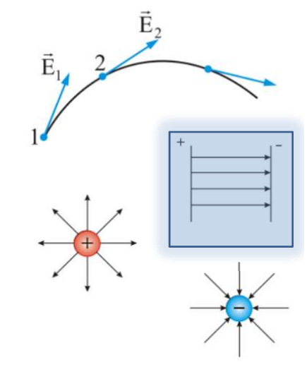

### Принцип суперпозиции полей

**Определение.** Напряжённость электрического поля системы точечных неподвижных зарядов равна векторной сумме напряжённостей полей, которые создавали бы каждый из зарядов в отдельности:

$$\vec E = \sum_{i} \vec E_i = \frac{1}{4\pi\varepsilon_0}\sum_{i}\frac{q_i}{r_i^{2}}\ \vec e_{ri}$$

Те электрические поля накладываются друг на друга, не оказывая влияния друг на друга.

### Возможные вопросы

- *Зачем делить силу на $q'$?* — Сила зависит от величины пробного заряда, а отношение $F/q'$ — уже нет. Поэтому оно характеризует само поле, а не пробный заряд.
- *Почему пробный заряд должен быть малым?* — Большой заряд своим полем перераспределит заряды источника, и измеряться будет уже другое поле. Строго: $\vec E = \lim_{q'\to 0} \vec F/q'$.
- *Почему пробный заряд положительный?* — Это соглашение о направлении: $\vec E$ направлена так, как сила, действующая на положительный заряд.
- *Почему здесь $r^2$, а в векторном законе Кулона $r^3$?* — Это одна и та же формула в двух формах записи: там орт был спрятан в виде $\vec r/r$, здесь он выписан отдельно как $\vec e_r$.
- *Суперпозиция полей — отдельный постулат?* — Нет, следствие суперпозиции сил (делением на $q'$).

---

## 3. Плотность зарядов. Примеры нахождения электрического поля равномерно заряженных объектов

Реально заряды имеют дискретную структуру. Однако при решении макроскопических задач удобно игнорировать дискретность и считать, что заряд непрерывно «размазан» (распределён) в пространстве. Это позволяет заменить алгебраическое суммирование интегрированием.

При переходе к непрерывному распределению вводят понятия плотности зарядов.

**1. Линейная плотность $\lambda$** — заряд, приходящийся на единицу длины:

$$\lambda = \frac{dq}{dl}\quad [\text{Кл/м}]$$

где $dq$ — заряд на элементе длины $dl$.

**2. Поверхностная плотность $\sigma$** — заряд, приходящийся на единицу площади поверхности:

$$\sigma = \frac{dq}{dS}\quad [\text{Кл/м}^2]$$

где $dq$ — заряд на элементе площади $dS$.

**3. Объёмная плотность $\rho$** — заряд, приходящийся на единицу объёма:

$$\rho = \frac{dq}{dV}\quad [\text{Кл/м}^3]$$

где $dq$ — заряд в элементе объёма $dV$.

### Нахождение поля непрерывно распределённых зарядов

С учётом введённых плотностей формула принципа суперпозиции видоизменяется. Заряд точечного элемента выражается как $dq = \rho\ dV$ (или $\sigma\ dS$, или $\lambda\ dl$), а сумма заменяется интегралом по всему объёму, поверхности или длине:

$$\vec E = \frac{1}{4\pi\varepsilon_0}\int \frac{dq}{r^{2}}\ \vec e_r = \frac{1}{4\pi\varepsilon_0}\int \frac{\rho\ dV}{r^{2}}\ \vec e_r$$

### Пример 1. Поле на оси тонкого равномерно заряженного кольца

Заряд $q$ равномерно распределён по тонкому кольцу радиуса $a$. Кольцо мысленно разбивается на элементы $dl$ с зарядом $dq$. Каждый элемент создаёт в точке на оси (на расстоянии $z$ от центра) напряжённость $dE$.

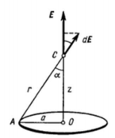

**1)** Элемент $dl$ с зарядом $dq$ считаем точечным зарядом; он создаёт поле

$$dE = \frac{1}{4\pi\varepsilon_0}\frac{dq}{r^{2}}$$

направленное под углом $\alpha$ к оси.

**2) Симметрия.** У каждого элемента есть диаметрально противоположный: их поперечные составляющие взаимно уничтожаются, осевые складываются. Значит, $\vec E$ направлен вдоль оси, и суммировать надо только проекции:

$$dE_z = dE\cos\alpha$$

**3)** Из прямоугольного треугольника с катетами $a$, $z$ и гипотенузой $r$:

$$\cos\alpha = \frac{z}{r}$$

**4) Подставляем:**

$$dE_z = \frac{1}{4\pi\varepsilon_0}\frac{dq}{r^{2}}\cdot\frac{z}{r} = \frac{1}{4\pi\varepsilon_0}\frac{z\ dq}{r^{3}}$$

**5) Суммируем по кольцу** — сумма бесконечно малых вкладов есть интеграл:

$$E = \int dE_z = \int \frac{1}{4\pi\varepsilon_0}\frac{z\ dq}{r^{3}}$$

**6)** Все элементы кольца равноудалены от точки наблюдения, поэтому $z$ и $r$ постоянны и выносятся за интеграл, а $\int dq = q$:

$$E = \frac{1}{4\pi\varepsilon_0}\frac{z}{r^{3}}\int dq = \frac{1}{4\pi\varepsilon_0}\frac{q\ z}{r^{3}}$$

**7)** Так как $r = \sqrt{a^{2}+z^{2}}$, то $r^{3} = (a^{2}+z^{2})^{3/2}$:

$$\boxed{\ E = \frac{1}{4\pi\varepsilon_0}\frac{q\ z}{(a^{2}+z^{2})^{3/2}}\ }$$

*Проверка:* при $z \gg a$ знаменатель $\approx z^3$, и $E \approx \dfrac{1}{4\pi\varepsilon_0}\dfrac{q}{z^{2}}$ — поле точечного заряда, как и должно быть. В центре кольца ($z=0$) поле равно нулю.

### Пример 2. Поле равномерно заряженной прямой нити

Прямая нить длиной $2l$ заряжена равномерно зарядом $q$ (линейная плотность $\lambda$, причём $q = 2\lambda l$). Нить разбивается на элементы $dy$. Напряжённость ищется в точке, отстоящей на расстоянии $x$ от середины нити по перпендикуляру; векторы $d\vec E$ от каждого элемента суммируются с учётом углов $\alpha$, под которыми эти элементы видны из точки наблюдения.

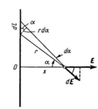

**1. Из соображений симметрии.** Составляющие вдоль нити от симметричных элементов взаимно уничтожаются:

$$E_y = 0 \implies E = E_x = \int dE_x$$

**2. Дифференциал проекции поля.** Элемент $dy$ несёт заряд $dq = \lambda\ dy$:

$$dE_x = dE\cos\alpha = \frac{1}{4\pi\varepsilon_0}\frac{dq}{r^{2}}\cos\alpha = \frac{\lambda}{4\pi\varepsilon_0}\frac{\cos\alpha\cdot dy}{r^{2}}$$

**3. Связь переменных через угол $\alpha$.** Угол отсчитываем от перпендикуляра $x$; в прямоугольном треугольнике катет $x$ прилежащий, катет $y$ противолежащий, $r$ — гипотенуза:

$$y = x\tan\alpha,\qquad r = \frac{x}{\cos\alpha}$$

Дифференцируем первое по $\alpha$ (при постоянном $x$), учитывая $(\tan\alpha)' = \dfrac{1}{\cos^{2}\alpha}$; второе возводим в квадрат:

$$dy = \frac{x\ d\alpha}{\cos^{2}\alpha},\qquad r^{2} = \frac{x^{2}}{\cos^{2}\alpha}$$

**4. Подстановка.** Деление на дробь — умножение на перевёрнутую:

$$dE_x = \frac{\lambda}{4\pi\varepsilon_0}\cdot\frac{\dfrac{x\ d\alpha}{\cos^{2}\alpha}\cdot\cos\alpha}{\dfrac{x^{2}}{\cos^{2}\alpha}} = \frac{\lambda}{4\pi\varepsilon_0}\cdot\frac{x\cos\alpha\ d\alpha}{x^{2}} = \frac{\lambda}{4\pi\varepsilon_0 x}\cos\alpha\ d\alpha$$

**5. Интегрирование** от $-\alpha_0$ до $\alpha_0$ (углы, под которыми видны концы нити); первообразная косинуса — синус, а $\sin(-\alpha_0) = -\sin\alpha_0$:

$$E = \frac{\lambda}{4\pi\varepsilon_0 x}\int_{-\alpha_0}^{\alpha_0}\cos\alpha\ d\alpha = \frac{\lambda}{4\pi\varepsilon_0 x}\Big[\sin\alpha\Big]_{-\alpha_0}^{\alpha_0} = \frac{2\lambda\sin\alpha_0}{4\pi\varepsilon_0 x}$$

**6. Геометрия нити.** В треугольнике с катетами $x$ и $l$ гипотенуза равна $\sqrt{l^{2}+x^{2}}$, поэтому

$$\sin\alpha_0 = \frac{l}{\sqrt{l^{2}+x^{2}}}$$

Подставляем, учитывая $q = 2\lambda l$:

$$\boxed{\ E = \frac{2\lambda l}{4\pi\varepsilon_0 x\sqrt{l^{2}+x^{2}}} = \frac{q}{4\pi\varepsilon_0 x\sqrt{l^{2}+x^{2}}}\ }$$

*Частный случай (бесконечная нить):* при $l \gg x$ угол $\alpha_0 \to \pi/2$, $\sin\alpha_0 \to 1$, и

$$E = \frac{2\lambda}{4\pi\varepsilon_0 x} = \frac{\lambda}{2\pi\varepsilon_0 x}$$

поле убывает как $1/x$, а не как $1/x^2$.

### Возможные вопросы

- *Зачем нужны плотности?* — Закон Кулона работает только для точечных зарядов. Плотность позволяет разбить протяжённое тело на точечные элементы $dq$ и заменить сумму интегралом.
- *Почему в примере с кольцом складываем только проекции?* — Из симметрии: поперечные составляющие от диаметрально противоположных элементов взаимно уничтожаются, остаётся только осевая.
- *Почему $z$, $a$, $r$ можно вынести за интеграл?* — Точка наблюдения зафиксирована, а все элементы кольца равноудалены от неё, поэтому $r$ одинаково для всех $dq$ и не является переменной интегрирования.
- *Зачем в примере с нитью переходить к углу $\alpha$?* — В переменной $y$ подынтегральное выражение содержит и $y$, и $r(y) = \sqrt{x^2+y^2}$; замена на $\alpha$ сводит всё к табличному интегралу $\int\cos\alpha\ d\alpha$.
- *Чему равно поле в центре кольца?* — Нулю (подставить $z = 0$).

---

## 4. Поток E. Теорема Остроградского-Гаусса для поля E (интегральная и дифференциальная форма)

### Поток вектора напряжённости $\Phi$

**Поток вектора $\vec E$ сквозь элементарную площадку $dS$** определяется как скалярное произведение вектора напряжённости на вектор площади:

$$d\Phi = E_n\ dS = E\ dS\cos\alpha$$

где $\vec n$ — единичный вектор нормали к площадке, $E_n$ — проекция вектора $\vec E$ на эту нормаль, $\alpha$ — угол между векторами $\vec E$ и $\vec n$.

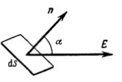

**Полный поток** сквозь произвольную поверхность $S$ равен интегралу:

$$\Phi = \int_S E_n\ dS$$

Знак потока зависит от выбора направления нормали (внешняя или внутренняя). Для замкнутых поверхностей всегда берут внешнюю нормаль.

### Теорема Остроградского-Гаусса (интегральная форма)

**Формулировка.** Поток вектора напряжённости электростатического поля сквозь любую *замкнутую* поверхность равен алгебраической сумме зарядов, охватываемых этой поверхностью, делённой на электрическую постоянную $\varepsilon_0$:

$$\oint_S E_n\ dS = \frac{q_{\text{внутр}}}{\varepsilon_0}$$

### Доказательство теоремы

**1)** Сначала рассмотрим поле одного точечного заряда $q$. Окружим этот заряд произвольной замкнутой поверхностью $S$.

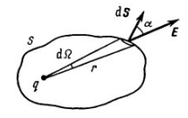

**2)** Найдём поток через бесконечно малый элемент этой поверхности $dS$:

$$d\Phi = E\ dS\cos\alpha$$

**3)** Подставим напряжённость поля точечного заряда $E = \dfrac{1}{4\pi\varepsilon_0}\dfrac{q}{r^2}$:

$$d\Phi = \frac{1}{4\pi\varepsilon_0}\frac{q}{r^2}\ dS\cos\alpha$$

**4)** Комбинация $\dfrac{dS\cos\alpha}{r^{2}}$ — это **телесный угол** $d\Omega$, под которым элемент $dS$ виден из точки, где сидит заряд.

*Телесный угол* — отношение площади участка сферы к квадрату её радиуса (в стерадианах); от радиуса не зависит. Полный телесный угол вокруг точки равен $\dfrac{4\pi r^{2}}{r^{2}} = 4\pi$ ср. Множитель $\cos\alpha$ нужен потому, что площадка наклонена к лучу: на сферу проецируется не вся $dS$, а $dS\cos\alpha$. Отсюда

$$d\Omega = \frac{dS\cos\alpha}{r^{2}} \implies d\Phi = \frac{q}{4\pi\varepsilon_0}\ d\Omega$$

Здесь $r^{2}$ из закона Кулона сократилось с $r^{2}$ телесного угла — расстояния в формуле больше нет.

**5)** Чтобы найти полный поток сквозь всю замкнутую поверхность, проинтегрируем это выражение. Полный телесный угол, охватывающий всё пространство вокруг точки, равен $4\pi$ стерадиан:

$$\Phi = \oint d\Phi = \frac{q}{4\pi\varepsilon_0}\oint d\Omega = \frac{q}{4\pi\varepsilon_0}\cdot 4\pi = \frac{q}{\varepsilon_0}$$

Результат не зависит ни от формы поверхности, ни от положения заряда внутри неё.

**6) Принцип суперпозиции.** Если внутри поверхности находится система точечных зарядов, то $\vec E = \vec E_1 + \vec E_2 + \dots$, и полный поток равен сумме потоков от каждого заряда:

$$\oint E_n\ dS = \Phi_1 + \Phi_2 + \dots = \frac{1}{\varepsilon_0}(q_1 + q_2 + \dots) = \frac{q_{\text{внутр}}}{\varepsilon_0}$$

**7) Заряды снаружи.** Если заряд $q$ находится вне поверхности $S$, вырезаемый им телесный угол $d\Omega$ протыкает поверхность дважды (входит и выходит). Потоки при этом имеют противоположные знаки ($\cos\alpha < 0$ на входе и $\cos\alpha > 0$ на выходе) и в сумме дают нуль. Значит, внешние заряды не вносят вклада в результирующий поток.

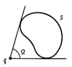

*Замечание.* Доказательство опирается на два факта: поле точечного заряда убывает как $1/r^2$ и выполняется принцип суперпозиции. Именно $r^2$ в знаменателе сокращается с $r^2$ в определении телесного угла — поэтому результат не зависит от расстояния и формы поверхности.

### Непрерывное распределение заряда

Если заряд распределён в пространстве непрерывно с объёмной плотностью $\rho$, то внутренний заряд равен интегралу по объёму:

$$q_{\text{внутр}} = \int_V \rho\ dV$$

Тогда интегральная форма теоремы Гаусса принимает вид:

$$\oint_S E_n\ dS = \frac{1}{\varepsilon_0}\int_V \rho\ dV$$

### Теорема Остроградского-Гаусса (дифференциальная форма)

Интегральная форма описывает связь поля и зарядов для конечного объёма. Дифференциальная форма локализует эту связь для каждой конкретной точки пространства.

Дивергенция в декартовых координатах равна

$$\mathrm{div}\ \vec E = \frac{\partial E_x}{\partial x} + \frac{\partial E_y}{\partial y} + \frac{\partial E_z}{\partial z}$$

**Переход от интегральной формы к дифференциальной.** По математической теореме Остроградского-Гаусса поток вектора через замкнутую поверхность равен интегралу от его дивергенции по охватываемому объёму:

$$\oint_S E_n\ dS = \int_V \mathrm{div}\ \vec E\ dV$$

Приравнивая это к правой части теоремы, получаем

$$\int_V \mathrm{div}\ \vec E\ dV = \frac{1}{\varepsilon_0}\int_V \rho\ dV$$

Перенесём всё в одну часть:

$$\int_V\left(\mathrm{div}\ \vec E - \frac{\rho}{\varepsilon_0}\right)dV = 0$$

Объём $V$ произвольный, поэтому подынтегральное выражение равно нулю в каждой точке (иначе взяли бы малый объём вокруг неё, и интеграл не был бы нулём):

$$\mathrm{div}\ \vec E = \frac{\rho}{\varepsilon_0}$$

*Смысл:* дивергенция (расходимость) вектора $\vec E$ в данной точке пространства зависит только от объёмной плотности заряда $\rho$ в этой же самой точке. Электрические заряды являются источниками (при $\rho > 0$) или стоками (при $\rho < 0$) электрического поля. Там, где зарядов нет, $\mathrm{div}\ \vec E = 0$ — линии поля не начинаются и не обрываются.

### Возможные вопросы

- *Что такое поток наглядно?* — Число силовых линий, пронизывающих поверхность.
- *Почему в формуле стоит $\cos\alpha$?* — Поток определяется через проекцию $\vec E$ на нормаль: важна только та составляющая, что пронизывает площадку. При $\vec E \parallel dS$ (поле скользит вдоль площадки) $\alpha = 90^\circ$ и поток равен нулю.
- *Что такое телесный угол?* — Отношение площади участка сферы к квадрату радиуса; полный телесный угол равен $4\pi$ ср.
- *Зависит ли поток от формы поверхности?* — Нет, только от заряда внутри. Форма и положение заряда внутри роли не играют.
- *Почему внешние заряды не дают вклада?* — Их силовые линии входят и выходят через поверхность, давая потоки противоположных знаков, сумма которых равна нулю.
- *Что важно в доказательстве?* — Закон $1/r^2$: именно он сокращается с $r^2$ телесного угла. Для другого закона теорема была бы неверна.
- *В чём разница двух форм?* — Интегральная связывает поле на поверхности с зарядом в объёме; дифференциальная связывает поле и заряд в одной точке. Переход — через математическую теорему Остроградского-Гаусса.

---

## 5. Примеры применения теоремы Остроградского-Гаусса для поля E

Теорема Остроградского-Гаусса $\left(\oint_S E_n\ dS = \dfrac{q_{\text{внутр}}}{\varepsilon_0}\right)$ позволяет легко находить напряжённость полей $\vec E$, обладающих высокой геометрической симметрией.

**Выбор замкнутой поверхности.** Поверхность подбирают под симметрию поля так, чтобы её части были одного из двух видов: либо $\vec E$ перпендикулярен поверхности и постоянен по модулю (тогда $\Phi = ES$), либо $\vec E$ параллелен ей (тогда поток через неё равен нулю). Только при этом условии $E$ выносится из-под интеграла и находится алгебраически.

### Поле бесконечной однородно заряженной плоскости

**1) Симметрия.** Плоскость бесконечна, все её точки равноправны, поэтому у $\vec E$ не может быть составляющей вдоль плоскости. Остаётся только перпендикулярная, одинаковая по модулю на равных расстояниях и направленная (при $\sigma > 0$) от плоскости в обе стороны.

**2) Поверхность** — цилиндр с осью, перпендикулярной плоскости, и основаниями $\Delta S$ по разные стороны от неё.

**3) Поток.** Через боковую поверхность потока нет ($\vec E \perp \vec n$, $E_n = 0$); через каждое основание $\vec E$ идёт перпендикулярно и постоянен по модулю:

$$\Phi_E = 2E\Delta S$$

**4) Заряд внутри** — заряд вырезанной площадки: $q_{\text{внутр}} = \sigma\Delta S$.

**5) Теорема Гаусса**, сокращаем $\Delta S$:

$$2E\Delta S = \frac{\sigma\Delta S}{\varepsilon_0} \implies E = \frac{\sigma}{2\varepsilon_0}$$

**Следствие:** расстояния в ответе нет — поле однородно. Двойка появилась оттого, что поток шёл через два основания.

![[05-plane.png]]

### Поле бесконечно длинного заряженного цилиндра (нити)

**1) Симметрия.** Цилиндр радиуса $R$ заряжен с линейной плотностью $\lambda$. Он бесконечен и симметричен относительно поворота вокруг оси, поэтому $\vec E$ направлен радиально и одинаков на равных расстояниях от оси.

**2) Поверхность** — коаксиальный цилиндр радиуса $r$ и длины $l$.

**3) Поток.** Через основания потока нет ($E_n = 0$); через боковую поверхность $\vec E$ идёт перпендикулярно и постоянен:

$$\Phi_E = E\cdot 2\pi r l$$

**4) Снаружи ($r \geq R$).** Внутри оказался кусок длиной $l$ с зарядом $q_{\text{внутр}} = \lambda l$; длина сокращается:

$$E\cdot 2\pi r l = \frac{\lambda l}{\varepsilon_0} \implies E = \frac{\lambda}{2\pi\varepsilon_0 r}$$

**5) Внутри ($r < R$).** Заряд сидит на поверхности цилиндра и внутрь не попадает: $q_{\text{внутр}} = 0$, поэтому $E = 0$.

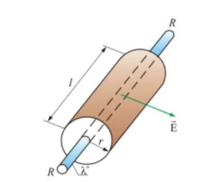

### Поле заряженной пустотелой сферы

**1) Симметрия.** Выделенного направления, кроме «от центра», нет, поэтому $\vec E$ радиален, а его модуль зависит только от $r$.

**2) Поверхность** — сфера радиуса $r$ с тем же центром; на ней $\vec E \parallel \vec n$ и $E = \text{const}$:

$$\Phi_E = E\cdot 4\pi r^{2}$$

**3) Снаружи ($r \geq R$).** $q_{\text{внутр}} = q$:

$$E\cdot 4\pi r^{2} = \frac{q}{\varepsilon_0} \implies E = \frac{q}{4\pi\varepsilon_0 r^{2}}$$

Это поле точечного заряда $q$, помещённого в центр.

**4) Внутри ($r < R$).** Весь заряд остался снаружи, $q_{\text{внутр}} = 0$, значит $E\cdot4\pi r^{2} = 0$, откуда $E = 0$.

**5) На границе** напряжённость скачком меняется от $0$ до $\dfrac{q}{4\pi\varepsilon_0 R^{2}}$: весь заряд лежит в бесконечно тонком слое.

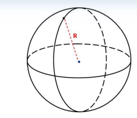![[05-sphere-graph.png|240]]

### Поле объёмно заряженного шара

**1) Условие.** Полный заряд равен плотности на объём шара: $q = \rho\cdot\dfrac{4}{3}\pi R^{3}$. Симметрия и поверхность те же, что у сферы, снова $\Phi_E = E\cdot 4\pi r^{2}$.

**2) Снаружи ($r \geq R$).** Внутрь попал весь заряд $q$, выкладка повторяет случай сферы:

$$E = \frac{q}{4\pi\varepsilon_0 r^{2}}$$

**3) Внутри ($r < R$).** Охвачена только внутренняя часть радиуса $r$ с зарядом $q_{\text{внутр}} = \rho\cdot\dfrac{4}{3}\pi r^{3}$. Подставляем и сокращаем $4\pi r^{2}$:

$$E\cdot 4\pi r^{2} = \frac{1}{\varepsilon_0}\cdot\rho\frac{4}{3}\pi r^{3} \implies E = \frac{\rho r}{3\varepsilon_0}$$

**4) Проверка на границе.** При $r = R$ обе формулы дают $\dfrac{\rho R}{3\varepsilon_0}$ — поле непрерывно.

**Следствие:** внутри шара $E$ растёт линейно от нуля в центре до максимума на поверхности, снаружи убывает как $1/r^{2}$.

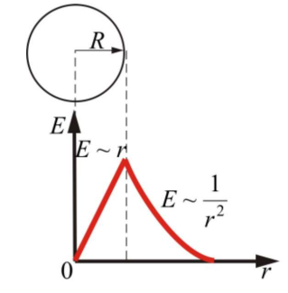

### Возможные вопросы

- *Как выбирается поверхность Гаусса?* — По симметрии поля: так, чтобы на каждом её участке $\vec E$ был либо перпендикулярен поверхности и постоянен по модулю, либо параллелен ей.
- *Почему поле плоскости не зависит от расстояния?* — При удалении поток «размазывается» по тем же двум основаниям $\Delta S$, а охваченный заряд $\sigma\Delta S$ не меняется, поэтому и $E$ не меняется.
- *Почему внутри сферы поле равно нулю?* — Внутрь воображаемой поверхности не попадает ни одного заряда, а по теореме Гаусса поток определяется только внутренним зарядом.
- *Чем поле шара отличается от поля сферы?* — Снаружи они одинаковы. Внутри у сферы $E = 0$, а у шара растёт линейно, поскольку внутренняя часть заряда всё же охватывается поверхностью.
- *Почему у сферы на границе скачок, а у шара нет?* — У сферы весь заряд лежит в бесконечно тонком слое, при переходе через него охваченный заряд меняется скачком; у шара заряд распределён по объёму и нарастает плавно.
- *Почему теорема не позволяет найти поле нити конечной длины?* — Там нет нужной симметрии: $E$ не постоянен на боковой поверхности цилиндра и его нельзя вынести из-под интеграла.

---

## 6. Работа кулоновских сил. Теорема о циркуляции вектора E

### Работа кулоновских сил

Рассмотрим работу, которую совершает поле неподвижного точечного заряда $q'$ при перемещении пробного заряда $q$ из точки 1 в точку 2. На бесконечно малом участке пути $d\vec l$ поле совершает элементарную работу:

$$dA = \vec F\ d\vec l = F\ dl\cos\alpha$$

где $\alpha$ — угол между вектором силы $\vec F$ и вектором перемещения $d\vec l$.

**Ключевой шаг: $dl\cos\alpha = dr$.** Кулоновская сила направлена вдоль радиус-вектора. Разложим перемещение $d\vec l$ на радиальную составляющую (вдоль силы, длина $dl\cos\alpha$) и поперечную (перпендикулярна силе, работы не совершает). Радиальная составляющая и есть изменение расстояния до заряда:

$$dl\cos\alpha = dr$$

Отсюда видно, что работа зависит только от того, насколько мы приблизились или удалились.

Подставляя это и $F = \dfrac{qq'}{4\pi\varepsilon_0 r^{2}}$:

$$dA = \frac{qq'}{4\pi\varepsilon_0 r^{2}}\ dr$$

Интегрируем от $r_1$ до $r_2$; первообразная от $r^{-2}$ равна $-\dfrac{1}{r}$:

$$A_{12} = \int_{r_1}^{r_2}\frac{qq'}{4\pi\varepsilon_0 r^{2}}\ dr = \frac{qq'}{4\pi\varepsilon_0}\left[-\frac{1}{r}\right]_{r_1}^{r_2} = \frac{qq'}{4\pi\varepsilon_0}\left(\frac{1}{r_1} - \frac{1}{r_2}\right)$$

**Следствия:**

- Работа сил электростатического поля не зависит от формы траектории, а определяется только начальным и конечным расстояниями $r_1$ и $r_2$.
- При перемещении по замкнутому пути ($r_1 = r_2$) работа поля равна нулю.

### Теорема о циркуляции вектора E

**Циркуляцией вектора** $\vec E$ называется интеграл по замкнутому контуру $\oint \vec E\ d\vec l$.
**Физический смысл величины.** Это работа, которую поле совершает над **единичным** положительным зарядом, протащенным по контуру и вернувшимся в начало. Она же — мера «закрученности» поля: если поле гоняет заряд по кругу, циркуляция не ноль.

**Формулировка.** Циркуляция вектора напряжённости электростатического поля по любому замкнутому контуру равна нулю:

$$\oint \vec E\ d\vec l = 0$$

Это фундаментальное свойство электростатического поля: оно имеет **безвихревой** характер, его силовые линии не могут быть замкнутыми.

### Доказательство теоремы

**1)** Выберем произвольный замкнутый путь. Элементарная работа поля над единичным положительным зарядом ($q = 1$) равна:

$$dA = \vec E\ d\vec l$$

**2)** Разобьём замкнутый путь точками 1 и 2 на две части: путь $1a2$ и путь $2b1$.

**3)** Работа не зависит от формы пути, поэтому работа по пути $a$ равна работе по пути $b$:

$$\int_{1a2}\vec E\ d\vec l = \int_{1b2}\vec E\ d\vec l$$

**4)** При обходе пути $b$ в обратном направлении (от 2 к 1) знак интеграла меняется на противоположный:

$$\int_{1a2}\vec E\ d\vec l = -\int_{2b1}\vec E\ d\vec l$$

**5)** Перенесём всё в левую часть:

$$\int_{1a2}\vec E\ d\vec l + \int_{2b1}\vec E\ d\vec l = 0$$

Сумма этих двух интегралов есть полный интеграл по замкнутому контуру, откуда получаем теорему о циркуляции:

$$\oint \vec E\ d\vec l = 0$$

### Возможные вопросы

- *Почему работа не зависит от формы пути?* — В работу входит только $dl\cos\alpha = dr$, то есть изменение расстояния до заряда. Боковые смещения работы не совершают, поэтому от траектории остаются лишь её концы.
- *Что означает, что поле потенциально?* — Работа его сил определяется только начальным и конечным положениями заряда, а по замкнутому пути равна нулю.
- *Может ли силовая линия электростатического поля быть замкнутой?* — Нет. Вдоль такой линии $\vec E$ всюду сонаправлен с $d\vec l$, обход дал бы $\oint \vec E\ d\vec l > 0$, что противоречит теореме.
- *Почему в доказательстве берут единичный заряд?* — Чтобы работа совпала с интегралом от $\vec E$: при $q = 1$ сила $\vec F = q\vec E$ равна самому $\vec E$. Это упрощение записи, общность не теряется.
- *Для каких полей теорема неверна?* — Для вихревого электрического поля, порождаемого переменным магнитным потоком: его циркуляция отлична от нуля, силовые линии замкнуты, потенциал ввести нельзя.
- *Как теорема о циркуляции связана с теоремой Гаусса?* — Это две независимые характеристики поля: Гаусс говорит о его источниках (заряды создают поток), циркуляция — об отсутствии вихрей. Вместе они полностью определяют электростатическое поле.

---

## 7. Энергия и потенциал электростатического поля

### Потенциальная энергия

Электростатическое поле потенциально, поэтому работу его сил можно выразить через убыль потенциальной энергии:

$$A_{12} = W_1 - W_2$$

Сравним это с работой из билета 6, раскрыв скобку:

$$A_{12} = \frac{qq'}{4\pi\varepsilon_0}\left(\frac{1}{r_1} - \frac{1}{r_2}\right) = \frac{qq'}{4\pi\varepsilon_0 r_1} - \frac{qq'}{4\pi\varepsilon_0 r_2}$$

Слева $W_1 - W_2$, справа разность двух одинаково устроенных величин: первая относится к началу пути, вторая к концу. Сопоставляя почленно:

$$W = \frac{1}{4\pi\varepsilon_0}\frac{qq'}{r} + \text{const}$$

Константа появилась потому, что из работы восстанавливается только **разность** энергий. Её выбирают так, чтобы при $r\to\infty$ энергия обращалась в нуль, то есть $\text{const} = 0$:

$$W = \frac{1}{4\pi\varepsilon_0}\frac{qq'}{r}$$

Энергия положительна для одноимённых зарядов и отрицательна для разноимённых.

### Потенциал

**Определение.** Потенциал — скалярная физическая величина, являющаяся энергетической характеристикой электростатического поля. Он численно равен потенциальной энергии, которой обладает в данной точке поля единичный положительный заряд:

$$\varphi = \frac{W}{q_{\text{пр}}}$$

где $q_{\text{пр}}$ — пробный заряд, помещённый в данную точку. Измеряется в вольтах: $1\ \text{В} = 1\ \text{Дж}/\text{Кл}$.

Обратно: энергия заряда $q$ в точке с потенциалом $\varphi$ равна $W = q\varphi$.

**Потенциал точечного заряда.** Делим энергию пробного заряда на него самого:

$$\varphi = \frac{W}{q_{\text{пр}}} = \frac{1}{q_{\text{пр}}}\cdot\frac{1}{4\pi\varepsilon_0}\frac{q\ q_{\text{пр}}}{r} = \frac{1}{4\pi\varepsilon_0}\frac{q}{r}$$

Константа выбрана так, что потенциал бесконечно удалённой точки равен нулю.

**Принцип суперпозиции.** Если поле создаётся системой зарядов, то потенциал результирующего поля равен алгебраической (скалярной) сумме потенциалов, создаваемых каждым из зарядов в отдельности:

$$\varphi = \sum_k \varphi_k = \frac{1}{4\pi\varepsilon_0}\sum_k \frac{q_k}{r_k}$$

**Работа через разность потенциалов.** Подставив $W = q\varphi$ в $A_{12} = W_1 - W_2$:

$$A_{12} = q(\varphi_1 - \varphi_2)$$

Разность потенциалов $\varphi_1 - \varphi_2$ называют напряжением $U$.

### Эквипотенциальные поверхности

**Определение.** Воображаемая поверхность, все точки которой имеют одинаковый потенциал ($\varphi(x,y,z) = \text{const}$), называется эквипотенциальной поверхностью.

При перемещении вдоль эквипотенциальной поверхности $d\varphi = 0$, поэтому работа $dA = -q\ d\varphi = 0$. С другой стороны, $dA = qE_l\ dl$, откуда $E_l = 0$ — касательной составляющей у $\vec E$ нет. Значит, в каждой точке **вектор $\vec E$ направлен по нормали (перпендикулярно) к эквипотенциальной поверхности**.

 

### Возможные вопросы

- *Почему потенциалы складываются алгебраически, а напряжённости — векторно?* — Потенциал скаляр, у него нет направления, поэтому складываются числа со своими знаками. Напряжённость — вектор, её складывают по правилу параллелограмма.
- *Потенциал определён с точностью до константы — что тогда имеет физический смысл?* — Только разность потенциалов: именно она входит в работу $A = q(\varphi_1 - \varphi_2)$. Ноль условно помещают в бесконечность (в технике — на землю).
- *Какого знака бывает энергия $W$?* — Положительная для одноимённых зарядов (они отталкиваются, при сближении энергия растёт) и отрицательная для разноимённых.
- *Почему $\vec E$ перпендикулярен эквипотенциальной поверхности?* — Будь у $\vec E$ касательная составляющая, при перемещении вдоль поверхности она совершала бы работу, но работа там равна нулю, так как $d\varphi = 0$.
- *Как выглядят эквипотенциальные поверхности точечного заряда?* — Концентрические сферы с центром в заряде; на рисунке (в сечении) — окружности.
- *Как по картине эквипотенциалей понять, где поле сильнее?* — Там, где поверхности расположены гуще: потенциал меняется на том же шаге за меньшее расстояние, значит $E$ больше.

---

## 8. Связь между напряжённостью электростатического поля и его потенциалом

### Вывод связи через работу поля

Электростатическое поле можно описать либо векторной величиной $\vec E$, либо скалярной величиной $\varphi$. Найдём связь между ними. Рассмотрим работу, совершаемую силами поля при бесконечно малом перемещении $dl$ точечного заряда $q$.

С одной стороны, работа равна произведению силы на перемещение:

$$dA = F_l\ dl = qE_l\ dl$$

где $E_l$ — проекция вектора $\vec E$ на направление перемещения $dl$.

С другой стороны, работа равна убыли потенциальной энергии:

$$dA = -q\ d\varphi$$

Приравнивая правые части, получаем:

$$qE_l\ dl = -q\ d\varphi \implies E_l = -\frac{d\varphi}{dl}$$

**Физический смысл.** Проекция вектора напряжённости на любое направление равна скорости убывания потенциала вдоль этого направления.

### Связь в трёхмерном пространстве (через градиент)

Записав это соотношение для декартовых осей координат ($x, y, z$), получим проекции вектора $\vec E$ через частные производные потенциала:

$$E_x = -\frac{\partial\varphi}{\partial x},\qquad E_y = -\frac{\partial\varphi}{\partial y},\qquad E_z = -\frac{\partial\varphi}{\partial z}$$

Сам вектор напряжённости записывается через единичные векторы (орты) $\vec i, \vec j, \vec k$:

$$\vec E = -\left(\frac{\partial\varphi}{\partial x}\vec i + \frac{\partial\varphi}{\partial y}\vec j + \frac{\partial\varphi}{\partial z}\vec k\right)$$

Выражение в скобках по определению называется **градиентом** скалярной функции $\varphi$ (обозначается $\mathrm{grad}\ \varphi$ или $\nabla\varphi$). Градиент — это вектор, показывающий направление наибыстрейшего *увеличения* функции. Тогда окончательная связь:

$$\vec E = -\mathrm{grad}\ \varphi = -\nabla\varphi$$

### Обратный переход: от E к потенциалу

Из $E_l = -\dfrac{d\varphi}{dl}$ следует $d\varphi = -\vec E\ d\vec l$. Интегрируем вдоль пути из точки 1 в точку 2 и меняем знак:

$$\int_1^2 d\varphi = \varphi_2 - \varphi_1 = -\int_1^2\vec E\ d\vec l \implies \varphi_1 - \varphi_2 = \int_1^2 \vec E\ d\vec l$$

Путь роли не играет: работа электростатического поля от него не зависит (билет 6).

### Главный вывод

Напряжённость электростатического поля равна градиенту потенциала, взятому с обратным знаком. Знак минус означает, что вектор напряжённости $\vec E$ всегда направлен в сторону **наибыстрейшего уменьшения потенциала** (по нормали к эквипотенциальной поверхности).

Отсюда единица напряжённости — вольт на метр: $1\ \text{В}/\text{м} = 1\ \text{Н}/\text{Кл}$.

### Возможные вопросы

- *Почему в формуле минус?* — Градиент указывает в сторону роста потенциала, а поле толкает положительный заряд туда, где потенциал меньше. Направления противоположны, отсюда знак.
- *Что такое градиент простыми словами?* — Вектор «самого крутого подъёма»: он показывает, в какую сторону функция растёт быстрее всего, а его длина равна скорости этого роста.
- *Почему $\vec E$ перпендикулярен эквипотенциальной поверхности?* — Вдоль поверхности $\varphi$ не меняется, значит производная по этому направлению равна нулю и касательной составляющей у $\vec E$ нет.
- *Может ли быть $\varphi = 0$ там, где $E \neq 0$, и наоборот?* — Да, и то и другое. Посередине между $+q$ и $-q$ потенциал равен нулю, а поле максимально; внутри заряженной сферы поле равно нулю, а потенциал нет. Поле определяется не значением потенциала, а скоростью его изменения.
- *Что удобнее находить первым — $\varphi$ или $\vec E$?* — Потенциал: он скаляр, складывается алгебраически. Найдя $\varphi$, поле получают дифференцированием.
- *Чему равно поле между обкладками плоского конденсатора?* — Поле однородно, потенциал меняется равномерно, поэтому $E = \dfrac{\varphi_1 - \varphi_2}{d} = \dfrac{U}{d}$, где $d$ — расстояние между обкладками.

---

## 9. Электрический диполь. Поле и потенциал

### Электрический диполь и его момент

**Определение.** Электрическим диполем называется система двух одинаковых по величине, но разноимённых точечных зарядов ($+q$ и $-q$), расстояние между которыми ($l$) значительно меньше расстояния до тех точек, в которых определяется поле системы ($r \gg l$).

- Вектор $\vec l$, направленный от отрицательного заряда к положительному, называется **плечом диполя**.
- Главной характеристикой является **электрический дипольный момент**:
$$\vec p = q\vec l$$
Направление $\vec p$ совпадает с направлением плеча $\vec l$ (от минуса к плюсу). Единица измерения в СИ — Кл·м.

### Потенциал поля диполя

Потенциал в произвольной точке находится по принципу суперпозиции как сумма потенциалов полей, создаваемых положительным и отрицательным зарядами:

$$\varphi = \varphi_+ + \varphi_- = \frac{1}{4\pi\varepsilon_0}\left(\frac{q}{r_+} - \frac{q}{r_-}\right) = \frac{q}{4\pi\varepsilon_0}\cdot\frac{r_- - r_+}{r_+ r_-}$$

Дальше пользуемся условием $r \gg l$.

**1) Разность расстояний.** Точка наблюдения так далеко, что лучи, идущие в неё от плюса, от минуса и от центра диполя, почти параллельны. Поэтому разница расстояний есть проекция плеча $\vec l$ на луч — прилежащий катет в треугольнике с гипотенузой $l$ и углом $\vartheta$:

$$r_- - r_+ \approx l\cos\vartheta$$

**2) Произведение расстояний.** Каждое отличается от $r$ не больше чем на $l/2$, а $l \ll r$, поэтому

$$r_+ r_- \approx r^{2}$$

**3) Подставляем**, учитывая $ql = p$:

$$\varphi = \frac{1}{4\pi\varepsilon_0}\frac{p\cos\vartheta}{r^2}$$

где $\vartheta$ — угол между осью диполя (вектором $\vec p$) и направлением на точку наблюдения.

### Электрическое поле диполя

Напряжённость находят через связь поля с потенциалом (билет 8): $\vec E = -\mathrm{grad}\ \varphi$. Потенциал зависит от двух величин — расстояния $r$ и угла $\vartheta$, поэтому вектор $\vec E$ раскладывают на две взаимно перпендикулярные составляющие: **радиальную** $E_r$ — вдоль луча, соединяющего центр диполя с точкой наблюдения, и **касательную** $E_\vartheta$ — перпендикулярно этому лучу. 

**Радиальная составляющая** — скорость убывания потенциала при удалении, угол закреплён. Учитывая $\dfrac{\partial}{\partial r}\left(\dfrac{1}{r^2}\right) = -\dfrac{2}{r^3}$:

$$E_r = -\frac{\partial\varphi}{\partial r} = -\frac{p\cos\vartheta}{4\pi\varepsilon_0}\cdot\left(-\frac{2}{r^3}\right) = \frac{1}{4\pi\varepsilon_0}\frac{2p\cos\vartheta}{r^3}$$

**Касательная составляющая** — скорость убывания потенциала при обходе диполя по дуге. При повороте на угол $d\vartheta$ точка проходит путь $dl = r\ d\vartheta$, поэтому в знаменателе появляется $r$. Учитывая $\dfrac{\partial(\cos\vartheta)}{\partial\vartheta} = -\sin\vartheta$:

$$E_\vartheta = -\frac{1}{r}\frac{\partial\varphi}{\partial\vartheta} = -\frac{p}{4\pi\varepsilon_0 r^3}\cdot(-\sin\vartheta) = \frac{1}{4\pi\varepsilon_0}\frac{p\sin\vartheta}{r^3}$$

Обе составляющие убывают как $1/r^3$. Три случая билета получаются подстановкой конкретного угла.

**А) Поле на оси диполя (продольное),** $\vartheta = 0$. Тогда $\sin 0 = 0$ — касательной составляющей нет, а $\cos 0 = 1$:

$$\vec E_\parallel = \frac{1}{4\pi\varepsilon_0}\frac{2\vec p}{r^3}$$

Вектор напряжённости совпадает по направлению с вектором дипольного момента $\vec p$: на оси ближе оказывается положительный заряд, его поле сильнее и задаёт направление.

**Б) Поле на перпендикуляре, проходящем через центр диполя (поперечное),** $\vartheta = 90^\circ$. Тогда $\cos 90^\circ = 0$ — радиальной составляющей нет, а $\sin 90^\circ = 1$:

$$\vec E_\perp = -\frac{1}{4\pi\varepsilon_0}\frac{\vec p}{r^3}$$

Вектор напряжённости антипараллелен $\vec p$: оба заряда равноудалены, радиальные составляющие полей гасят друг друга, а касательные направлены от плюса к минусу. Поле вдвое слабее, чем на оси, — двойка была только в радиальной составляющей.

**В) Поле в произвольной точке.** Составляющие взаимно перпендикулярны, поэтому модуль находится по теореме Пифагора:

$$E = \sqrt{E_r^2 + E_\vartheta^2} = \frac{p}{4\pi\varepsilon_0 r^3}\sqrt{4\cos^2\vartheta + \sin^2\vartheta}$$

Заменив $\sin^2\vartheta = 1 - \cos^2\vartheta$, получаем $4\cos^2\vartheta + 1 - \cos^2\vartheta = 3\cos^2\vartheta + 1$:

$$E = \frac{p}{4\pi\varepsilon_0 r^3}\sqrt{3\cos^2\vartheta + 1}$$

При $\vartheta = 0$ корень равен 2 и получается случай А, при $\vartheta = 90^\circ$ равен 1 и получается случай Б.

### Возможные вопросы

- *Зачем нужно условие $r \gg l$?* — Только при нём справедливы приближения $r_- - r_+ \approx l\cos\vartheta$ и $r_+ r_- \approx r^2$. Вблизи диполя формулы неверны, там надо считать поля двух зарядов честно.
- *Почему поле диполя убывает как $1/r^3$, а не как $1/r^2$?* — Суммарный заряд диполя равен нулю, поэтому издалека поля зарядов почти компенсируются. Остаётся малая разность, которая убывает на порядок быстрее, чем поле одиночного заряда.
- *Куда направлен вектор $\vec p$?* — От отрицательного заряда к положительному, то есть **против** направления поля внутри диполя.
- *Почему поле на оси вдвое больше, чем на перпендикуляре?* — На оси векторы $\vec E_+$ и $\vec E_-$ направлены в одну сторону и складываются; на перпендикуляре они направлены под углом, вертикальные составляющие компенсируются и остаются только горизонтальные.
- *Где потенциал диполя равен нулю?* — В плоскости, перпендикулярной оси диполя и проходящей через его центр ($\vartheta = 90^\circ$, $\cos\vartheta = 0$). При этом поле там не равно нулю.
- *Зачем вообще нужна модель диполя?* — Молекулы многих веществ (например, воды) представляют собой диполи, а нейтральные молекулы становятся диполями во внешнем поле. На этом строится вся теория диэлектриков.

---

## 10. Электрический диполь. Сила, действующая на диполь, её момент. Энергия диполя во внешнем поле

### Сила, действующая на диполь во внешнем поле

На заряды $+q$ и $-q$ диполя во внешнем поле действуют силы

$$\vec F_+ = q\vec E_+,\qquad \vec F_- = -q\vec E_-$$

где $\vec E_+$ и $\vec E_-$ — напряжённость внешнего поля в тех точках, где находятся заряды. Результирующая сила $\vec F = \vec F_+ + \vec F_-$.

**В однородном поле** ($\vec E = \text{const}$). Поле в обеих точках одинаково, $\vec E_+ = \vec E_-$, поэтому силы равны по модулю и противоположны по направлению:

$$\vec F = q\vec E - q\vec E = 0$$

Результирующая сила равна нулю — поступательного движения диполя нет.

**В неоднородном поле** ($\vec E \neq \text{const}$). Если поле меняется в пространстве, заряды сидят в **разных по силе** полях, и компенсации не выходит.

**Вывод построчно.** Пусть диполь вытянут вдоль направления $l$, вдоль которого поле меняется. Минус стоит в точке, где поле равно $E$, плюс — на расстоянии $l$ дальше, где поле уже другое:

$$E_+ = E + \Delta E, \qquad \Delta E = \frac{\partial E}{\partial l}\cdot l$$

(это обычная запись «изменение = скорость изменения × пройденный путь»). Складываем силы:

$$F = qE_+ - qE_- = q(E + \Delta E) - qE = q\ \Delta E = q\ l\ \frac{\partial E}{\partial l}$$

Подставляем $ql = p$:

$$F = p\frac{\partial E}{\partial l}$$

**Вывод:** в неоднородном поле на диполь действует сила, стремящаяся переместить его в область, где напряжённость поля по модулю больше.

### Момент сил, действующих на диполь

Хотя в однородном поле результирующая сила равна нулю, силы $\vec F_+$ и $\vec F_-$ не лежат на одной прямой, поэтому они создают **пару сил** — вращающий момент.

Момент пары равен произведению модуля силы на **плечо пары** — расстояние между линиями действия сил (а не между точками приложения).

**1)** Поле однородно, заряды равны по модулю, поэтому $F_+ = F_- = qE$.

**2)** Линии действия — две параллельные прямые через заряды вдоль $\vec E$. Расстояние между ними — катет, противолежащий углу $\alpha$, в треугольнике с гипотенузой $l$:

$$d = l\sin\alpha$$

**3)** Собираем, учитывая $ql = p$:

$$M = F\cdot d = qE\cdot l\sin\alpha = pE\sin\alpha$$

В векторной форме момент записывается через векторное произведение:

$$\vec M = [\vec p\ \vec E]$$

Момент сил стремится повернуть диполь так, чтобы его электрический момент $\vec p$ установился параллельно вектору напряжённости внешнего поля ($\vec p \uparrow\uparrow \vec E$).

### Потенциальная энергия диполя во внешнем поле

**Шаг 1. Энергия двух зарядов во внешнем поле.** Из билета 7 знаем: энергия заряда в точке с потенциалом $\varphi$ равна $W = q\varphi$. У нас два заряда в разных точках:

$$W = (+q)\varphi_+ + (-q)\varphi_- = q(\varphi_+ - \varphi_-)$$

где $\varphi_+$ — потенциал внешнего поля там, где сидит плюс, $\varphi_-$ — там, где сидит минус.

**Шаг 2. Разность потенциалов через поле.** Из билета 8: $\varphi_1 - \varphi_2 = \int\vec E\ d\vec l$. Для однородного поля интеграл превращается в произведение. Идём от минуса к плюсу — это смещение $\vec l$:

$$\varphi_+ - \varphi_- = -\vec E\cdot\vec l = -El\cos\alpha$$

*Откуда минус:* потенциал **убывает** вдоль поля. Если идти по направлению $\vec E$, потенциал становится меньше, значит разность «конец минус начало» отрицательна.

**Шаг 3. Подставляем и вводим $p = ql$:**

$$W = q\cdot(-El\cos\alpha) = -(ql)E\cos\alpha = -pE\cos\alpha$$

где $\alpha$ — угол между вектором $\vec p$ и вектором $\vec E$.

**Анализ устойчивости:**

- $\alpha = 0$ ($\vec p \uparrow\uparrow \vec E$): энергия минимальна, $W_{\min} = -pE$, момент равен нулю. Это положение **устойчивого равновесия**: при отклонении возникает момент сил, возвращающий диполь обратно.
- $\alpha = 180^\circ$ ($\vec p \uparrow\downarrow \vec E$): энергия максимальна, $W_{\max} = +pE$, момент тоже равен нулю, но равновесие **неустойчивое** — при малейшем отклонении момент разворачивает диполь на $180^\circ$.
- $\alpha = 90^\circ$: энергия равна нулю, а момент максимален и равен $pE$.

### Возможные вопросы

- *Почему в однородном поле диполь поворачивается, но не движется?* — Силы на зарядах равны и противоположны, поэтому сумма их равна нулю (нет поступательного движения), но линии их действия не совпадают, и пара сил создаёт вращающий момент.
- *Почему в неоднородном поле диполь втягивается в область сильного поля?* — Заряд, оказавшийся в более сильном поле, испытывает бо́льшую силу, и она перевешивает. Так наэлектризованная расчёска притягивает нейтральные бумажки: сначала поле превращает их в диполи, а затем втягивает в область, где поле сильнее.
- *Куда направлен вектор $\vec M$?* — Перпендикулярно плоскости, в которой лежат $\vec p$ и $\vec E$, по правилу правого винта (буравчика).
- *При каких углах момент равен нулю и чем эти положения отличаются?* — При $\alpha = 0$ и $\alpha = 180^\circ$. Первое устойчиво (минимум энергии), второе неустойчиво (максимум).
- *Почему в формуле энергии стоит минус?* — Чтобы энергия была минимальной в положении «по полю»: система сама стремится туда, где энергии меньше, а диполь стремится развернуться вдоль $\vec E$.
- *Как связаны момент и энергия?* — Момент численно равен скорости изменения энергии с углом: $M = \left|\dfrac{dW}{d\alpha}\right| = pE\sin\alpha$, и он всегда поворачивает диполь в сторону уменьшения энергии.

---

## 11. Поле системы зарядов на больших расстояниях

### Постановка задачи

Рассмотрим систему из $N$ зарядов $q_1, q_2, \dots, q_N$, размещённых в объёме с линейными размерами порядка $l$. Найдём потенциал поля $\varphi(r)$ на больших расстояниях $r \gg l$.

Выберем начало координат $O$ внутри объёма. Положение $i$-го заряда задаётся радиус-вектором $\vec r_i$, точка наблюдения — вектором $\vec r$.

По принципу суперпозиции потенциал в точке наблюдения равен сумме потенциалов всех зарядов:

$$\varphi(r) = \frac{1}{4\pi\varepsilon_0}\sum_{i=1}^{N}\frac{q_i}{|\vec r - \vec r_i|} \qquad (11.1)$$

Точно просуммировать это нельзя — расстояния $|\vec r - \vec r_i|$ у всех зарядов разные. Но при $r \gg l$ их можно приближённо выразить через одно общее $r$.

### Вывод формулы мультипольного разложения

**1) Приближаем расстояние от заряда до точки наблюдения.** Разложим $\vec r_i$ на продольную составляющую (вдоль направления на точку наблюдения) и поперечную. Продольная равна проекции $r_{ir} = r_i\cos\vartheta_i$ и приближает заряд к точке ровно на эту величину; поперечная при $r_i \ll r$ даёт поправку порядка $r_i^2/r$, которой пренебрегаем:

$$|\vec r - \vec r_i| \approx r - r_{ir} = r\left(1 - \frac{r_{ir}}{r}\right)$$

**2) Подставляем это выражение в (11.1):**

$$\varphi(r) = \frac{1}{4\pi\varepsilon_0}\sum_{i=1}^{N}\frac{q_i}{r\left(1 - \dfrac{r_{ir}}{r}\right)} \qquad (11.2)$$

**3) Раскрываем дробь по формуле приближённого вычисления для малых величин** $\dfrac{1}{1-x} \approx 1 + x$ (справедлива при $x \ll 1$). В нашем случае $x = \dfrac{r_{ir}}{r} \ll 1$:

$$\varphi(r) = \frac{1}{4\pi\varepsilon_0}\sum_{i=1}^{N}\frac{q_i}{r}\left(1 + \frac{r_{ir}}{r}\right)$$

**4) Разбиваем сумму на два слагаемых:**

$$\varphi(r) = \frac{1}{4\pi\varepsilon_0 r}\sum_i q_i \ +\  \frac{1}{4\pi\varepsilon_0 r^2}\sum_i q_i r_{ir} \qquad (11.3)$$

Это выражение представляет собой разложение функции в ряд по степеням $r_i/r$ и называется **мультипольным разложением**.

### Анализ членов разложения

**Первый член (мультиполь нулевого порядка, монополь).** Зависит от алгебраической суммы зарядов $\sum q_i$. Если $\sum q_i \neq 0$, этот член даёт основной вклад в потенциал на больших расстояниях; потенциал убывает как $\sim 1/r$. Система издалека выглядит как один точечный заряд, равный суммарному.

**Второй член (мультиполь первого порядка, диполь).** Если система электрически нейтральна ($\sum q_i = 0$), первый член обращается в нуль, и поле определяется вторым членом (убывает как $\sim 1/r^2$). Величина

$$\vec p = \sum_{i=1}^{N} q_i \vec r_i$$

называется **дипольным электрическим моментом системы зарядов**. Так как $\sum q_i r_{ir} = p_r = p\cos\vartheta$ — проекция $\vec p$ на направление $\vec r$, второй член имеет вид

$$\varphi = \frac{p\cos\vartheta}{4\pi\varepsilon_0 r^2}$$

то есть в точности потенциал диполя из билета 9.

### Последующие члены (высшие мультиполи)

Если суммарный заряд и дипольный момент равны нулю, поле определяется третьим членом разложения — полем **квадруполя**, четвёртый член — поле **октуполя**.

**Вывод:** Чем выше порядок мультиполя, тем быстрее убывает его поле с расстоянием, поэтому вдали от системы «выживает» первый ненулевой член разложения.

### Возможные вопросы

- *Зачем вообще нужно разложение?* — Точно просуммировать поле большого числа зарядов невозможно, а издалека этого и не требуется: система характеризуется всего несколькими числами — полным зарядом, дипольным моментом и т. д.
- *Почему $|\vec r - \vec r_i| \approx r - r_{ir}$?* — При $r_i \ll r$ лучи из $O$ и из заряда на точку наблюдения почти параллельны, поэтому вектор $\vec r_i$ укорачивает расстояние ровно на свою проекцию на направление $\vec r$. Отброшенная поперечная часть даёт поправку порядка $(r_i/r)^2$.
- *Откуда взялась формула $\dfrac{1}{1-x} \approx 1+x$?* — Это первые два члена разложения в ряд; проверяется умножением: $(1-x)(1+x) = 1 - x^2 \approx 1$ при малом $x$.
- *Докажите, что дипольный момент не зависит от выбора начала координат.* — Сдвинем начало на вектор $\vec b$: тогда $\vec r_i\ ' = \vec b + \vec r_i$ и $\vec p\ ' = \sum q_i(\vec b + \vec r_i) = \vec b\sum q_i + \sum q_i\vec r_i$. Первое слагаемое равно нулю из-за нейтральности, второе есть $\vec p$, значит $\vec p\ ' = \vec p$.
- *Почему для ненейтральной системы дипольный момент не имеет смысла?* — Тогда $\vec p\ ' = \vec b\sum q_i + \vec p$ зависит от $\vec b$, то есть от выбора начала координат: сдвинув начало, можно получить любое значение.
- *Как быстро убывают поля мультиполей?* — Потенциал: монополь $1/r$, диполь $1/r^2$, квадруполь $1/r^3$, октуполь $1/r^4$. Напряжённость в каждом случае убывает на степень быстрее.
- *Как связаны билеты 9 и 11?* — Билет 9 рассматривал два заряда $\pm q$; билет 11 показывает, что диполь — это второй член разложения поля **любой** нейтральной системы, поэтому формулы билета 9 работают гораздо шире.
- *Что такое квадруполь?* — Система из четырёх зарядов, у которой равны нулю и полный заряд, и дипольный момент (например, четыре заряда $\pm q$ в вершинах квадрата через один).

---

## 12. Поле внутри и снаружи проводника

### Электрическое поле внутри проводника

**Проводник** отличается наличием **свободных носителей заряда** (в металлах — электронов), которые могут перемещаться по всему объёму тела.

При внесении проводника во внешнее поле свободные заряды приходят в движение: на поверхности появляются **индуцированные** (наведённые) заряды, поле которых $\vec E\ '$ внутри проводника направлено навстречу внешнему. Разделение продолжается, пока $E\ '$ не скомпенсирует внешнее поле полностью:

$$\vec E_{\text{рез}} = \vec E + \vec E\ ' = 0$$

Раньше движение прекратиться не может: пока результирующее поле не равно нулю, на свободные заряды действует сила.

**Вывод:** в статическом случае электрическое поле внутри проводника отсутствует:

$$\boxed{\ \vec E = 0\ }$$

### Следствия из условия $\vec E = 0$

**1) Эквипотенциальность.** Так как $\vec E = -\mathrm{grad}\ \varphi$, условие $\vec E = 0$ означает, что потенциал во всех точках проводника одинаков:

$$\varphi = \text{const}$$

Любой проводник в электростатическом поле представляет собой эквипотенциальную область, а его поверхность — эквипотенциальную поверхность.

**2) Отсутствие объёмного заряда.** По теореме Гаусса для любой замкнутой поверхности внутри проводника поток вектора $\vec E$ равен нулю, следовательно суммарный заряд внутри любой такой поверхности тоже равен нулю:

$$\rho = 0$$

Все избыточные (нескомпенсированные) заряды располагаются **только на поверхности проводника**, в очень тонком поверхностном слое.

### Поле у поверхности проводника

**Направление.** Так как поверхность проводника эквипотенциальна, вектор $\vec E$ непосредственно у поверхности всегда направлен **по нормали** (перпендикулярно) к ней.

**Модуль — вывод формулы.** Связь между $E$ и локальной поверхностной плотностью заряда $\sigma$ устанавливается теоремой Гаусса.

**1)** Выберем на поверхности проводника бесконечно малый участок $\Delta S$ — настолько малый, чтобы в его пределах $\sigma$ и $E$ можно было считать постоянными.

**2)** Построим замкнутую поверхность в виде маленького цилиндра («таблетки»), образующие которого перпендикулярны поверхности проводника. Наружный торец находится в вакууме, внутренний — внутри проводника, участок $\Delta S$ оказывается зажат между ними.

**3)** Найдём поток вектора $\vec E$ через эту поверхность, разбирая три её части:

- **внутренний торец** — поток равен нулю, так как внутри проводника $E = 0$;
- **боковая поверхность** — поток равен нулю, так как $\vec E$ перпендикулярен поверхности проводника, а значит параллелен стенкам цилиндра: $\vec E \perp \vec n$ и $E_n = 0$;
- **наружный торец** — здесь $\vec E$ проходит перпендикулярно и постоянен по модулю, поток равен $E_n\Delta S$, где $E_n$ — проекция $\vec E$ на внешнюю нормаль.

Итого весь поток идёт только через наружный торец:

$$\oint_S E_n\ dS = E_n\Delta S$$

**4)** Заряд внутри цилиндра — это заряд вырезанного участка поверхности:

$$q_{\text{внутр}} = \sigma\Delta S$$

**5)** Применяем теорему Гаусса $\left(\oint_S E_n\ dS = \dfrac{q}{\varepsilon_0}\right)$:

$$E_n\Delta S = \frac{\sigma\Delta S}{\varepsilon_0}$$

Сокращаем на $\Delta S$:

$$\boxed{\ E_n = \frac{\sigma}{\varepsilon_0}\ }$$

Поле у поверхности определяется **местной** плотностью заряда, а знак $E_n$ совпадает со знаком $\sigma$.

### Возможные вопросы

- *Почему поле внутри проводника равно нулю?* — Свободные заряды движутся, пока поле их гонит. Они останавливаются только тогда, когда поле индуцированных зарядов полностью скомпенсирует внешнее. Статика и означает «движения нет», то есть $E = 0$.
- *Почему заряд не может сидеть в толще проводника?* — По теореме Гаусса поток через любую поверхность внутри равен нулю (там $E = 0$), значит и охваченный заряд равен нулю. Поверхность можно взять сколь угодно малой вокруг любой точки — заряда нет нигде в объёме.
- *Почему получилось $\dfrac{\sigma}{\varepsilon_0}$, а для заряженной плоскости в билете 5 было $\dfrac{\sigma}{2\varepsilon_0}$?* — У плоскости поле идёт в обе стороны, и поток шёл через **два** основания. У проводника внутрь поля нет, и весь поток идёт через **одно** основание — двойка не появляется.
- *Одинакова ли $\sigma$ по всей поверхности?* — Нет, она зависит от формы: на выступах и остриях заряд скапливается гуще, и поле там сильнее. Постоянен по проводнику потенциал, а не плотность заряда.
- *Что будет с полем в полости внутри проводника?* — Если внутри полости зарядов нет, поле в ней тоже равно нулю: проводник экранирует внешнее поле (электростатическая защита, клетка Фарадея).

---

## 13. Силы, действующие на поверхность проводника

### Природа сил

Избыточные заряды, распределённые по поверхности проводника, взаимодействуют друг с другом: одноимённые заряды отталкиваются. В результате на каждый элемент поверхности проводника действует кулоновская сила, направленная **наружу**.

### Вывод формулы

**1) Сила, действующая на элемент.** Возьмём малый элемент поверхности площадью $\Delta S$; его заряд равен

$$\Delta q = \sigma\Delta S$$

На этот элемент действует поле, создаваемое **всеми остальными** зарядами системы (сам на себя заряд действовать не может). Обозначим это поле $\vec E_0$:

$$\Delta F = \Delta q\cdot E_0 = \sigma\Delta S\cdot E_0$$

**2) Разложение поля у поверхности.** Результирующее поле $\vec E$ вблизи поверхности складывается из поля остальных зарядов $\vec E_0$ и поля самого элемента $\vec E_\sigma$:

$$\vec E = \vec E_0 + \vec E_\sigma$$

Вблизи элемент $\Delta S$ можно считать бесконечной равномерно заряженной плоскостью, поле которой по модулю равно $E_\sigma = \dfrac{\sigma}{2\varepsilon_0}$ (билет 5) и по разные стороны от $\Delta S$ направлено в противоположные стороны. Поле $\vec E_0$ по обе стороны одинаково.

**3) Находим $E_0$.**

- **Внутри проводника** результирующее поле равно нулю ($E = 0$), следовательно $\vec E_0$ и $\vec E_\sigma$ направлены в противоположные стороны и равны по модулю: $E_0 = E_\sigma$.
- **Снаружи проводника** оба вектора направлены в одну сторону, поэтому

$$E = E_0 + E_\sigma = 2E_0 \implies E_0 = \frac{E}{2}$$

**4) Подставляем $E_0$ в выражение для силы:**

$$\boxed{\ \Delta F = \frac{1}{2}\sigma\Delta S\cdot E\ }$$

### Поверхностная плотность сил (электростатическое давление)

Разделив обе части на $\Delta S$, получаем силу, действующую на единицу поверхности проводника:

$$F_{\text{ед}} = \frac{\Delta F}{\Delta S} = \frac{1}{2}\sigma E$$

Учитывая граничное условие у поверхности проводника $E = \dfrac{\sigma}{\varepsilon_0}$, то есть $\sigma = \varepsilon_0 E$ (билет 12), формулу записывают в векторном виде через внешнюю нормаль $\vec n$:

$$\boxed{\ \vec F_{\text{ед}} = \frac{\sigma^{2}}{2\varepsilon_0}\ \vec n = \frac{\varepsilon_0 E^{2}}{2}\ \vec n\ }$$

**Вывод.** Сила, действующая на единицу поверхности проводника, пропорциональна квадрату поверхностной плотности заряда ($\sigma^{2}$) или квадрату напряжённости ($E^{2}$). Обе величины всегда положительны, поэтому вектор $\vec F_{\text{ед}}$ **всегда направлен по внешней нормали** $\vec n$, то есть наружу от проводника, независимо от знака заряда $\sigma$. Электростатические силы всегда стремятся растянуть проводник.

### Возможные вопросы

- *Почему в формуле стоит $E_0$, а не полное поле $E$?* — Заряд не может действовать сам на себя. На элемент действует только поле, созданное остальными зарядами.
- *Откуда берётся множитель $\tfrac12$?* — Из соотношения $E_0 = E/2$: ровно половину поля у поверхности создаёт сам элемент, и её надо исключить.
- *Почему поле элемента равно $\sigma/2\varepsilon_0$, а полное поле у поверхности — $\sigma/\varepsilon_0$?* — Первое есть поле одного элемента, взятого как бесконечная плоскость; вторую половину добавляют все остальные заряды, и в сумме получается $\sigma/\varepsilon_0$.
- *Почему сила направлена наружу независимо от знака заряда?* — В формулу входит $\sigma^{2}$, а квадрат положителен при любом знаке. Физически: одноимённые заряды отталкиваются, и равнодействующая выталкивает каждый элемент из проводника.
- *Почему эту величину называют давлением?* — Она равна силе, делённой на площадь, и измеряется в Н/м² = Па. Проводник испытывает растягивающее давление изнутри.

---

## 14. Свойства замкнутой проводящей оболочки

### Отсутствие поля в пустой полости (электростатическая защита)

**Утверждение.** Если внутри проводника есть пустая полость (зарядов в ней нет), то в состоянии равновесия поле в полости равно нулю: $\vec E = 0$.

**Доказательство (от противного).**

**1) Суммарный заряд стенок полости равен нулю.** Проведём замкнутую поверхность $S$ целиком внутри металла так, чтобы она охватывала полость. Всюду на $S$ поле равно нулю (билет 12), значит поток через неё равен нулю, и по теореме Гаусса

$$\oint_S \vec E\ d\vec S = 0 = \frac{q_{\text{внутр}}}{\varepsilon_0} \implies q_{\text{внутр}} = 0$$

**2) Но этого мало.** Нуль в сумме получится и в том случае, если на одной стенке полости сидит заряд $+q$, а на противоположной $-q$. Предположим, что так и есть.

**3) Тогда в полости было бы поле** $\vec E \ne 0$, линии которого шли бы через полость от плюсов к минусам.

**4) Построим замкнутый контур $\Gamma$:**
- первая половина идёт через полость **вдоль силовой линии** (там $\vec E \ne 0$ и $\vec E \uparrow\uparrow d\vec l$);
- вторая половина возвращается назад **по металлу** (там $\vec E = 0$).

**5) Посчитаем циркуляцию по этому контуру:**

$$\oint_\Gamma \vec E\ d\vec l = \int_{\text{полость}} \vec E\ d\vec l + \int_{\text{металл}} \vec E\ d\vec l$$

- Второй интеграл равен нулю: в металле поля нет, подынтегральное выражение тождественно равно нулю.
- Первый интеграл строго больше нуля: контур выбран вдоль силовой линии, поэтому $\vec E\ d\vec l = E\ dl > 0$ в каждой точке пути.

Складывая, получаем

$$\oint_\Gamma \vec E\ d\vec l > 0, \quad\text{то есть}\quad \oint_\Gamma \vec E\ d\vec l \ne 0$$

**6) Противоречие.** По теореме о циркуляции (билет 6) циркуляция электростатического поля по любому замкнутому контуру строго равна нулю. Значит исходное предположение неверно.

**Вывод.** Никаких зарядов на внутренней поверхности пустой полости нет, и поле в ней $\vec E = 0$. Внешнее поле в полость не проникает — принцип **электростатической защиты (экранировки)**.

### Свойства полости с зарядом внутри

Поместим в полость заряд $+q$, не касающийся стенок. Поле внутри полости теперь не равно нулю.

**1) Индуцированный заряд на внутренней поверхности проводника(те внутри полости).** Снова проведём поверхность $S$ внутри металла, охватив полость. Там $\vec E = 0$, поток равен нулю, значит равен нулю и весь охваченный заряд:

$$q + q_{\text{внутр.пов}} = 0 \implies q_{\text{внутр.пов}} = -q$$

На стенках полости индуцируется заряд $-q$, полностью компенсирующий внесённый.

**2) Заряд на наружной поверхности проводника.** Пусть оболочка изначально не заряжена, то есть её полный заряд равен нулю. Заряд $-q$ перешёл на внутреннюю поверхность, поэтому по закону сохранения заряда на наружной поверхности появится

$$q_{\text{нар}} = +q$$

### Независимость полей (экранирование)

Металлическая оболочка разделяет всё пространство на внутреннюю и внешнюю части, в электромагнитном отношении совершенно не зависящие друг от друга:

- Распределение зарядов на наружной поверхности и поле снаружи **остаются неизменными** при любом перемещении зарядов внутри полости. Поле снаружи «не чувствует» изменений внутри: для сферической оболочки снаружи всегда $E = \dfrac{q}{4\pi\varepsilon_0 r^{2}}$, где $r$ отсчитывается от центра оболочки, а не от заряда.
- И наоборот: любые изменения внешних полей перераспределяют заряды только на наружной поверхности оболочки, оставляя поле внутри полости неизменным.

### Возможные вопросы

- *Почему из $q_{\text{внутр}} = 0$ нельзя сразу заключить, что зарядов на стенках нет?* — Теорема Гаусса даёт только **суммарный** заряд; он равен нулю и при разделённых $+q$ и $-q$ на разных стенках. Этот случай исключает уже теорема о циркуляции.
- *Почему интеграл по металлу равен нулю?* — В равновесии внутри проводника $\vec E = 0$ (билет 12).
- *Почему интеграл по полости строго положителен?* — Контур специально проведён вдоль силовой линии: $\vec E$ и $d\vec l$ сонаправлены, значит скалярное произведение положительно в каждой точке.
- *Защищает ли оболочка от заряда, находящегося внутри неё?* — Нет. Из-за заряда $+q$ на наружной поверхности поле выходит наружу. Экранировка одностороння: полость защищена от внешних полей, но не наоборот.
- *Что даёт заземление оболочки?* — Заряд $+q$ с наружной поверхности уходит в землю, и поле снаружи исчезает. Тогда экранировка работает в обе стороны.

---

## 15. Уравнения Пуассона и Лапласа. Метод изображений

### Общая задача электростатики

Найти потенциал $\varphi(\vec r)$ во всём пространстве по заданному распределению зарядов (объёмной плотности $\rho$) и заданным граничным условиям (например, потенциалам на проводниках).

Прямое суммирование $\varphi = \sum \dfrac{q_i}{4\pi\varepsilon_0 r_i}$ здесь не годится: на проводниках заряды распределяются сами, и заранее неизвестно как. Нужно уравнение на сам потенциал.

### Вывод уравнения Пуассона

**1)** Запишем теорему Остроградского-Гаусса в дифференциальной форме (билет 4):

$$\nabla\cdot\vec E = \frac{\rho}{\varepsilon_0}, \qquad\text{то же самое}\qquad \mathrm{div}\ \vec E = \frac{\rho}{\varepsilon_0}$$

**2)** Вспомним связь напряжённости и потенциала (билет 8):

$$\vec E = -\nabla\varphi, \qquad\text{то же самое}\qquad \vec E = -\mathrm{grad}\ \varphi$$

**3)** Подставим выражение для $\vec E$ из (2) в уравнение Гаусса (1):

$$\nabla\cdot(-\nabla\varphi) = \frac{\rho}{\varepsilon_0}$$

Оператор $\nabla$ линеен, поэтому минус выносится наружу и переносится в правую часть:

$$\nabla\cdot\nabla\varphi = -\frac{\rho}{\varepsilon_0}$$

**4)** Произведение операторов набла обозначают **оператором Лапласа**:

$$\nabla\cdot\nabla = \nabla^{2} = \Delta, \qquad \nabla^{2} = \frac{\partial^{2}}{\partial x^{2}} + \frac{\partial^{2}}{\partial y^{2}} + \frac{\partial^{2}}{\partial z^{2}}$$

**5)** Получаем **уравнение Пуассона**:

$$\boxed{\ \nabla^{2}\varphi = -\frac{\rho}{\varepsilon_0}\ }$$

### Уравнение Лапласа

Если в рассматриваемой области пространства зарядов нет ($\rho = 0$), уравнение Пуассона переходит в более простое **уравнение Лапласа**:

$$\boxed{\ \nabla^{2}\varphi = 0\ }$$

### Теорема единственности

**Формулировка.** В теории дифференциальных уравнений доказывается, что решение уравнений Пуассона и Лапласа при заданных граничных условиях **единственно**: существует только один потенциальный рельеф, удовлетворяющий физическим условиям задачи.

**Что она даёт на практике.** Решение можно искать любым способом, хоть угадыванием. Если найденная функция удовлетворяет уравнению и граничным условиям — она и есть ответ, других решений нет.

### Метод изображений

Приём основан на теореме единственности. Реальные проводящие поверхности **убирают**, а вместо них ставят систему фиктивных («изображённых») точечных зарядов, подобранных так, чтобы **граничные условия остались прежними**. По теореме единственности поле новой, более простой системы совпадает с полем исходной.

### Возможные вопросы

- *Зачем нужно уравнение Пуассона, если есть формула потенциала точечного заряда?* — Прямое суммирование требует знать, где какие заряды сидят. На проводниках они распределяются сами, заранее это неизвестно, задаются лишь граничные условия. Уравнение Пуассона позволяет найти $\varphi$, не зная распределения.
- *Откуда в уравнении Пуассона минус?* — Из связи $\vec E = -\nabla\varphi$: после подстановки в уравнение Гаусса минус переносится в правую часть.
- *Чем уравнение Лапласа отличается от уравнения Пуассона?* — Это его частный случай при $\rho = 0$, то есть уравнение для областей без зарядов.
- *Что даёт теорема единственности?* — Право угадывать: найденное любым способом решение, удовлетворяющее уравнению и граничным условиям, единственно верное.
- *Почему изображение берут с противоположным знаком?* — Чтобы обнулить потенциал на месте бывшей плоскости: её точки равноудалены от обоих зарядов, и вклады $+q$ и $-q$ гасят друг друга.
- *Где реально находятся заряды, заменённые изображением?* — На поверхности проводника в виде наведённого поверхностного заряда. Изображение лишь воспроизводит его поле, но находится в другом месте.

---

## 16. Электроёмкость. Уединённый проводник и система проводников

### Электроёмкость уединённого проводника

**Уединённый проводник** — проводник, удалённый от других тел настолько, что их полями и наведёнными на них зарядами можно пренебречь. Потенциал отсчитывается от бесконечности: $\varphi(\infty) = 0$.

**Утверждение.** Заряд уединённого проводника $q$ и его потенциал $\varphi$ прямо пропорциональны, поэтому отношение $q/\varphi$ от величины заряда не зависит и характеризует сам проводник.

**Вывод.**

**1)** Заряд уединённого проводника сидит на его поверхности с плотностью $\sigma$ (билет 12). Распределение не произвольно: поверхность проводника эквипотенциальна, а по теореме единственности (билет 15) распределение, дающее $\varphi = \text{const}$ на поверхности, только одно.

**2)** Увеличим заряд в $\lambda$ раз и предположим, что плотность всюду выросла в те же $\lambda$ раз: $\sigma' = \lambda\sigma$. По принципу суперпозиции потенциал в каждой точке — сумма вкладов всех элементов заряда, каждый $\Delta q_i$ вырос в $\lambda$ раз, расстояния $r_i$ не менялись (проводник тот же). Значит вся сумма выросла в $\lambda$ раз, **в каждой точке одинаково**:

$$\varphi = \sum_i \frac{1}{4\pi\varepsilon_0}\frac{\Delta q_i}{r_i}$$

$$\varphi' = \lambda\varphi$$

**3)** Если $\varphi$ была постоянна на поверхности, то и $\lambda\varphi$ постоянна. Значит предположенное распределение удовлетворяет нужному условию, и по теореме единственности заряд распределится именно так.

**4)** Итог: заряд вырос в $\lambda$ раз — потенциал вырос ровно во столько же раз. Отношение $q/\varphi$ при этом не изменилось.

**Определение.** Отношение заряда уединённого проводника к его потенциалу называют **электроёмкостью** (ёмкостью):

$$\boxed{\ C = \frac{q}{\varphi}\ }$$

Ёмкость зависит от размеров и формы проводника, но не зависит ни от материала, ни от заряда на нём.

**Единица.** В СИ — **фарад** (Ф): 1 Ф = 1 Кл / 1 В.

### Система проводников

**Утверждение.** Если к заряженному проводнику приблизить другие тела, его ёмкость существенно увеличится.

**Вывод.**

**1)** Поле нашего проводника вызывает перераспределение зарядов на окружающих телах: на проводниках появляются индуцированные заряды, диэлектрики поляризуются.

**2)** Заряды противоположного знака притягиваются и располагаются ближе к нашему проводнику, одноимённые отталкиваются и оказываются дальше.

**3)** Вклад заряда в потенциал убывает с расстоянием, поэтому близкие заряды противоположного знака понижают потенциал сильнее, чем далёкие одноимённые его повышают. Суммарно $\varphi$ уменьшается.

**4)** Заряд $q$ прежний, а $\varphi$ стал меньше — значит $C = q/\varphi$ выросла.

### Конденсаторы

Это явление и используют для создания систем с большой ёмкостью.

**Определение.** **Конденсатор** — система из двух проводников (обкладок), расположенных близко друг к другу.

Обкладки заряжают одинаковыми по модулю и противоположными по знаку зарядами $+q$ и $-q$; величину $q$ называют зарядом конденсатора.

**Локализация поля.** Форму и расположение обкладок подбирают так, чтобы создаваемое зарядами поле было практически полностью сосредоточено внутри конденсатора, в зазоре между обкладками: линии напряжённости начинаются на одной обкладке и заканчиваются на другой. Тогда внешние тела на ёмкость конденсатора не влияют.

**Ёмкость конденсатора.** В отличие от уединённого проводника, здесь берут отношение заряда конденсатора $q$ (модуля заряда одной обкладки) к разности потенциалов между обкладками — напряжению $U$:

$$\boxed{\ C = \frac{q}{U}\ }, \qquad U = \varphi_{+} - \varphi_{-}$$

Ёмкость конденсатора зависит от его геометрии (размеров и формы обкладок, ширины зазора) и от диэлектрической проницаемости среды, заполняющей зазор.

### Возможные вопросы

- *Почему $q/\varphi$ не зависит от заряда?* — Из линейности: умножение всех зарядов на $\lambda$ умножает потенциал на $\lambda$, поверхность остаётся эквипотенциальной, и по теореме единственности это и есть реальное распределение. Числитель и знаменатель растут одинаково.
- *От чего зависит ёмкость уединённого проводника?* — Только от его размеров и формы. Ни материал, ни величина заряда на неё не влияют.
- *Почему приближение других тел увеличивает ёмкость?* — Наведённые заряды противоположного знака оказываются ближе и понижают потенциал проводника. Заряд тот же, потенциал меньше — ёмкость больше.
- *Чем ёмкость конденсатора отличается от ёмкости уединённого проводника?* — В знаменателе стоит не потенциал одного проводника, а разность потенциалов между обкладками.
- *Зачем поле локализуют в зазоре?* — Чтобы внешние тела не меняли ёмкость: если поле не выходит наружу, оно ничего снаружи не поляризует и не наводит.
- *Почему заряды обкладок равны по модулю и противоположны?* — Все линии напряжённости, начавшись на одной обкладке, заканчиваются на другой; сколько линий вышло, столько и пришло, а число линий пропорционально заряду.
- *Много ли это — 1 фарад?* — Очень много. Для уединённого шара $C = 4\pi\varepsilon_0 R$, и ёмкости 1 Ф отвечает радиус около $9\cdot10^{9}$ м — в тысячу с лишним раз больше радиуса Земли.

---

## 17. Различные виды конденсаторов. Определение поля, потенциала и электроёмкости

Ёмкость любого конденсатора по определению равна $C = q/U$, где $q$ — заряд конденсатора, $U$ — напряжение между обкладками. Расчёт для любой геометрии (в вакууме) идёт по одной схеме:
**1)** найти поле между обкладками по теореме Гаусса; 
**2)** найти напряжение интегрированием поля от одной обкладки до другой, $U = \int E\ dr$; 
**3)** поделить заряд на напряжение.

### 1. Плоский конденсатор

Две параллельные пластины площадью $S$, разделённые зазором шириной $h$.

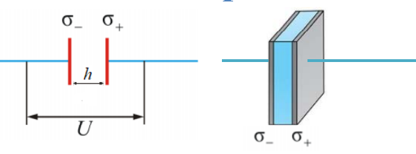

**1) Поле.** Поверхностная плотность заряда пластин $\sigma = q/S$. Каждая пластина создаёт поле $\sigma/2\varepsilon_0$ (билет 5). В зазоре поля пластин сонаправлены и складываются, снаружи — противоположны и гасятся. Без учёта краевых эффектов поле однородно:

$$E = \frac{\sigma}{\varepsilon_0} = \frac{q}{\varepsilon_0 S}$$

**2) Напряжение.** Поле однородно, поэтому интеграл сводится к произведению:

$$U = Eh = \frac{qh}{\varepsilon_0 S}$$

**3) Ёмкость.**

$$C = \frac{q}{U} = \frac{q\ \varepsilon_0 S}{q h} = \boxed{\frac{\varepsilon_0 S}{h}}$$

Ёмкость прямо пропорциональна площади пластин и обратно пропорциональна расстоянию между ними.

### 2. Сферический конденсатор

Две концентрические проводящие сферы радиусов $a$ (внутренняя) и $b$ (внешняя).

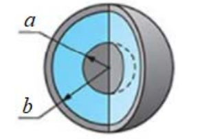

**1) Поле.** Поле в зазоре создаётся только зарядом $q$ внутренней сферы: внешняя сфера внутри себя поля не создаёт (билет 5). По теореме Гаусса при $a \leq r \leq b$:

$$E_r = \frac{1}{4\pi\varepsilon_0}\frac{q}{r^{2}}$$

**2) Напряжение.** Интегрируем по радиусу от $a$ до $b$; первообразная от $1/r^{2}$ равна $-1/r$:

$$U = \int\limits_{a}^{b} E_r\ dr = \frac{q}{4\pi\varepsilon_0}\left[-\frac{1}{r}\right]_{a}^{b} = \frac{q}{4\pi\varepsilon_0}\left(\frac{1}{a} - \frac{1}{b}\right) = \frac{q}{4\pi\varepsilon_0}\cdot\frac{b-a}{ab}$$

**3) Ёмкость.**

$$C = \frac{q}{U} = \boxed{4\pi\varepsilon_0\frac{ab}{b-a}}$$

**Предельный случай.** При малом зазоре ($b - a \ll a$) можно считать $a \approx b \approx R$, тогда $ab \approx R^{2}$, а $b - a = h$ — ширина зазора. Площадь сферы $S = 4\pi R^{2}$, поэтому

$$C = \frac{4\pi\varepsilon_0 R^{2}}{h} = \frac{\varepsilon_0 S}{h}$$

— формула плоского конденсатора.

### 3. Цилиндрический конденсатор

Два коаксиальных цилиндра радиусов $a$ и $b$ и длины $l$.

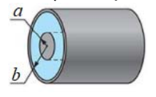

**1) Поле.** Поле в зазоре создаёт заряд внутреннего цилиндра с линейной плотностью $\lambda = q/l$ (билет 5):

$$E = \frac{\lambda}{2\pi\varepsilon_0 r}$$

**2) Напряжение.** Первообразная от $1/r$ равна $\ln r$:

$$U = \int\limits_{a}^{b} E\ dr = \frac{\lambda}{2\pi\varepsilon_0}\Big[\ln r\Big]_{a}^{b} = \frac{\lambda}{2\pi\varepsilon_0}\ln\frac{b}{a}$$

**3) Ёмкость.** Подставим $\lambda = q/l$:

$$C = \frac{q}{U} = \frac{q\cdot 2\pi\varepsilon_0}{(q/l)\ln(b/a)} = \boxed{\frac{2\pi\varepsilon_0 l}{\ln(b/a)}}$$

### Возможные вопросы

- *Почему между пластинами $E = \sigma/\varepsilon_0$, а не $\sigma/2\varepsilon_0$?* — Пластин две, и в зазоре их поля сонаправлены, поэтому складываются: $\sigma/2\varepsilon_0 + \sigma/2\varepsilon_0 = \sigma/\varepsilon_0$. Снаружи они направлены навстречу и гасятся — поле заперто внутри.
- *Что такое краевые эффекты?* — Искривление поля у краёв пластин, где однородность нарушается. Ими пренебрегают, когда размеры пластин много больше зазора.
- *Почему в сферическом конденсаторе учитывают только внутреннюю сферу?* — Заряд внешней сферы внутри себя поля не создаёт (теорема Гаусса, билет 5), поэтому в зазоре работает только заряд внутренней.
- *Почему в напряжении стоит $1/a - 1/b$, а не наоборот?* — Первообразная $-1/r$ на пределах от $a$ до $b$ даёт $-1/b + 1/a$. Знак получается верный: $b > a$, значит $U > 0$ при $q > 0$.
- *Как из сферического конденсатора получается плоский?* — При $b - a \ll a$ радиусы почти равны, $ab \approx R^{2}$, и $4\pi\varepsilon_0 R^{2}/h$ — это $\varepsilon_0 S/h$ с площадью сферы $S = 4\pi R^{2}$. Тонкий зазор «не чувствует» кривизны.
- *Почему у цилиндра логарифм, а не дробь?* — Поле цилиндра убывает как $1/r$, а первообразная от $1/r$ — логарифм. У сферы поле убывает как $1/r^{2}$, и первообразная степенная.
- *От чего зависит ёмкость во всех трёх случаях?* — Только от геометрии (площадь, радиусы, длина, зазор). Материал обкладок не входит; заполнение зазора диэлектриком ёмкость увеличивает.

---

## 18. Соединения конденсаторов (вывод)

Отдельный конденсатор ограничен по ёмкости и по допустимому напряжению, поэтому их соединяют в батареи. Различают параллельное и последовательное соединения. **Эквивалентная ёмкость** батареи — ёмкость одного конденсатора, который при том же напряжении накопил бы тот же заряд.

### Параллельное соединение

Положительные обкладки всех конденсаторов соединены в один узел, отрицательные — в другой.

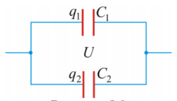

**1)** Все обкладки присоединены к одним и тем же двум узлам, а проводник эквипотенциален (билет 12). Значит напряжение на всех конденсаторах одинаково:

$$U_1 = U_2 = U$$

**2)** Полный заряд батареи — сумма зарядов конденсаторов:

$$q = q_1 + q_2$$

**3)** Выразим заряды через ёмкости, $q_i = C_i U_i = C_i U$:

$$q = C_1 U + C_2 U = U(C_1 + C_2)$$

**4)** По определению эквивалентная ёмкость $C = q/U$. Подставим полученный заряд:

$$C = \frac{U(C_1 + C_2)}{U} = C_1 + C_2$$

Для $N$ конденсаторов:

$$\boxed{\ C = \sum_{i=1}^{N} C_i\ }$$

### Последовательное соединение

Конденсаторы соединены цепочкой: обкладка одного соединена с обкладкой следующего.

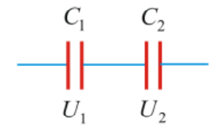

**1)** Средний участок (правая обкладка $C_1$ + левая обкладка $C_2$ + соединяющий их провод) изолирован от источника, поэтому его полный заряд сохраняется и остаётся нулевым. Заряд $+q$, пришедший на левую обкладку $C_1$, наводит на правой обкладке $C_1$ заряд $-q$; значит на левой обкладке $C_2$ остаётся $+q$. Заряды всех конденсаторов одинаковы по модулю:

$$q_1 = q_2 = q$$

**2)** Полное напряжение на батарее — сумма напряжений на конденсаторах (потенциал падает последовательно вдоль цепочки):

$$U = U_1 + U_2$$

**3)** Выразим напряжения через заряд и ёмкости, $U_i = q/C_i$:

$$U = \frac{q}{C_1} + \frac{q}{C_2} = q\left(\frac{1}{C_1} + \frac{1}{C_2}\right)$$

**4)** По определению $\dfrac{1}{C} = \dfrac{U}{q}$. Подставим полученное напряжение:

$$\frac{1}{C} = \frac{q\left(\dfrac{1}{C_1} + \dfrac{1}{C_2}\right)}{q} = \frac{1}{C_1} + \frac{1}{C_2}$$

Для $N$ конденсаторов:

$$\boxed{\ \frac{1}{C} = \sum_{i=1}^{N} \frac{1}{C_i}\ }$$

### Возможные вопросы

- *Почему при параллельном соединении напряжения одинаковы?* — Обкладки сидят на двух общих узлах, а соединённые проводники эквипотенциальны. Разность потенциалов между узлами одна на всех.
- *Почему при последовательном соединении заряды одинаковы?* — Внутренние обкладки с проводом между ними изолированы, их суммарный заряд остаётся нулевым. Наведённый заряд на одной обкладке в точности равен по модулю заряду соседней.
- *Какое соединение увеличивает ёмкость?* — Параллельное: ёмкости складываются. При последовательном эквивалентная ёмкость **меньше** наименьшей из ёмкостей.
- *Зачем тогда нужно последовательное соединение?* — Напряжение источника делится между конденсаторами, поэтому на каждый приходится меньше, чем он выдерживает поодиночке. Так набирают батарею на высокое напряжение.
- *Чему равна ёмкость двух одинаковых конденсаторов $C_0$?* — Параллельно $2C_0$, последовательно $C_0/2$.
- *Почему для параллельного соединения складываются именно ёмкости?* — Параллельные конденсаторы — фактически один конденсатор с суммарной площадью обкладок, а ёмкость площади пропорциональна (билет 17).

---

## 19. Энергия системы зарядов и системы двух тел

### Энергия системы точечных зарядов

**Формулировка.** Энергия взаимодействия системы $N$ неподвижных точечных зарядов:

$$\boxed{\ W = \frac{1}{2}\sum_{i=1}^{N} q_i\varphi_i\ }$$

где $q_i$ — $i$-й заряд, а $\varphi_i$ — потенциал, создаваемый в месте его нахождения всеми **остальными** зарядами системы.

**Вывод коэффициента $\frac12$** (на системе из трёх зарядов).

**1)** Полная энергия складывается из энергий всех пар, каждая пара учтена один раз:

$$W = W_{12} + W_{13} + W_{23}$$

**2)** Энергия пары взаимна: $W_{ik} = W_{ki}$. Поэтому каждое слагаемое можно записать симметрично, $W_{ik} = \frac12(W_{ik} + W_{ki})$:

$$W = \frac12\left(W_{12} + W_{21} + W_{13} + W_{31} + W_{23} + W_{32}\right)$$

**3)** Сгруппируем члены по первому индексу:

$$W = \frac12\Big[(W_{12} + W_{13}) + (W_{21} + W_{23}) + (W_{31} + W_{32})\Big]$$

**4)** Каждая скобка — энергия одного заряда в поле всех остальных, то есть $W_i = q_i\varphi_i$. Значит

$$W = \frac12(W_1 + W_2 + W_3) = \frac12\sum_{i=1}^{3} q_i\varphi_i$$

Обобщая на $N$ зарядов, получаем формулу. Половина возникла из-за того, что при суммировании по всем $i$ каждая пара учитывается дважды.

### Непрерывное распределение зарядов

Для заряда, распределённого в объёме $V$ с плотностью $\rho$, суммирование переходит в интегрирование:

$$\boxed{\ W = \frac12\int\limits_{V} \rho\varphi\ dV\ }$$

где $\varphi$ — потенциал, создаваемый всеми зарядами системы в элементе объёма $dV$.

**Важное различие.** Формула для точечных зарядов даёт только энергию их **взаимодействия** между собой. Интегральная формула даёт **полную** энергию системы, включая собственные энергии сборки каждого макроскопического элемента заряда.

### Энергия системы двух заряженных тел

**Формулировка.** Полная энергия системы двух заряженных тел складывается из их собственных энергий $W_1$, $W_2$ и энергии взаимодействия $W_{12}$:

$$W = W_1 + W_2 + W_{12}$$

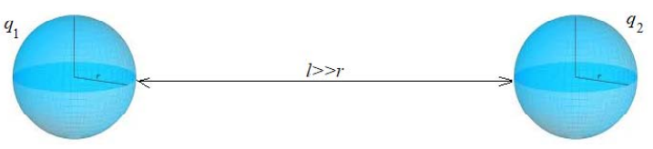

**Доказательство через локализацию энергии в поле.**

**1)** Согласно полевой теории энергия электростатического поля распределена по объёму с объёмной плотностью $w = \dfrac{\varepsilon_0 E^{2}}{2}$:

$$W = \int\limits_{V} \frac{\varepsilon_0 E^{2}}{2}\ dV$$

**2)** Поле создаётся двумя телами, по принципу суперпозиции $\vec E = \vec E_1 + \vec E_2$.

**3)** Возведём в квадрат по формуле квадрата суммы:

$$E^{2} = (\vec E_1 + \vec E_2)^{2} = E_1^{2} + E_2^{2} + 2\ \vec E_1\cdot\vec E_2$$

**4)** Подставим в интеграл; интеграл суммы равен сумме интегралов:

$$W = \int\limits_{V}\frac{\varepsilon_0 E_1^{2}}{2}\ dV + \int\limits_{V}\frac{\varepsilon_0 E_2^{2}}{2}\ dV + \int\limits_{V}\varepsilon_0\ \vec E_1\cdot\vec E_2\ dV$$

**5)** Сравнивая с формулировкой, получаем смысл каждого интеграла:

- $W_1 = \displaystyle\int\limits_{V}\frac{\varepsilon_0 E_1^{2}}{2}\ dV$ — собственная энергия поля первого тела, всегда $> 0$;
- $W_2 = \displaystyle\int\limits_{V}\frac{\varepsilon_0 E_2^{2}}{2}\ dV$ — собственная энергия поля второго тела, всегда $> 0$;
- $W_{12} = \displaystyle\int\limits_{V}\varepsilon_0\ \vec E_1\cdot\vec E_2\ dV$ — взаимная энергия, может быть как $> 0$ при отталкивании, так и $< 0$ при притяжении.

### Возможные вопросы

- *Откуда берётся коэффициент $\frac12$?* — Из двойного счёта: сумма по всем $i$ пробегает каждую пару зарядов дважды — один раз как «$i$ в поле $k$», другой как «$k$ в поле $i$».
- *Почему $\varphi_i$ — потенциал только остальных зарядов?* — Заряд не взаимодействует сам с собой. Его собственный потенциал в точке, где он сидит, к тому же бесконечен.
- *Чем формула с интегралом отличается от формулы с суммой?* — Сумма даёт только энергию взаимодействия зарядов между собой, интеграл — полную энергию, включая собственную энергию каждого заряженного тела.
- *Почему $W_1$ и $W_2$ всегда положительны, а $W_{12}$ — нет?* — В них стоят квадраты $E_1^{2}$ и $E_2^{2}$, а квадрат неотрицателен. В $W_{12}$ стоит скалярное произведение $\vec E_1\cdot\vec E_2$: оно отрицательно там, где поля направлены навстречу, — то есть при притяжении разноимённых зарядов.
- *Почему при сближении разноимённых зарядов энергия падает?* — Взаимная энергия отрицательна и по модулю растёт при сближении; система отдаёт энергию, поэтому притяжение и происходит само собой.
- *Где физически «хранится» энергия?* — По полевому подходу — в самом поле, распределённая по всему пространству с плотностью $w = \varepsilon_0E^{2}/2$.

---

## 20. Электрическое поле в диэлектрике. Поляризация веществ, состоящих из полярных и неполярных молекул

### Диэлектрики

**Определение.** Диэлектрики — вещества, практически не проводящие электрический ток. В них нет свободных зарядов, способных перемещаться под действием электростатического поля на макроскопические расстояния.

Заряды в диэлектрике связаны в атомах и молекулах и могут смещаться лишь на малые расстояния внутри молекулы.

### Полярные и неполярные молекулы

По структуре молекулы диэлектриков делятся на два класса.

**Неполярные.** Молекулы высокой симметрии, у которых в отсутствие внешнего поля центры тяжести положительных и отрицательных зарядов совпадают. Собственный дипольный момент равен нулю: $\vec p = 0$. Примеры: $\mathrm{CO_2}$, $\mathrm{CH_4}$, $\mathrm{H_2}$, $\mathrm{O_2}$, $\mathrm{N_2}$.

**Полярные.** Молекулы с асимметричным строением, у которых центры тяжести положительных и отрицательных зарядов смещены друг относительно друга. Обладают собственным дипольным моментом $\vec p \neq 0$ даже без внешнего поля. Примеры: $\mathrm{H_2O}$, $\mathrm{HCl}$, $\mathrm{NH_3}$, $\mathrm{CO}$, $\mathrm{SO_2}$.

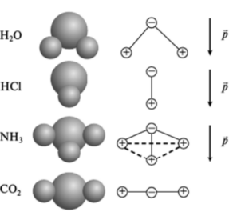

### Механизмы поляризации

**Определение.** Поляризация — процесс возникновения макроскопического дипольного момента у диэлектрика под действием внешнего электростатического поля $\vec E_0$.

Различают три основных механизма.

**1) Электронная (деформационная) поляризация.** Характерна для диэлектриков с **неполярными** молекулами. Под действием поля электронные облака упруго смещаются относительно ядер, молекулы деформируются и приобретают индуцированный (наведённый) дипольный момент, направленный вдоль поля. От температуры практически не зависит.

**2) Ориентационная (дипольная) поляризация.** Характерна для диэлектриков с **полярными** молекулами. Без поля дипольные моменты из-за теплового движения ориентированы хаотически, и суммарный момент равен нулю. Внешнее поле создаёт вращающий момент сил (билет 10)

$$\vec M = [\vec p \times \vec E]$$

стремящийся повернуть диполи вдоль поля. Тепловое движение этому препятствует, поэтому устанавливается лишь частичная упорядоченность. Сильно зависит от температуры: с ростом $T$ поляризация уменьшается.

**3) Ионная поляризация.** Наблюдается в кристаллических диэлектриках с ионной решёткой. Поле относительно смещает подрешётки положительных и отрицательных ионов, и кристалл в целом поляризуется.

### Общий вывод

Независимо от конкретного строения диэлектрика (полярное, неполярное или ионное) под действием внешнего поля положительные заряды смещаются по полю, а отрицательные — против поля. Вещество поляризуется, приобретая отличный от нуля суммарный электрический момент.

Следствие для поля: разошедшиеся заряды создают собственное поле $\vec E'$, направленное **против** внешнего. Поэтому внутри диэлектрика поле ослаблено:

$$\vec E = \vec E_0 + \vec E', \qquad E < E_0$$

### Возможные вопросы

- *Чем диэлектрик отличается от проводника?* — В проводнике есть свободные заряды, они перемещаются на макроскопические расстояния и обнуляют поле внутри. В диэлектрике заряды связаны, смещаются лишь внутри молекулы, и поле внутри не исчезает, а лишь ослабляется.
- *Чем полярная молекула отличается от неполярной?* — Наличием собственного дипольного момента без внешнего поля: у полярной центры тяжести зарядов разнесены, у неполярной совпадают.
- *Какой механизм у какого вещества?* — Неполярные молекулы — электронная поляризация, полярные — ориентационная, ионные кристаллы — ионная.
- *Почему ориентационная поляризация зависит от температуры, а электронная нет?* — Ориентационная — это борьба поля с тепловым хаосом: чем горячее, тем сильнее движение сбивает диполи с направления. Электронная — упругое смещение облаков внутри молекулы, тепловое движение молекулы как целого ему не мешает.
- *Почему при поляризации возникает вращающий момент, а не сила?* — В однородном поле силы на «плюс» и «минус» диполя равны и противоположны, они образуют пару сил: результирующая сила равна нулю, момент — нет (билет 10).
- *Почему поле внутри диэлектрика ослабляется?* — Смещённые связанные заряды создают собственное поле, направленное навстречу внешнему, и частично его компенсируют.

---

## 21. Поляризованность P, объёмные и поверхностные связанные заряды

### Связанные и сторонние заряды

**Связанные (поляризационные) заряды** — нескомпенсированные макроскопические заряды, появляющиеся при поляризации диэлектрика. Входят в состав его атомов и молекул и смещаться могут лишь на малые расстояния внутри молекулы. Обозначаются штрихом: $q'$, $\sigma'$, $\rho'$.

**Сторонние (свободные) заряды** — заряды, не входящие в состав молекул данного диэлектрика и способные свободно перемещаться (например, нанесённые на обкладки конденсатора). Обозначаются без штриха: $q$, $\sigma$, $\rho$.

### Механизм возникновения связанных зарядов

До включения поля диэлектрик нейтрален в любом макроскопическом объёме: распределения положительного и отрицательного зарядов совпадают всюду.

Включение внешнего поля $\vec E$ смещает положительные заряды по полю, а отрицательные — против поля. Два распределения сдвигаются друг относительно друга, и компенсация нарушается.

**1) Поверхностные связанные заряды $\sigma'$.** На границах компенсировать заряд нечем: с одной стороны выступают только положительные заряды, с противоположной — только отрицательные. Образуется тонкий слой нескомпенсированного заряда: $\sigma' > 0$ на одной грани и $\sigma' < 0$ на другой.

**2) Объёмные связанные заряды $\rho'$.** Если внешнее поле неоднородно или неоднороден сам диэлектрик, смещение зарядов в разных точках неодинаково. Тогда компенсация нарушается и внутри: в макроскопических объёмах возникают избыточные связанные заряды $\rho'$. В однородном диэлектрике в однородном поле $\rho' = 0$, остаются только поверхностные заряды.

### Поляризованность

**Определение.** Поляризованность (вектор поляризации) $\vec P$ — дипольный момент единицы объёма диэлектрика.

Выделим физически бесконечно малый объём $\Delta V$: малый по сравнению с телом, но содержащий много молекул. Если диполи внутри него имеют моменты $\vec p_i$, то

$$\vec P = \frac{1}{\Delta V}\sum_i \vec p_i$$

**Запись через среднюю молекулу.** Пусть молекулы одинаковы, их концентрация $n = \Delta N/\Delta V$, а $\langle \vec p \rangle$ — средний момент одной молекулы. Сумма моментов есть число молекул на средний момент: $\sum_i \vec p_i = \Delta N \langle \vec p \rangle$. Подставим:

$$\vec P = \frac{\Delta N \langle \vec p \rangle}{\Delta V} = n \langle \vec p \rangle$$

**Единица измерения.** Дипольный момент делим на объём: $\text{Кл}\cdot\text{м}/\text{м}^3 = \text{Кл}/\text{м}^2$. Размерность совпадает с размерностью поверхностной плотности заряда — это не случайность (билет 22).

### Связь поляризованности с напряжённостью поля

Опыт показывает: для широкого класса изотропных диэлектриков в не слишком сильных полях поляризованность линейно зависит от напряжённости электростатического поля **внутри** диэлектрика:

$$\vec P = \varkappa \varepsilon_0 \vec E$$

где $\varkappa$ (каппа) — **диэлектрическая восприимчивость** вещества: безразмерная величина, всегда $\varkappa > 0$. Она характеризует свойства самого диэлектрика — его способность поляризоваться. Вектор $\vec P$ сонаправлен с $\vec E$.

### Возможные вопросы

- *Чем связанные заряды отличаются от сторонних?* — Принадлежностью молекулам и свободой перемещения: связанные не могут покинуть свою молекулу и смещаются лишь на малые расстояния внутри неё, сторонние перемещаются по веществу свободно.
- *Почему поверхностный связанный заряд возникает всегда, а объёмный — не всегда?* — Внутри диэлектрика плюс одной молекулы гасится минусом соседней, и если смещение везде одинаковое, компенсация сохраняется. На границе соседа с одной стороны просто нет, гасить нечем. Объёмный заряд появляется, только когда смещение в разных точках разное, то есть при неоднородности поля или вещества.
- *Почему в определении $\vec P$ объём «физически бесконечно малый»?* — Он должен быть мал по сравнению с размерами тела, чтобы $\vec P$ описывала данную точку, и одновременно содержать много молекул, иначе усреднение дипольного момента не имеет смысла.
- *Что такое диэлектрическая восприимчивость?* — Безразмерный коэффициент $\varkappa > 0$ в связи $\vec P = \varkappa \varepsilon_0 \vec E$; характеризует способность вещества поляризоваться, зависит от вещества и температуры.
- *Какое поле $\vec E$ стоит в формуле $\vec P = \varkappa \varepsilon_0 \vec E$ — внешнее или полное?* — Полное поле внутри диэлектрика, то есть сумма внешнего поля и поля самих связанных зарядов (билет 20).

---

## 22. Теорема Остроградского-Гаусса для P. Связь P с объёмными и поверхностными связанными зарядами

### Теорема Гаусса для вектора P

**Формулировка.** Поток вектора поляризованности сквозь произвольную замкнутую поверхность $S$ равен взятому с обратным знаком избыточному связанному заряду диэлектрика внутри этой поверхности:

$$\oint_S \vec P\ d\vec S = -q'_{\text{внутр}}$$

**Доказательство.**
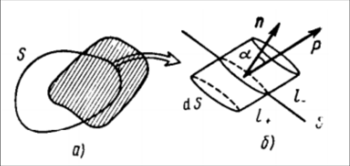

**1)** Диэлектрик поляризуется внешним полем: положительные заряды смещаются по полю на $l_+$, отрицательные — против поля на $l_-$. Возьмём произвольную замкнутую поверхность $S$ и на ней элемент $dS$ с внешней нормалью $\vec n$. Найдём связанный заряд $dq'$, который при поляризации выходит наружу через $dS$.

**2)** Наружу выйдут только те положительные заряды, которые изначально сидели к площадке ближе, чем величина их сдвига $l_+$. Они заполняют **косой цилиндр** с основанием $dS$ и ребром $l_+$, наклонённым под углом $\alpha$ к нормали. Его высота $h_+ = l_+\cos\alpha$, объём

$$dV_+ = dS\ l_+\cos\alpha$$

**3)** Заряд в этом объёме, где $\rho'_+$ — объёмная плотность положительных связанных зарядов:

$$dq'_+ = \rho'_+ l_+ dS\cos\alpha$$

**4)** Отрицательные заряды, сидевшие снаружи не дальше $l_-$, сместятся против поля и войдут внутрь. Вход минуса внутрь электрически эквивалентен выходу плюса наружу, поэтому вклады складываются:

$$dq'_- = \rho'_- l_- dS\cos\alpha$$

**5)** Полный вышедший заряд:

$$dq' = dq'_+ + dq'_- = (\rho'_+ l_+ + \rho'_- l_-)\ dS\cos\alpha$$

**6)** Выразим плотности через концентрацию молекул $n$ и заряд $e$ каждого знака в молекуле: $\rho'_+ = \rho'_- = ne$. Тогда скобка равна

$$ne\ l_+ + ne\ l_- = ne(l_+ + l_-) = ne\ l$$

где $l = l_+ + l_-$ — полное относительное смещение зарядов в молекуле.

**7)** Но $el = p$ — это дипольный момент одной молекулы, а $np = P$ — дипольный момент единицы объёма, то есть модуль поляризованности (билет 21). Значит

$$dq' = P\ dS\cos\alpha = \vec P\ d\vec S$$

**8)** Проинтегрируем по всей замкнутой поверхности — получим весь связанный заряд, покинувший её:

$$q'_{\text{выш}} = \oint_S \vec P\ d\vec S$$

**9)** По закону сохранения заряда: сколько положительного связанного заряда вышло наружу, ровно на столько же уменьшился заряд, оставшийся внутри: $q'_{\text{внутр}} = -q'_{\text{выш}}$. Подставляя, получаем теорему:

$$\oint_S \vec P\ d\vec S = -q'_{\text{внутр}}$$

### Дифференциальная форма

Запишем обе части теоремы через интегралы по объёму. По математической теореме Остроградского-Гаусса поток равен $\oint_S \vec P\ d\vec S = \int_V \mathrm{div}\ \vec P\ dV$, а заряд внутри есть $q'_{\text{внутр}} = \int_V \rho'\ dV$. Тогда

$$\int_V \left(\mathrm{div}\ \vec P + \rho'\right) dV = 0$$

Объём $V$ произволен, поэтому подынтегральное выражение равно нулю в каждой точке:

$$\mathrm{div}\ \vec P = -\rho'$$

Дивергенция вектора $\vec P$ равна объёмной плотности связанных зарядов с обратным знаком.

### Связь P с поверхностными связанными зарядами

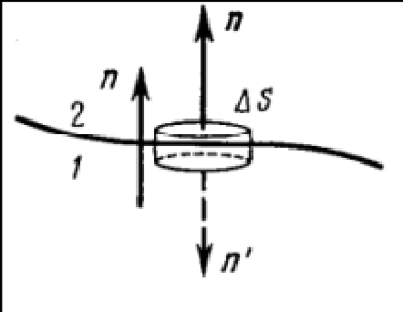
Возьмём на границе двух диэлектриков 1 и 2 малую плоскую таблетку: торцы площадью $\Delta S$ параллельны границе, высота ничтожно мала. Общую нормаль $\vec n$ направим из среды 1 в среду 2. Применим к таблетке теорему Гаусса для $\vec P$.

**1)** Поток через боковую поверхность равен нулю: её площадь стремится к нулю вместе с высотой.

**2)** У верхнего торца внешняя нормаль совпадает с $\vec n$, у нижнего противоположна ей, поэтому поток через торцы равен

$$(P_{2n} - P_{1n})\Delta S$$

**3)** Связанный заряд внутри таблетки — это заряд границы: $q'_{\text{внутр}} = \sigma'\Delta S$. Приравниваем по теореме:

$$P_{2n} - P_{1n} = -\sigma'$$

**4)** Если среда 2 — вакуум ($P_2 = 0$), условие принимает простой вид:

$$\sigma' = P_{1n} = P_n$$

Поверхностная плотность связанных зарядов равна проекции вектора $\vec P$ на внешнюю нормаль к поверхности диэлектрика.
### Связь P с объёмными связанными зарядами

Выясним, когда внутри диэлектрика есть объёмные связанные заряды.

**1)** Исходим из дифференциальной формы: $\mathrm{div}\ \vec P = -\rho'$.

**2)** Для изотропного диэлектрика $\vec P = \varkappa\varepsilon_0\vec E$ (билет 21), подставляем: $\mathrm{div}(\varkappa\varepsilon_0\vec E) = -\rho'$.

**3)** Если диэлектрик однородный, то $\varkappa = \text{const}$, и её можно вынести: $\varkappa\varepsilon_0\ \mathrm{div}\ \vec E = -\rho'$.

**4)** Теорема Гаусса для поля $\vec E$ учитывает **все** заряды, и сторонние, и связанные: $\mathrm{div}\ \vec E = (\rho + \rho')/\varepsilon_0$. Подставляем:

$$\varkappa(\rho + \rho') = -\rho'$$

**5)** Выражаем $\rho'$:

$$\rho' = -\frac{\varkappa}{1 + \varkappa}\ \rho$$

**Вывод.** В однородном изотропном диэлектрике объёмные связанные заряды возникают только там, где есть сторонние заряды $\rho$. Если сторонних зарядов внутри нет ($\rho = 0$), то и $\rho' = 0$, и поляризация проявляется только поверхностными зарядами $\sigma'$.

### Возможные вопросы

- *Почему в теореме для $\vec P$ стоит минус, а в теореме для $\vec E$ его нет?* — Поток $\vec P$ считает заряд, **вышедший** через поверхность наружу. Если положительный связанный заряд вышел, внутри его стало меньше на ту же величину — отсюда обратный знак.
- *Почему в доказательстве появился именно косой цилиндр?* — Заряды смещаются под углом к площадке. Наружу успеют выйти те, что лежат в слое толщиной, равной проекции сдвига на нормаль, а не самому сдвигу — отсюда $\cos\alpha$ и объём $dS\ l\cos\alpha$.
- *Почему вклады положительных и отрицательных зарядов складываются, а не вычитаются?* — Они дают одинаковый результат: выход плюса наружу и вход минуса внутрь одинаково уменьшают заряд внутри поверхности.
- *Что означает $\mathrm{div}\ \vec P = -\rho'$ словами?* — Связанный объёмный заряд возникает там, где поляризованность меняется от точки к точке. Если $\vec P$ всюду одинакова, её дивергенция равна нулю, и $\rho' = 0$.
- *Когда объёмных связанных зарядов нет?* — В однородном изотропном диэлектрике при отсутствии внутри сторонних зарядов. Это самый частый случай в задачах: весь связанный заряд сидит на поверхности.
- *Какая нормаль в формуле $\sigma' = P_n$?* — Внешняя по отношению к диэлектрику. Поэтому на грани, куда смещаются плюсы, $P_n > 0$ и $\sigma' > 0$, а на противоположной грани проекция отрицательна и $\sigma' < 0$.

---

## 23. Вектор электрического смещения D. Теорема Остроградского-Гаусса для D

### Зачем нужен вектор D

Теорема Гаусса для поля $\vec E$ учитывает **все** заряды — и сторонние, и связанные:

$$\oint_S \vec E\ d\vec S = \frac{q + q'}{\varepsilon_0}$$

Сторонние заряды $q$ мы вносим сами и знаем всегда. А связанные $q'$ заранее неизвестны: они возникают как отклик на поле и сами от него зависят. Получается замкнутый круг, и уравнение для расчёта непригодно.

Нужна вспомогательная величина, поток которой определялся бы только сторонними зарядами. Такой величиной и является **вектор электрического смещения** (электрической индукции) $\vec D$.

### Определение

$$\vec D = \varepsilon_0\vec E + \vec P$$

Вектор $\vec D$ есть линейная комбинация двух векторов разной природы: $\vec E$ — главная характеристика поля, $\vec P$ — характеристика поляризации среды. В СИ измеряется в кулонах на квадратный метр, как и $\vec P$.

### Теорема Гаусса для вектора D

**Формулировка.** Поток вектора электрического смещения сквозь произвольную замкнутую поверхность $S$ равен алгебраической сумме **только сторонних** зарядов, охватываемых этой поверхностью:

$$\oint_S \vec D\ d\vec S = q_{\text{внутр}}$$

**Доказательство.**

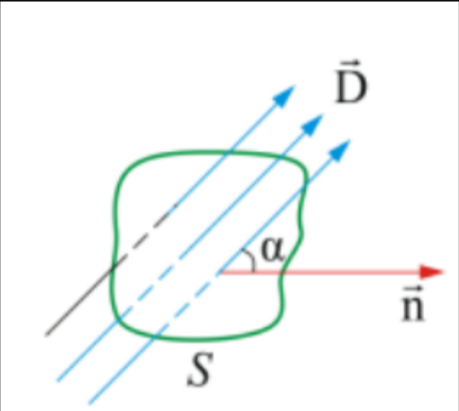

**1)** Запишем теорему Гаусса для поля $\vec E$ (билет 4), учитывающую все заряды, и умножим обе части на $\varepsilon_0$:

$$\varepsilon_0\oint_S \vec E\ d\vec S = q + q'$$

**2)** Запишем теорему Гаусса для вектора $\vec P$ (билет 22):

$$\oint_S \vec P\ d\vec S = -q'$$

**3)** Сложим эти два равенства почленно. Связанный заряд входит в них с противоположными знаками и сокращается:

$$\oint_S (\varepsilon_0\vec E + \vec P)\ d\vec S = q + q' - q' = q$$

**4)** В скобках по определению стоит $\vec D$, поэтому

$$\oint_S \vec D\ d\vec S = q_{\text{внутр}}$$

В этом сокращении $q'$ и заключён весь смысл введения вектора $\vec D$.

### Связь D с E в изотропном диэлектрике

Подставим в определение $\vec D$ линейную связь $\vec P = \varkappa\varepsilon_0\vec E$ (билет 21):

$$\vec D = \varepsilon_0\vec E + \varkappa\varepsilon_0\vec E = \varepsilon_0(1 + \varkappa)\vec E$$

Введём безразмерную величину

$$\varepsilon = 1 + \varkappa$$

— **диэлектрическую проницаемость** среды. Тогда

$$\vec D = \varepsilon_0\varepsilon\vec E$$

Так как $\varkappa > 0$, всегда $\varepsilon > 1$; для вакуума $\varkappa = 0$ и $\varepsilon = 1$. Проницаемость показывает, во сколько раз поле внутри диэлектрика слабее, чем в вакууме при тех же сторонних зарядах: $E = E_0/\varepsilon$.

### Возможные вопросы

- *Почему нельзя обойтись одним вектором $\vec E$?* — Поток $\vec E$ зависит и от связанных зарядов, а они заранее неизвестны и сами определяются полем. Уравнение с двумя неизвестными для расчёта бесполезно.
- *Как связанные заряды исчезают из теоремы для $\vec D$?* — Они входят в теорему для $\vec E$ со знаком плюс, а в теорему для $\vec P$ со знаком минус. При сложении сокращаются.
- *Является ли $\vec D$ настоящим полем?* — Нет, это вспомогательная величина, комбинация характеристики поля и характеристики среды. Сила на заряд определяется только $\vec E$.
- *Что такое диэлектрическая проницаемость и чему она равна для вакуума?* — $\varepsilon = 1 + \varkappa$, безразмерная величина, всегда больше единицы; показывает, во сколько раз поле в среде слабее, чем в вакууме. Для вакуума $\varepsilon = 1$.
- *Всегда ли $\vec D = \varepsilon_0\varepsilon\vec E$?* — Только для изотропных диэлектриков в не слишком сильных полях, где справедливо $\vec P = \varkappa\varepsilon_0\vec E$. Общее определение — $\vec D = \varepsilon_0\vec E + \vec P$.

---

## 24. Изменение E и D на границе двух диэлектриков

Граница двух однородных изотропных диэлектриков с проницаемостями $\varepsilon_1$ и $\varepsilon_2$. Каждый вектор раскладывается на **тангенциальную** (касательную к границе, индекс $\tau$) и **нормальную** (индекс $n$) составляющие. Сторонних зарядов на границе нет.

### Тангенциальная составляющая вектора E

**Формулировка.** Тангенциальная составляющая $\vec E$ одинакова по обе стороны границы:

$$E_{1\tau} = E_{2\tau}$$

**Доказательство.**
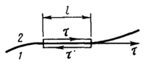

**1)** Возьмём на границе прямоугольный контур длиной $l$ и ничтожно малой высотой $h \to 0$; длинные стороны лежат по разные стороны границы. Применим к нему теорему о циркуляции электростатического поля (билет 6):

$$\oint \vec E\ d\vec l = 0$$

**2)** Вклад боковых сторон равен нулю: их длина $h$ пренебрежимо мала.

**3)** Остаётся вклад верхней и нижней сторон длиной $l$. Обход по ним совершается в противоположных направлениях, поэтому проекции входят с разными знаками:

$$E_{2\tau}l - E_{1\tau}l = 0$$

**4)** Сокращая на $l$, получаем граничное условие $E_{1\tau} = E_{2\tau}$.

**Следствие для вектора D.** Так как $D_\tau = \varepsilon_0\varepsilon E_\tau$, то

$$\frac{D_{1\tau}}{\varepsilon_1} = \frac{D_{2\tau}}{\varepsilon_2}$$

Тангенциальная составляющая $\vec D$ претерпевает скачок.

### Нормальная составляющая вектора D

**Формулировка.** При отсутствии на границе сторонних зарядов нормальная составляющая $\vec D$ непрерывна:

$$D_{1n} = D_{2n}$$

**Доказательство.**
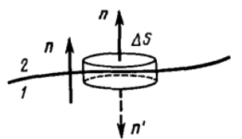

**1)** Построим на границе гауссову поверхность в виде плоского цилиндра («таблетки») с площадью оснований $\Delta S$ и ничтожно малой высотой. Применим теорему Гаусса для вектора $\vec D$ (билет 23):

$$\oint_S \vec D\ d\vec S = q_{\text{стор}}$$

**2)** Поток через боковую поверхность равен нулю: её высота мала.

**3)** Внешние нормали к основаниям противоположны ($\vec n$ и $\vec n' = -\vec n$), поэтому поток через основания равен

$$D_{2n}\Delta S - D_{1n}\Delta S$$

**4)** Сторонних зарядов на границе нет ($\sigma = 0$), значит заряд внутри таблетки равен нулю. Приравниваем поток нулю и сокращаем на $\Delta S$: $D_{1n} = D_{2n}$.

В общем случае, когда на границе есть сторонние заряды с поверхностной плотностью $\sigma$, условие имеет вид $D_{2n} - D_{1n} = \sigma$.

**Следствие для вектора E.** Так как $D_n = \varepsilon_0\varepsilon E_n$, то

$$\varepsilon_1 E_{1n} = \varepsilon_2 E_{2n}$$

Нормальная составляющая $\vec E$ претерпевает скачок — из-за поверхностных связанных зарядов, выступающих на границе.

### Закон преломления линий поля
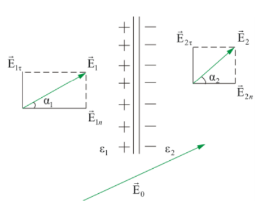 

**1)** Обозначим $\alpha_1$ и $\alpha_2$ — углы между вектором $\vec E$ и нормалью в первой и второй среде.

**2)** Тангенс угла наклона вектора равен отношению его составляющих:

$$\tan\alpha_1 = \frac{E_{1\tau}}{E_{1n}}, \qquad \tan\alpha_2 = \frac{E_{2\tau}}{E_{2n}}$$

**3)** Разделим второе равенство на первое и подставим граничные условия $E_{1\tau} = E_{2\tau}$ и $E_{2n} = \frac{\varepsilon_1}{\varepsilon_2}E_{1n}$:

$$\frac{\tan\alpha_2}{\tan\alpha_1} = \frac{E_{2\tau}E_{1n}}{E_{2n}E_{1\tau}} = \frac{E_{1n}}{E_{2n}} = \frac{\varepsilon_2}{\varepsilon_1}$$

**Вывод.** Отношение тангенсов углов равно отношению проницаемостей. При переходе в среду с большей проницаемостью ($\varepsilon_2 > \varepsilon_1$) угол растёт: линии поля удаляются от нормали, прижимаясь к границе. Линии $\vec D$ преломляются так же — в изотропном диэлектрике $\vec D$ параллелен $\vec E$.

### Возможные вопросы

- *Что на границе непрерывно, а что терпит скачок?* — Непрерывны $E_\tau$ и $D_n$. Скачок претерпевают $D_\tau$ (в $\varepsilon_2/\varepsilon_1$ раз) и $E_n$ (в $\varepsilon_1/\varepsilon_2$ раз).
- *Почему для нормальной составляющей берут именно $\vec D$, а не $\vec E$?* — В теорему Гаусса для $\vec E$ входят связанные заряды, а они на границе как раз и выступают и заранее неизвестны. В теорему для $\vec D$ они не входят.
- *Откуда в обоих доказательствах берётся минус?* — Из противоположной ориентации: длинные стороны контура обходятся в разные стороны, внешние нормали к основаниям таблетки направлены противоположно.
- *Зачем высоту контура и таблетки устремляют к нулю?* — Чтобы обнулить вклад боковых сторон и оставить только две «рабочие»; заодно внутрь не попадает объёмный заряд, остаётся только поверхностный.
- *Изменится ли условие для $E_\tau$, если на границе есть сторонние заряды?* — Нет: теорема о циркуляции верна для любого электростатического поля независимо от зарядов, поэтому $E_{1\tau} = E_{2\tau}$ выполняется всегда.

---

## 25. Поле на границе проводник-диэлектрик. Связанный заряд у поверхности проводника

Граница раздела двух сред: среда 1 — проводник, среда 2 — диэлектрик с проницаемостью $\varepsilon$.
### Условие для вектора D у поверхности проводника

**1)** Общее граничное условие для нормальной составляющей $\vec D$ при наличии на границе сторонних зарядов с поверхностной плотностью $\sigma$ (билет 24):

$$D_{2n} - D_{1n} = \sigma$$

**2)** В состоянии электростатического равновесия поле внутри проводника отсутствует, $\vec E_1 = 0$ (билет 12). Следовательно, диэлектрик там не поляризован, $\vec P_1 = 0$, а тогда и

$$\vec D_1 = \varepsilon_0\vec E_1 + \vec P_1 = 0$$

в частности $D_{1n} = 0$.

**3)** Подставляя это в граничное условие, получаем

$$D_n = \sigma$$

**Вывод.** Нормальная составляющая вектора электрического смещения в диэлектрике непосредственно у поверхности проводника равна поверхностной плотности сторонних зарядов на проводнике.

Тангенциальная составляющая при этом равна нулю: внутри проводника $E_{1\tau} = 0$, а по условию непрерывности (билет 24) $E_{2\tau} = E_{1\tau} = 0$. Значит поле перпендикулярно поверхности, $D_n = D$, и напряжённость в диэлектрике у поверхности равна $E = \sigma/\varepsilon_0\varepsilon$ (при $\varepsilon = 1$ — известный результат билета 12).

### Связанный заряд у поверхности проводника

Если заряженный проводник граничит с диэлектриком, то под действием поля проводника диэлектрик поляризуется, и на его границе, прилегающей к проводнику, выступают связанные заряды с поверхностной плотностью $\sigma'$. Найдём её.

**Вывод формулы.**

**1)** По теореме Гаусса для поля $\vec E$, учитывающей **все** заряды — и сторонние $\sigma$, и связанные $\sigma'$, — нормальная составляющая поля в диэлектрике у поверхности проводника равна

$$E_n = \frac{\sigma + \sigma'}{\varepsilon_0}$$

**2)** С другой стороны, из связи $\vec E$ с $\vec D$ (билет 23) $E_n = \frac{D_n}{\varepsilon_0\varepsilon}$, а по полученному выше условию $D_n = \sigma$, поэтому

$$E_n = \frac{\sigma}{\varepsilon_0\varepsilon}$$

**3)** Приравниваем правые части обоих выражений и сокращаем на $\varepsilon_0$:

$$\sigma + \sigma' = \frac{\sigma}{\varepsilon}$$

**4)** Выражаем $\sigma'$:

$$\sigma' = \frac{\sigma}{\varepsilon} - \sigma = -\frac{\varepsilon - 1}{\varepsilon}\sigma$$

**Вывод.** Поверхностная плотность связанных зарядов на диэлектрике однозначно определяется поверхностной плотностью сторонних зарядов на проводнике. Знак минус означает, что знаки этих зарядов всегда противоположны: положительный заряд проводника индуцирует отрицательный связанный заряд на прилегающем слое диэлектрика, и наоборот.

Так как $\varepsilon > 1$, всегда $|\sigma'| < \sigma$: связанный заряд компенсирует сторонний лишь частично. Суммарный заряд границы равен $\sigma + \sigma' = \sigma/\varepsilon$ — отсюда и ослабление поля в диэлектрике в $\varepsilon$ раз.

### Возможные вопросы

- *Почему внутри проводника $\vec D = 0$?* — В равновесии там $\vec E = 0$, значит нет и поляризации, $\vec P = 0$; по определению $\vec D = \varepsilon_0\vec E + \vec P = 0$.
- *Почему в первом шаге вывода $\sigma'$ есть, а во втором нет?* — Теорема Гаусса для $\vec E$ учитывает все заряды, а для $\vec D$ — только сторонние. Одна и та же величина $E_n$ посчитана двумя способами; приравнивание и даёт $\sigma'$.
- *Какой знак у связанного заряда?* — Всегда противоположный знаку заряда проводника.
- *Может ли связанный заряд превысить сторонний?* — Нет: $|\sigma'| = \sigma(\varepsilon - 1)/\varepsilon < \sigma$ при любом $\varepsilon > 1$. При $\varepsilon \to \infty$ компенсация становится полной, $\sigma' \to -\sigma$, — это предельный переход к проводнику.
- *Чему равно поле в диэлектрике у поверхности проводника?* — Оно перпендикулярно поверхности и равно $E = \sigma/\varepsilon_0\varepsilon$.

---

## 26. Виды диэлектриков. Сегнетоэлектрики

### Особые виды твёрдых диэлектриков

Обычный диэлектрик поляризуется только во внешнем поле и теряет поляризацию, как только поле снято. Но есть твёрдые диэлектрики с особыми свойствами поляризации.

**Электреты.** Диэлектрики, способные длительное время сохранять поляризованное состояние **после снятия** внешнего поля. 

**Пьезоэлектрики.** Кристаллы, в которых при механической деформации возникает поляризация, а вместе с ней разность потенциалов, — **прямой пьезоэффект**. Есть и **обратный пьезоэффект**: под действием внешнего электрического поля кристалл деформируется. 

**Пироэлектрики.** Спонтанно (самопроизвольно) поляризованные диэлектрики, поляризация которых сильно зависит от температуры: при нагревании или охлаждении на их поверхности появляются электрические заряды. Все пироэлектрики обладают и пьезоэлектрическими свойствами.

**Сегнетоэлектрики** — кристаллические диэлектрики, обладающие в определённом интервале температур **спонтанной** (самопроизвольной) поляризацией, направление которой можно изменить внешним электрическим полем.

Классы вложены: сегнетоэлектрики — часть пироэлектриков, пироэлектрики — часть пьезоэлектриков.

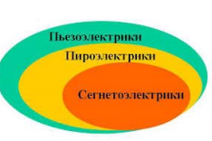

### Сегнетоэлектрики

**Домены.** Причина спонтанной поляризации — особое взаимодействие между частицами, разбивающее кристалл на микроскопические области, **домены**. В пределах каждого домена кристалл поляризован до насыщения. Без внешнего поля моменты доменов ориентированы так, что суммарный момент кристалла равен нулю, $P = 0$ (рис. а). Во внешнем поле домены переориентируются вдоль поля, и появляется отличная от нуля поляризованность (рис. б).

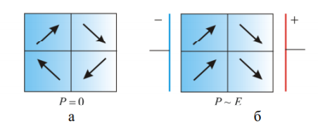
(в (б) знаки +- перепутаны)
### Основные свойства сегнетоэлектриков

**1) Сверхвысокая диэлектрическая проницаемость.** Величина $\varepsilon$ достигает $10^3 \ldots 10^4$ против единиц у обычных диэлектриков. 

**2) Нелинейная зависимость $\vec P$ от $\vec E$.** У обычных диэлектриков связь линейна, $\vec P = \varkappa\varepsilon_0\vec E$ (билет 21). У сегнетоэлектриков она сложная и нелинейная, а значит $\varepsilon$ не постоянна и сама зависит от напряжённости поля $\vec E$.

**3) Диэлектрический гистерезис.** Поляризованность зависит не только от нынешнего поля, но и от «предыстории» образца. При циклическом изменении внешнего поля график зависимости $P(E_0)$ образует петлю гистерезиса.

Как читается петля:

- точка $a$ — насыщение: все домены выстроены по полю, дальше поляризованности расти некуда;
- при снятии внешнего поля ($E_0 = 0$) поляризованность не исчезает — остаётся **остаточная поляризованность** $P_C$;
- чтобы её уничтожить, нужно приложить поле противоположного направления — **коэрцитивную силу** $E_C$;
- пунктиром показан обычный диэлектрик: у него зависимость линейна и петли нет.

**4) Наличие точки Кюри.** Существует определённая температура (**точка Кюри**), при нагревании выше которой сегнетоэлектрические свойства скачком исчезают — происходит фазовый переход 2-го рода. Интенсивное тепловое движение разрушает доменную структуру, и сегнетоэлектрик превращается в обычный полярный диэлектрик.

### Возможные вопросы

- *Чем сегнетоэлектрик отличается от обычного диэлектрика?* — Спонтанной поляризацией без внешнего поля, нелинейной связью $\vec P$ и $\vec E$, гистерезисом, огромной $\varepsilon$ и наличием точки Кюри.
- *Почему кристалл с доменами в целом не поляризован?* — Каждый домен поляризован до насыщения, но моменты разных доменов направлены в разные стороны и в сумме дают ноль.
- *В чём разница прямого и обратного пьезоэффекта?* — Прямой: деформация порождает поляризацию и разность потенциалов. Обратный: внешнее поле вызывает деформацию.
- *Как соотносятся классы?* — Каждый пироэлектрик является пьезоэлектриком, каждый сегнетоэлектрик — пироэлектриком; обратное неверно.
- *Почему у сегнетоэлектрика нельзя назвать одно значение $\varepsilon$?* — Связь $P(E_0)$ нелинейна, поэтому $\varepsilon$ зависит от поля, а из-за гистерезиса — ещё и от предыстории образца.

---

## 27. Электрический ток. Уравнение непрерывности

### Электрический ток и сила тока

**Определение.** Электрический ток — упорядоченное (направленное) движение заряженных частиц.

Количественная мера тока — **сила тока** $I$: заряд, проходящий через поверхность в единицу времени.

$$I = \frac{dq}{dt}$$

Единица измерения — ампер (А). За направление тока принято направление движения **положительных** носителей; в металлах носители — электроны, поэтому они движутся против направления тока.

### Плотность тока

Для описания тока в отдельной точке вводят вектор **плотности тока** $\vec j$; его направление совпадает с направлением скорости упорядоченного движения положительных носителей.

$$\vec j = \rho_+\vec u_+ + \rho_-\vec u_-$$

где $\rho_\pm$ — объёмные плотности зарядов носителей, $\vec u_\pm$ — скорости их упорядоченного движения. В металлах носителями являются только электроны, поэтому

$$\vec j = \rho_-\vec u_-$$

Единица измерения — $\mathrm{A/м^2}$.

**Связь с силой тока.** Сила тока есть **поток** вектора плотности тока через заданную поверхность $S$:

$$I = \int_S \vec j\ d\vec S$$

Для однородного тока через перпендикулярное ему плоское сечение $I = jS$.

### Уравнение непрерывности: интегральная форма

**1)** Возьмём замкнутую поверхность $S$, охватывающую объём $V$, с внешней нормалью. Тогда поток

$$\oint_S \vec j\ d\vec S$$

есть заряд, выходящий из объёма $V$ наружу за единицу времени.

**2)** По закону сохранения заряда ушедший наружу заряд ровно на столько же уменьшает заряд внутри. Значит поток равен скорости убыли заряда в объёме:

$$\oint_S \vec j\ d\vec S = -\frac{dq}{dt}$$

Минус стоит потому, что нормаль внешняя: положительный поток означает уход заряда, то есть **уменьшение** $q$. Это соотношение и называют **уравнением непрерывности**.

**3)** Для **стационарного (постоянного)** тока распределение зарядов в пространстве не меняется со временем, $dq/dt = 0$, поэтому

$$\oint_S \vec j\ d\vec S = 0$$

*Смысл:* линии вектора плотности постоянного тока нигде не начинаются и не заканчиваются — они замкнуты.

### Уравнение непрерывности: дифференциальная форма

**1)** Запишем заряд внутри объёма через объёмную плотность: $q = \int_V \rho\ dV$. Тогда правая часть уравнения принимает вид

$$-\frac{dq}{dt} = -\frac{d}{dt}\int_V \rho\ dV = -\int_V \frac{\partial\rho}{\partial t}\ dV$$

Объём неподвижен, поэтому производную вносим под интеграл; она **частная**, так как $\rho$ зависит не только от времени, но и от координат.

**2)** Интегральное уравнение переписывается так:

$$\oint_S \vec j\ d\vec S = -\int_V \frac{\partial\rho}{\partial t}\ dV$$

**3)** По математической теореме Остроградского-Гаусса поток вектора через замкнутую поверхность равен интегралу от дивергенции по объёму (тот же приём, что в билете 4):

$$\oint_S \vec j\ d\vec S = \int_V \mathrm{div}\ \vec j\ dV$$

Подставляем и переносим всё в одну часть:

$$\int_V \left(\mathrm{div}\ \vec j + \frac{\partial\rho}{\partial t}\right) dV = 0$$

**4)** Равенство выполняется для **любого** объёма $V$, а это возможно, только если подынтегральное выражение равно нулю в каждой точке:

$$\mathrm{div}\ \vec j = -\frac{\partial\rho}{\partial t}$$

*Смысл:* дивергенция вектора $\vec j$ в данной точке равна скорости убыли плотности заряда в этой же точке.

**Следствие для постоянного тока.** Условие стационарности $\partial\rho/\partial t = 0$ даёт

$$\mathrm{div}\ \vec j = 0$$

то есть поле вектора плотности постоянного тока не имеет ни источников, ни стоков.

### Возможные вопросы

- *Чем плотность тока отличается от силы тока?* — $I$ — скаляр, характеристика всего сечения; $\vec j$ — вектор, характеристика тока в отдельной точке. Сила тока есть поток $\vec j$ через сечение.
- *Куда направлен $\vec j$ в металле, если носители — электроны?* — По направлению тока, то есть против скорости электронов: их заряд отрицателен, и произведение $\rho_-\vec u_-$ разворачивает вектор.
- *Откуда в уравнении непрерывности минус?* — Нормаль внешняя, поэтому положительный поток означает уход заряда наружу, а заряд внутри при этом убывает.
- *Что физически означает $\mathrm{div}\ \vec j = 0$?* — Заряд нигде не накапливается: сколько втекает, столько и вытекает, линии тока замкнуты. По сути это закон сохранения заряда, записанный для точки.

---

## 28. Сторонние силы. Поле сторонних сил. Электродвижущая сила

### Сторонние силы

Для поддержания постоянного тока в замкнутой цепи одного электростатического поля недостаточно по двум причинам.

**1)** Силы электростатического поля перемещают положительные заряды от большего потенциала к меньшему. Под их действием потенциалы быстро выравниваются, и ток прекращается.

**2)** Работа электростатических сил по замкнутому контуру равна нулю (билет 6):

$$\oint \vec E\ d\vec l = 0$$

а для непрерывного круговорота зарядов работа нужна.

Значит необходимы силы **неэлектростатического (стороннего) происхождения**. Они поддерживают разность потенциалов, перемещая положительные заряды **против** электростатического поля — от меньшего потенциала к большему. Эти силы называются **сторонними**.

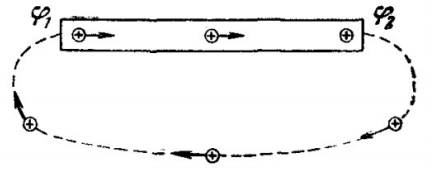

### Поле сторонних сил

Стороннюю силу $\vec f_{стор}$, действующую на заряд $q$, представляют в виде

$$\vec f_{стор} = q\vec E^*$$

где векторную величину $\vec E^*$ называют **напряжённостью поля сторонних сил**.

### Электродвижущая сила

**Определение.** Величина, равная работе сторонних сил $A_{стор}$ по перемещению единичного положительного заряда, называется **электродвижущей силой (ЭДС)** $\mathcal{E}$, действующей в цепи или на её участке:

$$\mathcal{E} = \frac{A_{стор}}{q}$$

Измеряется в вольтах (В).

**Вывод формулы ЭДС через циркуляцию.**

**1)** Работа сторонних сил над зарядом $q$ на всём протяжении замкнутой цепи равна линейному интегралу:

$$A_{стор} = \oint \vec f_{стор}\ d\vec l = q\oint \vec E^*\ d\vec l$$

**2)** Делим работу на заряд $q$ и получаем ЭДС, действующую в замкнутой цепи:

$$\mathcal{E} = \oint \vec E^*\ d\vec l$$

*Смысл:* ЭДС в замкнутой цепи равна циркуляции вектора напряжённости поля сторонних сил.

**3)** На произвольном участке цепи 1–2 интеграл берётся не по контуру, а вдоль участка:

$$\mathcal{E}_{12} = \int_1^2 \vec E^*\ d\vec l$$

### Напряжение на участке цепи

Кроме сторонних, на заряд действуют силы электростатического поля $\vec f_E = q\vec E$. Результирующая сила в каждой точке цепи:

$$\vec f = \vec f_{стор} + \vec f_E = q(\vec E^* + \vec E)$$

**Вывод формулы напряжения.**

**1)** Работа этой суммарной силы над зарядом $q$ на участке 1–2:

$$A_{12} = \int_1^2 q(\vec E^* + \vec E)\ d\vec l = q\int_1^2 \vec E^*\ d\vec l + q\int_1^2 \vec E\ d\vec l$$

**2)** Первый интеграл — работа сторонних сил, он равен $q\mathcal{E}_{12}$.

**3)** Второй интеграл — работа электростатического поля, она равна разности потенциалов, умноженной на заряд: $q(\varphi_1 - \varphi_2)$.

**4)** Складываем:

$$A_{12} = q\mathcal{E}_{12} + q(\varphi_1 - \varphi_2)$$

**5)** Величина, численно равная полной работе (и электростатических, и сторонних сил) по перемещению единичного положительного заряда, называется **напряжением (падением напряжения)** $U$:

$$U_{12} = \frac{A_{12}}{q} = \varphi_1 - \varphi_2 + \mathcal{E}_{12}$$

При отсутствии на участке сторонних сил ($\mathcal{E}_{12} = 0$) напряжение совпадает с разностью потенциалов: $U_{12} = \varphi_1 - \varphi_2$.

### Возможные вопросы

- *Почему одного электростатического поля недостаточно?* — Его силы гонят заряды только от большего потенциала к меньшему, разность потенциалов при этом исчезает; к тому же его работа по замкнутому контуру равна нулю, а на круговорот зарядов нужна работа.
- *Приведите пример сторонних сил.* — Химические реакции в батарейке, магнитные силы в генераторе, диффузия носителей в термопаре. Общее у них одно: они не электростатические.
- *Чем различаются разность потенциалов, ЭДС и напряжение?* — Всё это работа на единицу заряда, но разными силами: разность потенциалов — электростатическими, ЭДС — сторонними, напряжение — теми и другими вместе.
- *Почему ЭДС измеряется в вольтах?* — Это работа на единицу заряда, та же размерность, что у потенциала.
- *Может ли циркуляция $\vec E^*$ быть не равна нулю?* — Да, и в этом весь смысл: поле сторонних сил непотенциально. У электростатического поля циркуляция всегда ноль (билет 6), поэтому оно и не может поддерживать ток.

---

## 29. Закон Ома для однородного участка цепи (интегральная и дифференциальная форма)

### Однородный участок цепи

**Определение.** Однородным называется участок цепи (проводник), на котором не действуют сторонние силы, $\mathcal{E} = 0$. Напряжение на концах такого проводника совпадает с разностью потенциалов (билет 28):

$$U = \varphi_1 - \varphi_2$$

### Закон Ома в интегральной форме

Сила тока $I$, текущего по однородному металлическому проводнику, пропорциональна падению напряжения $U$ на нём:

$$I = \frac{U}{R}$$

Здесь $R$ — электрическое сопротивление проводника, единица измерения — ом (Ом).

Сопротивление зависит от формы, размеров проводника и свойств материала. Для однородного цилиндрического проводника

$$R = \rho\frac{l}{S}$$

где $l$ — длина проводника, $S$ — площадь поперечного сечения, $\rho$ — удельное электрическое сопротивление вещества (Ом $\cdot$ м).

### Закон Ома в дифференциальной форме

Запишем закон в форме, характеризующей состояние в конкретной точке проводника.

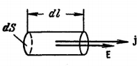

**1)** Выделим мысленно в окрестности некоторой точки внутри проводника элементарный цилиндрический объём. Образующие цилиндра параллельны вектору $\vec j$ в данной точке, площадь поперечного сечения равна $dS$, длина — $dl$.

**2)** Через поперечное сечение цилиндра течёт ток силой $I = j\ dS$.

**3)** Напряжение, приложенное к цилиндру, равно $U = E\ dl$, где $E$ — напряжённость поля в данной точке.

**4)** Сопротивление этого цилиндра по формуле выше:

$$R = \rho\frac{dl}{dS}$$

**5)** Подставляем всё это в интегральную форму $I = U/R$:

$$j\ dS = \frac{E\ dl}{\rho\ dl/dS} = \frac{dS}{\rho\ dl}\ E\ dl$$

**6)** Сокращаем $dS$ и $dl$ в обеих частях:

$$j = \frac{E}{\rho}$$

**7)** Вводим величину $\sigma = 1/\rho$ — **удельную электрическую проводимость** материала (См/м):

$$j = \sigma E$$

**8)** Носители заряда в каждой точке движутся вдоль вектора $\vec E$, поэтому векторы $\vec j$ и $\vec E$ совпадают по направлению, и формула записывается в векторном виде:

$$\vec j = \sigma\vec E$$

**Вывод.** Закон Ома в дифференциальной (локальной) форме связывает плотность тока в любой точке проводника с напряжённостью поля в этой же точке. В отличие от интегральной формы, он не содержит ни длины, ни сечения — только свойство вещества $\sigma$.

### Возможные вопросы

- *Какой участок называется однородным?* — Тот, на котором нет сторонних сил, $\mathcal{E} = 0$; поэтому напряжение на нём равно разности потенциалов.
- *От чего зависит сопротивление?* — От вещества (через $\rho$), длины и площади сечения: $R = \rho l/S$. Длинный тонкий проводник сопротивляется сильнее короткого толстого.
- *Чем дифференциальная форма лучше интегральной?* — Интегральная относится к проводнику целиком и требует знать его форму и размеры. Дифференциальная относится к точке и годится для проводника любой формы, в том числе когда ток по сечению распределён неравномерно.
- *Что такое $\sigma$?* — Удельная проводимость, величина, обратная удельному сопротивлению: $\sigma = 1/\rho$.
- *Закон Ома — фундаментальный закон?* — Нет, это экспериментально установленная зависимость, и выполняется она не всегда: у полупроводниковых приборов и газовых разрядов связь тока с напряжением нелинейна.

---

## 30. Закон Ома для неоднородного участка цепи (интегральная и дифференциальная форма)

### Неоднородный участок цепи

**Определение.** Неоднородным называется участок цепи, на котором действуют сторонние силы, то есть присутствует источник ЭДС, $\mathcal{E} \neq 0$. 
### Вывод интегральной формы (через закон сохранения энергии)

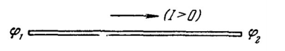
Рассмотрим неоднородный участок цепи между точками 1 и 2 с сопротивлением $R$.

**1)** Работа всех сил — и электростатических, и сторонних — над носителями заряда $dq$ при их перемещении от точки 1 к точке 2 равна:

$$dA = \mathcal{E}_{12}\ dq + (\varphi_1 - \varphi_2)\ dq$$

**2)** Если проводники неподвижны и химические реакции не происходят, то по закону сохранения энергии вся эта работа идёт на нагревание проводника. За время $dt$ выделяется джоулево тепло

$$dQ = I^2R\ dt$$

**3)** Переносимый за это время заряд равен $dq = I\ dt$, поэтому тепло переписывается через заряд:

$$dQ = IR(I\ dt) = IR\ dq$$

**4)** Приравниваем работу и выделившееся тепло:

$$IR\ dq = (\varphi_1 - \varphi_2)\ dq + \mathcal{E}_{12}\ dq$$

**5)** Сокращаем обе части на заряд $dq$:

$$IR = (\varphi_1 - \varphi_2) + \mathcal{E}_{12}$$

**6)** Выражаем силу тока:

$$I = \frac{\varphi_1 - \varphi_2 + \mathcal{E}_{12}}{R}$$

Это и есть **закон Ома для неоднородного участка цепи**.

**Правило знаков.** Ток $I$ считается положительным, если течёт в направлении от точки 1 к точке 2. ЭДС берётся со знаком «$+$», если сторонние силы действуют в направлении $1 \to 2$, и со знаком «$-$», если в противоположном.

**Частный случай.** Если участок замкнут, точки 1 и 2 совпадают, $\varphi_1 = \varphi_2$, и остаётся закон Ома для замкнутой цепи:

$$I = \frac{\mathcal{E}}{R}$$

где $R$ — полное сопротивление цепи, то есть внешнее $R$ плюс внутреннее сопротивление источника $r$: $I = \mathcal{E}/(R + r)$.

### Дифференциальная форма

При наличии сторонних сил на носители заряда в каждой точке действует результирующая сила, обусловленная суммой напряжённости электростатического поля $\vec E$ и напряжённости поля сторонних сил $\vec E^*$ (билет 28). Поэтому в законе Ома для точки (билет 29) вместо $\vec E$ стоит эта сумма:

$$\vec j = \sigma(\vec E + \vec E^*)$$

где $\vec j$ — вектор плотности тока, $\sigma$ — удельная электрическая проводимость вещества в данной точке. Это **обобщённый закон Ома в дифференциальной форме**; при $\vec E^* = 0$ он переходит в закон Ома для однородного участка.

### Возможные вопросы

- *Чем неоднородный участок отличается от однородного?* — Наличием сторонних сил (источника ЭДС). У однородного $\mathcal{E} = 0$ и $U = \varphi_1 - \varphi_2$, у неоднородного напряжение содержит ещё и ЭДС.
- *Почему вывод идёт через тепло?* — Проводники неподвижны и химических превращений нет, поэтому вся работа сил над зарядами может уйти только в нагрев. Приравняв работу и джоулево тепло, получаем связь между $I$, $R$, разностью потенциалов и ЭДС.
- *Когда ЭДС берётся со знаком минус?* — Когда сторонние силы гонят положительные заряды навстречу выбранному направлению обхода $1 \to 2$.
- *Как из этого закона получить закон Ома для замкнутой цепи?* — Замкнуть участок: точки 1 и 2 совпадают, разность потенциалов обращается в ноль, остаётся $I = \mathcal{E}/R$.
- *Как выглядит связь с законом Ома для однородного участка?* — Достаточно положить $\mathcal{E}_{12} = 0$ (или $\vec E^* = 0$): интегральная форма даёт $I = (\varphi_1 - \varphi_2)/R$, дифференциальная — $\vec j = \sigma\vec E$.

---

## 31. Разветвлённые цепи. Правила Кирхгофа (вывод, пример использования)

**Разветвлённая цепь** содержит несколько замкнутых контуров, и одного закона Ома для неё мало: неизвестных токов несколько. Недостающие уравнения дают два правила Кирхгофа.

**Узел** — точка цепи, в которой сходится не менее трёх проводников. **Ветвь** — участок между двумя соседними узлами; вдоль всей ветви течёт один и тот же ток.

### Первое правило Кирхгофа (правило узлов)

**Формулировка.** Алгебраическая сумма токов, сходящихся в узле, равна нулю:

$$\sum_k I_k = 0$$

Токи, текущие **к** узлу, считаются положительными, текущие **от** узла — отрицательными.

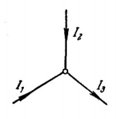

**Вывод.**

**1)** Окружим узел замкнутой поверхностью $S$, пересекающей все подходящие к нему провода.

**2)** По уравнению непрерывности (билет 27) поток плотности тока через замкнутую поверхность равен убыли заряда внутри неё:

$$\oint_S \vec j\ d\vec S = -\frac{dq}{dt}$$

**3)** Ток постоянный, то есть стационарный: заряд в узле не накапливается, $dq/dt = 0$. Значит поток равен нулю:

$$\oint_S \vec j\ d\vec S = 0$$

**4)** Вне проводов $\vec j = 0$, поэтому поток набирается только из сечений проводов, а поток через сечение — это сила тока в нём. Нормаль внешняя, поэтому вытекающие токи входят со знаком «$+$», втекающие — со знаком «$-$». Отсюда

$$\sum_k I_k = 0$$

### Второе правило Кирхгофа (правило контуров)

**Формулировка.** В любом замкнутом контуре разветвлённой цепи алгебраическая сумма падений напряжения $I_kR_k$ на отдельных участках равна алгебраической сумме ЭДС, действующих в этом контуре:

$$\sum_k I_kR_k = \sum_k \mathcal{E}_k$$

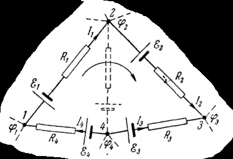

**Вывод.**

**1)** Выделим замкнутый контур 1-2-3-4-1 и зададим направление обхода — по часовой стрелке.

**2)** Каждый участок между соседними узлами — неоднородный участок цепи. Применим к нему закон Ома в форме $IR = \varphi_{\text{нач}} - \varphi_{\text{кон}} + \mathcal{E}$ (билет 30):

$$I_1R_1 = \varphi_1 - \varphi_2 + \mathcal{E}_1$$

$$I_2R_2 = \varphi_2 - \varphi_3 + \mathcal{E}_2$$

$$I_3R_3 = \varphi_3 - \varphi_4 + \mathcal{E}_3$$

$$I_4R_4 = \varphi_4 - \varphi_1 + \mathcal{E}_4$$

**3)** Сложим левые и правые части. Каждый потенциал входит в правую часть дважды с противоположными знаками, поэтому все они попарно сокращаются:

$$I_1R_1 + I_2R_2 + I_3R_3 + I_4R_4 = \mathcal{E}_1 + \mathcal{E}_2 + \mathcal{E}_3 + \mathcal{E}_4$$

**4)** В общем виде:

$$\sum_k I_kR_k = \sum_k \mathcal{E}_k$$

**Правило знаков.** Слагаемое $I_kR_k$ берётся со знаком «$+$», если ток течёт по направлению обхода, и со знаком «$-$», если против. ЭДС берётся со знаком «$+$», если при обходе источник проходится от «$-$» к «$+$», то есть по направлению сторонних сил, и со знаком «$-$», если наоборот.

### Пример использования

В цепи два узла (точки 3 и 6) и три ветви. Направления токов задаём произвольно: $I_1$ и $I_3$ — вниз по крайним ветвям, $I_2$ — вверх по средней.

**1)** Уравнение первого правила для узла 3: к узлу течёт $I_2$, от узла — $I_1$ и $I_3$:

$$-I_1 + I_2 - I_3 = 0$$

Узел 6 даёт то же уравнение с обратным знаком, писать его не нужно: при $N$ узлах независимы $N-1$ уравнений.

**2)** Выберем два независимых контура (независим тот, что содержит хотя бы одну новую ветвь) и обход по часовой стрелке.

Левый контур 1-2-3-6-1 (ветви 1 и 2):

$$-I_1R_1 - I_2R_2 = -\mathcal{E}_1 - \mathcal{E}_2$$

Правый контур 3-4-5-6-3 (ветви 2 и 3):

$$I_3R_3 + I_2R_2 = \mathcal{E}_3 + \mathcal{E}_2$$

**3)** Получена система трёх линейных уравнений с тремя неизвестными $I_1$, $I_2$, $I_3$; решая её, находим все токи. Если ток получился со знаком «минус», его истинное направление противоположно выбранному, а модуль верен.

### Возможные вопросы

- *Почему правил два, а не одно?* — Правило узлов даёт лишь $N-1$ уравнение, а неизвестных токов столько, сколько ветвей, и их всегда больше. Остальные уравнения даёт правило контуров.
- *Сколько всего уравнений надо составить?* — Столько, сколько ветвей: $N-1$ по правилу узлов, остальные по правилу контуров.
- *Почему уравнение для последнего узла лишнее?* — Оно получается сложением всех остальных с обратным знаком, новой информации не несёт.
- *Что делать, если ток получился отрицательным?* — Ничего не пересчитывать: минус означает лишь, что ток течёт навстречу выбранной стрелке.

---

## 32. Мощность тока. Закон Джоуля-Ленца (интегральная и дифференциальная форма)

### Работа и мощность тока

**1)** За время $t$ через сечение однородного участка проходит заряд (билет 27):

$$q = It$$

**2)** Электростатическое поле переносит этот заряд по участку, на концах которого напряжение $U = \varphi_1 - \varphi_2$, и совершает работу:

$$A = (\varphi_1 - \varphi_2)\ q = UIt$$

**3)** **Мощность тока** $P$ — работа за единицу времени:

$$P = \frac{A}{t} = UI$$

**4)** Подставляя закон Ома $U = IR$ (билет 29), получаем ещё две формы записи:

$$P = I^2R = \frac{U^2}{R}$$

Единица мощности в СИ — ватт (Вт).

### Закон Джоуля-Ленца (интегральная форма)

**Формулировка.** Количество теплоты, выделяющееся за время $t$ в неподвижном проводнике, равно:

$$Q = I^2Rt$$

**Вывод.** Проводник неподвижен и химических превращений в нём не происходит, поэтому работа тока не может уйти ни на механическую работу, ни на химию — она целиком переходит во внутреннюю энергию проводника, то есть в теплоту. Механизм: электроны разгоняются полем и сталкиваются с ионами кристаллической решётки, отдавая им набранную энергию. Значит теплота равна работе:

$$Q = A = UIt = I^2Rt$$

### Дифференциальная (локальная) форма

Интегральная форма даёт теплоту сразу во всём проводнике. Чтобы узнать, где именно она выделяется, вводят **удельную тепловую мощность** $Q_{\text{уд}}$ — количество теплоты, выделяющееся в единице объёма проводящей среды за единицу времени.

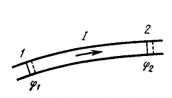

**Вывод.**

**1)** Выделим в проводящей среде элементарный цилиндрический объём: длина $dl$, площадь поперечного сечения $dS$, образующие параллельны вектору плотности тока $\vec j$.

**2)** Объём цилиндра:

$$dV = dS\ dl$$

**3)** Сопротивление этого цилиндра (билет 29), где $\rho$ — удельное сопротивление:

$$R = \rho\frac{dl}{dS}$$

**4)** Сила тока через его сечение (билет 27):

$$I = j\ dS$$

**5)** По интегральному закону Джоуля-Ленца за время $dt$ в этом объёме выделится теплота. Подставляем $R$ и $I$; при этом $dS$ сокращается, а произведение $dS\ dl$ собирается обратно в объём:

$$\delta Q = RI^2dt = \rho\frac{dl}{dS}(j\ dS)^2dt = \rho j^2(dS\ dl)dt = \rho j^2\ dV\ dt$$

**6)** По определению удельная тепловая мощность есть теплота, делённая на объём и на время:

$$Q_{\text{уд}} = \frac{\delta Q}{dV\ dt} = \rho j^2$$

Это и есть **закон Джоуля-Ленца в дифференциальной форме**.

**7)** Его можно переписать через поле. По закону Ома в дифференциальной форме $\vec j = \sigma\vec E$, а удельное сопротивление обратно проводимости, $\rho = 1/\sigma$:

$$Q_{\text{уд}} = \frac{1}{\sigma}(\sigma E)^2 = \sigma E^2$$

В векторном виде:

$$Q_{\text{уд}} = \vec j\cdot\vec E$$

### Неоднородный участок цепи

Если на участке действуют сторонние силы, в теплоту переходит работа и электростатических, и сторонних сил. Умножим закон Ома для неоднородного участка (билет 30) на силу тока $I$:

$$I^2R = I(\varphi_1 - \varphi_2) + I\mathcal{E}_{12}$$

Слева стоит мощность выделяемого тепла, справа — сумма мощностей электростатического поля и сторонних сил. В дифференциальной форме вместо $\vec E$ входит сумма полей:

$$Q_{\text{уд}} = \rho j^2 = \vec j\cdot(\vec E + \vec E^*)$$

### Возможные вопросы

- *Почему работа тока целиком уходит в тепло?* — Проводник неподвижен и химических превращений нет, значит других каналов, куда могла бы уйти энергия, не остаётся.
- *Зачем нужна дифференциальная форма, если есть интегральная?* — Интегральная даёт теплоту во всём проводнике сразу, а локальная говорит, сколько её выделяется в каждой точке. Это нужно, когда среда неоднородна или ток по сечению распределён неравномерно.
- *Почему в дифференциальной форме нет ни $R$, ни $I$?* — Сопротивление и сила тока относятся к куску провода целиком. В точке их заменяют удельное сопротивление $\rho$ (свойство вещества) и плотность тока $j$ (характеристика тока в этой точке).
- *Откуда берутся формы $P = I^2R$ и $P = U^2/R$?* — Обе получаются из $P = UI$ подстановкой закона Ома: $U = IR$ в первом случае, $I = U/R$ во втором.

---

## 33. Переходные процессы в цепи с конденсатором. Разрядка конденсатора

### Переходные процессы и квазистационарность

**Переходный процесс** — процесс перехода цепи от одного установившегося режима к другому. Примеры — зарядка и разрядка конденсатора.

Токи в таких цепях меняются не мгновенно, а с конечной скоростью. Если изменение происходит не слишком быстро, то в любой момент времени к цепи всё ещё можно применять законы постоянного тока — закон Ома и правила Кирхгофа. Такие меняющиеся токи называют **квазистационарными**.

### Постановка задачи

Обкладки конденсатора ёмкостью $C$ замкнуты через сопротивление $R$. Первоначальный заряд конденсатора $q_0$, внешних источников ЭДС в цепи нет. В момент $t = 0$ ключ $K$ замыкается.

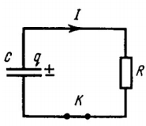

### Вывод закона изменения заряда

**1)** В момент времени $t$ на обкладках находится заряд $q$, и напряжение на конденсаторе равно

$$U = \frac{q}{C}$$

**2)** Ток течёт от положительной обкладки к отрицательной; считаем его положительным. Заряд конденсатора при этом убывает, поэтому в определении тока появляется минус:

$$I = -\frac{dq}{dt}$$

**3)** Сторонних сил в цепи нет, участок однородный, поэтому применим закон Ома $IR = U$ (билет 29):

$$IR = \frac{q}{C}$$

**4)** Подставляем сюда выражение для тока и получаем дифференциальное уравнение переходного процесса:

$$-\frac{dq}{dt}R = \frac{q}{C} \implies \frac{dq}{dt} + \frac{q}{RC} = 0$$

**5)** Решаем его методом разделения переменных — разносим $q$ и $t$ по разные стороны равенства:

$$\frac{dq}{q} = -\frac{dt}{RC}$$

**6)** Интегрируем: левую часть от начального заряда $q_0$ до текущего $q$, правую — от времени $0$ до $t$:

$$\int_{q_0}^{q}\frac{dq}{q} = -\frac{1}{RC}\int_{0}^{t} dt$$

Первообразная слева — логарифм, справа — сама переменная:

$$\ln q - \ln q_0 = -\frac{t}{RC} \implies \ln\frac{q}{q_0} = -\frac{t}{RC}$$

**7)** Потенцируем обе части (берём экспоненту) и получаем **закон изменения заряда при разрядке**:

$$q(t) = q_0 e^{-t/\tau}$$

### Время релаксации

Введённая здесь величина

$$\tau = RC$$

называется **временем релаксации**. Она имеет размерность времени и показывает, за какое время заряд на конденсаторе уменьшается в $e \approx 2{,}7$ раза.

### Закон изменения силы тока

Дифференцируем полученный закон по времени:

$$I = -\frac{dq}{dt} = -q_0\left(-\frac{1}{RC}\right)e^{-t/\tau} = \frac{q_0}{RC}e^{-t/\tau}$$

Обозначив начальный ток (в момент $t = 0$) как $I_0 = q_0/RC$, получаем:

$$I(t) = I_0 e^{-t/\tau}$$

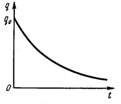

**Вывод.** При разрядке конденсатора заряд и ток убывают по одному и тому же экспоненциальному закону, асимптотически стремясь к нулю.

### Возможные вопросы

- *Почему в определении тока стоит минус?* — Ток мы условились считать положительным, а заряд конденсатора убывает, то есть $dq/dt < 0$. Минус компенсирует этот знак и делает $I > 0$.
- *Что такое квазистационарный ток?* — Меняющийся во времени, но настолько медленно, что в каждый момент к нему ещё применимы закон Ома и правила Кирхгофа.
- *В чём физический смысл $\tau = RC$?* — Это время, за которое заряд и ток уменьшаются в $e \approx 2{,}7$ раза. Чем больше $R$ и $C$, тем медленнее идёт разрядка.
- *Разряжается ли конденсатор полностью?* — Строго говоря нет: экспонента стремится к нулю асимптотически, не достигая его. Практически через $(3-5)\tau$ конденсатор считают разряженным.

---

## 34. Переходные процессы в цепи с конденсатором. Зарядка конденсатора

### Постановка задачи

Цепь состоит из последовательно соединённых конденсатора ёмкостью $C$, сопротивления $R$ и источника постоянной ЭДС $\mathcal{E}$. Первоначально конденсатор не заряжен, $q = 0$. В момент $t = 0$ замыкается ключ $K$, и в цепи начинает течь квазистационарный ток, заряжающий конденсатор.

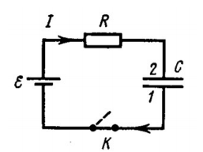

### Вывод закона изменения заряда

**1)** В произвольный момент времени $t$ на конденсаторе заряд $q$. Ток приходит на обкладку 2, поэтому она заряжается положительно и её потенциал выше. Напряжение на обкладках равно $q/C$ (билет 16), значит положительна именно разность

$$\varphi_2 - \varphi_1 = \frac{q}{C}$$

**2)** Заряд конденсатора увеличивается, поэтому сила тока положительна и равна скорости изменения заряда (в отличие от разрядки, минуса здесь нет):

$$I = \frac{dq}{dt}$$

**3)** На участке есть источник, значит он неоднородный. Применяем закон Ома $IR = \varphi_1 - \varphi_2 + \mathcal{E}$ (билет 30), где $\varphi_1 - \varphi_2 = -q/C$:

$$IR = \mathcal{E} - \frac{q}{C}$$

Напряжение конденсатора вошло со знаком минус: оно действует **навстречу** ЭДС и по мере зарядки гасит её.

**4)** Подставляем выражение для тока и разделяем переменные:

$$\frac{dq}{dt}R = \mathcal{E} - \frac{q}{C} \implies \frac{R\ dq}{\mathcal{E} - q/C} = dt$$

**5)** Интегрируем с учётом начального условия $q = 0$ при $t = 0$:

$$\int_{0}^{q}\frac{R\ dq}{\mathcal{E} - q/C} = \int_{0}^{t} dt$$

Слева первообразная — логарифм; из-за внутренней производной $-1/C$ перед ним появляется множитель $-RC$. Подставляя пределы, получаем:

$$-RC\left[\ln\left(\mathcal{E} - \frac{q}{C}\right) - \ln\mathcal{E}\right] = t$$

Разность логарифмов сворачивается в логарифм отношения:

$$\ln\left(1 - \frac{q}{C\mathcal{E}}\right) = -\frac{t}{RC}$$

**6)** Потенцируем обе части и выражаем заряд:

$$1 - \frac{q}{C\mathcal{E}} = e^{-t/RC} \implies q = C\mathcal{E}\left(1 - e^{-t/RC}\right)$$

Вводя максимальный (предельный) заряд $q_m = C\mathcal{E}$ и время релаксации $\tau = RC$, окончательно:

$$q(t) = q_m\left(1 - e^{-t/\tau}\right)$$

### Закон изменения силы тока

Дифференцируем полученный закон по времени. Раскроем скобку: $q = q_m - q_me^{-t/\tau}$. Первое слагаемое постоянно, а у второго производная экспоненты по правилу сложной функции даёт множитель $-1/\tau$, и два минуса — из скобки и из производной — сокращаются:

$$I = \frac{dq}{dt} = -q_m\left(-\frac{1}{\tau}\right)e^{-t/\tau} = \frac{q_m}{\tau}e^{-t/\tau} = \frac{C\mathcal{E}}{RC}e^{-t/\tau} = \frac{\mathcal{E}}{R}e^{-t/\tau}$$

Обозначив начальный (максимальный) ток $I_0 = \mathcal{E}/R$, получаем:

$$I(t) = I_0e^{-t/\tau}$$

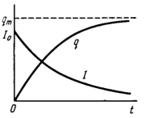

**Вывод.** При зарядке заряд конденсатора возрастает по закону «перевёрнутой экспоненты», стремясь к предельному значению $q_m = C\mathcal{E}$, а ток экспоненциально спадает до нуля: по мере зарядки напряжение на конденсаторе уравновешивает ЭДС источника.

### Возможные вопросы

- *Чем вывод отличается от разрядки?* — Тремя вещами: ток берётся без минуса (заряд растёт), участок неоднородный и в законе Ома появляется ЭДС, начальное условие $q = 0$ вместо $q_0$.
- *Почему ток со временем прекращается?* — Напряжение на конденсаторе $q/C$ растёт и всё сильнее противодействует ЭДС. Когда $q/C$ сравнивается с $\mathcal{E}$, разность в законе Ома обращается в ноль, и ток исчезает.
- *Чему равен ток сразу после замыкания ключа?* — $I_0 = \mathcal{E}/R$: конденсатор ещё не заряжен, напряжения на нём нет, и вся ЭДС приходится на сопротивление.
- *Зарядится ли конденсатор полностью?* — Строго говоря нет: заряд стремится к $C\mathcal{E}$ асимптотически. Практически конденсатор считают заряженным через $(3-5)\tau$.

---

## 35. Природа магнетизма (эксперименты и пояснения на основе сформулированных законов)

### Экспериментальные основы электромагнетизма

**Опыт Г. Х. Эрстеда (1820 г.).** Магнитная стрелка (компас), расположенная вблизи проводника с током, поворачивается: на неё действуют силы, стремящиеся установить её перпендикулярно проводнику.

**Вывод.** Электрический ток создаёт вокруг себя магнитное поле. Так была экспериментально доказана связь между электрическими и магнитными явлениями.

**Опыты А. М. Ампера (взаимодействие токов).** Ампер исследовал взаимодействие параллельных проводников с током и установил:

- если токи в проводниках **сонаправлены**, проводники **притягиваются**;
- если токи имеют **противоположное** направление, проводники **отталкиваются**.

**Вывод.** Токи взаимодействуют между собой, причём это взаимодействие не электростатическое: проводники с током в целом нейтральны, кулоновской силы между ними нет.

### Закон Ампера для параллельных токов

Сила взаимодействия, приходящаяся на единицу длины каждого из параллельных проводников, прямо пропорциональна токам $i_1$ и $i_2$ в них и обратно пропорциональна расстоянию $b$ между ними:

$$f_1 = \frac{\mu_0}{4\pi}\frac{2i_1i_2}{b}$$

где $\mu_0$ — **магнитная постоянная**.

### Физическая природа магнетизма

Взаимодействие токов осуществляется через материальную среду, называемую **магнитным полем**.

Движущиеся заряды (токи) изменяют свойства окружающего их пространства — создают в нём магнитное поле. Проявляется оно в том, что на другие движущиеся в нём заряды (токи) действуют магнитные силы.

**Отличие от электрического поля.** Магнитное поле порождается исключительно **движущимися** зарядами и не оказывает никакого действия на заряды неподвижные.

### Вектор магнитной индукции и принцип суперпозиции

Силовой характеристикой магнитного поля является вектор **магнитной индукции** $\vec B$ — аналог напряжённости $\vec E$ электрического поля. Единица измерения в СИ — тесла (Тл).

**Принцип суперпозиции.** Магнитное поле, создаваемое несколькими движущимися зарядами или токами, равно векторной сумме магнитных полей, создаваемых каждым зарядом или током в отдельности:

$$\vec B = \sum_i \vec B_i$$

### Возможные вопросы

- *Что именно доказал опыт Эрстеда?* — Что вокруг проводника с током существует магнитное поле, то есть электрические и магнитные явления связаны между собой.
- *Почему взаимодействие токов нельзя объяснить электростатикой?* — Проводники с током электрически нейтральны, кулоновские силы между ними отсутствуют. Притяжение и отталкивание вызвано именно движением зарядов.
- *Чем магнитное поле отличается от электрического?* — Электрическое поле создаётся любыми зарядами и действует на любые заряды; магнитное создаётся только движущимися зарядами и действует только на движущиеся.
- *Откуда взялось значение $\mu_0 = 4\pi\cdot10^{-7}$?* — Это не результат измерения, а следствие определения ампера: подстановка эталонных значений в закон Ампера даёт для $\mu_0$ ровно эту величину.

---

## 36. Магнитное поле равномерно движущегося заряда

### Закон для поля движущегося заряда

Магнитное поле порождается движущимися зарядами. Закон, определяющий магнитную индукцию $\vec B$ поля точечного заряда $q$, который движется с постоянной нерелятивистской скоростью $\vec v$:

$$\vec B = \frac{\mu_0}{4\pi}\frac{q[\vec v \times \vec r]}{r^3}$$

где $\mu_0$ — магнитная постоянная, а $\vec r$ — радиус-вектор, проведённый **от движущегося заряда к неподвижной точке наблюдения**.

В модуле, поскольку $|[\vec v \times \vec r]| = vr\sin\alpha$, а лишний $r$ сокращается с одним из трёх в знаменателе:

$$B = \frac{\mu_0}{4\pi}\frac{qv\sin\alpha}{r^2}$$

где $\alpha$ — угол между $\vec v$ и $\vec r$.

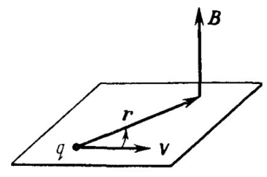

**Направление $\vec B$.** По свойствам векторного произведения вектор $\vec B$ перпендикулярен плоскости, в которой лежат $\vec v$ и $\vec r$. Куда именно из двух сторон — определяет правило правого винта (буравчика) при вращении от $\vec v$ к $\vec r$. 

**Зависимость от времени.** Заряд движется, вместе с ним перемещается и начало радиус-вектора $\vec r$. Следовательно, индукция $\vec B$ в любой фиксированной точке пространства зависит не только от координат этой точки, но и от времени $t$.

### Связь между $\vec B$ и $\vec E$

Электрическое поле неподвижного точечного заряда даётся электростатической формулой

$$\vec E = \frac{1}{4\pi\varepsilon_0}\frac{q}{r^3}\vec r$$

а при нерелятивистских скоростях ($v \ll c$) поле движущегося заряда практически совпадает с электростатическим. Значит, в законе для $\vec B$ можно выделить $\vec E$.

**1)** Выпишем закон и внесём постоянный множитель под знак векторного произведения — его можно отнести к любому из сомножителей:

$$\vec B = \frac{\mu_0 q}{4\pi r^3}[\vec v \times \vec r] = \mu_0\left[\vec v \times \frac{q\vec r}{4\pi r^3}\right]$$

**2)** Умножим и разделим выражение в скобках на электрическую постоянную $\varepsilon_0$ (значение не изменилось, но в скобках теперь стоит нужная комбинация):

$$\vec B = \mu_0\varepsilon_0\left[\vec v \times \frac{1}{4\pi\varepsilon_0}\frac{q\vec r}{r^3}\right]$$

**3)** Выражение во внутренних скобках есть вектор напряжённости электрического поля $\vec E$ этого же заряда. Получаем:

$$\vec B = \varepsilon_0\mu_0[\vec v \times \vec E]$$

**4)** Введём электродинамическую константу $c = 1/\sqrt{\varepsilon_0\mu_0}$, численно равную скорости света в вакууме. Отсюда $\varepsilon_0\mu_0 = 1/c^2$.

**5)** Подставляем и получаем фундаментальную связь между полями:

$$\vec B = \frac{[\vec v \times \vec E]}{c^2}$$

**Вывод.** Магнитное поле точечного заряда, движущегося с нерелятивистской скоростью, прямо пропорционально векторному произведению его скорости на напряжённость его же электрического поля и обратно пропорционально квадрату скорости света.

### Возможные вопросы

- *Почему в законе стоит именно векторное произведение?* — Опыт (Эрстед) показал, что магнитное действие поперечно: поле перпендикулярно и скорости заряда, и направлению на точку наблюдения. Векторное произведение — как раз та операция, которая даёт вектор, перпендикулярный двум исходным.
- *В каких точках поле движущегося заряда равно нулю?* — На прямой, вдоль которой заряд движется: там $\vec r$ параллелен $\vec v$, $\sin\alpha = 0$, векторное произведение обращается в ноль. Максимально поле в плоскости, перпендикулярной скорости и проходящей через заряд ($\alpha = 90^\circ$).
- *Почему $\vec B$ зависит от времени, хотя скорость постоянна?* — Радиус-вектор $\vec r$ отсчитывается от заряда, а заряд перемещается. Для неподвижного наблюдателя $\vec r$ всё время меняется, значит меняется и $\vec B$ в его точке.
- *Что означает «аксиальный вектор»?* — Вектор, полученный векторным произведением. У него нет собственного направления «из природы»: оно задано соглашением о правом винте. При зеркальном отражении такой вектор ведёт себя не так, как обычный (полярный) вектор $\vec v$ или $\vec E$.
- *Почему магнитное поле обычно много слабее электрического?* — Из $\vec B = [\vec v \times \vec E]/c^2$: множитель $v/c^2$ при нерелятивистских скоростях крайне мал. Магнитное действие — это, по сути, малая релятивистская поправка к электрическому.

---

## 37. Закон Био-Савара-Лапласа

### Что утверждает закон

Закон Био-Савара-Лапласа определяет индукцию магнитного поля, создаваемого **элементом проводника с током** в произвольной точке пространства. Поле всего проводника получается затем сложением (интегрированием) полей всех его элементов.

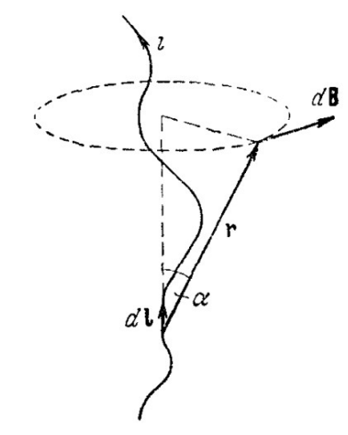

### Вывод из поля движущегося заряда

**1)** Исходная точка — поле одного точечного заряда, движущегося со скоростью $\vec v$:

$$\vec B = \frac{\mu_0}{4\pi}\frac{q[\vec v \times \vec r]}{r^3}$$

**2)** Перейдём к непрерывному распределению зарядов. Заряд, заключённый в элементе объёма $dV$, равен $dq = \rho\ dV$, где $\rho$ — объёмная плотность заряда. Он создаёт элементарное поле

$$d\vec B = \frac{\mu_0}{4\pi}\frac{\rho\ dV[\vec v \times \vec r]}{r^3} = \frac{\mu_0}{4\pi}\frac{[(\rho\vec v) \times \vec r]\ dV}{r^3}$$

(скалярный множитель $\rho$ внесли внутрь векторного произведения к вектору $\vec v$).

**3)** По определению $\vec j = \rho\vec v$ — вектор плотности тока (билет 27). Значит:

$$d\vec B = \frac{\mu_0}{4\pi}\frac{[\vec j \times \vec r]\ dV}{r^3}$$

**4)** Пусть ток течёт по тонкому проводу площадью сечения $dS$. Тогда элемент объёма — это кусочек провода длиной $dl$: $dV = dS \cdot dl$. Подставим и сгруппируем:

$$\vec j\ dV = \vec j\ dS\ dl = (j\ dS)\ d\vec l$$

Здесь $d\vec l$ — вектор элемента длины проводника, направленный по току (направление $\vec j$ передано ему). Произведение плотности тока на площадь сечения есть сила тока, $I = j\ dS$, поэтому

$$\vec j\ dV = I\ d\vec l$$

**5)** Подставляем это в формулу шага 3 и получаем **векторную форму закона Био-Савара-Лапласа**:

$$d\vec B = \frac{\mu_0}{4\pi}\frac{I[d\vec l \times \vec r]}{r^3}$$

### Скалярная форма

Модуль векторного произведения равен $dl\ r\sin\alpha$; один $r$ сокращается с одним из трёх в знаменателе:

$$dB = \frac{\mu_0}{4\pi}\frac{I\ dl\sin\alpha}{r^2}$$

где $\alpha$ — угол между вектором элемента тока $d\vec l$ и радиус-вектором $\vec r$, проведённым от элемента к точке наблюдения.

**Направление $d\vec B$.** Вектор $d\vec B$ перпендикулярен плоскости, содержащей $d\vec l$ и $\vec r$, в сторону, определяемую правилом правого винта (буравчика) при повороте от $d\vec l$ к $\vec r$.

### Полное поле проводника (интегральная форма)

Согласно принципу суперпозиции, поле $\vec B$, создаваемое проводником конечных размеров, находится интегрированием по всем его элементам тока:

$$\vec B = \frac{\mu_0 I}{4\pi}\int\frac{[d\vec l \times \vec r]}{r^3}$$

Ток $I$ вынесен за знак интеграла: вдоль неразветвлённого проводника он одинаков во всех сечениях.

### Возможные вопросы

- *Почему закон записан для элемента тока, а не для всего провода?* — Разные участки провода видны из точки наблюдения под разными углами и с разных расстояний, единой формулы для произвольного провода нет. Поэтому провод режут на элементы, для каждого поле считают по одной формуле, и результаты складывают по принципу суперпозиции.
- *Что такое элемент тока $I\ d\vec l$?* — Замена для «$q\vec v$» при переходе от одного заряда к проводу: кусочек провода длиной $dl$, по которому течёт ток $I$. Вектор $d\vec l$ направлен по току.
- *Куда направлен $d\vec B$ около прямого провода?* — По касательной к окружности, охватывающей провод и лежащей в плоскости, перпендикулярной ему. Линии магнитного поля тока замкнуты — они не начинаются и не кончаются на зарядах, в отличие от линий $\vec E$.
- *Где элемент тока не создаёт поля?* — На своём продолжении вперёд и назад: там $\vec r$ параллелен $d\vec l$, $\sin\alpha = 0$.
- *Как применяют закон на практике?* — Записывают $dB$ для одного элемента, находят из геометрии задачи связь между $dl$, $r$ и $\alpha$, и интегрируют. Для бесконечного прямого провода так получается $B = \dfrac{\mu_0 I}{2\pi b}$ — именно эта формула стоит за законом Ампера из билета 35.

---

## 38. Сила, действующая на заряд, движущийся в магнитном поле. Сила Лоренца. Закон Ампера

### Сила Лоренца

Магнитное поле не оказывает никакого воздействия на неподвижные электрические заряды. Сила возникает только тогда, когда заряд $q$ движется в поле со скоростью $\vec v$.

**Определение.** Силой Лоренца называют полную силу, действующую на точечный заряд $q$, движущийся в электромагнитном поле:

$$\vec F = q\vec E + q[\vec v \times \vec B]$$

Первое слагаемое — электрическая часть (действует и на покоящийся заряд), второе — магнитная.

**Магнитная часть силы Лоренца:**

$$\vec F_m = q[\vec v \times \vec B]$$

Модуль: $F_m = |q|vB\sin\alpha$, где $\alpha$ — угол между $\vec v$ и $\vec B$.

**Направление.** Для положительного заряда — по правилу левой руки: линии $\vec B$ входят в ладонь, четыре пальца направлены по $\vec v$, отогнутый большой палец указывает силу. Для отрицательного заряда сила направлена в противоположную сторону.

### Магнитная сила не совершает работы

**1)** Элементарная работа силы при перемещении заряда на $d\vec r = \vec v\ dt$ равна скалярному произведению силы на перемещение:

$$dA = \vec F_m \cdot d\vec r = q[\vec v \times \vec B]\cdot\vec v\ dt$$

**2)** По определению векторного произведения вектор $[\vec v \times \vec B]$ всегда ортогонален вектору $\vec v$.

**3)** Скалярное произведение двух взаимно перпендикулярных векторов равно нулю. Следовательно:

$$dA = 0$$

**Вывод.** Магнитная сила Лоренца работы не совершает. Она не может изменить ни модуль скорости, ни кинетическую энергию частицы, а лишь искривляет её траекторию.

### Закон Ампера

**Определение.** Сила, с которой магнитное поле действует на проводник с током, называется **силой Ампера**. Она представляет собой результат сложения сил Лоренца, действующих на все движущиеся носители заряда в проводнике.

**Вывод из силы Лоренца.**

**1)** Выделим в проводнике элементарный объём $dV$. Если объёмная плотность свободных носителей равна $\rho$, то заряд в этом объёме $dq = \rho\ dV$.

**2)** Носители движутся со средней скоростью упорядоченного дрейфа $\vec u$. Сила Лоренца, действующая на весь заряд $dq$:

$$d\vec F = dq[\vec u \times \vec B] = \rho\ dV[\vec u \times \vec B] = [(\rho\vec u) \times \vec B]\ dV$$

**3)** По определению $\vec j = \rho\vec u$ — вектор плотности тока (билет 27). Получаем закон Ампера в **объёмной (дифференциальной) форме**:

$$d\vec F = [\vec j \times \vec B]\ dV$$

**4)** Для тонкого линейного проводника с площадью сечения $dS$ элемент объёма равен $dV = dS \cdot dl$, поэтому

$$\vec j\ dV = \vec j\ dS\ dl = (j\ dS)\ d\vec l = I\ d\vec l$$

где $d\vec l$ — вектор элемента длины, направленный по току, а $j\ dS = I$ — сила тока.

**5)** Подставляем в формулу шага 3 и получаем закон Ампера в **линейной форме**:

$$d\vec F = I[d\vec l \times \vec B]$$

**Модуль силы Ампера:** $dF = IB\ dl\sin\alpha$, где $\alpha$ — угол между $d\vec l$ и $\vec B$.

**Направление силы Ампера.** По правилу левой руки: если ладонь левой руки расположить так, чтобы линии индукции $\vec B$ входили в неё, а четыре пальца направить по току $I$, то отогнутый на $90^\circ$ большой палец укажет направление силы Ампера.

Для прямого проводника длиной $l$ в однородном поле все элементы дают силу в одну сторону, и интегрирование сводится к умножению: $F = IBl\sin\alpha$.

### Возможные вопросы

- *Почему магнитная сила не меняет энергию частицы, хотя явно на неё действует?* — Потому что она всё время перпендикулярна скорости. Работу совершает только составляющая силы вдоль перемещения, а здесь её нет. Сила поворачивает частицу, но не разгоняет.
- *Как движется заряд, влетевший в однородное поле перпендикулярно $\vec B$?* — По окружности: модуль скорости постоянен, а сила постоянна по модулю и всегда перпендикулярна скорости — это условие равномерного движения по окружности. Радиус находится из $qvB = mv^2/R$, откуда $R = mv/(|q|B)$.
- *Почему сила Ампера выводится из силы Лоренца, а не наоборот?* — Ток — это движение отдельных носителей. Сила на провод есть просто сумма сил, действующих на каждый из них; ничего нового при переходе к проводу не добавляется.
- *Когда сила Ампера равна нулю?* — Когда провод параллелен полю: $\sin\alpha = 0$. Максимальна она при $\alpha = 90^\circ$.
- *Почему для силы Ампера правило левой руки, а для поля тока — правого винта?* — Это разные вопросы: винт даёт направление поля, которое ток **создаёт**, а левая рука — направление силы, с которой поле **действует**. Путать их нельзя.

---

## 39. Основные законы магнитного поля (интегральная и дифференциальная форма, примеры нахождения полей)

Магнитное поле описывается двумя основными законами: теоремой Гаусса о потоке и теоремой о циркуляции.

### Теорема Гаусса для поля B

**Интегральная форма.** Поток вектора магнитной индукции сквозь любую замкнутую поверхность $S$ равен нулю:

$$\oint_S \vec B\ d\vec S = 0$$

**Физический смысл.** Магнитных зарядов — источников, на которых линии индукции начинались бы или заканчивались, — в природе не существует. Поэтому линии $\vec B$ всегда замкнуты (поле называют **соленоидальным**), и сколько их вошло в замкнутую поверхность, столько же вышло.

**Дифференциальная форма.** По теореме Гаусса-Остроградского поток равен интегралу от дивергенции по объёму:

$$\oint_S \vec B\ d\vec S = \int_V \mathrm{div}\ \vec B\ dV = 0$$

Ноль получается при **любом** объёме, а это возможно, только если подынтегральная функция равна нулю в каждой точке:

$$\mathrm{div}\ \vec B = 0$$

### Теорема о циркуляции вектора B

**Интегральная форма.** Циркуляция вектора $\vec B$ по произвольному замкнутому контуру $\Gamma$ равна произведению магнитной постоянной на алгебраическую сумму токов, охватываемых этим контуром:

$$\oint_\Gamma \vec B\ d\vec l = \mu_0 I_{\text{охв}} = \mu_0\sum_k I_k$$

Сумма **алгебраическая**: Ток положителен, если его собственное магнитное поле закручено по направлению обхода, и со знаком минус в противном случае.

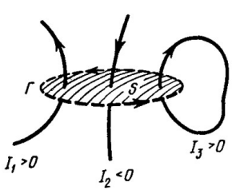

Если ток распределён непрерывно с плотностью $\vec j$, сумма заменяется потоком плотности тока через поверхность, натянутую на контур:

$$\oint_\Gamma \vec B\ d\vec l = \mu_0\int_S \vec j\ d\vec S$$

**Физический смысл.** Магнитное поле постоянных токов **вихревое** (непотенциальное): циркуляция в общем случае отлична от нуля. В электростатике было $\oint \vec E\ d\vec l = 0$ — поле потенциально, и вводится потенциал; у магнитного поля потенциала не существует.

**Дифференциальная форма.** По теореме Стокса циркуляция равна потоку ротора:

$$\oint_\Gamma \vec B\ d\vec l = \int_S \mathrm{rot}\ \vec B\ d\vec S = \mu_0\int_S \vec j\ d\vec S$$

Равенство верно при **любом** выборе поверхности, значит равны и подынтегральные выражения:

$$\mathrm{rot}\ \vec B = \mu_0\vec j$$

(В электростатике $\mathrm{rot}\ \vec E = 0$.)

### Примеры нахождения полей

**Выбор контура.** Контур подбирают под симметрию поля так, чтобы каждый его участок был одного из трёх видов: либо $\vec B$ направлен вдоль участка и постоянен по модулю (вклад $B\cdot l$), либо $\vec B$ перпендикулярен участку (вклад нулевой), либо участок лежит там, где поля нет (вклад тоже нулевой). Только при этом условии $B$ выносится из-под интеграла и находится алгебраически.

### Поле бесконечного прямого провода радиуса a

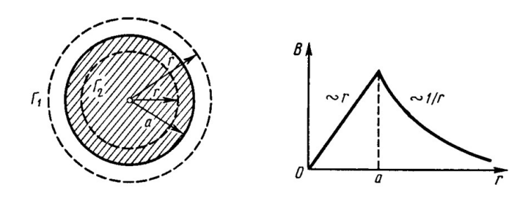

**1) Симметрия.** Провод бесконечен, и при повороте вокруг своей оси он выглядит точно так же — значит и поле после поворота то же самое. Поэтому силовые линии — окружности с центром на оси, лежащие в плоскостях, перпендикулярных проводу, а модуль $B$ одинаков во всех точках такой окружности.

**2) Контур** — окружность радиуса $r$ с центром на оси провода, обход по направлению поля.

**3) Циркуляция.** Вдоль всей окружности $\vec B$ направлен по контуру ($\vec B\ d\vec l = B\ dl$) и постоянен по модулю, поэтому $B$ выносится, а $\oint dl$ даёт длину окружности:

$$\oint \vec B\ d\vec l = B\cdot 2\pi r$$

**4) Снаружи ($r \geq a$).** Контур охватывает весь ток провода, $I_{\text{охв}} = I$:

$$B\cdot 2\pi r = \mu_0 I \implies B = \frac{\mu_0 I}{2\pi r}$$

**5) Внутри ($r \leq a$).** Контур проходит сквозь толщу провода и охватывает только ту часть тока, что течёт внутри окружности радиуса $r$. Ток распределён по сечению равномерно, поэтому охваченная доля тока равна доле площади:

$$I_{\text{охв}} = I\frac{\pi r^2}{\pi a^2} = I\frac{r^2}{a^2}$$

$$B\cdot 2\pi r = \mu_0 I\frac{r^2}{a^2} \implies B = \frac{\mu_0 I r}{2\pi a^2}$$

**Следствие:** внутри провода $B$ растёт линейно от нуля на оси, снаружи убывает как $1/r$; максимум — на поверхности провода.

### Поле бесконечного длинного соленоида

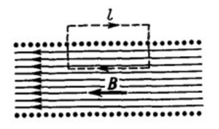

**1) Симметрия.** Соленоид — длинная катушка из плотно навитых витков. Поля соседних витков снаружи направлены навстречу друг другу и гасятся, а внутри складываются. Поэтому вне соленоида поле практически отсутствует ($B \approx 0$), а внутри однородно и направлено вдоль оси.

**2) Контур** — прямоугольник, у которого одна сторона длиной $l$ лежит внутри соленоида вдоль оси, противоположная ей — снаружи, а две оставшиеся идут поперёк.

**3) Циркуляция.** Разбираем стороны по очереди:

- внутренняя: $\vec B$ направлен вдоль неё и постоянен, вклад $B\cdot l$;
- внешняя: там $B \approx 0$, вклад нулевой;
- две поперечные: они перпендикулярны $\vec B$, скалярное произведение $\vec B\ d\vec l$ равно нулю.

$$\oint \vec B\ d\vec l = B\cdot l$$

**4) Охваченный ток.** Контур пронизывают все витки, попавшие на длину $l$. Если их $N$ и по каждому течёт ток $I$, то $I_{\text{охв}} = NI$ (один и тот же ток пересекает поверхность $N$ раз).

**5) Теорема о циркуляции:**

$$B\cdot l = \mu_0 NI$$

**6) Введём число витков на единицу длины** $n = N/l$, откуда $N = nl$. Подставляем и сокращаем $l$:

$$B\cdot l = \mu_0(nl)I \implies B = \mu_0 nI$$

**Следствие:** в ответе нет ни длины контура, ни радиуса соленоида — поле внутри одинаково во всех точках.

Тем же приёмом находятся поля тороида ($B = \mu_0 NI/2\pi r$) и бесконечной плоскости с током ($B = \frac{1}{2}\mu_0 i$) — полные выводы в `Explain.md`.

### Возможные вопросы

- *Почему поток $\vec B$ равен нулю, а поток $\vec E$ — нет?* — У $\vec E$ есть источники (заряды), на которых линии начинаются и кончаются. Магнитных зарядов нет, линии $\vec B$ замкнуты, и каждая, войдя в поверхность, обязательно из неё выйдет.
- *Почему для магнитного поля нельзя ввести потенциал?* — Потенциал есть только там, где работа не зависит от пути, то есть циркуляция равна нулю. У магнитного поля она отлична от нуля.
- *Какие токи входят в теорему о циркуляции?* — Только охватываемые контуром, то есть пронизывающие натянутую на него поверхность. Внешние токи на циркуляцию не влияют, хотя поле на контуре создают.
- *Почему снаружи соленоида поля практически нет?* — Поля соседних витков снаружи направлены навстречу друг другу и взаимно гасятся, а внутри складываются. У бесконечно длинного соленоида компенсация полная.
- *Когда теоремой о циркуляции удобно пользоваться?* — Только при высокой симметрии: когда есть контур, вдоль которого $B$ постоянен и направлен по контуру. Иначе $B$ не вынести из-под интеграла, и нужен закон Био-Савара-Лапласа (билет 37).

---

## 40. Сила, действующая на контур с током в магнитном поле

### Магнитный момент контура с током

Замкнутый контур с током играет в магнетизме ту же роль, что электрический диполь в электростатике, и его так и называют — **магнитный диполь**. 

Главная характеристика контура — вектор **магнитного момента**:

$$\vec p_m = IS\vec n$$

где $I$ — сила тока в контуре, $S$ — площадь, ограниченная контуром, $\vec n$ — положительная нормаль к плоскости контура. Направление $\vec n$ связано с направлением тока правилом правого винта: если вращать винт по току, он пойдёт вдоль $\vec n$.

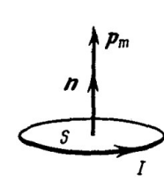

Единица измерения — $\text{А}\cdot\text{м}^2$.

### Сила, действующая на контур в однородном поле

**1)** Полная сила Ампера, действующая на замкнутый контур, находится интегрированием элементарных сил (билет 38) по всему контуру:

$$\vec F = \oint d\vec F = I\oint[d\vec l \times \vec B]$$

**2)** Если поле однородно ($\vec B = \text{const}$), то постоянный вектор $\vec B$ можно вынести за знак интеграла — как и постоянный ток $I$:

$$\vec F = I\left[\left(\oint d\vec l\right) \times \vec B\right]$$

**3)** Векторная сумма элементарных перемещений по любому замкнутому контуру равна нулю: пройдя контур целиком, мы возвращаемся в исходную точку, то есть суммарное перемещение нулевое.

$$\oint d\vec l = 0$$

**4)** Векторное произведение с нулевым вектором равно нулю, поэтому

$$\vec F = 0$$

**Вывод.** В однородном магнитном поле результирующая сила Ампера, действующая на любой замкнутый контур с током, равна нулю. Контур в таком поле не движется поступательно, но может поворачиваться: момент сил при этом отличен от нуля (билет 41).

### Сила, действующая на контур в неоднородном поле

Если поле неоднородно, разные участки контура находятся в разном по величине поле, и силы Ампера уже не компенсируют друг друга — результирующая сила отлична от нуля.

Для элементарного (малого) плоского контура с магнитным моментом $\vec p_m$ она равна

$$\vec F = p_m\frac{\partial \vec B}{\partial n}$$

где $\dfrac{\partial \vec B}{\partial n}$ — производная вектора индукции $\vec B$ по направлению нормали $\vec n$ к контуру, то есть по направлению самого $\vec p_m$.

В проекции на координатную ось $X$:

$$F_x = p_m\frac{\partial B_x}{\partial n}$$

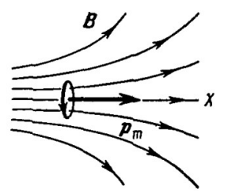

### Физический смысл силы

Сила стремится переместить контур в область, где индукция $B$ больше (**втягивание**), либо в область, где поле слабее (**выталкивание**) — в зависимости от взаимной ориентации $\vec p_m$ и $\vec B$:

**1)** Если $\vec p_m$ сонаправлен с полем ($\vec p_m \uparrow\uparrow \vec B$), контур **втягивается** в область более сильного поля.

**2)** Если $\vec p_m$ противоположен полю ($\vec p_m \uparrow\downarrow \vec B$), контур **выталкивается** из области сильного поля.

### Возможные вопросы

- *Почему в однородном поле сила равна нулю?* — Потому что $\oint d\vec l = 0$: обойдя замкнутый контур, мы возвращаемся туда же, откуда вышли. Силы на противоположных участках контура равны по модулю и противоположны по направлению, и в сумме дают ноль.
- *Значит ли это, что в однородном поле с контуром ничего не происходит?* — Нет. Поступательного движения нет, но силы приложены в разных точках и создают пару — контур поворачивается, стремясь развернуть $\vec p_m$ вдоль поля (билет 41).
- *Куда направлена нормаль $\vec n$?* — Определяется током по правилу правого винта: вращаем винт в направлении тока, поступательное движение винта даёт $\vec n$. Поменяли направление тока — $\vec n$ и $\vec p_m$ развернулись.
- *Чем контур с током похож на электрический диполь?* — Формулы совпадают по строению: на диполь в неоднородном поле действует $F = p\dfrac{\partial E}{\partial l}$ (билет 10), на контур — $F = p_m\dfrac{\partial B}{\partial n}$. В однородном поле и там, и там результирующая сила равна нулю, а момент сил — нет.
- *Почему сила зависит именно от производной поля, а не от его величины?* — Сила возникает из-за **разницы** поля на разных краях контура. Если поле всюду одинаково, разницы нет и сила нулевая; чем быстрее поле меняется в пространстве, тем больше эта разница, а значит и сила.

---
