# Физика. Разбор билетов — откуда берутся формулы

> Это **не** ответ на экзамене. Это справочник: если забыла, откуда взялась формула
> или что означает строчка в билете — смотри сюда.
> Готовые ответы для экзамена — в файле `Actual_answers.md`.

## Оглавление

1. [[#Разбор 1. Электрический заряд. Закон Кулона. Принцип суперпозиции сил|Электрический заряд. Закон Кулона. Принцип суперпозиции сил]]
2. [[#Разбор 2. Электрическое поле. Напряжённость E. Принцип суперпозиции полей|Электрическое поле. Напряжённость E. Принцип суперпозиции полей]]
3. [[#Разбор 3. Плотность зарядов. Поле кольца и нити|Плотность зарядов. Поле кольца и нити]]
4. [[#Разбор 4. Поток E. Теорема Остроградского-Гаусса|Поток E. Теорема Остроградского-Гаусса]]
5. [[#Разбор 5. Примеры применения теоремы Гаусса|Примеры применения теоремы Гаусса]]
6. [[#Разбор 6. Работа кулоновских сил. Теорема о циркуляции вектора E|Работа кулоновских сил. Теорема о циркуляции вектора E]]
7. [[#Разбор 7. Энергия и потенциал электростатического поля|Энергия и потенциал электростатического поля]]
8. [[#Разбор 8. Связь между напряжённостью и потенциалом|Связь между напряжённостью и потенциалом]]
9. [[#Разбор 9. Электрический диполь. Поле и потенциал|Электрический диполь. Поле и потенциал]]
10. [[#Разбор 10. Сила, момент и энергия диполя во внешнем поле|Сила, момент и энергия диполя во внешнем поле]]
11. [[#Разбор 11. Поле системы зарядов на больших расстояниях|Поле системы зарядов на больших расстояниях]]
12. [[#Разбор 12. Поле внутри и снаружи проводника|Поле внутри и снаружи проводника]]
13. [[#Разбор 13. Силы, действующие на поверхность проводника|Силы, действующие на поверхность проводника]]
14. [[#Разбор 14. Свойства замкнутой проводящей оболочки|Свойства замкнутой проводящей оболочки]]
15. [[#Разбор 15. Уравнения Пуассона и Лапласа. Метод изображений|Уравнения Пуассона и Лапласа. Метод изображений]]
16. [[#Разбор 16. Электроёмкость. Уединённый проводник и система проводников|Электроёмкость. Уединённый проводник и система проводников]]
17. [[#Разбор 17. Различные виды конденсаторов|Различные виды конденсаторов]]
18. [[#Разбор 18. Соединения конденсаторов|Соединения конденсаторов]]
19. [[#Разбор 19. Энергия системы зарядов и системы двух тел|Энергия системы зарядов и системы двух тел]]
20. [[#Разбор 20. Электрическое поле в диэлектрике. Поляризация|Электрическое поле в диэлектрике. Поляризация]]
21. [[#Разбор 21. Поляризованность P, связанные заряды|Поляризованность P, связанные заряды]]
22. [[#Разбор 22. Теорема Гаусса для P, связь P со связанными зарядами|Теорема Гаусса для P, связь P со связанными зарядами]]
23. [[#Разбор 23. Вектор D и теорема Гаусса для него|Вектор D и теорема Гаусса для него]]
24. [[#Разбор 24. Граница двух диэлектриков|Граница двух диэлектриков]]
25. [[#Разбор 25. Граница проводник-диэлектрик|Граница проводник-диэлектрик]]
26. [[#Разбор 26. Виды диэлектриков. Сегнетоэлектрики|Виды диэлектриков. Сегнетоэлектрики]]
27. [[#Разбор 27. Электрический ток. Уравнение непрерывности|Электрический ток. Уравнение непрерывности]]
28. [[#Разбор 28. Сторонние силы. ЭДС|Сторонние силы. ЭДС]]
29. [[#Разбор 29. Закон Ома для однородного участка|Закон Ома для однородного участка]]
30. [[#Разбор 30. Закон Ома для неоднородного участка|Закон Ома для неоднородного участка]]
31. [[#Разбор 31. Правила Кирхгофа|Правила Кирхгофа]]
32. [[#Разбор 32. Мощность тока и закон Джоуля-Ленца|Мощность тока и закон Джоуля-Ленца]]
33. [[#Разбор 33. Разрядка конденсатора|Разрядка конденсатора]]
34. [[#Разбор 34. Зарядка конденсатора|Зарядка конденсатора]]
35. [[#Разбор 35. Природа магнетизма|Природа магнетизма]]

%%
Дубль оглавления для GitHub: он не понимает вики-ссылок на заголовки, а Obsidian — гитхабовских якорей. В Obsidian этот блок скрыт как комментарий. При правке названий билетов обновляй оба списка.

1. [Электрический заряд. Закон Кулона. Принцип суперпозиции сил](#разбор-1-электрический-заряд-закон-кулона-принцип-суперпозиции-сил)
2. [Электрическое поле. Напряжённость E. Принцип суперпозиции полей](#разбор-2-электрическое-поле-напряжённость-e-принцип-суперпозиции-полей)
3. [Плотность зарядов. Поле кольца и нити](#разбор-3-плотность-зарядов-поле-кольца-и-нити)
4. [Поток E. Теорема Остроградского-Гаусса](#разбор-4-поток-e-теорема-остроградского-гаусса)
5. [Примеры применения теоремы Гаусса](#разбор-5-примеры-применения-теоремы-гаусса)
6. [Работа кулоновских сил. Теорема о циркуляции вектора E](#разбор-6-работа-кулоновских-сил-теорема-о-циркуляции-вектора-e)
7. [Энергия и потенциал электростатического поля](#разбор-7-энергия-и-потенциал-электростатического-поля)
8. [Связь между напряжённостью и потенциалом](#разбор-8-связь-между-напряжённостью-и-потенциалом)
9. [Электрический диполь. Поле и потенциал](#разбор-9-электрический-диполь-поле-и-потенциал)
10. [Сила, момент и энергия диполя во внешнем поле](#разбор-10-сила-момент-и-энергия-диполя-во-внешнем-поле)
11. [Поле системы зарядов на больших расстояниях](#разбор-11-поле-системы-зарядов-на-больших-расстояниях)
12. [Поле внутри и снаружи проводника](#разбор-12-поле-внутри-и-снаружи-проводника)
13. [Силы, действующие на поверхность проводника](#разбор-13-силы-действующие-на-поверхность-проводника)
14. [Свойства замкнутой проводящей оболочки](#разбор-14-свойства-замкнутой-проводящей-оболочки)
15. [Уравнения Пуассона и Лапласа. Метод изображений](#разбор-15-уравнения-пуассона-и-лапласа-метод-изображений)
16. [Электроёмкость. Уединённый проводник и система проводников](#разбор-16-электроёмкость-уединённый-проводник-и-система-проводников)
17. [Различные виды конденсаторов](#разбор-17-различные-виды-конденсаторов)
18. [Соединения конденсаторов](#разбор-18-соединения-конденсаторов)
19. [Энергия системы зарядов и системы двух тел](#разбор-19-энергия-системы-зарядов-и-системы-двух-тел)
20. [Электрическое поле в диэлектрике. Поляризация](#разбор-20-электрическое-поле-в-диэлектрике-поляризация)
21. [Поляризованность P, связанные заряды](#разбор-21-поляризованность-p-связанные-заряды)
22. [Теорема Гаусса для P, связь P со связанными зарядами](#разбор-22-теорема-гаусса-для-p-связь-p-со-связанными-зарядами)
23. [Вектор D и теорема Гаусса для него](#разбор-23-вектор-d-и-теорема-гаусса-для-него)
24. [Граница двух диэлектриков](#разбор-24-граница-двух-диэлектриков)
25. [Граница проводник-диэлектрик](#разбор-25-граница-проводник-диэлектрик)
26. [Виды диэлектриков. Сегнетоэлектрики](#разбор-26-виды-диэлектриков-сегнетоэлектрики)
27. [Электрический ток. Уравнение непрерывности](#разбор-27-электрический-ток-уравнение-непрерывности)
28. [Сторонние силы. ЭДС](#разбор-28-сторонние-силы-эдс)
29. [Закон Ома для однородного участка](#разбор-29-закон-ома-для-однородного-участка)
30. [Закон Ома для неоднородного участка](#разбор-30-закон-ома-для-неоднородного-участка)
31. [Правила Кирхгофа](#разбор-31-правила-кирхгофа)
32. [Мощность тока и закон Джоуля-Ленца](#разбор-32-мощность-тока-и-закон-джоуля-ленца)
33. [Разрядка конденсатора](#разбор-33-разрядка-конденсатора)
34. [Зарядка конденсатора](#разбор-34-зарядка-конденсатора)
35. [Природа магнетизма](#разбор-35-природа-магнетизма)
%%

---

## Разбор 1. Электрический заряд. Закон Кулона. Принцип суперпозиции сил

### Что такое заряд

Всё состоит из атомов. В ядре — **протоны** («+») и нейтроны (без заряда), вокруг летают **электроны** («−»). В обычном атоме их поровну, поэтому атом нейтрален.

Заряд — такое же свойство частицы, как масса:

| | масса | заряд |
|---|---|---|
| за что отвечает | участие в гравитации | участие в электрическом взаимодействии |
| знаки | только «+» | «+» и «−» |
| следствие | только притяжение | и притяжение, и отталкивание |

**Как тело заряжается.** Только перетаскиванием электронов. Потёрла палочку о шерсть — часть электронов перешла на палочку: палочка «−» (лишние электроны), шерсть «+» (электронов не хватает). Протоны сидят в ядрах и не двигаются.

### Квантование: $q = \pm N e$

Заряд нельзя нарезать сколь угодно мелко. Есть минимальная «монетка» — заряд электрона $e = 1{,}6\cdot10^{-19}$ Кл. Любой заряд — целое число таких монеток.

Как деньги: нельзя заплатить 5,7 копейки, только целое число копеек.

- $N$ — сколько монеток (целое число);
- $\pm$ — каких монеток избыток.

**Термины:** «дискретен» = «по порциям» (противоположность — непрерывный); «квантование» = «разбиение на неделимые порции».

Число $1{,}6\cdot10^{-19}$ чудовищно мало → в заряде 1 Кл сидит около $6{,}25\cdot10^{18}$ электронов. Поэтому **1 Кл — огромный заряд**, в жизни встречаются нано- и микрокулоны.

### Инвариантность и сохранение

**Инвариантность** = «неизменность». Заряд электрона одинаков всегда: летит он или стоит, смотришь из поезда или с перрона — те же $1{,}6\cdot10^{-19}$ Кл. (Масса в теории относительности от скорости зависит, а заряд — нет.)

**Сохранение.** Заряд нельзя создать или уничтожить — только перенести. Потёрла палочку: на ней $-5$ нКл, на шерсти $+5$ нКл, в сумме по-прежнему 0.

«Алгебраическая сумма» = складываем со знаками ($+5 + (-5) = 0$), а не по модулю.

### Точечный заряд

Идеализация, аналог материальной точки в механике. Шарик радиусом 1 см на расстоянии 10 м — точечный заряд. Тот же шарик на расстоянии 2 мм — уже нет.

**Зачем нужно:** закон Кулона работает **только** для точечных зарядов. Всё остальное считается разбиением на точечные кусочки + суперпозиция (это билет 3).

### Закон Кулона $F = k\ \dfrac{|q_1||q_2|}{r^2}$

**Откуда взялся.** Это **опытный** закон. Кулон в 1785 г. подвешивал заряженные шарики на тонкой нити (крутильные весы) и мерил угол закручивания. Формула не выведена из чего-то более глубокого — она измерена.

**По кусочкам:**

| Кусок | Что означает |
|---|---|
| $F$ | модуль силы взаимодействия, Н |
| $\|q_1\|\cdot\|q_2\|$ | прямая пропорциональность: заряд вдвое больше → сила вдвое больше |
| $r^2$ в знаменателе | отодвинула вдвое → сила в **4 раза** меньше; втрое → в **9 раз** |
| $k$ | коэффициент согласования единиц |
| модули | берём заряды без знаков, чтобы $F$ вышла положительной; направление указываем словами |

**Почему именно квадрат.** Представь лампочку: свет расходится во все стороны и «размазывается» по сфере площадью $S = 4\pi r^2$. Отодвинулась вдвое — тот же свет размазался по вчетверо большей площади → яркость упала в 4 раза. Электрическое действие «растекается» так же. Отсюда $1/r^2$.

**Про коэффициент.** $k = \dfrac{1}{4\pi\varepsilon_0} = 9\cdot10^9$, где $\varepsilon_0$ — электрическая постоянная, число-переводчик между кулонами и ньютонами в СИ.

*Зачем писать $k$ в уродливом виде $1/4\pi\varepsilon_0$?* Это **плата за красоту дальше**: если запихнуть $4\pi$ сюда, то в теореме Гаусса и уравнениях Максвелла никаких $4\pi$ не будет. Физики решили, что важнее упростить главные уравнения. Такая запись называется «рационализованной».

*Масштаб:* $k = 9\cdot10^9$ означает, что два заряда по 1 Кл на расстоянии 1 м оттолкнулись бы с силой 9 миллиардов Н — как вес миллиона тонн.

### Векторная форма — почему $r^3$

$$\vec F_{1,2} = k\ \frac{q_1 q_2}{r_{1,2}^3}\ \vec r_{1,2}$$

Обозначения: $\vec r_{1,2}$ — вектор **от заряда 1 к заряду 2**; $r_{1,2}$ — его длина; $\vec F_{1,2}$ — сила, действующая **на заряд 2 со стороны 1**.

**Куб появляется потому, что сверху стоит вектор, а не число.** Распишем:

$$\frac{\vec r}{r^3} = \underbrace{\left(\frac{\vec r}{r}\right)}_{\text{длина} = 1}\cdot\frac{1}{r^2} = \hat r\cdot\frac{1}{r^2}$$

Вектор $\vec r$, делённый на свою же длину $r$, — это **орт** $\hat r$ (длина ровно 1). Он не влияет на величину, только показывает направление. Оставшийся $1/r^2$ — настоящий закон Кулона.

Итог: **куб не потому, что физика такая, а потому что один $r$ ушёл на нормировку вектора направления.** Модуль этой формулы — обычный $k q_1 q_2/r^2$.

**Зачем убрали модули с зарядов** — чтобы знак работал автоматически:

- $q_1q_2 > 0$ (одноимённые) → множитель «+» → $\vec F$ смотрит туда же, куда $\vec r_{1,2}$, то есть от 1 к 2 → заряд 2 толкают прочь → **отталкивание**;
- $q_1q_2 < 0$ (разноимённые) → множитель «−» → $\vec F$ смотрит против $\vec r_{1,2}$, то есть к заряду 1 → **притяжение**.

Одна формула описывает оба случая.

### Принцип суперпозиции сил

$$\vec F_{\text{рез}} = \sum_{i=1}^{n}\vec F_i$$

Считаешь силу от каждого заряда по отдельности (как будто остальных нет), потом складываешь **векторно** — по правилу параллелограмма или по проекциям на оси.

**Почему это не банальность.** Можно вообразить мир, где третий заряд «экранирует» взаимодействие первых двух — тогда сила между 1 и 2 зависела бы от того, кто ещё стоит рядом, и суммировать было бы нельзя. Природа устроена не так: **каждая пара взаимодействует независимо**. Это тоже опытный факт, а не математика.

$\Sigma$ (сигма) = «сумма всех». $\sum_{i=1}^{n}\vec F_i$ читается «сумма сил $\vec F_i$, где $i$ пробегает от 1 до $n$».

⚠️ Ключевое слово — **векторной**. $3\ \text{Н} + 4\ \text{Н}$ может дать 7 Н (вдоль одной прямой в одну сторону), 1 Н (навстречу) или 5 Н (под $90^\circ$).

---

## Разбор 2. Электрическое поле. Напряжённость E. Принцип суперпозиции полей

### Зачем придумали поле

Закон Кулона говорит: два заряда действуют друг на друга. Но **как?** Между ними пустота. Откуда заряд «знает», что в метре от него сидит другой?

Два варианта ответа:

- **дальнодействие** — заряды чувствуют друг друга мгновенно через пустоту (так думали до XIX века; оказалось неверно);
- **близкодействие** — заряд меняет пространство вокруг себя, а второй заряд реагирует на изменённое пространство **прямо в той точке, где он сам находится**.

Это «изменённое пространство» и есть **электрическое поле**.

*Аналогия:* стоишь у костра и чувствуешь тепло. Ты взаимодействуешь не с костром напрямую, а с **нагретым воздухом в той точке, где стоишь**.

Схема взаимодействия меняется так:

```
Было:    заряд 1  <-->  заряд 2          (действие через пустоту)

Стало:   заряд 1  -->  ПОЛЕ  -->  заряд 2
         создаёт            действует на
```

Поле — **не удобная выдумка**, а реальный физический объект: у него есть энергия и импульс, оно может существовать само по себе (электромагнитная волна летит от Солнца 8 минут, когда источник уже «отработал»). Поэтому в билете и написано «**особая форма материи**»: материя бывает не только веществом, но и полем.

**Обнаружить поле можно только одним способом** — внести туда заряд и увидеть силу. Отсюда «главное свойство поля».

### Напряжённость: зачем делить силу на $q'$

Как измерить поле числом? Внести заряд и померить силу. Но сила зависит от того, **какой** заряд внесли: внесли 1 нКл — сила одна, внесли 2 нКл — вдвое больше. А поле одно и то же.

**Решение — поделить силу на заряд:**

$$\vec E = \frac{\vec F}{q'}$$

Внесли $q'$ → получили $F$. Внесли $2q'$ → получили $2F$. Отношение $F/q'$ — **одно и то же**, значит оно характеризует уже не пробный заряд, а **само поле в этой точке**.

*Аналогия:* цена всей корзины яблок зависит от того, сколько ты набрала, а цена **за килограмм** — свойство самих яблок.

| Обозначение | Что это |
|---|---|
| $q'$ | **пробный заряд** — тот, что мы внесли, чтобы «пощупать» поле |
| $\vec F$ | сила, действующая на этот пробный заряд |
| $\vec E$ | напряжённость — характеристика поля в данной точке |

$\vec E$ — вектор, потому что $\vec F$ — вектор, а $q'$ — просто число; деление на положительное число направления не меняет.

«**Силовая** характеристика» = «говорит о силе». Позже (билет 7) появится потенциал — энергетическая характеристика.

### Почему пробный заряд малый и положительный

**Положительный** — это соглашение о направлении. С отрицательным пробным зарядом $\vec E$ смотрела бы в противоположную сторону. Договорились: $\vec E$ направлена так, как сила на «плюс».

**Малый** — а это уже физика. Пусть поле создано заряженной металлической пластиной. Внесём туда большой пробный заряд — он своим полем **растащит заряды на пластине**, они перераспределятся. И мерить мы будем уже **не то поле, которое было до нашего прихода**.

*Аналогия:* мерить температуру воды огромным холодным градусником — пока меришь, воду остудил.

Строгая запись:

$$\vec E = \lim_{q'\to 0}\frac{\vec F}{q'}$$

### Единица измерения

Из формулы $E = F/q$ единица получается **Н/Кл** (ньютон на кулон). Это то же самое, что **В/м**. Почему при чём тут вольты — станет ясно в билете 8 (связь $E$ и потенциала). Пока просто: **1 В/м = 1 Н/Кл**.

### Поле точечного заряда — вывод

Это не новая формула, а **закон Кулона, делённый на $q'$**.

Сила, с которой заряд $q$ действует на пробный $q'$:

$$\vec F = \frac{1}{4\pi\varepsilon_0}\cdot\frac{q\ q'}{r^2}\cdot\vec e_r$$

Делим на $q'$ по определению напряжённости:

$$\vec E = \frac{\vec F}{q'} = \frac{1}{4\pi\varepsilon_0}\cdot\frac{q}{r^2}\cdot\vec e_r$$

**Что произошло:** $q'$ сократился. Это принципиально — **в итоговой формуле пробного заряда нет вообще**. Значит, поле существует само по себе, независимо от того, вносим мы туда что-то или нет. Пробный заряд был нужен только как инструмент измерения.

**Про $\vec e_r$** — это тот же орт из билета 1: вектор единичной длины, направленный «от заряда наружу». Здесь он выписан отдельно, поэтому в знаменателе $r^2$, а не $r^3$. Сравни с векторным законом Кулона, где орт был спрятан в виде $\vec r/r^3$: **это одна и та же формула в двух формах записи**.

**Направление:**

- $q > 0$ → множитель положительный → $\vec E$ вдоль $\vec e_r$, то есть **от заряда** (поле «вытекает»);
- $q < 0$ → множитель отрицательный → $\vec E$ против $\vec e_r$, то есть **к заряду** (поле «втекает»).

### Силовые линии — как читать картинку

Формулами поле описано, но глазами не увидеть. Поэтому рисуют линии напряжённости по двум правилам.

**Правило 1 (направление): касательная к линии в любой точке совпадает с $\vec E$.**

На рисунке в билете вверху нарисована кривая, и в точках 1 и 2 из неё торчат стрелки $\vec E_1$ и $\vec E_2$. Они не «вдоль линии целиком» — они **касаются** её в этой точке.

Почему так, а не «линия = стрелка»? Потому что $\vec E$ в каждой точке своя, одной прямой стрелкой всё поле не нарисуешь. А кривая, которая в каждой точке «повёрнута правильно», описывает сразу всю картину.

**Правило 2 (величина): густота линий пропорциональна модулю $\vec E$.**

Гуще → поле сильнее, реже → слабее. У самого шарика «+» линии сходятся вплотную (поле большое), дальше расходятся веером (поле падает). Это визуальная версия закона $1/r^2$.

**Что видно на рисунке из билета:**

- **«+»** — линии направлены **наружу**: плюс это «источник» поля;
- **«−»** — линии направлены **внутрь**: минус это «сток» поля;
- **квадрат в рамке** (плюс слева, минус справа, между ними параллельные стрелки) — линии прямые, параллельные, одинаково густые → это **однородное поле**.

### Однородное поле

$\vec E$ одинакова во всех точках **и по модулю, и по направлению**.

⚠️ Обе части важны. Если модуль везде один, а направление меняется (например, вокруг точечного заряда на фиксированном расстоянии) — поле **не** однородное.

Признак на картинке: линии прямые, параллельные, на равном расстоянии. Реальный пример — поле между пластинами плоского конденсатора (билет 17).

### Суперпозиция полей — вывод в три строки

Берём суперпозицию **сил** из билета 1 и делим обе части на $q'$:

$$\vec F_{\text{рез}} = \sum_i \vec F_i \quad\Big|\ \div\  q'$$

$$\frac{\vec F_{\text{рез}}}{q'} = \sum_i \frac{\vec F_i}{q'}$$

$$\vec E = \sum_i \vec E_i$$

Слева по определению получается $\vec E$; справа каждое слагаемое $\vec F_i/q'$ — это $\vec E_i$, поле от $i$-го заряда. Всё.

**Вывод:** суперпозиция полей — **не отдельный закон**, а прямое следствие суперпозиции сил. Если попросят доказать — вот эти три строчки и есть доказательство.

**Второе равенство в билете** — то же самое, но каждое $\vec E_i$ расписано как поле точечного заряда:

$$\vec E = \frac{1}{4\pi\varepsilon_0}\sum_i \frac{q_i}{r_i^2}\vec e_{ri}$$

Индекс $i$ стоит у всего: $q_i$ — $i$-й заряд, $r_i$ — расстояние от него до нашей точки, $\vec e_{ri}$ — орт, направленный от $i$-го заряда к нашей точке.

**Физический смысл:** поля не мешают друг другу. Каждый заряд создаёт своё поле так, будто остальных нет, а потом всё складывается векторно.

---

## Разбор 3. Плотность зарядов. Поле кольца и нити

### Проблема, которую решает этот билет

Закон Кулона работает **только для точечных зарядов**. А что делать, если заряжено кольцо, нить, пластина, шар? Формулы для них нет.

**Решение:** разбить тело на кусочки настолько мелкие, что каждый можно считать точечным зарядом. Для каждого кусочка закон Кулона уже работает. Дальше — сложить все вклады по принципу суперпозиции.

Но кусочков бесконечно много, и они бесконечно малы. Сумма $\sum$ превращается в интеграл $\int$. Вот и весь билет.

```
Реальность:   заряд состоит из отдельных электронов (дискретно, но их 10^18 штук)
Модель:       заряд «размазан» непрерывно
Зачем:        чтобы вместо суммы 10^18 слагаемых написать один интеграл
```

### Что такое интеграл (если совсем с нуля)

$\int$ — это растянутая буква S от слова «Summa». Интеграл — **это и есть сумма**, только слагаемых бесконечно много и каждое бесконечно мало.

- $dq$ — «бесконечно малый кусочек заряда» (буква $d$ = «крошечная порция чего-то»);
- $\int dq$ — «сложить все крошечные кусочки заряда» = весь заряд $q$;
- $\int dl$ по кольцу — «сложить все крошечные кусочки длины» = длина кольца $2\pi a$.

Именно поэтому в выводе для кольца шаг $\int dq = q$ — это не фокус, а буквальное прочтение значка.

### Три плотности

Плотность отвечает на вопрос **«сколько заряда приходится на единицу длины / площади / объёма»**. Какую из трёх брать — зависит от того, на что «размазан» заряд.

| | обозначение | формула | единица | когда используется |
|---|---|---|---|---|
| линейная | $\lambda$ (ламбда) | $\lambda = dq/dl$ | Кл/м | нить, тонкий стержень, кольцо |
| поверхностная | $\sigma$ (сигма) | $\sigma = dq/dS$ | Кл/м² | пластина, сфера, поверхность проводника |
| объёмная | $\rho$ (ро) | $\rho = dq/dV$ | Кл/м³ | шар, цилиндр, заряд «внутри» тела |

*Аналогия.* Это ровно как плотность массы, только вместо массы — заряд. «Погонный метр верёвки весит 200 г» — линейная плотность. «Квадратный метр ткани весит 300 г» — поверхностная. «Кубометр воды весит 1000 кг» — объёмная.

**Как читать $\lambda = dq/dl$.** Формально это производная. По смыслу проще: берём крошечный кусочек длины $dl$, смотрим, сколько заряда $dq$ на нём сидит, делим одно на другое.

**Главное, ради чего это вводится** — обратная формула:

$$dq = \lambda\ dl \qquad dq = \sigma\ dS \qquad dq = \rho\ dV$$

Она позволяет **выразить заряд кусочка через его размер**. Без неё интеграл не взять: под интегралом должна остаться геометрия (длина, площадь, объём), а не абстрактное $dq$.

### Общая формула

$$\vec E = \frac{1}{4\pi\varepsilon_0}\int\frac{dq}{r^2}\vec e_r$$

Сравни с формулой суперпозиции из билета 2:

$$\vec E = \frac{1}{4\pi\varepsilon_0}\sum_i \frac{q_i}{r_i^2}\vec e_{ri}$$

**Изменились ровно две вещи:** $\sum \to \int$ и $q_i \to dq$. Физика та же самая — это по-прежнему принцип суперпозиции, просто зарядов стало бесконечно много.

### Алгоритм: как решается любая такая задача

Оба примера в билете идут по одной схеме. Если её понять, оба вывода перестают быть страшными.

1. **Разбить** тело на элементы $dq$.
2. **Записать** $dE$ от одного элемента по закону Кулона.
3. **Использовать симметрию:** понять, какие составляющие взаимно уничтожаются, и оставить только одну проекцию.
4. **Свести всё к одной переменной** и проинтегрировать.

Шаг 3 — ключевой. Без него пришлось бы считать интеграл от вектора, а это тяжело. Симметрия сводит задачу к скалярному интегралу.

### Пример 1: кольцо — построчно

**Постановка.** Кольцо радиуса $a$, заряд $q$ размазан равномерно. Точка $C$ — на оси кольца, на расстоянии $z$ от центра.

**Почему нужна симметрия.** Возьми элемент кольца слева — он создаёт $d\vec E$, наклонённый вправо-вверх. Возьми диаметрально противоположный элемент справа — он создаёт такой же по модулю $d\vec E$, наклонённый влево-вверх. Складываем: горизонтальные части **гасятся**, вертикальные (вдоль оси) **складываются**.

Так работает каждая пара элементов. Вывод: **суммарное поле направлено строго вдоль оси**, а поперечные составляющие можно вообще не считать.

**Строка 1.** $dE_z = dE\cos\alpha$

Это просто проекция вектора на ось: длина вектора × косинус угла между вектором и осью. Мы складываем не сами векторы $d\vec E$, а только их осевые проекции.

**Строка 2.** $\cos\alpha = z/r$

Смотри на рисунок: треугольник $A$–$O$–$C$ прямоугольный (ось перпендикулярна плоскости кольца). Угол $\alpha$ при вершине $C$. Прилежащий катет — $z$, гипотенуза — $r$ (расстояние от элемента кольца до точки $C$). Косинус = прилежащий / гипотенуза. Обычная школьная геометрия.

**Строка 3.** Подставляем:

$$dE_z = \frac{1}{4\pi\varepsilon_0}\frac{dq}{r^2}\cdot\frac{z}{r} = \frac{1}{4\pi\varepsilon_0}\frac{z\ dq}{r^3}$$

Первый множитель — закон Кулона для элемента $dq$ (билет 2), второй — косинус. Перемножили, $r^2\cdot r = r^3$.

**Строка 4.** $E = \displaystyle\int\frac{1}{4\pi\varepsilon_0}\frac{z\ dq}{r^3}$ — складываем вклады всех элементов.

**Строка 5 — самое важное место.** Выносим константы:

$$E = \frac{1}{4\pi\varepsilon_0}\frac{z}{r^3}\int dq$$

*Почему это законно?* За знак интеграла можно вынести только то, что **не меняется при переборе элементов**. Мы перебираем точки кольца. Точка наблюдения $C$ стоит на месте, а все точки кольца **равноудалены** от неё — ведь кольцо круглое, а $C$ на оси. Значит $r$ одинаково для всех элементов. И $z$, и $a$ тоже фиксированы.

⚠️ Это работает **только** потому, что точка лежит на оси. Если бы она была сбоку, $r$ было бы разным для разных элементов, вынести бы не получилось, и задача стала бы неразрешимой в элементарных функциях.

**Строка 6.** $\int dq = q$ — сумма всех кусочков заряда есть весь заряд.

$$E = \frac{1}{4\pi\varepsilon_0}\frac{q z}{r^3}$$

**Строка 7.** Убираем $r$, выражая его через данные задачи. По теореме Пифагора в том же треугольнике: $r = \sqrt{a^2+z^2}$, значит $r^3 = (a^2+z^2)^{3/2}$.

$$E = \frac{1}{4\pi\varepsilon_0}\frac{q z}{(a^2+z^2)^{3/2}}$$

**Проверки (полезно назвать на экзамене):**

- $z = 0$ (центр кольца) → $E = 0$. Логично: со всех сторон тянет одинаково, всё компенсируется.
- $z \gg a$ (смотрим издалека) → $(a^2+z^2)^{3/2} \approx z^3$, и $E \approx \dfrac{q}{4\pi\varepsilon_0 z^2}$ — обычное поле точечного заряда. Издалека кольцо неотличимо от точки. **Формула прошла проверку.**

### Пример 2: нить — построчно

**Постановка.** Нить длиной $2l$ (от $-l$ до $+l$), заряд $q$ распределён равномерно с плотностью $\lambda$. Точка наблюдения — на расстоянии $x$ от середины нити, по перпендикуляру.

На рисунке: нить вертикальна (вдоль оси $y$), точка наблюдения справа, $x$ — расстояние до неё, $\alpha$ — угол, под которым из точки наблюдения видно элемент нити.

**Шаг 1. Симметрия:** $E_y = 0 \implies E = E_x$

Направление $d\vec E$ от каждого элемента задаёт закон Кулона: вдоль прямой, соединяющей элемент с точкой наблюдения. Элемент, лежащий **выше** точки наблюдения, создаёт вклад, направленный **вниз-вправо**; симметричный ему элемент **ниже** — **вверх-вправо**. По модулю эти вклады равны (одинаковые $r$, $dq$ и угол), поэтому вертикальные составляющие взаимно уничтожаются, а горизонтальные складываются. Остаётся только $E_x$ — вдоль перпендикуляра к нити.

Чисто горизонтальный вклад даёт лишь один элемент — тот, что лежит ровно напротив точки наблюдения ($y = 0$, $\alpha = 0$). Все остальные вклады наклонные — именно поэтому и приходится брать проекцию $dE_x = dE\cos\alpha$, а не складывать модули.

**Шаг 2. Дифференциал проекции:**

$$dE_x = dE\cos\alpha = \frac{1}{4\pi\varepsilon_0}\frac{dq}{r^2}\cos\alpha = \frac{\lambda}{4\pi\varepsilon_0}\frac{\cos\alpha\ dy}{r^2}$$

Здесь сработала та самая формула $dq = \lambda\ dy$: абстрактный «кусочек заряда» заменили на «кусочек длины». Теперь под интегралом только геометрия.

**Шаг 3. Замена переменной — самое сложное место.**

*В чём проблема.* В выражении две переменные: $y$ (какой элемент берём) и $r$ (расстояние до него), причём $r$ зависит от $y$: $r = \sqrt{x^2+y^2}$. Плюс ещё $\cos\alpha$. Интеграл в таком виде некрасивый.

*Идея.* Ввести **одну** переменную, через которую выражается всё остальное. Такой переменной оказывается угол $\alpha$.

Из прямоугольного треугольника (катеты $x$ и $y$, гипотенуза $r$, угол $\alpha$ между $x$ и $r$):

$$\tan\alpha = \frac{y}{x} \implies y = x\tan\alpha$$

$$\cos\alpha = \frac{x}{r} \implies r = \frac{x}{\cos\alpha} \implies r^2 = \frac{x^2}{\cos^2\alpha}$$

Дифференцируем первое по $\alpha$ (при этом $x$ = const, а производная тангенса равна $1/\cos^2\alpha$):

$$dy = \frac{x\ d\alpha}{\cos^2\alpha}$$

*Смысл этой строки:* если угол изменился на крошечное $d\alpha$, то по нити мы сдвинулись на $dy$. Это перевод «шага по нити» в «шаг по углу».

**Шаг 4. Подстановка — и происходит чудо:**

$$dE_x = \frac{\lambda}{4\pi\varepsilon_0}\cdot\frac{\dfrac{x\ d\alpha}{\cos^2\alpha}\cdot\cos\alpha}{\dfrac{x^2}{\cos^2\alpha}}$$

Считаем дробь: делить на дробь = умножить на перевёрнутую.

$$\frac{x\ d\alpha\ \cos\alpha}{\cos^2\alpha}\cdot\frac{\cos^2\alpha}{x^2} = \frac{x\cos\alpha\ d\alpha}{x^2} = \frac{\cos\alpha\ d\alpha}{x}$$

Все $\cos^2\alpha$ сократились, один $x$ сократился. Остаётся:

$$dE_x = \frac{\lambda}{4\pi\varepsilon_0 x}\cos\alpha\ d\alpha$$

Было страшно — стало элементарно. **Ради этого и делали замену.**

**Шаг 5. Интегрирование.** Пределы: нить видна из точки наблюдения в диапазоне углов от $-\alpha_0$ (нижний конец) до $+\alpha_0$ (верхний конец).

$$E = \frac{\lambda}{4\pi\varepsilon_0 x}\int_{-\alpha_0}^{\alpha_0}\cos\alpha\ d\alpha$$

Первообразная косинуса — синус:

$$\Big[\sin\alpha\Big]_{-\alpha_0}^{\alpha_0} = \sin\alpha_0 - \sin(-\alpha_0) = \sin\alpha_0 + \sin\alpha_0 = 2\sin\alpha_0$$

(использовали нечётность синуса: $\sin(-\alpha) = -\sin\alpha$)

$$E = \frac{2\lambda\sin\alpha_0}{4\pi\varepsilon_0 x}$$

**Шаг 6. Возврат к геометрии.** Угол $\alpha_0$ — не данное задачи, его надо выразить через $l$ и $x$. Из треугольника с катетами $x$ и $l$: гипотенуза $\sqrt{l^2+x^2}$, синус = противолежащий / гипотенуза:

$$\sin\alpha_0 = \frac{l}{\sqrt{l^2+x^2}}$$

$$E = \frac{2\lambda l}{4\pi\varepsilon_0 x\sqrt{l^2+x^2}}$$

Наконец, $\lambda = q/(2l)$, то есть $2\lambda l = q$:

$$E = \frac{q}{4\pi\varepsilon_0 x\sqrt{l^2+x^2}}$$

**Проверки:**

- $x \gg l$ (издалека) → $\sqrt{l^2+x^2}\approx x$, и $E \approx \dfrac{q}{4\pi\varepsilon_0 x^2}$ — поле точечного заряда. ✓
- $l \gg x$ (**бесконечная нить**) → $\alpha_0 \to 90°$, $\sin\alpha_0 \to 1$:

$$E = \frac{2\lambda}{4\pi\varepsilon_0 x} = \frac{\lambda}{2\pi\varepsilon_0 x}$$

Поле бесконечной нити убывает как $1/x$, а не как $1/x^2$. Эту формулу стоит помнить — она встретится в билете 5 (там её получают из теоремы Гаусса за три строчки вместо шести шагов).

### Что означает `rdα` на рисунке

На картинке к нити подписана дуга $r\ d\alpha$. Это то же самое соотношение, записанное иначе: проекция элемента $dy$ на направление, перпендикулярное $r$, равна $dy\cos\alpha = r\ d\alpha$. Проверь сам: $dy\cos\alpha = \dfrac{x\ d\alpha}{\cos^2\alpha}\cdot\cos\alpha = \dfrac{x\ d\alpha}{\cos\alpha}$, а $r\ d\alpha = \dfrac{x}{\cos\alpha}d\alpha$ — совпадает.

---

## Разбор 4. Поток E. Теорема Остроградского-Гаусса

### Зачем нужен этот билет

В билете 3 поле кольца считали через интеграл — шесть шагов и замена переменной. Теорема Гаусса позволяет получить поле плоскости, нити или шара **в три строчки**, вообще без интегрирования.

Плата за это — она работает только там, где есть **симметрия**. Но симметричных задач в курсе большинство, поэтому дальше (билеты 5, 12, 15, 23) теорема Гаусса — основной рабочий инструмент.

### Что такое поток — на пальцах

Слово «поток» пришло из гидродинамики. Представь реку и рамку, которую ты в неё опускаешь. **Поток — это сколько воды проходит через рамку в секунду.**

От чего зависит:

1. **от скорости течения** — быстрее река, больше воды пройдёт;
2. **от площади рамки** — больше рамка, больше воды;
3. **от того, как рамка повёрнута** — вот это главное.

Про третий пункт подробно:

- рамка **поперёк течения** (плашмя к потоку) → сквозь неё идёт максимум воды;
- рамка **вдоль течения** (поставлена ребром) → сквозь неё не проходит **ничего**, вода обтекает.

Электрическое поле воды никуда не переносит, но математика ровно та же. `E` играет роль скорости течения, площадка — роль рамки.

$$d\Phi = E\ dS\cos\alpha$$

| множитель | что учитывает | аналог у реки |
|---|---|---|
| $E$ | сила поля | скорость течения |
| $dS$ | размер площадки | площадь рамки |
| $\cos\alpha$ | наклон площадки | как рамка повёрнута |

### Нормаль и угол $\alpha$

Проблема: как задать «поворот площадки» числом? У площадки нет одного направления — она плоская.

**Решение:** взять вектор, **перпендикулярный** площадке. Он называется **нормаль** $\vec n$, его длина равна 1. Теперь наклон площадки задан однозначно — направлением нормали.

Угол $\alpha$ — между $\vec E$ и **нормалью** $\vec n$ (не между $\vec E$ и самой площадкой!). Смотри рисунок в билете: `n` торчит из площадки, `E` идёт вбок, между ними угол `α`.

Проверим крайние случаи:

| положение | угол $\alpha$ | $\cos\alpha$ | поток |
|---|---|---|---|
| поле перпендикулярно площадке (пронизывает насквозь) | $0°$ | 1 | максимальный, $\Phi = E\ dS$ |
| поле под углом | между | от 0 до 1 | промежуточный |
| поле скользит **вдоль** площадки | $90°$ | 0 | **ноль** |
| поле пронизывает с обратной стороны | $180°$ | −1 | отрицательный |

Последняя строка объясняет фразу билета «знак потока зависит от выбора нормали»: развернёшь нормаль в другую сторону — поток сменит знак. Для замкнутых поверхностей договорились всегда брать **внешнюю** нормаль: тогда «вытекает наружу» = плюс, «втекает внутрь» = минус.

**Запись $E_n$** означает «проекция $\vec E$ на нормаль», то есть $E_n = E\cos\alpha$. Это то же самое, просто короче.

**Наглядно через линии.** Поток = число силовых линий, пронизывающих поверхность. Повернули рамку ребром — ни одна линия её не протыкает, поток ноль.

### Значок $\oint$

$\oint$ — это тот же интеграл, но кружок означает, что поверхность **замкнутая** (как мешок или шарик, у неё нет краёв). Именно для замкнутых поверхностей и формулируется теорема Гаусса.

### Смысл теоремы

$$\oint_S E_n\ dS = \frac{q_{\text{внутр}}}{\varepsilon_0}$$

Читается так: **сколько поля «вытекает» наружу через замкнутую оболочку — определяется только зарядом, который сидит внутри.**

Ни форма оболочки, ни расположение заряда внутри, ни то, что творится снаружи — **ничего из этого на поток не влияет**.

*Аналогия.* Внутри комнаты — батарея. Сколько тепла уходит наружу через стены, зависит только от мощности батареи. Форма комнаты и место, где батарея стоит, суммарный тепловой поток не меняют.

### Доказательство — по шагам

**Шаг 1–2.** Берём один точечный заряд, окружаем его **произвольной** (какой угодно кривой) замкнутой поверхностью. Смотрим на крошечный кусочек $dS$ и поток через него: $d\Phi = E\ dS\cos\alpha$.

**Шаг 3.** Подставляем известное поле точечного заряда (билет 2):

$$d\Phi = \frac{1}{4\pi\varepsilon_0}\frac{q}{r^2}\ dS\cos\alpha$$

**Шаг 4 — ключевой трюк. Телесный угол.**

Сначала про обычный, плоский угол. Как его измеряют в радианах? Берут дугу окружности и делят её длину на радиус:

$$\varphi = \frac{\text{длина дуги}}{r}$$

Полный угол вокруг точки: длина всей окружности $2\pi r$, делим на $r$, получаем $2\pi$ радиан.

**Телесный угол** — то же самое, но в трёхмерии. Вместо дуги — кусок поверхности сферы, вместо деления на $r$ — деление на $r^2$ (потому что площадь):

$$d\Omega = \frac{\text{площадь на сфере}}{r^2}$$

Полный телесный угол вокруг точки: площадь всей сферы $4\pi r^2$, делим на $r^2$, получаем **$4\pi$ стерадиан**. Вот откуда берётся $4\pi$ в шаге 5.

*Наглядно:* телесный угол — это «насколько широко раскрыт конус», под которым из точки виден объект. Полное раскрытие во все стороны = $4\pi$.

Теперь почему $\dfrac{dS\cos\alpha}{r^2} = d\Omega$. Наша площадка $dS$ повёрнута как попало, а телесный угол определён для кусочка **сферы**, то есть площадки, повёрнутой строго поперёк луча. Множитель $\cos\alpha$ как раз и «выпрямляет» нашу площадку — даёт её проекцию на сферу. Дальше делим на $r^2$ по определению.

**Шаг 5 — сокращение, ради которого всё затевалось.**

$$d\Phi = \frac{1}{4\pi\varepsilon_0}\frac{q}{r^2}\ dS\cos\alpha = \frac{q}{4\pi\varepsilon_0}\cdot\underbrace{\frac{dS\cos\alpha}{r^2}}_{d\Omega} = \frac{q}{4\pi\varepsilon_0}\ d\Omega$$

**Обрати внимание: $r$ полностью исчезло.** Осталась только «доля обзора» $d\Omega$. Складываем по всей замкнутой поверхности — а она окружает заряд целиком, значит углы в сумме дают всё пространство, то есть $4\pi$:

$$\Phi = \frac{q}{4\pi\varepsilon_0}\cdot 4\pi = \frac{q}{\varepsilon_0}$$

$4\pi$ сократилось. **Вот зачем в законе Кулона писали $k = 1/4\pi\varepsilon_0$** — теперь понятно (см. разбор 1).

**Почему форма поверхности не важна.** Раздуй поверхность вдвое — площадь каждого кусочка вырастет в 4 раза, но поле упадёт в 4 раза (закон $1/r^2$). Произведение не изменится. Именно это сокращение и записано формально через телесный угол.

⚠️ Отсюда важный вывод: **теорема Гаусса работает только потому, что поле убывает как $1/r^2$.** Будь закон другим — $1/r^3$ или $1/r$ — сокращения бы не произошло и теоремы бы не было. Это хороший ответ на вопрос «а что тут принципиально?».

**Шаг 6.** Зарядов много → поля складываются (суперпозиция) → потоки тоже складываются, потому что интеграл от суммы равен сумме интегралов. Получаем сумму всех зарядов внутри.

**Шаг 7. Почему заряд снаружи не считается.**

Смотри рисунок: заряд $q$ вне поверхности. Конус телесного угла из него **протыкает поверхность дважды** — на входе и на выходе.

- **на входе** поле идёт внутрь, а внешняя нормаль смотрит наружу → угол тупой, $\cos\alpha < 0$ → поток **отрицательный**;
- **на выходе** поле и нормаль смотрят в одну сторону → $\cos\alpha > 0$ → поток **положительный**;
- по модулю они равны (тот же телесный угол).

Сумма = 0. Сколько линий вошло — столько и вышло. Поэтому внешние заряды в теореме не участвуют.

### Дифференциальная форма

**Зачем она нужна.** Интегральная форма говорит про **целый объём**: «внутри мешка столько-то заряда». А хочется знать, что происходит **в конкретной точке**. Дифференциальная форма — это интегральная, сжатая до точки.

**Что такое дивергенция.** $\mathrm{div}\ \vec E$ («расходимость») отвечает на вопрос: **есть ли в этой точке источник поля?**

- $\mathrm{div}\ \vec E > 0$ — из точки поле «вытекает», там сидит положительный заряд (**источник**);
- $\mathrm{div}\ \vec E < 0$ — в точку поле «втекает», там отрицательный заряд (**сток**);
- $\mathrm{div}\ \vec E = 0$ — сколько линий вошло, столько вышло; заряда в точке нет, поле просто проходит насквозь.

*Аналогия:* представь течение воды. Дивергенция в точке — это «бьёт ли здесь родник (плюс), есть ли здесь слив (минус), или вода просто течёт мимо (ноль)».

Считается как сумма частных производных:

$$\mathrm{div}\ \vec E = \frac{\partial E_x}{\partial x} + \frac{\partial E_y}{\partial y} + \frac{\partial E_z}{\partial z}$$

Запись $\nabla\cdot\vec E$ — то же самое, просто через оператор «набла» $\nabla = \left(\dfrac{\partial}{\partial x}, \dfrac{\partial}{\partial y}, \dfrac{\partial}{\partial z}\right)$: скалярное произведение наблы на $\vec E$ и даёт эту сумму.

**Как одна форма переходит в другую.** Есть чисто математическая теорема (она тоже носит имя Остроградского-Гаусса, и в этом вся путаница):

$$\oint_S E_n\ dS = \int_V \mathrm{div}\ \vec E\ dV$$

Она говорит: «поток через оболочку = сумма всех источников внутри». Подставляем её в физическую теорему:

$$\int_V \mathrm{div}\ \vec E\ dV = \frac{1}{\varepsilon_0}\int_V \rho\ dV$$

Это верно **для любого объёма** $V$ — какой ни возьми. А если два интеграла по любому объёму равны, значит равны сами подынтегральные функции:

$$\mathrm{div}\ \vec E = \frac{\rho}{\varepsilon_0}$$

**Итог:** обе формы говорят одно и то же — «заряды порождают поле». Интегральная говорит это про область, дифференциальная — про точку.

### Две теоремы с одним именем — не путать

| | что это | о чём |
|---|---|---|
| **математическая** теорема Остроградского-Гаусса | тождество из векторного анализа | связывает поток через поверхность с интегралом дивергенции по объёму; верна для **любого** векторного поля |
| **физическая** теорема Гаусса для $\vec E$ | закон электростатики | поток $\vec E$ определяется зарядом внутри; следует из закона Кулона |

Первая — инструмент, с помощью которого вторая переписывается из интегральной формы в дифференциальную.

---

## Разбор 5. Примеры применения теоремы Гаусса

### Что здесь вообще происходит

Сравни с билетом 3. Там поле нити считалось так: разбить на элементы, найти проекцию, заменить переменную, взять интеграл, подставить пределы, вернуться к геометрии — шесть шагов.

Здесь то же самое поле получается **в три строки**. Причина: теорема Гаусса уже содержит в себе всё интегрирование, проделанное один раз в общем виде. Остаётся только правильно ей воспользоваться.

Плата — теорема помогает **только при высокой симметрии**. Для нити конечной длины она бесполезна, там придётся честно интегрировать.

### Главная идея метода

В теореме стоит интеграл:

$$\oint_S E_n\ dS = \frac{q_{\text{внутр}}}{\varepsilon_0}$$

Слева интеграл — вещь неприятная. **Вся хитрость в том, чтобы выбрать поверхность, на которой этот интеграл берётся устно.**

Это возможно, если каждый кусок поверхности относится к одному из двух типов:

| тип куска | условие | вклад в поток |
|---|---|---|
| «рабочий» | $\vec E \perp$ поверхности, $E$ = const по модулю | $\Phi = E\cdot S$ — просто произведение |
| «холостой» | $\vec E \parallel$ поверхности | $\Phi = 0$, поле скользит вдоль |

Тогда $\oint E_n dS$ превращается в $E\cdot S_{\text{рабочая}}$, откуда $E$ выражается алгебраически.

**Откуда мы знаем, что $E$ постоянен и направлен именно так?** Из симметрии, ещё до всяких вычислений. Например: у бесконечной плоскости нет ни выделенной точки, ни выделенного направления вдоль неё — значит поле не может «наклоняться» вбок, ему просто некуда, остаётся только перпендикуляр. Это рассуждение обязательно проговаривать на экзамене, иначе метод повисает в воздухе.

### Три типа симметрии — три формы поверхности

| симметрия | объект | поверхность Гаусса |
|---|---|---|
| плоская | плоскость, пластина | цилиндр (или коробочка), протыкающий плоскость |
| осевая | нить, цилиндр | коаксиальный цилиндр |
| сферическая | сфера, шар, точечный заряд | концентрическая сфера |

Форма поверхности **всегда повторяет симметрию источника**. Это единственное правило выбора.

### Плоскость — разбор

Заряженная плоскость, $\sigma$ — заряд на единицу площади.

**Почему цилиндр?** Поле перпендикулярно плоскости и торчит в обе стороны. Нужна поверхность, у которой часть перпендикулярна полю (основания), а часть параллельна (бок). Цилиндр, надетый на плоскость, — ровно то, что нужно.

**Поток.** Бок даёт ноль (поле скользит вдоль него). Остаются два основания:

$$\Phi = \underbrace{E\Delta S}_{\text{вверх}} + \underbrace{E\Delta S}_{\text{вниз}} = 2E\Delta S$$

Двойка — потому что оснований два, и через оба поле **выходит** наружу (для положительного заряда), то есть оба потока положительные.

**Заряд внутри.** Цилиндр вырезал из плоскости кружок площадью $\Delta S$. Заряда на нём: $q = \sigma\Delta S$.

**Подставляем:**

$$2E\Delta S = \frac{\sigma\Delta S}{\varepsilon_0} \implies E = \frac{\sigma}{2\varepsilon_0}$$

$\Delta S$ сократилось — и это важно: **ответ не зависит от того, какой цилиндр мы взяли**. Так и должно быть, поверхность-то воображаемая.

**Самое удивительное в ответе:** в нём **нет расстояния**. Отойди на метр, на километр — поле то же самое. Поле однородно.

*Почему так?* Отходя дальше, ты видишь больше площади плоскости (её вклад растёт), но каждый её кусок дальше от тебя (вклад падает). Эти два эффекта в точности компенсируются. Работает, конечно, только для **бесконечной** плоскости — вблизи реальной пластины формула верна, а издалека она уже выглядит точечным зарядом.

### Цилиндр (нить) — разбор

$\lambda$ — заряд на единицу длины.

**Поверхность:** цилиндр того же радиуса-направления, надетый на нить, радиуса $r$ и длины $l$. Основания дают ноль (поле идёт радиально, скользит вдоль них), работает только бок.

**Площадь боковой поверхности** цилиндра: $S_{\text{бок}} = 2\pi r l$ (длина окружности × высота). Отсюда:

$$\Phi = E\cdot 2\pi r l$$

**Заряд внутри:** кусок нити длиной $l$, то есть $q = \lambda l$.

$$E\cdot 2\pi r l = \frac{\lambda l}{\varepsilon_0} \implies E = \frac{\lambda}{2\pi\varepsilon_0 r}$$

$l$ сократилось — ответ не зависит от того, какой длины цилиндр мы взяли. Правильно.

**Сверь с билетом 3:** там ровно эта формула получилась шестью шагами через замену переменной. Здесь — тремя строками. Это лучшая иллюстрация, зачем нужна теорема Гаусса.

**Внутри ($r < R$):** воображаемый цилиндр целиком внутри вещества, зарядов внутри него нет (у проводящего цилиндра заряд сидит на поверхности) → $q_{\text{внутр}} = 0$ → $E = 0$.

**График $E(r)$:** ноль до $R$, скачок, дальше спад как $1/r$.

### Сфера — разбор

**Поверхность:** воображаемая сфера того же центра, радиуса $r$. Всё поле перпендикулярно ей, модуль везде одинаков — идеальный случай, вся поверхность «рабочая».

$$\Phi = E\cdot\underbrace{4\pi r^2}_{\text{площадь сферы}}$$

**Снаружи** ($r \geq R$): охвачен весь заряд $q$:

$$E\cdot 4\pi r^2 = \frac{q}{\varepsilon_0} \implies E = \frac{q}{4\pi\varepsilon_0 r^2}$$

Это **в точности поле точечного заряда**. То есть снаружи заряженный шар неотличим от точки в его центре. (Тот же результат в гравитации: Земля притягивает так, будто вся её масса в центре.)

**Внутри** ($r < R$): воображаемая сфера меньше заряженной, внутрь неё не попал **ни один** заряд — весь заряд остался снаружи, на оболочке.

$$q_{\text{внутр}} = 0 \implies E = 0$$

⚠️ **Это место кажется парадоксальным, и о нём часто спрашивают.** Заряды-то есть, они на оболочке — почему же поле внутри ноль?

Ответ: вклады взаимно гасятся. Встань внутри сферы ближе к левой стенке. Слева заряд близко — тянет сильно, но его мало (маленький кусок оболочки виден под углом). Справа заряд далеко — тянет слабо, но его много. Ослабление по закону $1/r^2$ и рост площади как $r^2$ компенсируют друг друга **точно**. Так в любой точке внутри.

Теорема Гаусса даёт этот результат мгновенно, но понимать физику стоит.

**График:** ноль до $R$, потом скачок до $\dfrac{q}{4\pi\varepsilon_0 R^2}$, дальше спад как $1/r^2$.

**Откуда скачок?** Весь заряд сидит в бесконечно тонком слое. Чуть внутри — охвачено 0, чуть снаружи — охвачено всё $q$. Заряд «включается» скачком, поле тоже.

### Шар — разбор

Отличие от сферы: заряд размазан **по всему объёму** с плотностью $\rho$, а не по поверхности.

**Снаружи** — всё то же самое: охвачен весь заряд, $E = \dfrac{q}{4\pi\varepsilon_0 r^2}$. Снаружи шар и сфера с тем же зарядом неразличимы.

**Внутри** — вот здесь разница. Воображаемая сфера радиуса $r$ охватывает **не весь** заряд, а только тот, что попал внутрь неё:

$$q' = \rho\cdot\underbrace{\frac{4}{3}\pi r^3}_{\text{объём шарика радиуса } r}$$

Подставляем в теорему:

$$E\cdot 4\pi r^2 = \frac{1}{\varepsilon_0}\cdot\rho\frac{4}{3}\pi r^3$$

Сокращаем $4\pi$ и одно $r^2$:

$$E = \frac{\rho r}{3\varepsilon_0}$$

**$E$ пропорционально $r$** — растёт линейно от центра к поверхности.

*Почему растёт, а не падает?* Два эффекта борются: охваченный заряд растёт как $r^3$ (объём), а площадь поверхности — как $r^2$. Отношение $r^3/r^2 = r$ — рост побеждает.

В центре ($r = 0$) поле ноль: со всех сторон одинаково, всё компенсируется.

**Проверка на границе.** Подставим $r = R$ в обе формулы:

- изнутри: $E = \dfrac{\rho R}{3\varepsilon_0}$
- снаружи: $E = \dfrac{q}{4\pi\varepsilon_0 R^2}$, где $q = \rho\dfrac{4}{3}\pi R^3$, откуда $E = \dfrac{\rho\frac{4}{3}\pi R^3}{4\pi\varepsilon_0 R^2} = \dfrac{\rho R}{3\varepsilon_0}$

**Совпало.** Поле непрерывно — скачка нет, в отличие от сферы. Это хорошая проверка правильности выкладок, её стоит показать на экзамене.

**График:** прямая линия от нуля до пика при $r = R$, дальше спад как $1/r^2$.

### Сводка — что чем отличается

| объект | внутри | снаружи |
|---|---|---|
| плоскость | — | $\dfrac{\sigma}{2\varepsilon_0}$, не зависит от расстояния |
| нить / цилиндр | $0$ | $\dfrac{\lambda}{2\pi\varepsilon_0 r}$, спад как $1/r$ |
| сфера | $0$ (скачок на границе) | $\dfrac{q}{4\pi\varepsilon_0 r^2}$, спад как $1/r^2$ |
| шар | $\dfrac{\rho r}{3\varepsilon_0}$, растёт линейно | $\dfrac{q}{4\pi\varepsilon_0 r^2}$, спад как $1/r^2$ |

Закономерность видна сразу: **чем «мернее» источник, тем медленнее падает поле.** Точка (0 измерений) — $1/r^2$; нить (1 измерение) — $1/r$; плоскость (2 измерения) — вообще не падает. Причина — во сколько сторон «разбегается» поле.

---

## Разбор 6. Работа кулоновских сил. Теорема о циркуляции вектора E

### Зачем нужен этот билет

Билеты 1–5 отвечали на вопрос **«где какое поле»**: посчитали $\vec E$ для точечного заряда, кольца, нити, плоскости, сферы, шара.

Этот билет — поворотный. Здесь мы перестаём считать поля и начинаем разбираться, **что поле умеет делать с зарядом**, то есть какую работу совершает. И выясняется одна-единственная, но невероятно важная вещь: **работа не зависит от пути**. Из этого одного факта вырастает всё, что будет дальше — потенциальная энергия и потенциал (билет 7), связь $\vec E = -\mathrm{grad}\ \varphi$ (билет 8), эквипотенциальные поверхности.

Поэтому если из билета 6 запомнить одну фразу, то эту: *работа кулоновских сил зависит только от начальной и конечной точек*.

### Напоминание: что такое работа

Из механики: работа силы на малом перемещении — это скалярное произведение

$$dA = \vec F\ d\vec l = F\ dl\cos\alpha$$

Смысл множителя $\cos\alpha$: работу совершает не вся сила, а **только её составляющая вдоль движения**. Если толкать вагон под углом — «работает» лишь та часть усилия, что направлена вдоль рельсов. Если сила перпендикулярна движению ($\alpha = 90^\circ$), работа равна нулю вообще.

Здесь $\alpha$ — угол между силой $\vec F$ (она направлена вдоль радиус-вектора $\vec r$, от заряда $q'$ к заряду $q$) и перемещением $d\vec l$.

### Главный трюк билета: $dl\cos\alpha = dr$

Это одна строчка, и в ней вся суть. Разберём её медленно.

Заряд $q$ ползёт по кривой траектории. Сила направлена радиально — вдоль $\vec r$, от источника $q'$. Раскладываем маленькое перемещение $d\vec l$ на две составляющие:

- **вдоль радиуса** — эта часть равна $dl\cos\alpha$, и она же есть приращение расстояния $dr$;
- **поперёк радиуса** (по дуге окружности вокруг $q'$) — на ней угол с силой равен $90^\circ$, работа **ноль**.

Значит, в работу входит только радиальная часть смещения:

$$dl\cos\alpha = dr$$

**Следствие, которое стоит проговорить вслух:** поле «замечает» лишь то, насколько заряд приблизился или удалился. Как именно он при этом вилял — полю всё равно. Отсюда и независимость от формы траектории: как ни петляй, сумма всех $dr$ равна $r_2 - r_1$.

### Разбор рисунка «работа кулоновских сил»

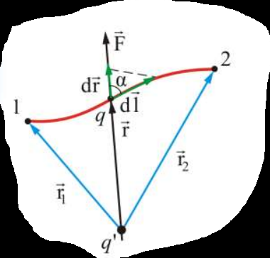

**Что вообще изображено.** Внизу чёрная точка — заряд $q'$, источник поля, он неподвижен. Вверху красная кривая — произвольная траектория, по которой пробный заряд $q$ ползёт из точки 1 (слева) в точку 2 (справа). Буква $q$ подписана у середины кривой — это и есть «ползущий» заряд в текущий момент.

**Что означает каждая стрелка:**

| стрелка | цвет | что это |
|---|---|---|
| $\vec r_1$ | синяя, из $q'$ в точку 1 | радиус-вектор начального положения; его длина $r_1$ — начальное расстояние до источника |
| $\vec r_2$ | синяя, из $q'$ в точку 2 | радиус-вектор конечного положения, длина $r_2$ |
| $\vec r$ | чёрная, из $q'$ в текущее положение $q$ | текущий радиус-вектор, длина $r$ — та самая переменная, по которой мы интегрируем |
| $\vec F$ | чёрная, вверх, продолжает $\vec r$ | сила, с которой поле действует на заряд $q$. **Направлена вдоль $\vec r$ от источника** — значит на рисунке заряды одноимённые и отталкиваются |
| $d\vec l$ | зелёная, по касательной к красной кривой | элементарное перемещение — маленький шажок вдоль траектории |
| $d\vec r$ | зелёная, вдоль $\vec r$ | проекция шажка на направление радиуса, то есть на сколько заряд реально удалился |
| $\alpha$ | угол с пунктирной дужкой | угол между $\vec F$ (то есть $\vec r$) и $d\vec l$ |

**Главное, что нужно увидеть на картинке:** $d\vec r$ короче, чем $d\vec l$, и связаны они как катет с гипотенузой: $dr = dl\cos\alpha$. Вот и вся формула вывода — она буквально нарисована.

**Чего на рисунке не хватает** (дорисуй карандашом, на экзамене это спасает):

- **Нет второй составляющей перемещения** — той, что перпендикулярна $\vec r$ (движение «по дуге» вокруг $q'$). Дорисуй пунктирный отрезок от конца $d\vec r$ до конца $d\vec l$ — получится прямоугольный треугольник. Тогда сразу видно: гипотенуза $d\vec l$ раскладывается на катет вдоль радиуса ($d\vec r$, работа есть) и катет поперёк радиуса (работа ноль).
- **Не указаны знаки зарядов.** Раз $\vec F$ направлена от $q'$ наружу, рисунок молча предполагает, что $q$ и $q'$ одного знака. Стоит подписать оба плюсами.
- **Не показано, что $\vec F \uparrow\uparrow \vec r$** — то есть что кулоновская сила центральная. Это ключ ко всему выводу, и его нужно проговаривать вслух.
- **Нет стрелки направления обхода** на красной кривой: подразумевается движение из 1 в 2, стрелку лучше поставить.

### Интеграл — построчно

Подставляем силу Кулона $F = \dfrac{qq'}{4\pi\varepsilon_0 r^2}$ и замену $dl\cos\alpha = dr$:

$$dA = \frac{qq'}{4\pi\varepsilon_0 r^2}\ dr$$

Обрати внимание: **в выражении не осталось ни $\alpha$, ни $dl$** — только $r$ и $dr$. Кривая исчезла, осталась одна переменная. Дальше суммируем все кусочки:

$$A_{12} = \int_{r_1}^{r_2}\frac{qq'}{4\pi\varepsilon_0 r^2}\ dr$$

Константы выносим, остаётся табличный интеграл $\int \dfrac{dr}{r^2} = -\dfrac{1}{r}$:

$$A_{12} = \frac{qq'}{4\pi\varepsilon_0}\left(-\frac{1}{r}\right)\Bigg|_{r_1}^{r_2} = \frac{qq'}{4\pi\varepsilon_0}\left(-\frac{1}{r_2} + \frac{1}{r_1}\right) = \frac{qq'}{4\pi\varepsilon_0}\left(\frac{1}{r_1} - \frac{1}{r_2}\right)$$

**Проверка знака.** Пусть оба заряда положительны и заряд удаляется: $r_2 > r_1$, значит $\frac{1}{r_1} > \frac{1}{r_2}$, и $A_{12} > 0$. Правильно — одноимённые заряды отталкиваются, поле само толкает заряд наружу и совершает положительную работу. Если заряд приближать, работу придётся совершать нам, а поле сработает в минус.

**Проверка на замкнутом пути.** Вернулись в исходную точку: $r_2 = r_1$, скобка обнуляется, $A = 0$. Это и есть будущая теорема о циркуляции — она уже здесь, в готовом виде.

### Консервативность и потенциальность — что это за слова

Оба слова означают одно и то же свойство, просто одно относится к силе, другое к полю:

| термин | к чему относится | что означает |
|---|---|---|
| **консервативная сила** | к силе | работа не зависит от пути; по замкнутому контуру равна нулю |
| **потенциальное поле** | к полю | у него есть потенциальная энергия / потенциал |

Связь простая: раз работа зависит только от концов пути, ей можно сопоставить **функцию точки** — энергию $W(r)$, разность значений которой и даёт работу. Если бы работа зависела от дороги, такую функцию было бы не определить: в одну и ту же точку можно было бы прийти с разным «запасом», и величина стала бы неоднозначной.

**Житейская аналогия.** Подъём в гору: набранная высота зависит только от того, откуда и куда ты пришёл, а не от того, по какой тропе. Сила тяжести консервативна. А вот трение — нет: чем длиннее дорога, тем больше потерь, и «функцию точки» для трения не построишь.

Кулон и тяготение вообще похожи как близнецы — оба $\sim 1/r^2$, оба центральные, поэтому оба консервативны. Именно закон $1/r^2$ дал в интеграле аккуратное $1/r$.

**И ещё, про суперпозицию.** Мы доказали всё для *одного* точечного заряда $q'$. Для системы зарядов поле складывается, значит складываются и работы каждого — а сумма величин, не зависящих от пути, тоже от пути не зависит. Поэтому вывод верен для **любой** системы неподвижных зарядов.

### Что такое циркуляция

Слово звучит страшно, значит простое: **циркуляция — это сумма проекций поля на путь, набранная при обходе замкнутого контура**.

$$\oint \vec E\ d\vec l$$

Кружок на интеграле — путь замкнут (тот же значок, что и в билете 4, только там была замкнутая поверхность, а тут замкнутая линия).

**Физический смысл величины.** Это работа, которую поле совершает над **единичным** положительным зарядом, протащенным по контуру и вернувшимся в начало. Она же — мера «закрученности» поля: если поле гоняет заряд по кругу, циркуляция не ноль.

Отсюда название свойства: циркуляция равна нулю — значит поле **безвихревое**, гонять заряд по кругу оно не умеет.

### Доказательство — по шагам

Формально всё уже доказано выше (замкнутый путь, $r_1 = r_2$, значит $A = 0$), но в билете просят стандартный вывод «через два пути». Он общий: не опирается на точечный заряд, а только на факт независимости работы от пути.

**Шаг 1. Единичный заряд.** Берём $q = 1$. Тогда $\vec F = q\vec E = \vec E$, и работа прямо равна $dA = \vec E\ d\vec l$ — без лишних множителей. Общность не теряется, это просто удобная нормировка.

**Шаг 2. Режем контур.** Отмечаем на замкнутом контуре две точки, 1 и 2. Контур распался на два куска: верхний назовём $a$, нижний $b$. Обход контура целиком = пройти $1a2$, потом $2b1$.

**Шаг 3. Работы по двум путям равны.** И путь $a$, и путь $b$ ведут из 1 в 2. Работа от формы пути не зависит — значит

$$\int_{1a2}\vec E\ d\vec l = \int_{1b2}\vec E\ d\vec l$$

**Шаг 4. Разворачиваем второй путь.** Пройти $b$ от 2 к 1 — это то же самое, что пройти его от 1 к 2, но каждый $d\vec l$ смотрит в обратную сторону, все скалярные произведения меняют знак:

$$\int_{2b1}\vec E\ d\vec l = -\int_{1b2}\vec E\ d\vec l$$

Подставляя в равенство шага 3:

$$\int_{1a2}\vec E\ d\vec l = -\int_{2b1}\vec E\ d\vec l$$

**Шаг 5. Складываем.** Переносим правую часть налево:

$$\int_{1a2}\vec E\ d\vec l + \int_{2b1}\vec E\ d\vec l = 0$$

Но слева — это и есть обход всего контура: сначала по $a$ туда, потом по $b$ обратно. То есть

$$\oint \vec E\ d\vec l = 0$$

**Где именно использована физика?** Только в шаге 3. Всё остальное — арифметика знаков. Поэтому на вопрос «на чём основано доказательство» правильный ответ: **на независимости работы кулоновских сил от формы пути**.

### Разбор рисунка «контур, разбитый на два пути»

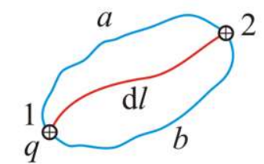

**Что вообще изображено.** Синяя замкнутая кривая — произвольный контур, по которому таскают заряд. Форма нарочно «кривая и некрасивая»: подчёркивается, что контур любой. На нём отмечены две точки — 1 (слева внизу) и 2 (справа вверху), обе нарисованы кружком с плюсом. Рядом с точкой 1 подписан заряд $q$ — тот, который перемещают.

**Что означает каждый элемент:**

| элемент | что это |
|---|---|
| точки 1 и 2 | две произвольные точки, которыми контур разрезан на две части |
| синяя дуга $a$ (верхняя) | первый путь из 1 в 2 |
| синяя дуга $b$ (нижняя) | второй путь из 1 в 2 |
| красная линия внутри | ещё один, третий произвольный путь между теми же точками — напоминание, что работа по нему будет такой же |
| $dl$ | элементарный участок пути, из таких кусочков набирается интеграл |
| кружок с плюсом | знак заряда: он положительный |

**Главное, что нужно увидеть:** дуги $a$ и $b$ по отдельности — это два *разных* пути из 1 в 2 (по ним работы равны), а вместе они составляют *один замкнутый контур*. Вся хитрость доказательства — в переходе от первого взгляда ко второму.

**Чего на рисунке не хватает** (обязательно дорисуй):

- **Нет стрелок направления обхода.** Именно смена направления на пути $b$ даёт минус в шаге 4, а на картинке этого не видно. Поставь стрелку на дуге $a$ от 1 к 2, а на дуге $b$ — от 2 к 1. Тогда сразу видно, что вместе они дают один обход петли по кругу.
- **Не нарисовано само поле $\vec E$.** Теорема верна для *любого* электростатического поля, поэтому конкретный источник на картинке и не подразумевается. Дорисовать можно двумя способами:
    - *быстрый (чтобы увидеть подынтегральное выражение).* На красной линии, рядом с подписью $dl$, поставь остриё по касательной в сторону точки 2 — это $d\vec l$. Из той же точки проведи вторую стрелку наискосок, в произвольную сторону, и подпиши $\vec E$; между ними — дужка с углом $\alpha$. Повтори ещё в двух местах: на верхней дуге $a$ (посередине, под самой буквой $a$) и на нижней дуге $b$ (справа внизу, над буквой $b$). Рядом подпиши $\vec E\ d\vec l = E\ dl\cos\alpha$ — это и есть то, что складывает интеграл.
    - *понятный (чтобы увидеть, почему получается ноль).* Нарисуй **вне контура**, слева внизу от точки 1, точечный заряд $+Q$ — источник поля, и проведи от него веером 3–4 пунктирные силовые линии, пересекающие петлю. Теперь $\vec E$ в любой точке контура направлен вдоль такой линии, прочь от $Q$. Сразу видно: идя по дуге $a$ из 1 в 2, заряд в среднем удаляется от $Q$ и поле совершает положительную работу; возвращаясь по дуге $b$ из 2 в 1, он приближается, и работа такая же по модулю, но отрицательная. Сумма — ноль.
- **Не показано, что $dl$ — это вектор.** В интеграле стоит $d\vec l$, направленный по касательной к пути; на рисунке подписана только длина участка.

### Почему замкнутых силовых линий не бывает

Хорошее рассуждение «от противного», его любят спрашивать.

Допустим, силовая линия электростатического поля замкнулась в петлю. Пойдём по ней в качестве контура. В каждой точке $\vec E$ направлен **по касательной к линии** (это определение силовой линии), то есть вдоль $d\vec l$, значит $\vec E\ d\vec l = E\ dl > 0$ везде.

Сумма строго положительных величин положительна, значит $\oint \vec E\ d\vec l > 0$. Противоречие с теоремой. Следовательно, замкнутых линий у электростатического поля нет: каждая начинается на плюсе и заканчивается на минусе (или уходит в бесконечность).

**Заодно — про вечный двигатель.** Если бы циркуляция была не нулевой, можно было бы гонять заряд по кругу и снимать работу на каждом витке, ничего не тратя. Теорема о циркуляции — это, по сути, запрет такого устройства для электростатики.

### Где эта теорема перестаёт работать

Важная оговорка, чтобы потом не запутаться: теорема доказана **для электростатики** — то есть для поля неподвижных зарядов.

Как только появляется переменное магнитное поле, оно порождает электрическое поле совсем другой природы — **вихревое**. У него силовые линии замкнуты, циркуляция отлична от нуля и связана со скоростью изменения магнитного потока, а потенциал ввести нельзя. Это будет дальше по курсу; сейчас достаточно знать, что слово «электростатическое» в формулировке стоит не для красоты.

### Две теоремы про поле E — как они делят обязанности

К этому моменту у нас есть две «глобальные» теоремы про $\vec E$, и их полезно держать рядом:

| | теорема Гаусса | теорема о циркуляции |
|---|---|---|
| что интегрируем | поток через замкнутую **поверхность** | проекцию поля на замкнутую **линию** |
| формула | $\oint_S E_n\ dS = \dfrac{q_{\text{внутр}}}{\varepsilon_0}$ | $\oint \vec E\ d\vec l = 0$ |
| о чём говорит | у поля есть **источники** — заряды | у поля нет **вихрей** |
| образ | линии откуда-то начинаются и где-то кончаются | линии не закольцовываются |

Вместе эти два утверждения полностью описывают электростатическое поле — это две из четырёх будущих формул Максвелла. Хороший ответ на экзамене эту связку упоминает.

### Что дальше

Работа $A_{12} = \dfrac{qq'}{4\pi\varepsilon_0}\left(\dfrac{1}{r_1} - \dfrac{1}{r_2}\right)$ уже имеет вид «разность двух значений одной функции». Осталось эту функцию назвать по имени — потенциальной энергией $W = \dfrac{qq'}{4\pi\varepsilon_0 r}$, поделить на пробный заряд и получить потенциал $\varphi$. Ровно это и происходит в билете 7.

---

## Разбор 7. Энергия и потенциал электростатического поля

### Зачем нужен этот билет

В билете 6 мы выяснили: работа кулоновских сил не зависит от пути. Это разрешение ввести **энергию**. Сейчас мы этим разрешением пользуемся.

Дальше происходит ровно тот же фокус, что в билете 2. Тогда была сила $\vec F$ — она зависела от того, какой заряд мы принесли; мы поделили её на этот заряд и получили $\vec E$ — характеристику самого поля. Сейчас есть энергия $W$ — она тоже зависит от принесённого заряда; делим на него и получаем $\varphi$ — тоже характеристику самого поля.

| | «зависит от пробного заряда» | «характеристика поля» | связь |
|---|---|---|---|
| силовое описание | сила $\vec F$ | напряжённость $\vec E$ | $\vec E = \dfrac{\vec F}{q_{\text{пр}}}$ |
| энергетическое описание | энергия $W$ | потенциал $\varphi$ | $\varphi = \dfrac{W}{q_{\text{пр}}}$ |

Верхняя строка — билеты 2–5. Нижняя — этот билет. В билете 8 мы свяжем два столбца между собой.

### Откуда берётся формула для энергии — построчно

**Шаг 1. Что значит «потенциальная энергия».** В механике так называют величину, убыль которой равна работе:

$$A_{12} = W_1 - W_2$$

Читается: работа = «сколько энергии было» минус «сколько осталось». Заряд скатывается — запас тратится на работу.

**Шаг 2. Смотрим на готовый ответ билета 6.**

$$A_{12} = \frac{qq'}{4\pi\varepsilon_0 r_1} - \frac{qq'}{4\pi\varepsilon_0 r_2}$$

Сравни две строчки. Слева от минуса стоит что-то, зависящее только от $r_1$, справа — то же самое с $r_2$. Значит

$$W_1 = \frac{qq'}{4\pi\varepsilon_0 r_1}, \qquad W_2 = \frac{qq'}{4\pi\varepsilon_0 r_2}$$

то есть в любой точке

$$W = \frac{1}{4\pi\varepsilon_0}\frac{qq'}{r}$$

**Никакого нового интегрирования не понадобилось** — мы просто *опознали* в ответе билета 6 разность двух значений одной функции. Именно ради этого шага и доказывалась независимость от пути.

### Почему пишут «+ const» и что такое «ноль на бесконечности»

В шаге 2 есть лазейка: если к $W_1$ и к $W_2$ прибавить одно и то же число, разность не изменится. Поэтому честная запись такая:

$$W = \frac{1}{4\pi\varepsilon_0}\frac{qq'}{r} + \text{const}$$

Константа не определяется физикой — её выбираем мы. Договорились: при $r \to \infty$ (заряды бесконечно далеко, не взаимодействуют) энергия равна нулю. Подставляем $r = \infty$: первое слагаемое обнуляется само, значит $\text{const} = 0$.

**Аналогия.** Высота над уровнем моря. Разность высот между двумя этажами — объективна, её можно измерить рулеткой. А сама «высота» зависит от того, откуда считать: от пола, от моря, от центра Земли. Выбор уровня отсчёта ни на что физически не влияет — важны только разности. С энергией и потенциалом ровно так же.

### Что означает знак энергии

Формула $W = \dfrac{qq'}{4\pi\varepsilon_0 r}$ знак берёт из произведения $qq'$:

- **Одноимённые заряды** ($qq' > 0$): $W > 0$. Они отталкиваются; чтобы сблизить их, надо поработать, и энергия при сближении растёт. При $r \to 0$ энергия уходит в $+\infty$.
- **Разноимённые** ($qq' < 0$): $W < 0$. Они притягиваются; чтобы растащить их, надо поработать, и энергия растёт при удалении — от большого отрицательного значения к нулю.

**Проверка здравым смыслом:** система «устойчива» там, где энергия минимальна. Для разноимённых зарядов минимум — при малом $r$, они и правда слипаются. Для одноимённых минимум — на бесконечности, они и правда разбегаются. Формула не врёт.

### Что такое потенциал

Энергия $W$ неудобна тем же, чем была неудобна сила: она про **пару** зарядов. Принесли другой пробный заряд — получили другое число, хотя поле не изменилось. Лечится делением:

$$\varphi = \frac{W}{q_{\text{пр}}}$$

Теперь пробный заряд сократился, и осталась чистая характеристика точки поля. Словами: **потенциал численно равен энергии, которой обладал бы в этой точке единичный положительный заряд.**

Обратное прочтение той же формулы используется даже чаще:

$$W = q\varphi$$

«Энергия заряда = заряд × потенциал точки, где он находится».

> **Осторожно с обозначениями.** В исходном PDF в этом месте написано $\varphi = W/q'$, хотя в билете 6 буквой $q'$ обозначен **заряд-источник** поля. Это опечатка по смыслу: делить надо на **пробный** заряд. Я пишу $q_{\text{пр}}$, чтобы не путаться.

### Потенциал точечного заряда — откуда

Просто подставляем. Поле создаёт заряд $q$, пробный заряд $q_{\text{пр}}$ находится на расстоянии $r$:

$$\varphi = \frac{W}{q_{\text{пр}}} = \frac{1}{q_{\text{пр}}}\cdot\frac{1}{4\pi\varepsilon_0}\frac{q\ q_{\text{пр}}}{r} = \frac{1}{4\pi\varepsilon_0}\frac{q}{r}$$

Пробный заряд сократился — как и было задумано.

**Сравни с полем того же заряда:** $E \sim \dfrac{1}{r^2}$, а $\varphi \sim \dfrac{1}{r}$. Потенциал убывает медленнее. Это не случайность: $E$ — это скорость изменения $\varphi$, а производная от $1/r$ как раз даёт $-1/r^2$ (билет 8).

### Вольт — что это за единица

$$[\varphi] = \frac{[\text{энергия}]}{[\text{заряд}]} = \frac{\text{Дж}}{\text{Кл}} = \text{В (вольт)}$$

**1 вольт** — это такой потенциал, при котором заряд в 1 Кл обладает энергией 1 Дж. Розетка на 220 В означает: каждый кулон заряда, пройдя от одного контакта к другому, отдаёт 220 Дж.

### Суперпозиция: почему с потенциалом работать проще

Потенциалы складываются **как обычные числа, со своими знаками**:

$$\varphi = \sum_k \varphi_k = \frac{1}{4\pi\varepsilon_0}\sum_k \frac{q_k}{r_k}$$

Никаких проекций, косинусов и параллелограммов — в этом вся выгода скалярной величины. Вспомни билет 3: чтобы найти $\vec E$ кольца, пришлось разбираться, какие составляющие компенсируются. Для потенциала такой возни нет вообще.

**Показательный пример.** Два заряда $+q$ и $-q$ на расстоянии $a$; смотрим в точку ровно посередине между ними.

- *Потенциал:* $\varphi = \dfrac{1}{4\pi\varepsilon_0}\dfrac{q}{a/2} + \dfrac{1}{4\pi\varepsilon_0}\dfrac{-q}{a/2} = 0$.
- *Напряжённость:* оба вектора направлены **в одну сторону** (от плюса к минусу) и складываются: $E = 2\cdot\dfrac{1}{4\pi\varepsilon_0}\dfrac{q}{(a/2)^2} \neq 0$.

Вывод, который любят спрашивать: **$\varphi = 0$ и $E = 0$ — совершенно разные вещи.** Потенциал может обнулиться там, где поле максимально, и наоборот (внутри заряженной сферы из билета 5 поле равно нулю, а потенциал — нет).

### Работа через разность потенциалов

Это главная рабочая формула билета. Берём $A_{12} = W_1 - W_2$ и подставляем $W = q\varphi$:

$$A_{12} = q\varphi_1 - q\varphi_2 = q(\varphi_1 - \varphi_2)$$

Разность $\varphi_1 - \varphi_2$ называется **напряжением** $U$. То самое напряжение, что пишут на батарейках.

Смысл: чтобы посчитать работу поля, не нужно знать ни траекторию, ни поле по дороге — достаточно потенциалов в двух точках. Ради этого потенциал и вводили.

### Эквипотенциальные поверхности

**Определение.** Поверхность, во всех точках которой $\varphi = \text{const}$.

**Почему $\vec E$ ей перпендикулярен — вывод в три строки:**

1. Двигаем заряд вдоль поверхности. Потенциал не меняется: $d\varphi = 0$.
2. Работа $dA = -q\ d\varphi = 0$ — поле не совершает работы.
3. Но $dA = qE_l\ dl$, где $E_l$ — проекция $\vec E$ на направление движения. Раз $dA = 0$ при любом $dl$, то $E_l = 0$: **касательной составляющей у поля нет**. Остаётся только нормальная — значит $\vec E \perp$ поверхности.

**Карта местности — лучшая аналогия для всего билета.** Потенциал $\varphi$ — это высота. Эквипотенциальные поверхности — горизонтали на топографической карте (линии равной высоты). Тогда:

- идти вдоль горизонтали — не тратить сил на подъём (работа поля равна нулю);
- самый крутой спуск всегда **поперёк** горизонтали (вектор $\vec E$ перпендикулярен эквипотенциали);
- где горизонтали **гуще** — там склон круче (поле сильнее);
- «высота» отсчитывается от произвольного уровня, важны только перепады (константа в потенциале).

Эту аналогию стоит держать в голове и на билете 8 — там $\vec E$ окажется в точности «направлением наибыстрейшего спуска».

### Разбор рисунка 1: эквипотенциали точечного заряда

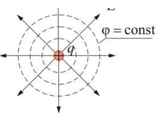

**Что изображено.** В центре красная точка — точечный заряд $q$. Вокруг него две системы линий двух разных типов.

| элемент | что это |
|---|---|
| сплошные прямые стрелки, расходящиеся из центра во все стороны | **силовые линии** поля $\vec E$; стрелки направлены наружу — значит заряд **положительный** |
| пунктирные окружности вокруг заряда | **эквипотенциальные поверхности** (в сечении — окружности, в пространстве — сферы) |
| подпись $\varphi = \text{const}$ | относится к пунктирной окружности: вдоль неё потенциал одинаков |

**Главное, что нужно увидеть:** в каждой точке пересечения пунктир и стрелка образуют **прямой угол**. Это и есть утверждение «$\vec E \perp$ эквипотенциальной поверхности», нарисованное картинкой.

**Чего на рисунке не хватает:**

- **Не подписан знак заряда.** Он положительный (стрелки наружу), но «+» не стоит. Подпиши. И полезно рядом нарисовать вариант для отрицательного заряда: окружности те же самые, а стрелки развёрнуты внутрь.
- **Не показано, что потенциал убывает с расстоянием.** Подпиши окружности изнутри наружу: $\varphi_1 > \varphi_2 > \varphi_3$ — тогда видно, куда «под гору» и почему $\vec E$ направлен именно наружу (в сторону убывания $\varphi$).
- **Не отмечен прямой угол.** Поставь значок $90^\circ$ хотя бы в одном пересечении стрелки с пунктиром — это главный смысл рисунка.
- **Не сказано, что окружности неравномерны.** У точечного заряда поверхности с одинаковым шагом по потенциалу идут гуще вблизи заряда и реже вдали, потому что $\varphi \sim 1/r$. На картинке они нарисованы почти равномерно — это упрощение.
- **Это сечение, а не объём.** Реальные эквипотенциальные поверхности — сферы; окружности получаются, если разрезать картину плоскостью. Стоит проговорить на экзамене.

### Разбор рисунка 2: эквипотенциали диполя

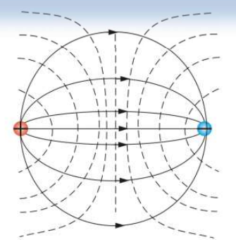

**Что изображено.** Два разноимённых заряда: слева красный, справа синий. Это картина поля **диполя** (подробно — билет 9).

| элемент | что это |
|---|---|
| сплошные дугообразные линии со стрелками | силовые линии $\vec E$; они выходят из левого заряда и входят в правый — значит **слева $+q$, справа $-q$** |
| пунктирные кривые | эквипотенциальные поверхности |
| стрелки на сплошных линиях | направление поля: всегда от плюса к минусу |

**Главное:** пунктир снова пересекает сплошные линии под прямым углом — свойство работает и для сложного поля, не только для точечного заряда.

**Чего на рисунке не хватает:**

- **Не подписаны знаки зарядов.** Их приходится угадывать по направлению стрелок. Подпиши «+» слева и «−» справа.
- **Нет обозначения, где что.** Ни подписи «силовые линии», ни «$\varphi = \text{const}$» — в отличие от первого рисунка. Подпиши оба семейства.
- **Не проведена плоскость нулевого потенциала.** Ровно посередине между зарядами есть плоскость (на рисунке — вертикальная прямая), где $\varphi = 0$, потому что вклады $+q$ и $-q$ равны по модулю и противоположны по знаку. При этом поле там **не** равно нулю и максимально. Это любимый экзаменационный вопрос, а на картинке этой линии нет — дорисуй её и подпиши $\varphi = 0$.
- **Нет знаков потенциала по областям.** Слева от средней линии $\varphi > 0$, справа $\varphi < 0$. Подпиши.
- **Не отмечен прямой угол** в пересечениях — как и на первом рисунке.

### Что дальше

У нас теперь два описания одного и того же поля: векторное ($\vec E$) и скалярное ($\varphi$). Логичный следующий вопрос — как перевести одно в другое. Ответ ($\vec E = -\mathrm{grad}\ \varphi$) — билет 8. Аналогия с картой уже всё подсказала: поле есть направление и крутизна самого быстрого спуска с «горы потенциала».

---

## Разбор 8. Связь между напряжённостью и потенциалом

### Зачем нужен этот билет

У нас теперь два описания одного и того же поля:

- **силовое** — вектор $\vec E$ (билеты 2–5): куда и с какой силой поле толкает заряд;
- **энергетическое** — число $\varphi$ (билет 7): сколько энергии запасено в данной точке.

Это как описывать одну и ту же местность двумя способами: «здесь склон крутой, вниз и направо» или «здесь высота 300 метров». Оба описания полны, но говорят на разных языках. Билет 8 — **словарь-переводчик** между ними.

Практическая ценность огромна: считать скаляр $\varphi$ намного проще, чем вектор $\vec E$ (складывать числа против сложения векторов). Поэтому в реальных задачах сначала находят $\varphi$, а потом получают $\vec E$ из него.

### Что такое производная — если совсем с нуля

В формуле стоит $\dfrac{d\varphi}{dl}$. Это **скорость изменения**: на сколько изменится потенциал, если сдвинуться на маленький шажок, делённое на длину шажка.

$$\frac{d\varphi}{dl} = \frac{\text{насколько изменился } \varphi}{\text{насколько сдвинулись}}$$

**Числовой пример.** Сдвинулись на 2 мм и потенциал упал с 10 В до 6 В. Тогда

$$\frac{d\varphi}{dl} = \frac{6 - 10\ \text{В}}{0{,}002\ \text{м}} = -2000\ \frac{\text{В}}{\text{м}}$$

Минус — потому что потенциал *упал*. А напряжённость получается $E_l = -(-2000) = +2000$ В/м, то есть положительная и направленная туда, куда мы шли. Логично: поле толкает положительный заряд «под гору».

Запомни главное: **производная — это крутизна**. Круто падает — большое поле. Не меняется — поля нет.

### Вывод связи — построчно

Идея: **записать одну и ту же работу двумя способами и приравнять**. Приём, который в физике встречается постоянно.

**Способ 1 — через силу (механика).** Работа = сила × перемещение, но берётся только составляющая силы вдоль движения:

$$dA = F_l\ dl$$

Сила на заряд со стороны поля $\vec F = q\vec E$, её проекция $F_l = qE_l$. Значит

$$dA = qE_l\ dl$$

**Способ 2 — через энергию (билет 7).** Работа равна убыли потенциальной энергии, $dA = -dW$. Энергия заряда в поле $W = q\varphi$, заряд не меняется, поэтому

$$dA = -q\ d\varphi$$

*Откуда минус:* работа совершается за счёт запаса энергии — поле поработало, значит энергии стало меньше. Подробнее это разобрано в билете 7.

**Приравниваем.** Работа одна и та же, записана по-разному:

$$qE_l\ dl = -q\ d\varphi$$

**Сокращаем $q$.** Заряд стоит в обеих частях — делим на него. Это принципиально: результат **не зависит от того, какой заряд мы носили**, значит связь между $E$ и $\varphi$ — свойство самого поля, а не пробного заряда.

$$E_l\ dl = -d\varphi \implies \boxed{E_l = -\frac{d\varphi}{dl}}$$

### Что означает «проекция на любое направление»

$E_l$ — это не весь вектор $\vec E$, а только его тень на выбранное направление. Формула утверждает: **какое направление ни выбери, проекция поля на него равна скорости убывания потенциала вдоль него.**

Отсюда два важных частных случая:

- Идём **вдоль эквипотенциальной поверхности**: $\varphi$ не меняется, $d\varphi = 0$, значит $E_l = 0$. Касательной составляющей нет — $\vec E$ перпендикулярен поверхности. (В билете 7 мы получили это же через работу; здесь тот же вывод одной строкой.)
- Идём **поперёк**, в сторону самого быстрого падения $\varphi$: там $|d\varphi/dl|$ максимален, проекция максимальна — а максимальна проекция вектора тогда, когда мы смотрим вдоль него самого. Значит это и есть направление $\vec E$.

### Частная производная — что означает значок ∂

В трёхмерном случае потенциал зависит от трёх координат: $\varphi(x, y, z)$. Значок $\partial$ (круглое «д») означает: **дифференцируем по одной переменной, две другие держим замороженными**.

$\dfrac{\partial\varphi}{\partial x}$ — «насколько быстро меняется потенциал, если шагать строго вдоль оси $x$, не сходя с неё по $y$ и $z$».

Никакой новой математики: это обычная производная, просто остальные буквы временно считаются константами. Взяв три такие производные, мы узнаём скорость изменения $\varphi$ по трём направлениям — а этого достаточно, чтобы собрать вектор:

$$\vec E = E_x\vec i + E_y\vec j + E_z\vec k = -\left(\frac{\partial\varphi}{\partial x}\vec i + \frac{\partial\varphi}{\partial y}\vec j + \frac{\partial\varphi}{\partial z}\vec k\right)$$

Здесь $\vec i, \vec j, \vec k$ — орты, единичные векторы вдоль осей; они нужны только чтобы указать «эта часть смотрит вдоль $x$, эта вдоль $y$».

### Что такое градиент

Выражение в скобках и называется градиентом:

$$\mathrm{grad}\ \varphi = \nabla\varphi = \frac{\partial\varphi}{\partial x}\vec i + \frac{\partial\varphi}{\partial y}\vec j + \frac{\partial\varphi}{\partial z}\vec k$$

Значок $\nabla$ («набла») — просто другое обозначение того же самого.

**Словами:** градиент — вектор, который показывает, **в какую сторону функция растёт быстрее всего**, а его длина равна скорости этого роста.

**На карте местности** (продолжаем аналогию билета 7): стоишь на склоне, $\varphi$ — высота. Градиент — стрелка «самый крутой подъём»: куда идти, чтобы набирать высоту быстрее всего. Чем круче склон, тем стрелка длиннее. На ровной площадке градиент равен нулю.

**Почему градиент всегда перпендикулярен линиям уровня.** Вдоль горизонтали высота не меняется — в этом направлении роста нет вообще. Значит «направление самого быстрого роста» обязано быть поперёк горизонтали. Отсюда и $\vec E \perp$ эквипотенциальной поверхности — теперь это не отдельный факт, а свойство градиента.

### Почему минус — три способа объяснить

1. **Формально:** он пришёл из $dA = -q\ d\varphi$, то есть из того, что работа равна *убыли* энергии.
2. **По смыслу:** градиент смотрит **вверх** по потенциалу, а поле толкает положительный заряд **вниз** — туда, где энергии меньше. Направления противоположны, минус их разворачивает.
3. **Проверкой на картинке:** у положительного заряда потенциал максимален вблизи него и падает наружу. Градиент, значит, направлен внутрь, к заряду. А силовые линии — наружу. Действительно противоположны.

Аналогия: камень на склоне катится в сторону, **противоположную** направлению подъёма. $\vec E$ — это «куда покатится положительный заряд», $\mathrm{grad}\ \varphi$ — «где подъём». Отсюда минус.

### Обратный переход: от поля к потенциалу

Формулу $E_l = -\dfrac{d\varphi}{dl}$ можно перевернуть: $d\varphi = -E_l\ dl$. Суммируя (интегрируя) по пути от точки 1 до точки 2:

$$\varphi_1 - \varphi_2 = \int_1^2 \vec E\ d\vec l$$

Итого связь двусторонняя:

| знаем | хотим | действие |
|---|---|---|
| $\varphi$ | $\vec E$ | продифференцировать: $\vec E = -\mathrm{grad}\ \varphi$ |
| $\vec E$ | $\varphi_1 - \varphi_2$ | проинтегрировать вдоль любого пути |

Слово «любого» здесь работает благодаря билету 6: интеграл не зависит от пути, иначе такая формула была бы бессмысленной.

### Проверка на точечном заряде — построчно

Лучший способ убедиться, что формула верна: применить её к тому, что мы уже знаем.

Потенциал точечного заряда (билет 7): $\varphi = \dfrac{1}{4\pi\varepsilon_0}\dfrac{q}{r}$.

Поле направлено радиально, поэтому берём производную по $r$. Нужна производная функции $\dfrac{1}{r} = r^{-1}$; по правилу $(r^n)' = n r^{n-1}$ получаем $(r^{-1})' = -r^{-2} = -\dfrac{1}{r^2}$. Тогда

$$E_r = -\frac{d\varphi}{dr} = -\frac{q}{4\pi\varepsilon_0}\cdot\left(-\frac{1}{r^2}\right) = \frac{1}{4\pi\varepsilon_0}\frac{q}{r^2}$$

Ровно поле точечного заряда из билета 2. **Два минуса сократились** — один из формулы связи, другой из производной. Связь работает.

### Однородное поле: формула $E = U/d$

Между обкладками плоского конденсатора поле однородно ($E$ = const), и потенциал меняется равномерно. Тогда производную можно заменить простым отношением:

$$E = \frac{\varphi_1 - \varphi_2}{d} = \frac{U}{d}$$

где $d$ — расстояние между обкладками, $U$ — напряжение. Это самая используемая на практике форма связи (и заодно объяснение, почему $\vec E$ измеряют в вольтах на метр). Пригодится в билетах про конденсаторы.

### $\varphi = 0$ и $E = 0$ — не одно и то же

Частая путаница, разберём таблицей:

| ситуация | потенциал | поле | почему |
|---|---|---|---|
| посередине между $+q$ и $-q$ | $\varphi = 0$ | $E \neq 0$, максимально | вклады в $\varphi$ гасятся (числа с разными знаками), а векторы $\vec E$ смотрят в одну сторону и складываются |
| внутри заряженной сферы | $\varphi \neq 0$, постоянен | $E = 0$ | потенциал есть, но он **не меняется** — а поле зависит только от изменения |
| очень далеко от зарядов | $\varphi \to 0$ | $E \to 0$ | оба убывают |

Главный вывод: **поле определяется не значением потенциала, а скоростью его изменения.** Постоянный потенциал любой величины даёт нулевое поле — ровно как ровная площадка на любой высоте не заставляет мяч катиться.

### Про картинки

В исходном PDF к этому билету рисунков нет. Если на экзамене захочется что-то нарисовать, бери картинку эквипотенциалей точечного заряда из билета 7 и показывай на ней:

- пунктирные окружности — линии уровня $\varphi$;
- стрелки наружу — вектор $\vec E$;
- $\mathrm{grad}\ \varphi$ — такие же стрелки, но развёрнутые **внутрь**, к заряду (их на рисунке нет — дорисуй, это прямо иллюстрирует минус в формуле);
- прямой угол между стрелкой и пунктиром — следствие того, что градиент перпендикулярен линиям уровня.

### Что дальше

Связь $\vec E = -\mathrm{grad}\ \varphi$ — не украшение, а рабочий инструмент. Уже в билете 9 поле диполя находят именно так: сначала считают потенциал (просто, потому что скаляр), потом дифференцируют. Прямое векторное сложение там было бы заметно тяжелее.

---

## Разбор 9. Электрический диполь. Поле и потенциал

### Зачем нужен этот билет

До сих пор мы считали поля «геометрических» объектов: точки, кольца, нити, плоскости. Диполь — первый объект, который взят **из природы**.

Молекула воды устроена так, что центр её положительных зарядов не совпадает с центром отрицательных: получается крошечная пара «плюс–минус». То же самое происходит с любой нейтральной молекулой, попавшей во внешнее поле, — её электронное облако чуть смещается, и молекула становится диполем. Именно поэтому вся теория диэлектриков (билеты 20–26) построена на диполях, а этот билет — фундамент под ней.

Второй смысл билета — **тренировка приёма**: считаем скалярный потенциал (это просто), а поле получаем из него дифференцированием (билет 8). Прямое векторное сложение здесь было бы заметно тяжелее.

### Что такое диполь и зачем условие $r \gg l$

Диполь — это два заряда, $+q$ и $-q$, одинаковые по модулю, на маленьком расстоянии $l$ друг от друга.

Слово «маленькое» надо понимать относительно: $l$ мало **по сравнению с расстоянием до точки, где мы считаем поле**. Это записывают как $r \gg l$.

**Зачем это нужно?** Вблизи диполя никакой «системы» нет — есть просто два заряда, и поле каждого считается отдельно. Диполь как единый объект появляется только издалека: оттуда пара выглядит точкой, у которой есть одна-единственная характеристика — момент $\vec p$. Все формулы билета верны **только** при $r \gg l$.

**Аналогия.** Издалека вращающийся вентилятор — просто «крутящийся круг»; вблизи видны отдельные лопасти, и описание кругом уже не работает.

### Плечо и дипольный момент

- **Плечо** $\vec l$ — вектор от минуса к плюсу. Его длина — расстояние между зарядами.
- **Дипольный момент** $\vec p = q\vec l$ — то же направление, но длина умножена на величину заряда.

**Почему момент, а не просто заряд и расстояние?** Потому что во все формулы $q$ и $l$ входят **только вместе, в виде произведения**. Диполь из зарядов 2 нКл на расстоянии 1 мм создаёт вдали ровно такое же поле, как диполь из 1 нКл на 2 мм. Различить их снаружи невозможно, значит и хранить два числа незачем — достаточно их произведения.

**Направление «от минуса к плюсу»** — просто соглашение, но важно его не путать: **внутри** диполя силовые линии идут наоборот, от плюса к минусу. То есть $\vec p$ и $\vec E$ между зарядами направлены противоположно.

Единица: $[p] = \text{Кл}\cdot\text{м}$.

### Разбор рисунка 1: сам диполь

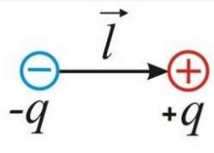

**Что изображено.** Простейшая схема: слева синий кружок со знаком «−» и подписью $-q$, справа красный кружок со знаком «+» и подписью $+q$. Между ними чёрная стрелка, подписанная $\vec l$ и направленная **от минуса к плюсу**.

**Чего на рисунке не хватает:**

- **Нет самого вектора $\vec p$** — а он главный герой билета. Дорисуй вторую стрелку рядом, вдоль той же линии, подпиши $\vec p = q\vec l$.
- **Нет точки наблюдения и расстояния $r$.** Из рисунка никак не видно главного условия $r \gg l$. Поставь где-нибудь далеко справа точку и проведи к ней $r$, заметно длиннее $l$.
- **Не отмечен центр диполя.** Все расстояния в формулах ($r$, $\vartheta$) отсчитываются от середины между зарядами, а середина не обозначена.
- **Не нарисованы силовые линии.** Полезно помнить, что между зарядами поле идёт **против** $\vec p$ — это видно, только если линии нарисованы.

### Почему сначала считают потенциал

Можно было бы сложить два вектора $\vec E_+$ и $\vec E_-$ — но это значит раскладывать их на составляющие, возиться с углами и косинусами.

Потенциал — скаляр (билет 7): два числа складываются со своими знаками, и всё. Поэтому порядок действий такой:

1. складываем потенциалы двух зарядов → получаем $\varphi$;
2. дифференцируем по правилу билета 8 → получаем $\vec E$.

Это и есть главная выгода от введения потенциала, ради которой писались билеты 7 и 8.

### Вывод потенциала — построчно

**Шаг 1. Складываем два потенциала.** Пусть до точки наблюдения от плюса расстояние $r_+$, от минуса $r_-$:

$$\varphi = \varphi_+ + \varphi_- = \frac{1}{4\pi\varepsilon_0}\frac{q}{r_+} + \frac{1}{4\pi\varepsilon_0}\frac{(-q)}{r_-} = \frac{q}{4\pi\varepsilon_0}\left(\frac{1}{r_+} - \frac{1}{r_-}\right)$$

Обрати внимание: минус появился **сам**, из знака заряда. Мы просто подставили $-q$.

**Шаг 2. Приводим к общему знаменателю.**

$$\frac{1}{r_+} - \frac{1}{r_-} = \frac{r_- - r_+}{r_+ r_-}$$

Теперь всё зависит от двух вещей: **разности** расстояний и их **произведения**. Дальше обе оценим приближённо.

**Шаг 3. Разность расстояний.** Это ключевое место, разберём отдельно ниже:

$$r_- - r_+ \approx l\cos\vartheta$$

**Шаг 4. Произведение расстояний.** Точка далеко, поэтому $r_+ \approx r_- \approx r$, где $r$ — расстояние от **центра** диполя:

$$r_+ r_- \approx r^2$$

Здесь мы «грубим» сознательно: разницей между $r_+$, $r_-$ и $r$ можно пренебречь в произведении (оно большое), но **нельзя** пренебречь в разности — там как раз вся физика, и если положить $r_- - r_+ = 0$, получится $\varphi = 0$, то есть ничего.

> **Правило, которое стоит запомнить:** в разности близких величин приближать нельзя, в сумме и произведении — можно.

**Шаг 5. Собираем.**

$$\varphi = \frac{q}{4\pi\varepsilon_0}\cdot\frac{l\cos\vartheta}{r^2} = \frac{1}{4\pi\varepsilon_0}\frac{p\cos\vartheta}{r^2}$$

где мы подставили $ql = p$. Готово.

### Откуда берётся $l\cos\vartheta$ — геометрия шага 3

Смотри на рисунок ниже. Из точки $+q$ опускаем **перпендикуляр** на прямую $r_-$ (пунктирная линия на рисунке).

Так как точка наблюдения очень далеко, лучи $r_+$ и $r_-$ идут в неё почти **параллельно**. Значит перпендикуляр отрезает от $r_-$ ровно тот «лишний кусочек», на который $r_-$ длиннее $r_+$:

$$r_- - r_+ = \text{этот кусочек}$$

А кусочек — катет маленького прямоугольного треугольника, у которого гипотенуза равна $l$, а прилежащий угол равен $\vartheta$. По определению косинуса:

$$\text{катет} = l\cos\vartheta$$

Вот и всё. **Вся аппроксимация билета живёт в одном пунктирном отрезке на рисунке.**

**Проверка на частных случаях:**

- $\vartheta = 0$ (смотрим вдоль оси со стороны плюса): $\cos 0 = 1$, разность максимальна и равна $l$. Логично — плюс к нам ближе всего.
- $\vartheta = 90^\circ$ (смотрим сбоку): $\cos 90^\circ = 0$, разность нулевая. Логично — оба заряда равноудалены, и потенциал равен нулю.
- $\vartheta = 180^\circ$ (со стороны минуса): $\cos 180^\circ = -1$, потенциал отрицателен. Тоже логично.

### Разбор рисунка 2: к расчёту потенциала

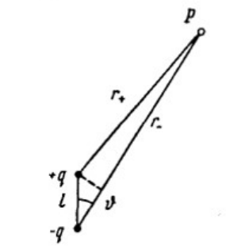

**Что изображено.** Вверху справа кружок с подписью $P$ — точка наблюдения. Внизу вертикально расположен диполь: сверху чёрная точка $+q$, снизу чёрная точка $-q$, между ними отрезок, подписанный $l$.

| элемент | что это |
|---|---|
| линия от $+q$ к $P$, подпись $r_+$ | расстояние от положительного заряда до точки наблюдения |
| линия от $-q$ к $P$, подпись $r_-$ | расстояние от отрицательного заряда до точки наблюдения |
| дужка с буквой $\vartheta$ | угол между осью диполя и направлением на точку $P$ |
| **короткий пунктирный отрезок** от $+q$ к линии $r_-$ | перпендикуляр — самая важная линия на рисунке |

**Как читать пунктир.** Он делит $r_-$ на две части: нижняя часть равна $r_+$ (потому что лучи почти параллельны), а верхняя — это и есть разность $r_- - r_+ = l\cos\vartheta$. Треугольник «$+q$ — $-q$ — основание перпендикуляра» прямоугольный, гипотенуза $l$, угол $\vartheta$.

**Чего на рисунке не хватает:**

- **Не подписан сам отрезок $l\cos\vartheta$.** Пунктир нарисован, но не назван — рисунок «немой». Подпиши его обязательно, иначе на экзамене не объяснишь, откуда взялся косинус.
- **Нет значка прямого угла** в месте, где пунктир упирается в $r_-$. Без него неочевидно, что это перпендикуляр.
- **Не нарисован вектор $\vec p$** и не отмечен центр диполя.
- **Нет расстояния $r$.** В итоговой формуле стоит именно $r$ — от **центра** диполя до $P$, а на рисунке есть только $r_+$ и $r_-$. Проведи третью линию из середины отрезка $l$ в точку $P$ и подпиши $r$.
- **Рисунок врёт по масштабу.** Углы между $r_+$ и $r_-$ на нём заметные, а по условию $r \gg l$ они должны быть почти неразличимы. Держи в голове: настоящая точка $P$ намного дальше, чем нарисовано.

### Почему потенциал убывает как $1/r^2$, а не как $1/r$

У одиночного заряда $\varphi \sim 1/r$. У диполя — $1/r^2$, то есть быстрее. Причина простая:

**полный заряд диполя равен нулю.** $(+q) + (-q) = 0$. Издалека диполь выглядит нейтральным, и его поле «почти» исчезает. Остаётся не сам вклад зарядов, а лишь **разность** двух почти одинаковых вкладов — а разность близких величин всегда мала.

Формально это видно в выводе: множитель $\dfrac{r_- - r_+}{r_+r_-}$ дал одну степень $r$ в знаменателе от произведения и ещё одну — из-за того, что разность в числителе не растёт с расстоянием (она равна $l\cos\vartheta$ и от $r$ вообще не зависит).

Та же логика объясняет и поле: $E \sim 1/r^3$, ещё на порядок быстрее, потому что поле — производная потенциала, а дифференцирование $1/r^2$ даёт $1/r^3$.

| объект | потенциал | поле |
|---|---|---|
| точечный заряд | $\sim 1/r$ | $\sim 1/r^2$ |
| диполь | $\sim 1/r^2$ | $\sim 1/r^3$ |

### Как вообще находят поле диполя: две составляющие

Потенциал мы уже вывели:

$$\varphi = \frac{1}{4\pi\varepsilon_0}\frac{p\cos\vartheta}{r^2}$$

Он зависит от **двух** величин — от расстояния $r$ и от угла $\vartheta$. Значит, из точки наблюдения можно «уехать» двумя независимыми способами, и потенциал по ним меняется по-разному:

- **отойти дальше** от диполя, не меняя угла → меняется $r$;
- **обойти диполь по дуге**, не меняя расстояния → меняется $\vartheta$.

Поэтому вектор $\vec E$ раскладывают на две взаимно перпендикулярные части: **радиальную** $E_r$ (вдоль луча) и **касательную** $E_\vartheta$ (перпендикулярно лучу). К каждой применяем правило билета 8: *проекция поля на направление = скорость убывания потенциала вдоль него.*

**Радиальная составляющая.** Шагаем вдоль луча, угол заморожен:

$$E_r = -\frac{\partial\varphi}{\partial r}$$

Считаем производную. Записываем $\dfrac{1}{r^2} = r^{-2}$ и применяем правило $(r^n)' = nr^{n-1}$:

$$\frac{\partial}{\partial r}\left(r^{-2}\right) = -2r^{-3} = -\frac{2}{r^3}$$

Подставляем (минус из формулы на минус из производной дают плюс):

$$E_r = -\frac{p\cos\vartheta}{4\pi\varepsilon_0}\cdot\left(-\frac{2}{r^3}\right) = \frac{1}{4\pi\varepsilon_0}\frac{2p\cos\vartheta}{r^3}$$

**Касательная составляющая.** Здесь есть тонкость, из-за которой чаще всего ошибаются. Мы поворачиваемся на угол $d\vartheta$ — но в формулу билета 8 надо подставлять **пройденный путь**, а не угол. Точка, стоящая на расстоянии $r$, при повороте на $d\vartheta$ проходит дугу длиной

$$dl = r\ d\vartheta$$

(длина дуги = радиус × угол в радианах). Отсюда лишнее $r$ в знаменателе:

$$E_\vartheta = -\frac{\partial\varphi}{\partial l} = -\frac{1}{r}\frac{\partial\varphi}{\partial\vartheta}$$

Производная $\dfrac{\partial(\cos\vartheta)}{\partial\vartheta} = -\sin\vartheta$, снова минус на минус:

$$E_\vartheta = -\frac{p}{4\pi\varepsilon_0 r^2}\cdot\frac{1}{r}\cdot(-\sin\vartheta) = \frac{1}{4\pi\varepsilon_0}\frac{p\sin\vartheta}{r^3}$$

**Всё, поле диполя найдено.** Дальше «три случая» билета — это просто подстановка конкретного угла, никаких новых выводов там нет.

| | $E_r$ (вдоль луча) | $E_\vartheta$ (поперёк луча) |
|---|---|---|
| общая формула | $\dfrac{2p\cos\vartheta}{4\pi\varepsilon_0 r^3}$ | $\dfrac{p\sin\vartheta}{4\pi\varepsilon_0 r^3}$ |
| $\vartheta = 0$ — на оси | максимальна | ноль |
| $\vartheta = 90^\circ$ — сбоку | ноль | максимальна |

Обрати внимание: **двойка живёт только в радиальной составляющей**. Всё различие между «полем на оси» и «полем сбоку» сводится к ней.

### Относительно чего раскладываем — и как отметить это на рисунке

Самое путаное место билета. Разберём по пунктам.

**Правило одно.** Раскладываем всегда относительно **луча «центр диполя → точка наблюдения»**. Этот луч и есть направление $r$ из формул.

- **радиальная** составляющая — вдоль этого луча (от диполя или к диполю);
- **касательная** — перпендикулярно ему.

Ни ось диполя, ни края листа, ни «вертикаль с горизонталью» тут ни при чём. Провела луч из центра диполя в свою точку — вот тебе и обе оси.

**Почему тогда в случае Б говорят «вертикальные» и «горизонтальные» составляющие?** Только потому, что там луч $r$ нарисован вертикально. Это особенность картинки, а не правило:

| случай | куда смотрит луч $r$ | радиальное направление | касательное направление |
|---|---|---|---|
| А — точка на оси | вдоль оси диполя, вправо | горизонтальное | вертикальное |
| Б — точка на перпендикуляре | вверх, поперёк оси | вертикальное | горизонтальное |
| В — произвольная точка | под углом $\vartheta$ к оси | вдоль луча | поперёк луча |

**Отдельно про слова — тут легко попасться.** В названиях случаев PDF пишет «поле продольное» и «поле поперечное» — это про то, **где стоит точка наблюдения** (на оси диполя или на перпендикуляре к ней). А «радиальная и касательная составляющие» — про то, **как мы разбираем один вектор в одной точке**. Два разных смысла у похожих слов. Поэтому вторую составляющую мы называем **касательной**, а не «поперечной».

**Как отметить составляющие на рисунке — по шагам** (на примере случая Б, рисунок 4):

1. Найди на рисунке **центр диполя** $O$ — середину между зарядами, там, где кончается подпись $l/2$.
2. Проведи из $O$ луч в точку наблюдения $A$. На рисунке 4 он уже есть — это вертикальная линия, подписанная $r$.
3. Через точку $A$ проведи **две пунктирные прямые**: одну как продолжение луча (это радиальная ось), вторую перпендикулярно ему (касательная ось). Получилась маленькая система координат с началом в $A$.
4. Из конца вектора $\vec E_+$ опусти перпендикуляры на обе оси — получишь две его проекции. То же самое проделай с $\vec E_-$.
5. Сравни **радиальные** проекции: они равны по длине и смотрят в противоположные стороны (одна от диполя, другая к нему). Перечеркни их — они гасятся.
6. **Касательные** проекции обе смотрят в одну сторону, от плюса к минусу. Обведи их и сложи — это и есть $\vec E_\perp$.

В случае А делать нечего: там оба вектора лежат **точно на луче**, поэтому касательных проекций нет вообще, а радиальные направлены навстречу друг другу и вычитаются.

### Почему в одном месте составляющие гасятся, а в другом складываются по Пифагору

Очень частая путаница: «в случае Б радиальные составляющие гасят друг друга, а в случае В радиальная и касательная складываются как катеты — они же перпендикулярны, как так?»

Ответ: слово «перпендикулярны» в этих двух местах относится к **разным парам векторов**.

**Считаем, что вообще складываем.** В точке наблюдения есть **два поля** — от плюса и от минуса. Каждое раскладывается на **одни и те же две оси**. Получается четыре кусочка:

| кусочек | на какой оси лежит |
|---|---|
| радиальная часть $\vec E_+$ | радиальная ось |
| радиальная часть $\vec E_-$ | **та же** радиальная ось |
| касательная часть $\vec E_+$ | касательная ось |
| касательная часть $\vec E_-$ | **та же** касательная ось |

Отсюда всё и становится понятно: **гасятся не «перпендикулярные» кусочки, а те, что лежат на одной оси.** Радиальная часть $\vec E_+$ и радиальная часть $\vec E_-$ — два вектора на **одной прямой**, направленные навстречу. Они друг другу не перпендикулярны, они антипараллельны — поэтому и вычитаются.

А перпендикулярны — **оси между собой**. Поэтому итоговые $E_r$ и $E_\vartheta$ (уже суммарного поля) собираются по теореме Пифагора, как катеты.

**Правильный порядок действий:**

1. Каждый заряд даёт свой вектор поля.
2. Раскладываем оба вектора на одни и те же две оси.
3. **Складываем вдоль каждой оси отдельно.** Здесь что-то гасится, что-то удваивается. Результат — $E_r$ и $E_\vartheta$ уже **суммарного** поля.
4. **Только теперь** соединяем $E_r$ и $E_\vartheta$ по Пифагору: $E = \sqrt{E_r^2 + E_\vartheta^2}$.

Шаг 3 — сложение **параллельных** векторов, это обычная арифметика со знаками. Шаг 4 — сложение **перпендикулярных**, это корень из суммы квадратов. Две разные операции, их и путают.

**Проверка на случае Б.** Шаг 3 даёт $E_r = 0$ (радиальные погасились) и $E_\vartheta = \dfrac{p}{4\pi\varepsilon_0 r^3}$. Шаг 4:

$$E = \sqrt{0^2 + E_\vartheta^2} = E_\vartheta$$

Пифагор никуда не делся — просто один катет нулевой. Случай Б есть в точности случай В при $\vartheta = 90^\circ$, противоречия нет.

**А почему в случае В шагов 1–3 не видно?** Потому что там мы считали не суперпозицией, а через потенциал. Оба заряда были сложены ещё на этапе $\varphi$ (там складывались просто числа), поэтому дифференцирование сразу выдало $E_r$ и $E_\vartheta$ **суммарного** поля. Шаги 1–3 произошли внутри формулы, и осталось выполнить только шаг 4.

Это, кстати, ещё один аргумент в пользу метода потенциала: он избавляет от возни с проекциями каждого заряда по отдельности.

### Случай А: поле на оси диполя ($\vartheta = 0$)

Подставляем $\cos 0 = 1$, $\sin 0 = 0$:

- касательная составляющая обращается в нуль — поле лежит точно вдоль луча, то есть вдоль оси диполя;
- радиальная даёт

$$E_\parallel = \frac{1}{4\pi\varepsilon_0}\frac{2p}{r^3}$$

**Откуда двойка?** Из показателя степени: дифференцируя $1/r^2$, мы «сносим вниз» двойку. Больше ей взяться неоткуда — это не какая-то физическая двойка, а чисто математическая.

**Направление.** Вдоль $\vec p$. На пальцах: если смотреть с той стороны, где плюс, то плюс к нам ближе, его поле сильнее, и суммарное поле направлено прочь от плюса — туда же, куда смотрит $\vec p$. В векторном виде:

$$\vec E_\parallel = \frac{1}{4\pi\varepsilon_0}\frac{2\vec p}{r^3}$$

**Проверка вторым способом — прямым сложением полей.** Полезно уметь, потому что могут спросить «а без потенциала?».

Точка на оси, справа от диполя. До плюса расстояние $r - l/2$, до минуса $r + l/2$. Оба поля лежат на одной прямой и направлены в противоположные стороны, поэтому модули вычитаются:

$$E = \frac{q}{4\pi\varepsilon_0}\left[\frac{1}{(r - l/2)^2} - \frac{1}{(r + l/2)^2}\right]$$

Приводим к общему знаменателю. Числитель — разность квадратов:

$$(r + l/2)^2 - (r - l/2)^2 = \big[(r + l/2) - (r - l/2)\big]\cdot\big[(r + l/2) + (r - l/2)\big] = l\cdot 2r = 2rl$$

Знаменатель при $r \gg l$ приближённо равен $r^2\cdot r^2 = r^4$. Итого:

$$E = \frac{q}{4\pi\varepsilon_0}\cdot\frac{2rl}{r^4} = \frac{1}{4\pi\varepsilon_0}\frac{2ql}{r^3} = \frac{1}{4\pi\varepsilon_0}\frac{2p}{r^3}$$

Тот же ответ. Но обрати внимание, насколько дольше — а ведь это ещё самый простой из трёх случаев. Ради этого мы и вводили потенциал.

### Разбор рисунка 3: поле на оси

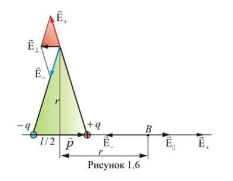

**Внимание: на этом рисунке совмещены сразу два случая** — продольный (внизу справа, точка $B$) и поперечный (вверху, вершина зелёного треугольника). Это главная ловушка картинки; разбирай их отдельно.

**Нижняя, продольная часть:**

| элемент | что это |
|---|---|
| горизонтальная линия | ось диполя |
| синий кружок $-q$ слева, красный $+q$ справа | сами заряды |
| подпись $l/2$ | половина плеча: от заряда до центра диполя |
| чёрная стрелка $\vec p$ вправо | дипольный момент, от минуса к плюсу |
| двусторонняя стрелка $r$ внизу | расстояние от **центра** диполя до точки $B$ |
| точка $B$ | точка наблюдения на оси |
| стрелка $\vec E_-$, направленная **влево** | поле отрицательного заряда: он притягивает, поэтому вектор смотрит на него |
| стрелка $\vec E_+$, направленная **вправо**, длинная | поле положительного заряда: он отталкивает, и он ближе, поэтому вектор длиннее |
| стрелка $\vec E_\parallel$, направленная **вправо**, короче $\vec E_+$ | результат: $E_\parallel = E_+ - E_-$ |

**Верхняя часть** (зелёный треугольник с вершиной над центром) — это уже случай Б, разбор ниже.

**Чего на рисунке не хватает:**

- **Не разделены два случая.** В обоих подписано одно и то же $r$, хотя это разные точки наблюдения. Лучше перерисовать двумя отдельными картинками.
- **Не показано вычитание.** Видно, что $\vec E_\parallel$ короче $\vec E_+$, но не показано, что разница — это в точности $\vec E_-$. Дорисуй: отложи $\vec E_-$ от конца $\vec E_+$ назад.
- **Не подписаны расстояния до зарядов:** $r - l/2$ до плюса и $r + l/2$ до минуса. Без них непонятно, почему $E_+ > E_-$.
- **Не сказано, что $\vec E_\parallel \uparrow\uparrow \vec p$** — а это и есть ответ на вопрос «куда направлено поле на оси».

### Случай Б: поле на перпендикуляре ($\vartheta = 90^\circ$)

Точка лежит на перпендикуляре к оси, проведённом через центр диполя. Подставляем $\cos 90^\circ = 0$, $\sin 90^\circ = 1$:

- радиальная составляющая обращается в нуль — вдоль луча поле проекции не имеет;
- касательная даёт

$$E_\perp = \frac{1}{4\pi\varepsilon_0}\frac{p}{r^3}$$

**Почему вдвое слабее, чем на оси?** Потому что двойка сидела в радиальной составляющей, а здесь работает касательная, где её нет. Никакой глубокой физики — просто разные производные.

**Ловушка: $\varphi = 0$, а поле есть.** При $\vartheta = 90^\circ$ косинус нулевой, значит потенциал во всей этой плоскости равен нулю. Но поле — не ноль! Мы это разбирали в билетах 7 и 8: поле определяется не значением потенциала, а **скоростью его изменения**. Вдоль плоскости $\varphi$ не меняется (везде ноль) — значит это **эквипотенциальная поверхность**, и поле, по правилу билета 8, ей перпендикулярно. То есть $\vec E$ направлен вдоль оси диполя. Заметь: перпендикулярность поля к этой плоскости мы получили, вообще ничего не вычисляя.

**Куда именно направлен вектор — проверка сложением.** Оба заряда удалены на одно и то же расстояние $\approx r$, поэтому модули их полей равны:

$$|\vec E_+| = |\vec E_-| = \frac{q}{4\pi\varepsilon_0 r^2}$$

Раскладываем оба вектора на составляющие:

- **радиальные**, вдоль луча $r$ (на этом рисунке луч вертикален, поэтому они вертикальные): у $\vec E_+$ вверх, у $\vec E_-$ вниз, модули равны — **гасятся**;
- **касательные**, поперёк луча (здесь — горизонтальные): обе направлены от плюса к минусу — **складываются**.

Каждая касательная составляющая равна $E_\pm\sinlpha$, где $lpha$ — угол при вершине треугольника, между лучом $r$ и направлением на заряд. Из прямоугольного треугольника «точка наблюдения — центр — заряд»: противолежащий катет равен $l/2$, гипотенуза $pprox r$, поэтому $\sinlpha = \dfrac{l/2}{r}$. Складываем две:

$$E_\perp = 2\cdot\frac{q}{4\pi\varepsilon_0 r^2}\cdot\frac{l/2}{r} = \frac{1}{4\pi\varepsilon_0}\frac{ql}{r^3} = \frac{1}{4\pi\varepsilon_0}\frac{p}{r^3}$$

Тот же ответ, и вдобавок видно направление: **от плюса к минусу**, то есть против $\vec p$. Отсюда минус в векторной записи:

$$\vec E_\perp = -\frac{1}{4\pi\varepsilon_0}\frac{\vec p}{r^3}$$

**Итог двух случаев:** на оси поле вдвое сильнее и направлено **по** $\vec p$; сбоку — вдвое слабее и направлено **против** $\vec p$.

### Разбор рисунка 4: поперечное поле

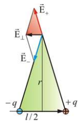

**Что изображено.** Внизу горизонтально лежит диполь: синий кружок $-q$ слева, красный $+q$ справа, между ними подпись $l/2$ (от заряда до центра). Из центра вверх идёт вертикальная линия, подписанная $r$, — до точки наблюдения (вершина зелёного треугольника). В вершине построены три вектора:

| стрелка | что это |
|---|---|
| красная $\vec E_+$ вверх (с наклоном влево) | поле положительного заряда, направлено **прочь** от него |
| синяя $\vec E_-$ вниз (с наклоном влево) | поле отрицательного заряда, направлено **к** нему |
| чёрная $\vec E_\perp$ горизонтально **влево** | результат сложения — направлен от плюса к минусу, то есть против $\vec p$ |

Зелёный треугольник — просто вспомогательный: его стороны показывают направления на заряды, а высота равна $r$.

**Чего на рисунке не хватает:**

- **Не показано разложение на составляющие** — а это вся суть случая. Дорисуй пунктиром у $\vec E_+$ и $\vec E_-$ их вертикальные и горизонтальные проекции, и вертикальные перечеркни: они гасятся. Горизонтальные останутся, обе влево.
- **Нет вектора $\vec p$.** Он лежит вдоль основания и направлен вправо. Без него не видно, что $\vec E_\perp$ ему **антипараллелен** — а это ответ на главный вопрос по картинке.
- **Не отмечено, что $|\vec E_+| = |\vec E_-|$.** Именно равенство модулей обеспечивает компенсацию вертикальных составляющих; на рисунке стрелки нарисованы разной длины, что сбивает.
- **Не подписано, что вся эта плоскость — эквипотенциальная**, с $\varphi = 0$. Подпиши: тогда сразу понятно, почему $\vec E$ ей перпендикулярен.

### Случай В: произвольная точка

Здесь работают **обе** составляющие сразу. Они взаимно перпендикулярны (одна вдоль луча, другая поперёк него), поэтому модуль полного вектора находится по теореме Пифагора:

$$E = \sqrt{E_r^2 + E_\vartheta^2}$$

Подставляем:

$$E = \sqrt{\left(\frac{2p\cos\vartheta}{4\pi\varepsilon_0 r^3}\right)^2 + \left(\frac{p\sin\vartheta}{4\pi\varepsilon_0 r^3}\right)^2}$$

Общий множитель $\dfrac{p}{4\pi\varepsilon_0 r^3}$ выносим из-под корня:

$$E = \frac{p}{4\pi\varepsilon_0 r^3}\sqrt{4\cos^2\vartheta + \sin^2\vartheta}$$

Осталось упростить подкоренное выражение. Пользуемся основным тригонометрическим тождеством $\sin^2\vartheta = 1 - \cos^2\vartheta$:

$$4\cos^2\vartheta + \sin^2\vartheta = 4\cos^2\vartheta + 1 - \cos^2\vartheta = 3\cos^2\vartheta + 1$$

Окончательно:

$$E = \frac{p}{4\pi\varepsilon_0 r^3}\sqrt{3\cos^2\vartheta + 1}$$

**Проверка — она же лучший способ запомнить формулу:**

| угол | корень | результат | совпадает с |
|---|---|---|---|
| $\vartheta = 0$ (на оси) | $\sqrt{3\cdot 1 + 1} = 2$ | $E = \dfrac{2p}{4\pi\varepsilon_0 r^3}$ | случай А ✓ |
| $\vartheta = 90^\circ$ (сбоку) | $\sqrt{0 + 1} = 1$ | $E = \dfrac{p}{4\pi\varepsilon_0 r^3}$ | случай Б ✓ |

Значит А и Б — не три разные формулы, а **одна формула в двух точках**. На экзамене это стоит показать: выглядит убедительно и экономит запоминание.

Видно и то, что поле меняется с углом не сильно: между «сбоку» и «на оси» разница всего вдвое. А вот потенциал при $\vartheta = 90^\circ$ обращается **в ноль** — потенциал реагирует на угол куда резче, чем поле.

**Направление в общем случае** ни с чем не совпадает: вектор $\vec E$ не смотрит ни вдоль $\vec p$, ни вдоль $r$, а куда-то между. Его наклон к лучу задаётся отношением составляющих:

$$\tan\alpha = \frac{E_\vartheta}{E_r} = \frac{\sin\vartheta}{2\cos\vartheta} = \frac{1}{2}\tan\vartheta$$

Эту формулу учить не нужно, но полезно понимать, что направление поля вычисляется, а не угадывается.

### Разбор рисунка 5: поле в произвольной точке

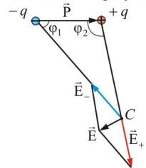

**Что изображено.** Вверху диполь: слева синий $-q$, справа красный $+q$, между ними стрелка дипольного момента (на рисунке подписана заглавной $\vec P$). Справа внизу — точка наблюдения $C$. К ней проведены две длинные прямые: одна от $-q$, другая от $+q$. Углы $\varphi_1$ (при $-q$) и $\varphi_2$ (при $+q$) — углы между осью диполя и направлениями на точку $C$.

Из точки $C$ построены три вектора:

| стрелка | направление | что это |
|---|---|---|
| синяя $\vec E_-$ | вверх-влево, вдоль линии на $-q$ | поле отрицательного заряда — направлено **к** нему |
| красная $\vec E_+$ | вниз-вправо, по продолжению линии от $+q$ | поле положительного заряда — направлено **прочь** от него |
| чёрная $\vec E$ | вниз-влево | результат: диагональ параллелограмма, построенного на $\vec E_-$ и $\vec E_+$ |

Тонкие чёрные линии вокруг векторов — стороны этого параллелограмма (правило параллелограмма из билета 2).

**Чего на рисунке не хватает и что на нём путает:**

- **Опасное обозначение.** Углы подписаны буквой $\varphi$ ($\varphi_1$, $\varphi_2$), хотя во всём остальном билете $\varphi$ — это **потенциал**. Держи в голове, что здесь это углы, и на экзамене лучше переобозначь их, например $\alpha_1$ и $\alpha_2$.
- **Момент подписан заглавной $\vec P$**, а в формулах он строчный $\vec p$. Разные буквы для одного и того же — источник путаницы.
- **Нет угла $\vartheta$ из формулы!** В формуле стоит угол между $\vec p$ и направлением на точку **из центра диполя**, а на рисунке нарисованы два других угла — при каждом заряде. Дорисуй линию из середины диполя в точку $C$, подпиши её $r$ и отметь угол $\vartheta$ между ней и $\vec p$. Без этого формула и рисунок не стыкуются.
- **Не показано, что $|\vec E_+| > |\vec E_-|$** (плюс на рисунке ближе к $C$) — а именно из-за этого результат «завален» в сторону $\vec E_+$.
- **Не подписано, что $\vec E$ вообще не смотрит ни на один из зарядов** — направление результирующего поля в произвольной точке ни с чем не совпадает, это нормально.

### Сводка по билету

| что | формула | как убывает |
|---|---|---|
| дипольный момент | $\vec p = q\vec l$, от «−» к «+» | — |
| потенциал | $\varphi = \dfrac{1}{4\pi\varepsilon_0}\dfrac{p\cos\vartheta}{r^2}$ | $1/r^2$ |
| поле на оси ($\vartheta = 0$) | $\vec E_\parallel = \dfrac{1}{4\pi\varepsilon_0}\dfrac{2\vec p}{r^3}$, по $\vec p$ | $1/r^3$ |
| поле сбоку ($\vartheta = 90^\circ$) | $\vec E_\perp = -\dfrac{1}{4\pi\varepsilon_0}\dfrac{\vec p}{r^3}$, против $\vec p$ | $1/r^3$ |
| поле в общем случае | $E = \dfrac{p}{4\pi\varepsilon_0 r^3}\sqrt{3\cos^2\vartheta + 1}$ | $1/r^3$ |

### Что дальше

Сейчас мы смотрели, **какое поле создаёт диполь**. В билете 10 — обратная задача: **что внешнее поле делает с диполем** (поворачивает, втягивает, запасает в нём энергию). Вместе эти два билета и составляют всю «механику» диполя.

---

## Разбор 10. Сила, момент и энергия диполя во внешнем поле

### Зачем нужен этот билет

Билет 9 отвечал на вопрос «какое поле создаёт диполь». Билет 10 — **обратная задача**: диполь попал в чужое поле, что с ним произойдёт?

Вопросов ровно три, и билет отвечает на них по очереди:

1. **Потянет ли его куда-нибудь?** → сила $\vec F$;
2. **Повернёт ли его?** → момент $\vec M$;
3. **Сколько энергии в нём запасено и какое положение выгодно?** → энергия $W$.

Практическая ценность огромна: именно это происходит с миллиардами молекул-диполей, когда диэлектрик вносят в поле. Вся теория поляризации (билеты 20–26) — это билет 10, применённый к множеству молекул сразу.

### Вопрос 1: сила. Почему в однородном поле её нет

На плюс поле действует силой $\vec F_+ = q\vec E_+$ — вдоль поля. На минус — силой $\vec F_- = -q\vec E_-$, то есть **против** поля (минус в формуле разворачивает вектор).

Если поле **однородно**, то в обеих точках оно одинаковое: $\vec E_+ = \vec E_-= \vec E$. Тогда

$$\vec F = q\vec E - q\vec E = 0$$

Два одинаковых по модулю и противоположных вектора дают ноль. Диполь никуда не поедет.

**Глубинная причина:** суммарный заряд диполя равен нулю, а однородное поле «чувствует» только полный заряд. Нет заряда — нет силы.

### Вопрос 1 (продолжение): откуда берётся сила в неоднородном поле

Если поле меняется в пространстве, заряды сидят в **разных по силе** полях, и компенсации не выходит.

**Вывод построчно.** Пусть диполь вытянут вдоль направления $l$, вдоль которого поле меняется. Минус стоит в точке, где поле равно $E$, плюс — на расстоянии $l$ дальше, где поле уже другое:

$$E_+ = E + \Delta E, \qquad \Delta E = \frac{\partial E}{\partial l}\cdot l$$

(это обычная запись «изменение = скорость изменения × пройденный путь»). Складываем силы:

$$F = qE_+ - qE_- = q(E + \Delta E) - qE = q\ \Delta E = q\ l\ \frac{\partial E}{\partial l}$$

Подставляем $ql = p$:

$$F = p\frac{\partial E}{\partial l}$$

**Читаем результат.** Сила пропорциональна не самому полю, а **скорости его изменения**. В однородном поле производная равна нулю — и сила исчезает, как и должно быть. Это хорошая проверка формулы.

**Куда тянет?** Туда, где поле сильнее. Проверить легко: тот из зарядов, который оказался в более сильном поле, испытывает бо́льшую силу, и она перевешивает. Диполь при этом успевает сначала развернуться по полю (момент действует быстрее), а развёрнутый диполь всегда втягивается в область сильного поля.

**Классический опыт.** Наэлектризованная расчёска притягивает мелкие бумажки, хотя они нейтральны. Механизм двухступенчатый:

1. поле расчёски превращает молекулы бумаги в диполи (наводит дипольный момент);
2. поле расчёски **неоднородно** (у края оно сильнее), поэтому наведённые диполи втягиваются к расчёске.

Без неоднородности притяжения бы не было — бумажки просто повернулись бы и остались на месте.

### Разбор рисунка 1: диполь в неоднородном поле

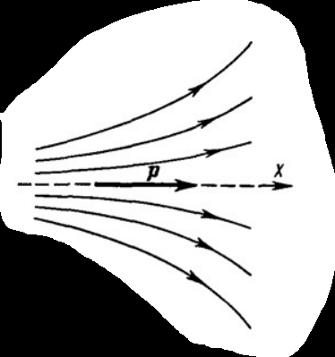

**Что изображено.** Пучок силовых линий внешнего поля. Слева они идут **тесно**, почти параллельно; вправо **расходятся веером** и становятся всё реже. Стрелки на линиях направлены вправо. По центру проходит пунктирная горизонтальная прямая — ось $x$; на ней жирная чёрная стрелка, подписанная $\vec p$, направленная вправо. Это и есть диполь, уже развёрнутый по полю.

| элемент | что означает |
|---|---|
| густота линий слева | поле там **сильное** |
| разреженность справа | поле там **слабое** |
| стрелки на линиях | направление $\vec E$ — вправо |
| жирная стрелка $\vec p$ | диполь, установившийся по полю ($\vec p \uparrow\uparrow \vec E$) |
| ось $x$ | направление, вдоль которого меняется поле |

**Как читать физику по картинке.** Раз линии редеют вправо, то $E$ убывает с ростом $x$, то есть $\dfrac{\partial E}{\partial x} < 0$. Значит $F = p\dfrac{\partial E}{\partial x} < 0$ — сила направлена **влево**, в сторону густых линий. Диполь втягивается туда, где поле сильнее.

**Чего на рисунке не хватает:**

- **Нет самой силы $\vec F$!** Рисунок иллюстрирует билет про силу, а вектора силы на нём нет. Дорисуй стрелку влево у диполя и подпиши $\vec F$.
- **Не нарисованы заряды диполя.** Видна только стрелка $\vec p$; полезно поставить на её концах «−» слева и «+» справа и показать две разные по длине силы $\vec F_+$ (вправо, короче — плюс в слабом поле) и $\vec F_-$ (влево, длиннее — минус в сильном поле). Тогда сразу видно, почему перевешивает левая.
- **Не подписано, где поле сильнее.** Стоит написать «$E$ больше» слева и «$E$ меньше» справа — картинка станет самоочевидной.
- **Не показан случай, когда диполь развёрнут наоборот.** Если $\vec p$ смотрит влево (против поля), сила меняет знак и диполь выталкивается. Но такое положение неустойчиво, диполь сначала развернётся.

### Вопрос 2: момент сил. Что такое пара сил

**Пара сил** — это две равные по модулю, противоположно направленные силы, линии действия которых **не совпадают**. Сдвинуть тело они не могут (сумма равна нулю), а вот вращать — могут.

Простейший пример: крутишь руль двумя руками — левая тянет вниз, правая вверх. Машина от этого не взлетает и не падает, но руль поворачивается.

Момент пары равен

$$M = F\cdot d$$

где $d$ — **плечо пары**, то есть расстояние между линиями действия сил (а не между точками приложения!). Это ключевой момент, на нём чаще всего ошибаются.

### Вывод формулы момента

Диполь стоит под углом $\alpha$ к полю.

**Шаг 1. Модуль каждой силы.** $F = qE$ (обе силы одинаковы по модулю, так как поле однородно, а заряды равны).

**Шаг 2. Плечо.** Линии действия сил — это две параллельные прямые, проходящие через заряды вдоль $\vec E$. Расстояние между ними находим из прямоугольного треугольника: гипотенуза — сам диполь длиной $l$, а искомое расстояние — катет, противолежащий углу $\alpha$:

$$d = l\sin\alpha$$

**Шаг 3. Собираем:**

$$M = F\cdot d = qE\cdot l\sin\alpha = (ql)E\sin\alpha = pE\sin\alpha$$

**Проверка на крайних случаях:**

| угол | $\sin\alpha$ | момент | смысл |
|---|---|---|---|
| $\alpha = 0$ (по полю) | 0 | $M = 0$ | силы на одной прямой, пары нет — вращать нечем |
| $\alpha = 90^\circ$ (поперёк) | 1 | $M = pE$ — максимум | плечо максимально |
| $\alpha = 180^\circ$ (против поля) | 0 | $M = 0$ | силы снова на одной прямой |

### Что такое векторное произведение

Запись $\vec M = [\vec p\ \vec E]$ — это векторное произведение. Оно задаёт **сразу и модуль, и направление**:

- **модуль** равен произведению модулей на синус угла между ними: $M = pE\sin\alpha$ — ровно то, что мы вывели;
- **направление** перпендикулярно обоим векторам, по правилу правого винта: поворачиваешь $\vec p$ к $\vec E$ по кратчайшему пути — куда пойдёт винт (буравчик), туда и смотрит $\vec M$.

Зачем моменту вообще направление? Оно указывает **ось вращения**. Вектор $\vec M$ торчит перпендикулярно листу, а диполь крутится в плоскости листа вокруг этой оси.

Заметь: синус в векторном произведении появился не случайно — он и есть «непараллельность» векторов. Чем сильнее диполь перекошен относительно поля, тем больше момент.

### Разбор рисунка 2: пара сил

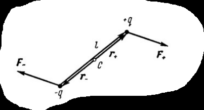

**Что изображено.** Наклонный диполь: внизу слева заряд $-q$, вверху справа заряд $+q$, между ними двойная линия — сам диполь, подписанный $l$. В середине отмечена точка $c$ — центр диполя; отрезки от центра к зарядам подписаны $r_+$ (к плюсу) и $r_-$ (к минусу).

| стрелка | направление | что это |
|---|---|---|
| $\vec F_+$ | вправо, от заряда $+q$ | сила, действующая на положительный заряд, **вдоль** поля |
| $\vec F_-$ | влево, от заряда $-q$ | сила на отрицательном заряде, **против** поля |

Главное, что нужно увидеть: стрелки **антипараллельны и равны по длине** (сумма — ноль), но приложены к разным точкам и лежат на **разных прямых**. Именно поэтому получается пара сил и диполь начинает вращаться — в данном случае против часовой стрелки, стремясь лечь вдоль поля.

**Чего на рисунке не хватает:**

- **Не нарисован вектор внешнего поля $\vec E$!** Силы есть, а поля, которое их создаёт, нет — из рисунка непонятно, откуда взялись стрелки. Проведи горизонтальную стрелку $\vec E$ (силы направлены вдоль неё) и подпиши.
- **Нет вектора $\vec p$.** Подписано только плечо $l$. Дорисуй $\vec p$ вдоль диполя, от минуса к плюсу.
- **Не обозначен угол $\alpha$** между $\vec p$ и $\vec E$ — а он стоит в формуле. Отметь дужкой.
- **Не показано плечо пары $l\sin\alpha$.** Это самое важное для вывода. Проведи через каждый заряд пунктиром прямую вдоль $\vec E$ (линии действия сил) и отметь расстояние между этими двумя прямыми — вот оно, плечо.
- **Нет стрелки направления вращения.** Дорисуй дуговую стрелку вокруг центра $c$, показывающую, куда поворачивается диполь.
- **Обозначения $r_+$ и $r_-$ лишние и путают.** В формуле момента их нет: момент пары считается через расстояние между линиями действия, а не через плечи от центра. К тому же буквой $r$ в билете 9 обозначалось расстояние до точки наблюдения — здесь это совсем другое.

### Вопрос 3: энергия диполя — вывод построчно

**Шаг 1. Энергия двух зарядов во внешнем поле.** Из билета 7 знаем: энергия заряда в точке с потенциалом $\varphi$ равна $W = q\varphi$. У нас два заряда в разных точках:

$$W = (+q)\varphi_+ + (-q)\varphi_- = q(\varphi_+ - \varphi_-)$$

где $\varphi_+$ — потенциал внешнего поля там, где сидит плюс, $\varphi_-$ — там, где сидит минус.

**Шаг 2. Разность потенциалов через поле.** Из билета 8: $\varphi_1 - \varphi_2 = \int\vec E\ d\vec l$. Для однородного поля интеграл превращается в произведение. Идём от минуса к плюсу — это смещение $\vec l$:

$$\varphi_+ - \varphi_- = -\vec E\cdot\vec l = -El\cos\alpha$$

*Откуда минус:* потенциал **убывает** вдоль поля. Если идти по направлению $\vec E$, потенциал становится меньше, значит разность «конец минус начало» отрицательна.

**Шаг 3. Подставляем и вводим $p = ql$:**

$$W = q\cdot(-El\cos\alpha) = -(ql)E\cos\alpha = -pE\cos\alpha$$

В компактной записи это скалярное произведение:

$$W = -(\vec p\ \vec E)$$

### Почему в энергии минус, а в моменте нет

Частый вопрос. Разберём по смыслу.

Минус нужен, чтобы **выгодным было положение «по полю»**. Природа всегда скатывается туда, где энергия меньше. Проверим:

- $\alpha = 0$, диполь по полю: $\cos 0 = 1$, значит $W = -pE$ — **минимум**. Именно сюда диполь и стремится. ✓
- $\alpha = 180^\circ$, диполь против поля: $\cos 180^\circ = -1$, значит $W = +pE$ — **максимум**. Сюда он не хочет. ✓

Если бы минуса не было, всё перевернулось бы и диполь «хотел» бы встать против поля — что противоречит опыту.

В моменте минуса нет, потому что там стоит **синус**, а не косинус: момент максимален как раз посередине между двумя равновесиями, и вопрос «куда выгоднее» решает не он.

### Три положения диполя — сводка

| $\alpha$ | положение | энергия $W$ | момент $M$ | равновесие |
|---|---|---|---|---|
| $0$ | $\vec p \uparrow\uparrow \vec E$, по полю | $-pE$ (минимум) | $0$ | **устойчивое** |
| $90^\circ$ | поперёк поля | $0$ | $pE$ (максимум) | равновесия нет, крутит сильнее всего |
| $180^\circ$ | $\vec p \uparrow\downarrow \vec E$, против поля | $+pE$ (максимум) | $0$ | **неустойчивое** |

**Про два «равновесия».** В обоих крайних положениях момент равен нулю, то есть формально диполь может стоять и так и так. Разница — что будет при малом толчке:

- из положения $\alpha = 0$ момент **вернёт** его обратно (это дно ямы);
- из положения $\alpha = 180^\circ$ момент **утащит** дальше, и диполь перевернётся (это вершина холма).

**Аналогия:** шарик на дне ямы и шарик на макушке горки. И там и там он «стоит», но устойчивость разная. Или проще — компас: стрелка спокойно стоит, указывая на север; поверни её на юг и отпусти — развернётся обратно.

### Связь момента и энергии

Эти две величины — не независимые. Момент есть скорость изменения энергии с углом:

$$M = \left|\frac{dW}{d\alpha}\right| = \left|\frac{d}{d\alpha}\left(-pE\cos\alpha\right)\right| = pE\sin\alpha$$

Получилась ровно формула момента. Смысл тот же, что у связи $\vec E = -\mathrm{grad}\ \varphi$ из билета 8: **сила (здесь — момент) есть крутизна энергетического рельефа**, и она всегда направлена под гору. В билете 8 «под гору» означало «в сторону меньшего потенциала», здесь — «в сторону меньшего угла с полем».

Это хороший ответ на вопрос «а как связаны три части билета»: сила, момент и энергия — три взгляда на одно и то же.

### Где это работает

- **Ориентационная поляризация диэлектриков.** Полярные молекулы (например, вода) — готовые диполи. Без поля они смотрят хаотично, тепловое движение всё перемешивает. Во внешнем поле момент $\vec M$ разворачивает их вдоль $\vec E$, и диэлектрик поляризуется. Это билеты 20–21.
- **Микроволновка.** Переменное поле заставляет молекулы воды непрерывно разворачиваться туда-сюда; трение между молекулами превращает это вращение в тепло.
- **Притяжение нейтральных тел** к заряженным предметам — тот самый опыт с расчёской и бумажками.

### Что дальше

Диполь оказался вторым по важности после точечного заряда объектом. В билете 11 выясняется, что это не совпадение: **поле любой системы зарядов на большом расстоянии** раскладывается в сумму, где первый член — поле полного заряда, второй — поле диполя, и так далее. Диполь — это следующее приближение после точечного заряда.

---

## Разбор 11. Поле системы зарядов на больших расстояниях

### Зачем нужен этот билет

До сих пор мы считали поле «в лоб»: берём все заряды, складываем их потенциалы, получаем ответ. Для двух-трёх зарядов это работает. А если зарядов миллиард — молекула, кристалл, кусок вещества?

Точную сумму никто не посчитает. Но выясняется, что издалека она и не нужна. Если отойти достаточно далеко, вся система схлопывается для наблюдателя в несколько простых чисел:

- сколько в ней заряда всего;
- насколько в ней «+» смещён относительно «−»;
- и дальше — всё более тонкие детали, которые почти не видны.

Билет 11 — про то, как это разложение получается математически. Это один из самых важных приёмов физики: **вместо точного ответа строим ряд приближений, где каждый следующий член меньше предыдущего**, и оставляем столько членов, сколько нужно для точности.

**Аналогия.** Смотришь на город с самолёта. С высоты 10 км видно только светлое пятно — это «монополь», один параметр: город есть, вот такой яркости. Снизился — видно, что север ярче юга: появилась «дипольная» деталь. Ещё ниже — районы, кварталы, отдельные фонари. Каждый следующий уровень детализации виден только с меньшей высоты — ровно как высшие мультиполи «включаются» только вблизи.

### Постановка: что дано и что ищем

Есть $N$ зарядов, набитых в область размером примерно $l$ (это может быть шар, молекула, любая клякса — важен только её масштаб). Мы уходим на расстояние $r$, много большее $l$:

$$r \gg l$$

Это **единственное** условие всего билета. Из него вырастет всё остальное.

Ставим начало координат $O$ где-нибудь внутри системы (где именно — не важно, позже отдельно докажем, что от этого ничего не зависит). Тогда:

| обозначение | что это |
|---|---|
| $\vec r_i$ | радиус-вектор $i$-го заряда: из $O$ в заряд. Короткий, $r_i \lesssim l$ |
| $\vec r$ | радиус-вектор точки наблюдения: из $O$ туда, где мы меряем. Длинный, $r \gg l$ |
| $\vec r - \vec r_i$ | вектор от **заряда** к точке наблюдения — именно это расстояние стоит в законе Кулона |

Стартовая формула — обычная суперпозиция потенциалов (билет 7): каждый заряд создаёт $\dfrac{q}{4\pi\varepsilon_0 R}$, где $R$ — расстояние **от него** до точки:

$$\varphi(r) = \frac{1}{4\pi\varepsilon_0}\sum_{i=1}^{N}\frac{q_i}{|\vec r - \vec r_i|}$$

Никакого приближения здесь ещё нет — формула точная. Плоха она лишь тем, что у каждого заряда своё расстояние в знаменателе, и вынести за скобку ничего нельзя. Вся дальнейшая работа — избавиться от $\vec r_i$ в знаменателе.

### Разбор рисунка 1: система зарядов и точка наблюдения

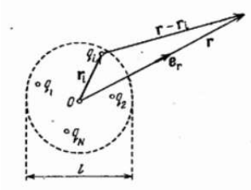

**Что изображено.** Пунктирная окружность — условная граница области, в которой сидят заряды. Внизу двусторонней стрелкой отмечен её размер $l$ (диаметр). Внутри разбросаны кружочки-заряды с подписями $q_1$, $q_2$, $q_N$ и, ближе к верху, $q_i$ — тот, с которым мы работаем. В центре точка $O$ — начало координат. Из $O$ выходят три стрелки.

| стрелка | откуда → куда | что означает |
|---|---|---|
| $\vec r_i$ | из $O$ в заряд $q_i$ | положение заряда; короткая, не длиннее $l/2$ |
| $\vec r$ | из $O$ в точку наблюдения (далеко вправо вверх) | положение точки, где меряем потенциал |
| $\vec e_r$ | из $O$ вдоль $\vec r$ | **единичный** вектор направления на точку наблюдения (длина 1, только показывает, куда смотреть) |
| $\vec r - \vec r_i$ | из заряда $q_i$ в точку наблюдения | то самое расстояние, что стоит в знаменателе Кулона |

**Главное, что надо увидеть на картинке.** Три стрелки — $\vec r$, $\vec r_i$ и $\vec r - \vec r_i$ — образуют треугольник: «из $O$ в заряд, из заряда в точку» даёт то же самое, что «из $O$ сразу в точку». Отсюда и запись $\vec r_i + (\vec r - \vec r_i) = \vec r$.

И второе: стрелки $\vec r$ и $\vec r - \vec r_i$ на рисунке почти параллельны и почти одинаковой длины. Это не случайность художника — это и есть условие $r \gg l$, нарисованное. Именно из-за него дальше можно будет написать приближённое равенство.

**Чего на рисунке не хватает:**

- **Не подписана точка наблюдения.** Стрелки $\vec r$ и $\vec r - \vec r_i$ упираются в правый верхний угол, но там нет ни точки, ни буквы. Поставь жирную точку и подпиши её, например, $P$ (или $A$) — «точка наблюдения».
- **Не показана проекция $r_{ir}$** — а ведь это главная величина вывода! Опусти из конца вектора $\vec r_i$ перпендикуляр на линию $\vec r$: отрезок от $O$ до основания перпендикуляра и есть $r_{ir}$. Без этого построения непонятно, откуда берётся ключевая формула.
- **Не обозначен угол $\vartheta$** между $\vec r_i$ и $\vec r$. Через него проекция записывается как $r_{ir} = r_i\cos\vartheta$.
- **Масштаб обманывает.** На рисунке $r$ всего раза в три больше $l$, а по условию должно быть в сотни. Рисунок «сжат», чтобы влезть на страницу; помни, что реально точка наблюдения гораздо дальше.
- **Не показан дипольный момент $\vec p$**, хотя он появится через две строки как $\sum q_i\vec r_i$. Хорошо бы дорисовать его отдельной стрелкой из $O$.
- **Не указаны знаки зарядов.** Кружочки безымянные; полезно пометить часть «+», часть «−» — тогда видно, что система может быть нейтральной.

### Ключевой шаг: почему $|\vec r - \vec r_i| \approx r - r_{ir}$

Это самое трудное место билета. Разберём медленно.

**Постановка.** Нужно длину вектора $\vec r - \vec r_i$ выразить через длину $\vec r$. Точная формула по теореме косинусов выглядит громоздко:

$$|\vec r - \vec r_i| = \sqrt{r^2 - 2 r\  r_i\cos\vartheta + r_i^2}$$

Работать с ней неудобно, а точность нам и не нужна — нужен главный вклад.

**Геометрический способ (проще всего запомнить).** Разложим $\vec r_i$ на две части:

- **продольную** — вдоль направления на точку наблюдения; её длина и есть проекция $r_{ir} = r_i\cos\vartheta$;
- **поперечную** — перпендикулярно этому направлению.

Продольная часть просто **приближает или отдаляет** заряд от точки наблюдения: если заряд сместился на $r_{ir}$ в сторону точки, расстояние уменьшилось ровно на $r_{ir}$. Отсюда

$$|\vec r - \vec r_i| \approx r - r_{ir}$$

А поперечная часть почти ничего не меняет: сдвиг вбок на маленькую величину при большом расстоянии удлиняет отрезок лишь чуть-чуть — по теореме Пифагора на величину порядка $r_i^2/r$, то есть на $(r_i/r)^2$ от $r$. Именно этой поправкой мы и пренебрегаем — и именно она, если её удержать, даёт квадрупольный член.

**Проверка предельными случаями:**

| положение заряда | $\cos\vartheta$ | $r_{ir}$ | расстояние | здраво? |
|---|---|---|---|---|
| прямо в сторону точки наблюдения | $1$ | $+r_i$ | $r - r_i$ | да, заряд ближе всех |
| в противоположную сторону | $-1$ | $-r_i$ | $r + r_i$ | да, дальше всех |
| вбок, перпендикулярно | $0$ | $0$ | $r$ | да, расстояние почти не изменилось |
| заряд в самом начале координат | — | $0$ | $r$ | да |

Формула ведёт себя правильно во всех случаях — значит, записана верно.

**Зачем выносить $r$ за скобку.** Записываем результат в виде

$$r - r_{ir} = r\left(1 - \frac{r_{ir}}{r}\right)$$

Смысл: мы выделили большое общее расстояние $r$ (одинаковое для всех зарядов, его можно вынести из суммы) и маленькую безразмерную поправку $\dfrac{r_{ir}}{r} \ll 1$, разную у разных зарядов. Дальше вся математика — про эту маленькую поправку.

### Ключевой шаг 2: формула $\dfrac{1}{1-x} \approx 1 + x$

После подстановки в знаменателе появилась скобка, и потенциал принял вид

$$\varphi(r) = \frac{1}{4\pi\varepsilon_0}\sum_i \frac{q_i}{r\left(1 - \dfrac{r_{ir}}{r}\right)}$$

Дробь с маленькой добавкой в знаменателе — неудобно. Её раскрывают стандартным приёмом.

**Что это за формула.** При $x \ll 1$

$$\frac{1}{1-x} \approx 1 + x$$

**Проверка умножением** (так проще всего убедиться): $(1-x)(1+x) = 1 - x^2$. При маленьком $x$ квадрат $x^2$ совсем крошечный ($x = 0{,}01 \Rightarrow x^2 = 0{,}0001$), им пренебрегаем, получается 1. Значит $1+x$ действительно обратно к $1-x$ с нужной точностью.

**Проверка числом:** $x = 0{,}01$. Точно: $1/0{,}99 = 1{,}0101\ldots$ Приближённо: $1{,}01$. Ошибка в четвёртом знаке.

**Смысл приёма.** Мы жертвуем точностью в членах порядка $x^2$ — ровно теми, которые уже отбросили на предыдущем шаге (поперечная поправка). Оба приближения одного порядка, поэтому мы ничего не портим: сохраняем всё, что порядка $x$, и выбрасываем всё, что порядка $x^2$.

Подставляем $x = \dfrac{r_{ir}}{r}$:

$$\varphi(r) = \frac{1}{4\pi\varepsilon_0}\sum_i \frac{q_i}{r}\left(1 + \frac{r_{ir}}{r}\right)$$

### Финальный шаг: раскрываем скобку и получаем два слагаемых

Умножаем почленно:

$$\frac{q_i}{r}\left(1 + \frac{r_{ir}}{r}\right) = \frac{q_i}{r} + \frac{q_i r_{ir}}{r^2}$$

Сумма разбивается на две. В первой $r$ — общий множитель, он выносится; во второй выносится $r^2$:

$$\varphi(r) = \underbrace{\frac{1}{4\pi\varepsilon_0 r}\sum_i q_i}_{\text{монополь},\ \sim 1/r} \ +\  \underbrace{\frac{1}{4\pi\varepsilon_0 r^2}\sum_i q_i r_{ir}}_{\text{диполь},\ \sim 1/r^2}$$

Вот и всё разложение. Обрати внимание, что произошло: **в каждом слагаемом расстояние $r$ отделилось от свойств самой системы**. Множитель $1/r$ или $1/r^2$ говорит, как быстро убывает вклад; сумма рядом ($\sum q_i$ или $\sum q_i r_{ir}$) — это уже характеристика системы, от точки наблюдения не зависящая. Именно ради такого разделения всё и затевалось.

### Первый член: монополь

$$\varphi_1 = \frac{1}{4\pi\varepsilon_0 r}\sum_i q_i = \frac{Q}{4\pi\varepsilon_0 r}$$

Это в точности потенциал точечного заряда $Q = \sum q_i$, помещённого в начало координат.

**Физический смысл.** Издалека любая заряженная система выглядит как один точечный заряд, равный её полному заряду. Форма, расположение зарядов внутри, размеры — всё это на большом расстоянии неразличимо.

**Слово «монополь»** — от «моно» (один): один полюс, один знак. Заряд — это и есть электрический монополь.

Если $Q \neq 0$, дальше можно не считать: остальные члены на большом расстоянии в $r/l$ раз меньше и просто теряются на фоне первого.

### Второй член: диполь

Он вступает в игру, когда $\sum q_i = 0$ — система нейтральна. Такое сплошь и рядом: молекула, атом, кусок диэлектрика — всё это нейтрально, но поле создаёт.

Смотрим на второй член:

$$\varphi_2 = \frac{1}{4\pi\varepsilon_0 r^2}\sum_i q_i r_{ir}$$

Подставим $r_{ir} = r_i\cos\vartheta_i$ — проекцию. Сумма $\sum q_i r_i\cos\vartheta_i$ — это в точности проекция векторной суммы

$$\vec p = \sum_{i=1}^{N} q_i \vec r_i$$

на направление $\vec r$ (проекция суммы равна сумме проекций). Обозначив угол между $\vec p$ и $\vec r$ через $\vartheta$, получаем

$$\varphi_2 = \frac{p\cos\vartheta}{4\pi\varepsilon_0 r^2}$$

**Узнаёшь?** Это ровно формула потенциала диполя из билета 9. То есть:

> любая нейтральная система зарядов издалека создаёт поле диполя с моментом $\vec p = \sum q_i\vec r_i$.

Билет 9 разбирал частный случай — два заряда $\pm q$ на расстоянии $l$. Проверим, что общая формула его содержит. Поставим начало координат в минус: тогда $\vec r_- = 0$, $\vec r_+ = \vec l$, и

$$\vec p = (+q)\vec l + (-q)\cdot 0 = q\vec l$$

Получилось $p = ql$ — определение из билета 9. ✓

**Почему $\vec p$ вообще не ноль у нейтральной системы.** Заряд весь скомпенсирован: $\sum q_i = 0$. А вот **их расположение** — нет: если «плюсы» в среднем сидят правее «минусов», сумма $\sum q_i\vec r_i$ не обнулится. Дипольный момент измеряет именно **разнесённость** зарядов разного знака, а не их количество.

### Разбор рисунка 2: два начала координат

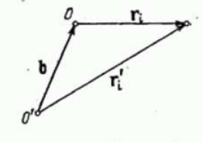

**Что изображено.** Треугольник из трёх стрелок и двух точек-начал: $O$ (вверху слева) и $O'$ (внизу слева). Справа — кружочек, тот самый заряд $q_i$ (на рисунке он, к сожалению, не подписан).

| стрелка | откуда → куда | что означает |
|---|---|---|
| $\vec b$ | из $O'$ в $O$ | вектор сдвига между двумя началами координат |
| $\vec r_i$ | из $O$ в заряд | положение заряда в «старой» системе |
| $\vec r_i\ '$ | из $O'$ в заряд | положение того же заряда в «новой» системе |

**Что читается по картинке.** Правило сложения векторов: «из $O'$ в $O$, потом из $O$ в заряд» = «из $O'$ сразу в заряд», то есть

$$\vec r_i\ ' = \vec b + \vec r_i$$

Это и есть пункт 1 доказательства, нарисованный. Ключевое: $\vec b$ **один и тот же для всех зарядов** (начала координат не двигаются от заряда к заряду), а $\vec r_i$ у каждого свой. Поэтому $\vec b$ выносится из суммы, а $\vec r_i$ — нет.

**Чего на рисунке не хватает:**

- **Не подписан заряд.** Кружочек справа — это $q_i$, но подписи нет. Из-за этого рисунок выглядит как чистая геометрия и не связывается с физикой.
- **Нарисован всего один заряд.** А доказательство — про сумму по всем зарядам. Стоит дорисовать хотя бы второй заряд $q_j$ со своей парой векторов $\vec r_j$ и $\vec r_j\ '$: тогда сразу видно, что $\vec b$ у них общий.
- **Нет самой системы зарядов.** Хорошо бы обвести заряды пунктирным контуром, как на первом рисунке, и показать, что $O$ и $O'$ — просто два разных способа поставить начало отсчёта.
- **Не показано, где потенциал считаем.** Точка наблюдения на рисунке отсутствует вовсе, хотя весь смысл в том, что физический ответ (потенциал) от выбора начала зависеть не может.
- **Не отмечено условие $\sum q_i = 0$**, без которого доказательство не работает. Стоит написать его прямо на рисунке — это единственное место, где оно используется.

### Доказательство независимости $\vec p$ от начала координат — по шагам

**Зачем это доказывать.** Мы выбрали начало координат «где-нибудь внутри». Но $\vec p = \sum q_i\vec r_i$ явно содержит эти $\vec r_i$, а они зависят от того, откуда мерить! Возникает подозрение, что $\vec p$ — не характеристика системы, а произвол наблюдателя. Надо проверить.

**Шаг 1. Связь координат.** Сдвинем начало из $O$ в $O'$. Радиус-векторы связаны как $\vec r_i\ ' = \vec b + \vec r_i$, где $\vec b$ — вектор из $O'$ в $O$, общий для всех зарядов.

**Шаг 2. Считаем момент в новой системе.**

$$\vec p\ ' = \sum_i q_i\vec r_i\ ' = \sum_i q_i(\vec b + \vec r_i)$$

**Шаг 3. Раскрываем скобки** и разбиваем на две суммы:

$$\vec p\ ' = \sum_i q_i\vec b + \sum_i q_i\vec r_i = \vec b\sum_i q_i + \sum_i q_i\vec r_i$$

Вынести $\vec b$ можно именно потому, что он у всех зарядов одинаковый.

**Шаг 4. Пользуемся нейтральностью.** По условию $\sum q_i = 0$, значит первое слагаемое равно нулю. Второе — это дипольный момент в старой системе:

$$\vec p\ ' = 0 + \vec p = \vec p$$

**Вывод:** у нейтральной системы дипольный момент один и тот же, откуда бы ты ни мерила. Значит, это честная физическая характеристика системы — как масса или полный заряд.

**А если система не нейтральна?** Тогда $\vec p\ ' = \vec b\ Q + \vec p$, и ответ зависит от $\vec b$. Более того, подобрав $\vec b$, можно сделать $\vec p\ '$ равным нулю или любым другим. Поэтому:

> у заряженной системы говорить «её дипольный момент» бессмысленно — надо указывать, относительно какой точки.

И это не беда: у заряженной системы всё равно главный вклад даёт монополь, и дипольная поправка тонет на его фоне.

**Аналогия из механики.** Точно та же история с моментом импульса или моментом силы: они зависят от выбора точки отсчёта, кроме случая, когда суммарная сила равна нулю (пара сил — её момент одинаков относительно любой точки). Правило общее: **если нулевой момент разложения равен нулю, следующий за ним перестаёт зависеть от начала отсчёта.**

### Высшие мультиполи: квадруполь и октуполь

Что делать, если и заряд, и дипольный момент нулевые? Такое бывает: у симметричных молекул (CO₂, метан) «плюсы» и «минусы» разнесены, но так симметрично, что $\vec p = 0$.

Тогда поле определяется **третьим** членом разложения — тем, который мы отбросили вместе с поправками порядка $(r_i/r)^2$. Это поле **квадруполя**, оно убывает как $\varphi \sim 1/r^3$.

Дальше — **октуполь** ($\sim 1/r^4$) и так далее.

Общее правило:

| мультиполь | когда «работает» | потенциал | напряжённость |
|---|---|---|---|
| монополь (заряд) | $Q \neq 0$ | $\sim 1/r$ | $\sim 1/r^2$ |
| диполь | $Q = 0$, $\vec p \neq 0$ | $\sim 1/r^2$ | $\sim 1/r^3$ |
| квадруполь | $Q = 0$, $\vec p = 0$ | $\sim 1/r^3$ | $\sim 1/r^4$ |
| октуполь | и квадрупольный момент нулевой | $\sim 1/r^4$ | $\sim 1/r^5$ |

Напряжённость всегда убывает на степень быстрее потенциала, потому что $\vec E = -\mathrm{grad}\ \varphi$ (билет 8), а дифференцирование $1/r^n$ даёт $1/r^{n+1}$.

**Практический смысл таблицы.** Работает первый ненулевой член — остальные на больших расстояниях пренебрежимо малы. Поэтому реальная процедура такая: посчитай полный заряд; если ноль — считай $\vec p$; если и он ноль — переходи к квадруполю.

### Разбор рисунка 3: квадруполь и октуполь

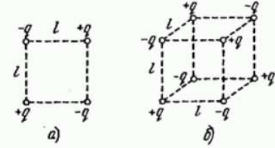

**Что изображено.** Два примера систем с нулевым зарядом и нулевым дипольным моментом.

**(а) Квадруполь.** Квадрат со стороной $l$ (стороны показаны пунктиром — это не провода, а просто разметка расстояний). В вершинах кружочки-заряды, знаки чередуются по кругу: сверху слева $-q$, сверху справа $+q$, снизу справа $-q$, снизу слева $+q$. То есть одинаковые знаки стоят по диагонали.

**(б) Октуполь.** То же самое, но в объёме: куб с ребром $l$, в восьми вершинах восемь зарядов, знаки чередуются так, что у каждого заряда все ближайшие соседи противоположного знака (как в шахматной раскраске).

**Проверим, что это действительно квадруполь.** Считаем для квадрата:

- **Полный заряд:** $(+q) + (+q) + (-q) + (-q) = 0$. ✓
- **Дипольный момент:** возьмём начало координат в центре квадрата. Заряды стоят попарно симметрично относительно центра, причём **противоположные по расположению заряды имеют одинаковый знак** (диагонали одноимённые). Значит, в сумме $\sum q_i\vec r_i$ каждая пара даёт $q\vec r + q(-\vec r) = 0$. Итого $\vec p = 0$. ✓

Оба первых члена нулевые — остаётся третий. Поле такой системы убывает как $1/r^3$.

**Как это устроено «по-человечески».** Квадруполь можно собрать из двух диполей: верхняя пара зарядов — это диполь, направленный влево, нижняя пара — такой же диполь, направленный вправо. Их моменты гасятся ($\vec p = 0$), но сами диполи разнесены в пространстве, поэтому их поля не гасятся полностью — остаётся слабый остаток, который и убывает быстрее.

Та же логика, что была с диполем: диполь = два монополя, которые компенсируют заряд, но разнесены. Квадруполь = два диполя, которые компенсируют момент, но разнесены. Октуполь = два квадруполя. Каждый следующий уровень — «пара предыдущих, поставленных навстречу».

**Чего на рисунке не хватает:**

- **Не показано, что $Q = 0$ и $\vec p = 0$.** Ради этого рисунок и приведён, но никаких пометок нет. Подпиши прямо под картинкой оба равенства.
- **Не отмечен центр системы** и разбиение на два диполя. Дорисуй две стрелки $\vec p_{\text{верх}}$ и $\vec p_{\text{низ}}$ — сразу видно, почему они гасятся.
- **Пунктир может ввести в заблуждение.** Это не стержни и не связи, а просто рёбра воображаемого квадрата/куба, показывающие расстояние $l$. Заряды ничем не соединены.
- **Не нарисованы силовые линии или эквипотенциали.** Для диполя (билет 9) картинка линий была; здесь её нет, и понять, как выглядит поле квадруполя, по рисунку невозможно.
- **Нет точки наблюдения и расстояния $r$**, хотя весь смысл — в поведении поля на больших $r$.
- **Для октуполя не проверить знаки навскидку** — часть вершин куба загорожена. Стоит помнить правило: знаки чередуются в шахматном порядке, каждая пара соседей по ребру разноимённая.

### Почему разложение вообще сходится

Резонный вопрос: почему мы уверены, что второй член меньше первого, третий меньше второго и так далее?

Сравним первые два по порядку величины. Первый: $\dfrac{Q}{r}$. Второй: $\dfrac{p}{r^2} \sim \dfrac{Q\ l}{r^2}$ (ведь $p \sim Q l$). Отношение:

$$\frac{\text{второй}}{\text{первый}} \sim \frac{Ql/r^2}{Q/r} = \frac{l}{r} \ll 1$$

Каждый следующий член меньше предыдущего примерно в $r/l$ раз. Если система размером 1 нм, а смотрим с 1 мкм, то $l/r = 10^{-3}$: второй член — тысячная от первого, третий — миллионная. Вот почему хватает одного-двух членов.

И наоборот: **вблизи системы** ($r \sim l$) разложение бессмысленно — там все члены сравнимы, и надо честно считать сумму по всем зарядам. Условие $r \gg l$ — не формальность, а граница применимости всего билета.

### Итог билета одним абзацем

Поле любой системы зарядов вдали от неё раскладывается в сумму убывающих вкладов: заряд ($1/r$), диполь ($1/r^2$), квадруполь ($1/r^3$), октуполь ($1/r^4$)… Работает первый ненулевой член. Получается разложение из двух приближений: расстояние до заряда заменяем на $r - r_{ir}$ и раскрываем дробь по формуле $\dfrac{1}{1-x}\approx 1+x$. Дипольный момент нейтральной системы $\vec p = \sum q_i\vec r_i$ не зависит от выбора начала координат — это её собственная характеристика.

### Что дальше

Разложение по мультиполям — фундамент для теории диэлектриков (билеты 20–26): каждая молекула вещества нейтральна, значит её поле — дипольное, и всё поведение диэлектрика в поле сводится к поведению множества диполей. Так билет 11 логически замыкает блок 9–11 и открывает дорогу к поляризации.

Ближайший же билет 12 меняет тему: от систем точечных зарядов переходим к **проводникам** — телам, внутри которых заряды могут свободно двигаться.

---

## Разбор 12. Поле внутри и снаружи проводника

### Зачем нужен этот билет

Билеты 1–11 были про заряды, которые **сидят там, куда их положили**: точечный заряд, кольцо, нить, диполь, система зарядов. Мы задавали расположение зарядов и считали поле.

Билет 12 переворачивает задачу. Здесь заряды **сами решают, где им сидеть**: в проводнике они могут свободно двигаться и двигаются до тех пор, пока их устраивает поле. То есть теперь не мы задаём распределение зарядов, а его находит сама природа — а мы должны сообразить, каким оно окажется.

Ответ оказывается на удивление коротким: движение прекращается только при $\vec E = 0$ внутри. Из этого единственного условия вытекает **всё остальное** в билете. Дальше вся логика — цепочка следствий:

$$\vec E = 0 \ \Longrightarrow\  \varphi = \text{const} \ \Longrightarrow\  \text{поверхность эквипотенциальна} \ \Longrightarrow\  \vec E \perp \text{поверхности}$$

$$\vec E = 0 \ \Longrightarrow\  \rho = 0 \ \Longrightarrow\  \text{заряд только на поверхности} \ \Longrightarrow\  E_n = \sigma/\varepsilon_0$$

Если запомнить эту схему, билет рассказывается сам собой.

### Что такое проводник

В проводнике часть электронов **не привязана к своим атомам** и может гулять по всему объёму тела. В металле это электроны внешних оболочек: атомы отдают их в общее пользование и остаются положительными ионами, жёстко закреплёнными в узлах кристаллической решётки.

Важно, что двигаться могут только электроны. Положительные ионы стоят на месте, поэтому «сдвинуть плюс» физически нельзя — можно только **убрать оттуда электроны**, и тогда это место станет выглядеть положительным.

| | заряд | подвижность |
|---|---|---|
| электроны проводимости | «−» | свободно бегают по всему телу |
| ионы решётки | «+» | закреплены, не двигаются |

**Аналогия:** проводник — это сосуд с водой. Наклонишь сосуд (приложишь поле) — вода перельётся, но не бесконечно: она перетечёт ровно настолько, чтобы поверхность снова стала горизонтальной, и на этом успокоится. Дальше про эту аналогию вспомним ещё раз.

### Главный вывод: почему $\vec E = 0$ внутри — по шагам

**Шаг 1. Вносим проводник в поле.** Пусть внешнее поле $\vec E$ направлено вправо.

**Шаг 2. Заряды приходят в движение.** На электрон действует сила $\vec F = q\vec E$, а так как заряд электрона отрицателен, сила направлена **против** поля, то есть влево. Электроны едут влево и скапливаются на левой стороне проводника.

**Шаг 3. Появляются индуцированные заряды.** Слева избыток электронов — там «−». Справа электронов не хватает, оголились ионы решётки — там «+». Это и есть **индуцированные** (наведённые) заряды. Обрати внимание: суммарный заряд проводника не изменился, он как был нейтральным, так и остался — заряды просто перераспределились.

**Шаг 4. Индуцированные заряды создают своё поле.** Между «−» слева и «+» справа внутри проводника возникает поле $\vec E\ '$, направленное от плюсов к минусам, то есть **влево** — навстречу внешнему.

**Шаг 5. Процесс сам себя останавливает.** Чем больше электронов перетекло, тем больше $E\ '$. Как только $E\ ' $ сравняется с $E$ по модулю, результирующее поле обратится в нуль:

$$\vec E_{\text{рез}} = \vec E + \vec E\ ' = 0$$

и силы, гоняющей заряды, больше нет — движение прекращается.

**Почему это единственный возможный исход.** Рассуждаем от противного: пусть в установившемся состоянии внутри осталось хоть какое-то поле $\vec E_{\text{рез}} \neq 0$. Тогда на свободные заряды действует сила, они продолжают двигаться — а значит, состояние не установившееся. Противоречие. Следовательно, в статике внутри проводника поле строго равно нулю.

**Обратно к аналогии с водой.** Вода перетекает, пока поверхность наклонена, и останавливается ровно тогда, когда наклона не осталось. «Наклон» здесь — это поле; «вода успокоилась» — это статика. Заметь, что вода не знает заранее, сколько ей нужно перетечь: она просто течёт, пока причина течь не исчезнет. С зарядами то же самое.

**Насколько быстро?** Для металлов время установления порядка $10^{-16}$ с. По любым практическим меркам — мгновенно, поэтому в электростатике мы всегда рассматриваем уже установившееся состояние.

### Разбор рисунка 1: проводник во внешнем поле

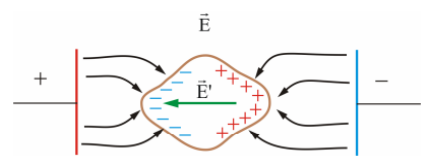

**Что изображено.** Слева красная вертикальная пластина, подписанная «+», справа синяя, подписанная «−» — это обкладки, создающие внешнее однородное поле. Сверху подпись $\vec E$ — внешнее поле. Между пластинами чёрные линии со стрелками — силовые линии, идущие слева направо (от «+» к «−»). В середине — тело, обведённое коричневым контуром: это и есть проводник. На его левой стороне синие знаки «−», на правой красные «+». Внутри зелёная стрелка, подписанная $\vec E\ '$, направленная **влево**.

| элемент | что означает |
|---|---|
| чёрные линии со стрелками вправо | внешнее поле $\vec E$ |
| «−» на левой стороне проводника | индуцированные заряды: электроны, приехавшие против поля |
| «+» на правой стороне | оголившиеся ионы решётки, откуда ушли электроны |
| зелёная стрелка $\vec E\ '$ влево | поле индуцированных зарядов — навстречу внешнему |

**Как читать физику по картинке.** Главное — увидеть, что стрелка $\vec E\ '$ смотрит **против** внешних силовых линий. Это и есть механизм компенсации: два поля внутри проводника гасят друг друга.

Второе, что стоит заметить: силовые линии **упираются в поверхность проводника и обрываются на ней**, причём подходят перпендикулярно, а сквозь тело не проходят. Внутри линий нет вовсе — потому что там нет поля.

**Чего на рисунке не хватает:**

- **Не написано, что $E\ ' = E$ по модулю.** Стрелка $\vec E\ '$ нарисована короткой, как будто поле скомпенсировано лишь частично. На самом деле компенсация полная. Подпиши рядом «$E\ ' = E$, поэтому $E_{\text{рез}} = 0$».
- **Не подписано, что внутри $\vec E_{\text{рез}} = 0$.** Это главный результат билета, а на рисунке его нет. Напиши прямо в теле проводника «$E = 0$».
- **Не показано, что заряд проводника в целом равен нулю.** Из картинки можно решить, что проводник заряжен. Стоит пометить, что число «+» и «−» одинаково.
- **Не видно, что линии подходят по нормали.** Линии обрываются на контуре, но угол не подчёркнут. Полезно провести у пары линий маленький значок прямого угла.

### Следствие 1: потенциал одинаков во всём проводнике

**Способ 1 (через градиент).** Из билета 8: $\vec E = -\mathrm{grad}\ \varphi$. Расписав по осям:

$$E_x = -\frac{\partial\varphi}{\partial x},\qquad E_y = -\frac{\partial\varphi}{\partial y},\qquad E_z = -\frac{\partial\varphi}{\partial z}$$

Все три проекции равны нулю, значит все три производные равны нулю. Функция, которая ни по одному направлению не меняется, — постоянная:

$$\varphi = \text{const}$$

**Способ 2 (через интеграл, нагляднее).** Возьмём две любые точки внутри проводника и посчитаем разность потенциалов по формуле билета 8:

$$\varphi_1 - \varphi_2 = \int_1^2 \vec E\ d\vec l = \int_1^2 0\cdot d\vec l = 0$$

Значит $\varphi_1 = \varphi_2$ — потенциалы любых двух точек равны.

**Смысл.** Весь проводник — единая эквипотенциальная область, а его поверхность — эквипотенциальная поверхность. Это верно для проводника **любой формы**: хоть шар, хоть гвоздь, хоть смятая фольга.

**Аналогия «потенциал = высота».** Она у нас сквозная с билета 7. Проводник в этой аналогии — **абсолютно ровная площадка**: где по ней ни ходи, высота одна и та же. И это ровно то же самое, что «вода успокоилась»: поверхность воды горизонтальна, потому что иначе она продолжала бы течь.

### Следствие 2: заряд не может сидеть внутри

**Рассуждение.** Возьмём внутри проводника любую воображаемую замкнутую поверхность. Всюду на ней поле равно нулю, значит и поток равен нулю:

$$\oint_S E_n\ dS = \oint_S 0\cdot dS = 0$$

По теореме Гаусса (билет 4) поток равен $q_{\text{внутр}}/\varepsilon_0$, поэтому

$$\frac{q_{\text{внутр}}}{\varepsilon_0} = 0 \implies q_{\text{внутр}} = 0$$

**Ключевой довод — произвольность поверхности.** Мы не выбирали её специально: она любая. Можно взять маленькую сферу вокруг любой точки внутри проводника — и заряд внутри неё окажется нулевым. Стянем её в точку: значит, в этой точке заряда нет. Точка была произвольной, следовательно $\rho = 0$ **везде** в объёме.

**То же в одну строку через дифференциальную форму.** $\mathrm{div}\ \vec E = \dfrac{\rho}{\varepsilon_0}$. Дивергенция нулевого поля равна нулю, значит $\rho = 0$.

**Куда же девается заряд, если мы зарядим проводник?** Ему остаётся единственное место — **поверхность**. Весь избыточный заряд выходит на неё и сидит в очень тонком слое (порядка размера атома).

**Почему это физически понятно.** Одноимённые заряды отталкиваются и стремятся разбежаться как можно дальше друг от друга. Внутри тела разбегаться некуда — со всех сторон соседи. Дальше всего друг от друга они окажутся, выйдя на поверхность. Внутри же остаётся ровно столько зарядов, сколько нужно для нейтральности: электронов и ионов поровну.

### Разбор рисунка 2: точечный заряд рядом с проводником

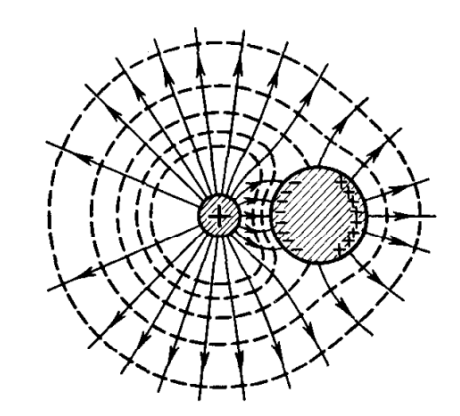

**Что изображено.** Слева маленький заштрихованный кружок со знаком «+» — точечный заряд. Справа большой заштрихованный круг — незаряженный проводящий шар. От заряда во все стороны расходятся **сплошные линии со стрелками** — силовые линии поля. **Пунктирные замкнутые кривые**, пересекающие их, — эквипотенциали. На ближней (левой) стороне шара нарисованы знаки «−», на дальней (правой) — «+».

| элемент | что означает |
|---|---|
| сплошные линии со стрелками | силовые линии $\vec E$, выходят из «+» |
| пунктирные кривые | эквипотенциали ($\varphi = \text{const}$), всюду перпендикулярны силовым линиям |
| «−» на ближней стороне шара | индуцированные заряды, притянутые к «+» |
| «+» на дальней стороне | оттуда электроны ушли |
| штриховка шара | проводник; внутри него линий нет — там $E = 0$ |

**Что тут самое главное.** Три вещи, и все три — прямые следствия билета:

1. **Внутри шара нет ни одной линии.** Поле там равно нулю, хотя рядом стоит заряд.
2. **Силовые линии подходят к поверхности шара под прямым углом** и на ней обрываются (упираются в индуцированные «−»). Так и должно быть: поверхность эквипотенциальна, а $\vec E$ перпендикулярен эквипотенциали.
3. **Сама поверхность шара — эквипотенциаль.** Пунктирные кривые вблизи шара повторяют его форму, огибая его.

И отдельно стоит заметить: слева от заряда картина почти правильная-круговая (как у одиночного точечного заряда), а справа она искажена присутствием проводника. Проводник «притягивает» к себе линии — потому что на нём сидят наведённые «−».

**Чего на рисунке не хватает:**

- **Не подписано, что шар — проводник и что он нейтрален.** Штриховка сама по себе этого не говорит. Напиши «проводник, $q = 0$».
- **Не написано $E = 0$ внутри шара** — а это главное, что рисунок должен показать. Впиши прямо в круг.
- **Не различены сплошные и пунктирные линии.** Нужна подпись-легенда: «— силовые линии, --- эквипотенциали».
- **Не отмечен прямой угол** между силовыми линиями и поверхностью шара, хотя ради этого рисунок и приведён.
- **Не показано, что «−» и «+» на шаре поровну.** Иначе непонятно, что суммарный заряд шара остался нулевым.
- **Не видно, что поле у шара сильнее там, где «−» гуще.** Полезная деталь: густота знаков связана с $\sigma$, а значит и с $E_n = \sigma/\varepsilon_0$.

### Поле у поверхности: сначала направление

Раз поверхность проводника эквипотенциальна, вектор $\vec E$ у неё направлен **по нормали**. Это уже доказано в билете 7, но повторим довод в терминах проводника — он тут даже нагляднее.

Пусть у $\vec E$ была бы составляющая **вдоль** поверхности. Тогда на поверхностные заряды действовала бы сила, гонящая их вдоль поверхности — то есть заряды бы поехали. Но мы рассматриваем статику, где ничего не едет. Противоречие. Значит, касательной составляющей нет:

$$E_\tau = 0 \implies \vec E \parallel \vec n$$

Это тот же самый аргумент, что и для $E = 0$ внутри, просто применённый к движению вдоль поверхности, а не поперёк.

### Поле у поверхности: вывод модуля $E_n = \sigma/\varepsilon_0$

**Идея.** Мы знаем, где сидит заряд (на поверхности) и куда смотрит поле (по нормали). Осталось связать величину поля с плотностью заряда — а это работа для теоремы Гаусса. Нужно только правильно выбрать поверхность.

**Почему именно «таблетка».** Поверхность Гаусса подбирают так, чтобы на каждом её куске поле было либо перпендикулярно ей, либо параллельно (билет 5). Плоский цилиндрик, наполовину утопленный в проводник, идеально подходит:

| часть цилиндра | где находится | поток |
|---|---|---|
| внутренний торец | в толще проводника | $0$, потому что там $E = 0$ |
| боковая стенка | пересекает поверхность | $0$, потому что $\vec E$ идёт вдоль стенки, $E_n = 0$ |
| наружный торец | в вакууме | $E_n\Delta S$ — весь поток здесь |

**Разбираем каждую строку.**

*Внутренний торец.* Он целиком в проводнике, а там поля нет вообще — умножать нечего, поток нулевой. Это единственное место вывода, где используется главный результат билета.

*Боковая стенка.* Её образующие перпендикулярны поверхности проводника. А вектор $\vec E$ у поверхности тоже перпендикулярен ей — значит, $\vec E$ **параллелен** стенке, скользит вдоль неё. Поток через поверхность, вдоль которой скользит поле, равен нулю ($\cos 90^\circ = 0$).

*Наружный торец.* Он параллелен поверхности проводника, а поле ей перпендикулярно — значит, поле проходит через торец строго насквозь. Площадка мала, поэтому $E$ на ней постоянно, и поток равен просто $E_n\Delta S$.

**Собираем.** Полный поток:

$$\oint_S E_n\ dS = 0 + 0 + E_n\Delta S = E_n\Delta S$$

Заряд внутри цилиндра — это заряд того кусочка поверхности проводника, который цилиндр вырезал:

$$q_{\text{внутр}} = \sigma\Delta S$$

Теорема Гаусса:

$$E_n\Delta S = \frac{\sigma\Delta S}{\varepsilon_0}$$

Сокращаем $\Delta S$ (и это важно: ответ не должен зависеть от того, какого размера таблетку мы взяли):

$$E_n = \frac{\sigma}{\varepsilon_0}$$

**Проверка знака.** Если $\sigma > 0$, то $E_n > 0$ — поле направлено по внешней нормали, то есть **от** проводника. Если $\sigma < 0$, то $E_n < 0$ — поле направлено **к** проводнику. Ровно как и должно быть: от плюсов линии выходят, в минусы входят.

### Разбор рисунка 3: цилиндр у поверхности

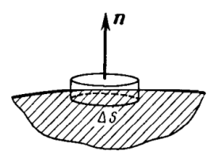

**Что изображено.** Заштрихованная область снизу — тело проводника, её верхняя граница — поверхность проводника. Сквозь эту границу вставлен маленький плоский цилиндр («таблетка»): его верхний торец торчит наружу, нижний утоплен в проводник. Кусочек поверхности, вырезанный цилиндром, подписан $\Delta S$. Из верхнего торца вверх торчит стрелка, подписанная $\vec n$ — внешняя нормаль.

| элемент | что означает |
|---|---|
| штриховка | проводник, внутри него $E = 0$ |
| граница штриховки | поверхность проводника, на ней сидит заряд с плотностью $\sigma$ |
| цилиндр | замкнутая поверхность Гаусса |
| $\Delta S$ | площадь торца = площадь вырезанного участка поверхности |
| $\vec n$ | внешняя нормаль, относительно неё считается проекция $E_n$ |

**Что читается по картинке.** Что цилиндр **пересекает** поверхность — именно поэтому внутрь него попадает заряд $\sigma\Delta S$. И что он маленький — настолько, что участок поверхности можно считать плоским, а $\sigma$ на нём постоянной.

**Чего на рисунке не хватает:**

- **Нет самого вектора $\vec E$!** Нарисована только нормаль $\vec n$. А ведь считается поток именно поля. Дорисуй стрелку $\vec E$ вдоль $\vec n$, выходящую из верхнего торца.
- **Не подписано $E = 0$** в заштрихованной области — а это то, из-за чего обнуляется поток через нижний торец.
- **Не показаны заряды на поверхности.** Поставь ряд «+» на границе внутри $\Delta S$ и подпиши $\sigma$ — тогда видно, откуда берётся $q = \sigma\Delta S$.
- **Не отмечено, что поток через боковую стенку равен нулю.** Это второй по важности шаг вывода. Можно нарисовать у стенки стрелку $\vec E$, скользящую вдоль неё.
- **Нижний торец плохо различим** — он спрятан в штриховке. Стоит прорисовать его пунктиром, чтобы было видно, что цилиндр замкнут.

### Почему $\sigma/\varepsilon_0$, а не $\sigma/2\varepsilon_0$

Самый частый вопрос по этому билету, потому что в билете 5 для заряженной плоскости получилось ровно вдвое меньше. Сравним выводы:

| | бесконечная плоскость (билет 5) | поверхность проводника (билет 12) |
|---|---|---|
| поле по обе стороны | есть с обеих сторон | только снаружи, внутри $E = 0$ |
| поток идёт через | **два** основания | **одно** основание |
| поток | $2E\Delta S$ | $E\Delta S$ |
| заряд внутри | $\sigma\Delta S$ | $\sigma\Delta S$ |
| ответ | $E = \dfrac{\sigma}{2\varepsilon_0}$ | $E_n = \dfrac{\sigma}{\varepsilon_0}$ |

Вся разница — в **числе торцов, через которые идёт поток**. У заряженной плоскости поле выходит в обе стороны, и один и тот же заряд «обслуживает» два потока. У проводника внутрь поля нет, весь поток уходит наружу через одно основание — и достаётся ему целиком.

Так что двойка не «потерялась» — её просто неоткуда взять.

### Скачок поля на поверхности

Полезное наблюдение, которое хорошо показывает всю картину сразу. Пойдём вдоль нормали снаружи внутрь:

- чуть снаружи поверхности: $E = \dfrac{\sigma}{\varepsilon_0}$;
- чуть внутри: $E = 0$.

Поле меняется **скачком** при переходе через поверхность. Причина та же, что у заряженной сферы в билете 5: весь заряд сосредоточен в бесконечно тонком слое, и, пересекая его, мы разом «проходим» весь заряд.

Потенциал же при этом **не** скачет: он непрерывен и равен одному и тому же значению на поверхности и во всей толще. Скачет производная потенциала, а не он сам.

### Где это работает

- **Электростатическая защита (клетка Фарадея).** Если внутри проводника есть полость и в ней нет зарядов, поле в полости равно нулю: снаружи хоть что твори, внутрь не проникнет. Поэтому чувствительную аппаратуру помещают в металлические корпуса, а в самолёте, куда попала молния, пассажирам ничего не грозит.
- **Неравномерность $\sigma$.** Одинаков по проводнику **потенциал**, а не плотность заряда. На выступах и остриях заряд скапливается гуще, поэтому там $\sigma$ больше — а вместе с ней и $E_n = \sigma/\varepsilon_0$. Отсюда громоотвод: у острия поле такое сильное, что разряд идёт именно туда.

### Что дальше

Мы выяснили, где сидит заряд на проводнике и какое поле он создаёт у поверхности. Естественный следующий вопрос: **с какой силой этот заряд тянет саму поверхность?** Одноимённые заряды отталкиваются, и на каждый элемент поверхности действует сила наружу. Это билет 13, и он опирается прямо на формулу $E_n = \sigma/\varepsilon_0$, выведенную здесь.

---

## Разбор 13. Силы, действующие на поверхность проводника

### Зачем нужен этот билет

Билет 12 закончился на том, что весь избыточный заряд выходит на поверхность проводника и создаёт там поле $E_n = \sigma/\varepsilon_0$. Естественный следующий вопрос: **а сам-то заряд что чувствует?**

Ответ очевиден качественно: заряды на поверхности одноимённые, а одноимённые отталкиваются. Значит, каждый кусочек поверхности что-то тянет наружу. Билет 13 отвечает на вопрос **насколько сильно** — и оказывается, что найти это не так просто, как кажется.

Весь билет — это одна короткая формула $\Delta F = \tfrac12\sigma\Delta S\cdot E$ и одна тонкость, ради которой всё и затевается: **откуда взялась одна вторая**. Если понять её, билет закрыт.

### Главная тонкость: заряд не действует сам на себя

Первое, что хочется написать: «на заряде $\Delta q$ в поле $E$ действует сила $\Delta F = \Delta q\ E$». Это **неверно**, и получится ответ ровно вдвое больше правильного.

Причина простая. Поле $E$ у поверхности создано **всеми** зарядами проводника, включая тот самый элемент $\Delta S$, на который мы считаем силу. Но заряд не может толкать сам себя: третий закон Ньютона запрещает — силы внутри самого элемента попарно уравновешиваются.

**Аналогия.** Нельзя поднять себя за волосы. Как бы сильно ты ни тянула, сила действует и на руку, и на волосы, и в сумме даёт ноль. Чтобы подняться, нужен кто-то **другой**.

Значит, из полного поля надо выкинуть вклад самого элемента и оставить только поле «всех остальных» — его обозначают $\vec E_0$:

$$\Delta F = \Delta q\cdot E_0 = \sigma\Delta S\cdot E_0$$

Дальше вся работа — выразить неизвестное $E_0$ через известное $E$.

### Раскладываем поле на два вклада

Вблизи элемента $\Delta S$ полное поле складывается из двух частей:

| вклад | кто создаёт | чему равен | как направлен |
|---|---|---|---|
| $\vec E_\sigma$ | сам элемент $\Delta S$ | $\dfrac{\sigma}{2\varepsilon_0}$ | по разные стороны от $\Delta S$ — в противоположные стороны |
| $\vec E_0$ | все остальные заряды проводника | пока неизвестно | по обе стороны одинаково |

**Почему $E_\sigma = \sigma/2\varepsilon_0$.** Мы стоим вплотную к элементу, гораздо ближе, чем его размеры. С такого расстояния он выглядит как **бесконечная равномерно заряженная плоскость**, а её поле мы считали в билете 5: $E = \sigma/2\varepsilon_0$, в обе стороны от плоскости. Обрати внимание — здесь работает именно «плоскостная» формула с двойкой, а не «проводниковая» $\sigma/\varepsilon_0$ из билета 12. Это разные вещи, и путать их — самая частая ошибка в билете.

**Почему $\vec E_0$ по обе стороны одинаково.** Остальные заряды сидят далеко от нашей крошечной площадки — по сравнению с ней. Их поле на расстоянии в доли размера $\Delta S$ измениться не успевает, поэтому чуть выше и чуть ниже элемента оно практически одно и то же.

### Находим $E_0$ — два уравнения из двух точек

Смотрим на одну и ту же сумму $\vec E = \vec E_0 + \vec E_\sigma$ по обе стороны от элемента.

**Точка внутри проводника.** Там результирующее поле равно нулю (билет 12):

$$\vec E_0 + \vec E_\sigma = 0$$

Два вектора дают в сумме ноль только если они противоположны и равны по модулю:

$$E_0 = E_\sigma$$

Вот и всё, что нам нужно было: **поле остальных зарядов равно по модулю полю самого элемента.**

**Точка снаружи.** Переходя на другую сторону элемента, вектор $\vec E_\sigma$ **разворачивается** (поле плоскости смотрит в обе стороны наружу), а $\vec E_0$ остаётся как был. Теперь они сонаправлены и складываются:

$$E = E_0 + E_\sigma = E_0 + E_0 = 2E_0 \implies E_0 = \frac{E}{2}$$

**Смысл результата.** Полное поле у поверхности проводника состоит из двух равных половин: половину даёт сам кусочек поверхности, половину — все остальные заряды. Именно поэтому внутри всё гасится, а снаружи удваивается.

### Разбор рисунка: поле у элемента поверхности

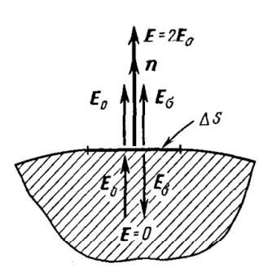

**Что изображено.** Заштрихованная область снизу — тело проводника, её верхняя граница — поверхность. На поверхности стрелкой отмечен маленький участок, подписанный $\Delta S$. Выше и ниже этого участка нарисованы векторы.

| стрелка | где | направление | что означает |
|---|---|---|---|
| $\vec n$ | снаружи | вверх | внешняя нормаль |
| $\vec E_0$ | снаружи | вверх | поле остальных зарядов |
| $\vec E_\sigma$ | снаружи | вверх | поле самого элемента |
| $\vec E = 2\vec E_0$ | снаружи | вверх, длиннее вдвое | результат сложения |
| $\vec E_0$ | внутри | вверх | то же поле остальных зарядов — направление не изменилось |
| $\vec E_\sigma$ | внутри | **вниз** | поле элемента развернулось |
| $\vec E = 0$ | внутри | — | сумма равна нулю |

**Главное, что нужно увидеть.** Сравни две пары стрелок. Снаружи $\vec E_0$ и $\vec E_\sigma$ смотрят **в одну сторону** — складываются и дают $2E_0$. Внутри $\vec E_0$ смотрит вверх, а $\vec E_\sigma$ вниз — они гасятся, и получается ноль. Разворачивается при этом только $\vec E_\sigma$; $\vec E_0$ в обоих случаях направлен одинаково.

Именно эта картинка — весь вывод целиком. Если её нарисовать на экзамене, объяснять почти нечего.

**Чего на рисунке не хватает:**

- **Нет самой силы $\vec F$!** Билет про силы, а вектора силы на рисунке нет. Дорисуй стрелку наружу у элемента $\Delta S$ и подпиши $\vec F_{\text{ед}}$.
- **Не показаны заряды.** Поставь ряд «+» вдоль поверхности внутри $\Delta S$ — тогда видно, откуда берётся $\sigma$ и почему $\vec E_\sigma$ смотрит от поверхности в обе стороны.
- **Не подписано $E_\sigma = \sigma/2\varepsilon_0$** — ключевая величина вывода, а на рисунке только буква.
- **Не отмечено, что $\vec E_0$ одинаков сверху и снизу.** Это то, на чём держится всё рассуждение; стоит подчеркнуть, что обе стрелки $\vec E_0$ равны по длине и направлению.
- **Не видно, что $\Delta S$ мал.** Рисунок создаёт впечатление, что элемент сравним с телом; полезно подписать «$\Delta S$ мал, вблизи — как бесконечная плоскость».

### От силы к давлению

Сила $\Delta F$ пропорциональна площади: взяли кусочек вдвое больше — получили вдвое большую силу. Поэтому удобнее говорить не о силе, а о **силе на единицу площади**. Делим на $\Delta S$:

$$F_{\text{ед}} = \frac{\Delta F}{\Delta S} = \frac{1}{2}\sigma E$$

Дальше подставляем связь из билета 12: $E = \sigma/\varepsilon_0$, то есть $\sigma = \varepsilon_0 E$. Подставить можно двумя способами, и получаются две записи одной формулы:

- убираем $E$: $\ F_{\text{ед}} = \dfrac12\sigma\cdot\dfrac{\sigma}{\varepsilon_0} = \dfrac{\sigma^{2}}{2\varepsilon_0}$
- убираем $\sigma$: $\ F_{\text{ед}} = \dfrac12\varepsilon_0 E\cdot E = \dfrac{\varepsilon_0 E^{2}}{2}$

$$\vec F_{\text{ед}} = \frac{\sigma^{2}}{2\varepsilon_0}\ \vec n = \frac{\varepsilon_0 E^{2}}{2}\ \vec n$$

**Проверка размерности.** $[\varepsilon_0 E^{2}] = \dfrac{\text{Кл}^2}{\text{Н}\cdot\text{м}^2}\cdot\dfrac{\text{Н}^2}{\text{Кл}^2} = \dfrac{\text{Н}}{\text{м}^{2}} = \text{Па}$. Получились паскали — значит, «электростатическое давление» не метафора, а честная размерность давления.

### Почему сила всегда наружу

В обеих записях стоит **квадрат**: $\sigma^2$ или $E^2$. Квадрат неотрицателен при любом знаке, поэтому $\vec F_{\text{ед}}$ всегда сонаправлена с внешней нормалью $\vec n$ — тянет наружу. Заряди проводник положительно или отрицательно — результат один и тот же.

**Почему так и должно быть физически.** Знак заряда меняет и направление поля, и знак заряда элемента одновременно. Сила есть произведение этих двух вещей, и оба минуса перемножаются в плюс. Проще словами: заряды на поверхности **одноимённые при любом знаке**, а одноимённые всегда отталкиваются.

Отсюда общий вывод: электростатические силы всегда **растягивают** проводник, сжать его они не могут.

### Численная оценка

Полезно понимать масштаб. Возьмём $E = 3\cdot10^6$ В/м — это пробойное поле воздуха, больше в обычных условиях не бывает:

$$F_{\text{ед}} = \frac{\varepsilon_0 E^{2}}{2} = \frac{8{,}85\cdot10^{-12}\cdot(3\cdot10^{6})^{2}}{2} \approx 40\ \text{Па}$$

Для сравнения: атмосферное давление около $10^5$ Па. То есть электростатическое давление даже при предельном поле в тысячи раз меньше атмосферного — металл его, конечно, не замечает.

Зато его прекрасно замечают лёгкие объекты: заряженный мыльный пузырь раздувается, а мелкая заряженная капля жидкости при достаточном заряде разрывается на части — сила растяжения побеждает поверхностное натяжение.

### Что дальше

Билеты 12 и 13 разобрали сплошной проводник. Билет 14 берётся за **проводник с полостью**: там выясняется, что внутри пустой полости поля нет вообще (электростатическая защита), и доказывается это через теорему о циркуляции из билета 6.

---

## Разбор 14. Свойства замкнутой проводящей оболочки

### О чём этот билет

Билеты 12 и 13 разбирали сплошной кусок металла. Теперь в нём **дырка** — пустая полость. Вопрос: что происходит в этой полости?

Ответ неожиданно сильный: **там ничего не происходит**. Ни поля, ни зарядов на стенках — что бы ни творилось снаружи. Хоть поднеси заряженный шар вплотную, хоть помести всю конструкцию между пластинами конденсатора — внутри полости по-прежнему ноль.

Это и есть **электростатическая защита** (экранировка). На ней держится вся практика: экранированные кабели, металлические корпуса приборов, клетка Фарадея, безопасность в машине во время грозы.

Билет состоит из трёх частей:
1. пустая полость — поля нет (главное, тут есть доказательство);
2. полость с зарядом внутри — какие заряды где наводятся;
3. независимость внутреннего и внешнего пространства (формулировки).

### Часть 1. Почему в пустой полости нет поля

#### Шаг первый: теорема Гаусса — и почему её мало

Проводим замкнутую поверхность $S$ **целиком внутри металла**, охватив полость. Это ключевой выбор: поверхность идёт по толще металла, нигде не выходя ни в полость, ни наружу.

Раз каждая точка $S$ лежит в металле, то в каждой точке $\vec E = 0$ (билет 12). Значит и поток нулевой:

$$\oint_S \vec E\ d\vec S = 0$$

А по теореме Гаусса поток равен охваченному заряду, делённому на $\varepsilon_0$. Отсюда

$$q_{\text{внутр}} = 0$$

Поверхность $S$ охватывает полость вместе с её стенками, полость пуста — значит **суммарный заряд стенок полости равен нулю**.

**А теперь главная тонкость билета.** Кажется, что доказательство закончено. Ничего подобного!

Теорема Гаусса умеет считать только **сумму**. А сумма ноль — это не то же самое, что «зарядов нет». Представь: на левой стенке полости сидит $+q$, на правой $-q$. Сумма — ноль, теорема Гаусса довольна. А поле в полости при этом есть: линии идут от плюсов к минусам.

Такая картинка и нарисована в билете. Её надо **опровергнуть отдельно**, и Гаусс здесь бессилен — нужен другой инструмент.

#### Шаг второй: доказательство от противного через циркуляцию

Другой инструмент — теорема о циркуляции из билета 6:

$$\oint_\Gamma \vec E\ d\vec l = 0$$

для **любого** замкнутого контура. Она следует из потенциальности поля: работа по замкнутому пути равна нулю.

Строим хитрый контур $\Gamma$ из двух половин:

| половина контура | где идёт | чему равно поле | вклад в циркуляцию |
|---|---|---|---|
| первая | по полости, **вдоль силовой линии** | $\vec E \ne 0$, причём $\vec E \uparrow\uparrow d\vec l$ | строго $> 0$ |
| вторая | назад **по металлу** | $\vec E = 0$ | ровно $0$ |

Разбиваем интеграл на две части:

$$\oint_\Gamma \vec E\ d\vec l = \underbrace{\int_{\text{полость}} \vec E\ d\vec l}_{>\ 0} + \underbrace{\int_{\text{металл}} \vec E\ d\vec l}_{=\ 0} > 0$$

**Почему первый интеграл строго положителен.** Скалярное произведение $\vec E\ d\vec l = E\ dl\cos\alpha$. Мы **специально** пустили контур вдоль силовой линии, то есть $\alpha = 0$ и $\cos\alpha = 1$. Значит подынтегральное выражение $E\ dl$ положительно в каждой точке — и сумма положительных величин положительна. Нигде по дороге ничего не может «скомпенсироваться».

**Почему второй равен нулю.** В металле $\vec E = 0$, умножать на $d\vec l$ нечего.

Итог: $\oint_\Gamma \vec E\ d\vec l \ne 0$ — а этого не может быть **никогда**. Противоречие. Значит наше предположение (что на стенках есть разделённые $+q$ и $-q$) ложно.

**Вывод.** На внутренней поверхности пустой полости зарядов нет вообще — ни суммарно, ни по отдельности. И поле в полости $\vec E = 0$.

#### Почему контур выбран именно так

Вся хитрость доказательства — в выборе контура. Нужно было заставить циркуляцию быть **заведомо ненулевой**, и для этого:

- половину пути идём **вдоль линии** — так набирается строго положительный вклад, который ничем нельзя обнулить;
- обратно возвращаемся **по металлу**, где поле ноль — иначе на обратном пути мы шли бы против линий и набрали отрицательный вклад, который погасил бы первый. Металл — это «бесплатная дорога назад».

Именно поэтому контур обязан быть наполовину в полости, наполовину в металле. Если провести его целиком в полости, ничего не докажешь.

### Разбор рисунка: полость и контур

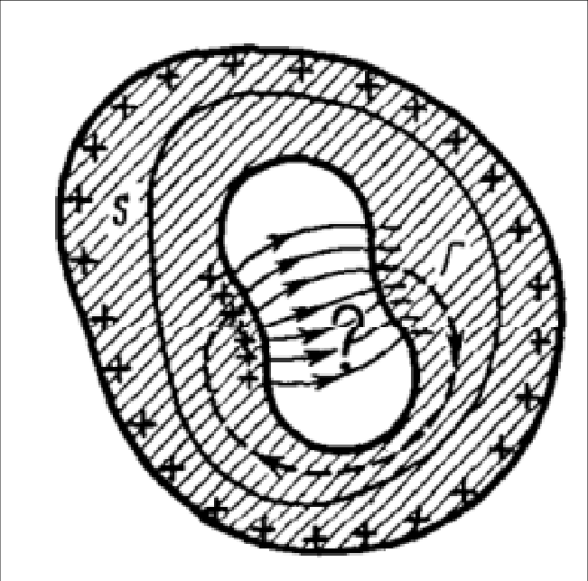

**Что изображено.** Штриховка — металл проводника. Внутри него белая область неправильной формы — полость. Снаружи по всей границе металла расставлены «+» — это заряд, сидящий на наружной поверхности.

| элемент | что означает |
|---|---|
| штриховка | тело проводника (металл), где $\vec E = 0$ |
| «+» по внешнему контуру | избыточный заряд на наружной поверхности |
| белая область в центре | полость |
| «+» и «−» на стенках полости | **предполагаемые** заряды — то, что мы опровергаем |
| стрелки внутри полости | силовые линии предполагаемого поля, от «+» к «−» |
| $S$ | замкнутая поверхность внутри металла (для теоремы Гаусса) |
| $\Gamma$ | замкнутый контур: часть в полости вдоль линии, часть в металле |

**Главное, что нужно увидеть.** Контур $\Gamma$ — большая петля. Одна её часть накладывается на силовую линию внутри полости (по ней стрелки), другая уходит в штриховку и возвращается по металлу. Это и есть весь чертёж доказательства.

**Обрати внимание:** заряды «+» и «−» внутри полости нарисованы не потому, что они там есть, а потому что мы **допустили**, что они есть, чтобы прийти к противоречию. Формально это рисунок несуществующей ситуации.

**Чего на рисунке не хватает:**

- **Не подписано, что заряды в полости — предположение.** Смотрится так, будто они реально там сидят. Подпиши «предположим» со знаком вопроса.
- **Не отмечено $\vec E = 0$ в металле** — а это то, из-за чего второй интеграл обнуляется.
- **Направление обхода $\Gamma$** показано слабо; стоит поставить одну жирную стрелку и подписать $d\vec l$.
- **Не видно, где именно контур переходит из полости в металл.** Полезно отметить точками две «границы перехода».
- **Не различены $S$ и $\Gamma$ по смыслу:** $S$ — поверхность (для Гаусса), $\Gamma$ — линия (для циркуляции). Разные теоремы, разные объекты, а нарисованы похоже.

### Часть 2. Заряд внутри полости

Теперь в полость подвешен заряд $+q$, стенок он не касается.

**Что наводится на внутренней поверхности.** Логика та же: проводим $S$ по металлу вокруг полости, поток ноль, охваченный заряд ноль. Но теперь внутри $S$ лежат два заряда — наш $+q$ и то, что село на стенки:

$$q + q_{\text{внутр.пов}} = 0 \implies q_{\text{внутр.пов}} = -q$$

Металл «обволакивает» заряд слоем $-q$, ровно погашая его. С точки зрения металла и всего, что снаружи, заряда как будто и нет.

**Что появляется на наружной поверхности.** Оболочка была нейтральна, её полный заряд равен нулю. Электроны никуда не делись, они лишь перераспределились: часть ушла на внутреннюю поверхность, создав там $-q$. Значит на наружной поверхности не хватает такого же количества:

$$q_{\text{нар}} = +q$$

**Итог по слоям:** внутри полости $+q$, на стенке полости $-q$, на наружной поверхности $+q$. Заряд как бы «протек насквозь»: снаружи всё выглядит так, будто $q$ просто размазан по внешней поверхности оболочки.

### Разбор рисунка: заряд в полости

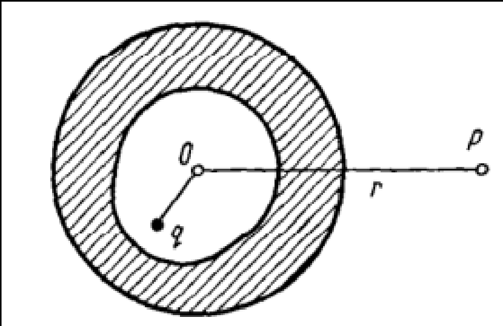

**Что изображено.** Заштрихованное кольцо — стенка сферической металлической оболочки в разрезе. Внутри белый круг — полость. В ней точка $q$ — внесённый заряд, **смещённый от центра**. Точка $O$ — центр оболочки. От $O$ вправо идёт отрезок $r$ к точке $P$ снаружи.

| элемент | что означает |
|---|---|
| штриховка | металл оболочки |
| белый круг | полость |
| точка $q$ | заряд, сидящий **не в центре** |
| $O$ | центр оболочки |
| $r$, $P$ | расстояние **от центра** до внешней точки наблюдения |

**Главное, что нужно увидеть.** Заряд нарисован смещённым специально. Расстояние $r$ отсчитывается **от $O$, а не от $q$** — и это не небрежность художника. Именно в этом суть: снаружи поле не зависит от того, куда внутри полости положили заряд. Оно всегда

$$E = \frac{q}{4\pi\varepsilon_0 r^{2}}$$

как будто заряд сидит точно в центре.

Причина: заряд $+q$ на наружной поверхности сферы распределяется **равномерно**, что бы ни творилось внутри. А равномерно заряженная сфера снаружи создаёт поле точечного заряда в центре (билет 5).

**Чего на рисунке не хватает:**

- **Не показаны наведённые заряды.** Нужны «−» по внутренней стенке (неравномерно, гуще со стороны $q$) и «+» по наружной (строго равномерно). Без них картинка не объясняет ничего.
- **Не нарисованы силовые линии** от $q$ к внутренней стенке и от наружной поверхности в бесконечность.
- **Не подписано $\vec E = 0$** в толще металла.
- **Не подчёркнуто, что $q$ смещён намеренно** — а это единственное, ради чего рисунок нужен.

### Часть 3. Экранирование: в какую сторону работает

Оболочка делит мир надвое, и эти два мира друг о друге не знают. Но **не совсем симметрично**, и на экзамене об этом любят спросить.

**Снаружи внутрь — защита полная.** Внесли оболочку во внешнее поле — заряды перераспределились по наружной поверхности так, чтобы внутри металла было ноль, а в полости, как доказано в части 1, тоже ноль. Двигай источники снаружи как хочешь: в полости ничего не изменится.

**Изнутри наружу — защиты нет.** Заряд $q$ в полости выгнал на наружную поверхность заряд $+q$, и его поле спокойно уходит в бесконечность. Прибор снаружи заряд заметит.

Но и здесь есть тонкость: снаружи видно **только полный заряд**, а не то, где он внутри лежит и как движется. Двигаешь $q$ внутри полости — распределение на наружной поверхности не меняется вообще.

**Заземление меняет дело.** Соединим оболочку с землёй — заряд $+q$ с наружной поверхности стечёт, и поле снаружи пропадёт. Теперь экранировка работает в обе стороны. Поэтому у экранирующих корпусов всегда есть клемма заземления.

### Зачем это на практике

- **Клетка Фарадея.** Сплошной металл не обязателен: достаточно сетки, если ячейка мельче характерных размеров задачи. Внутри — тишина.
- **Автомобиль в грозу.** Кузов работает как оболочка; ток молнии идёт по металлу, внутри поля нет.
- **Экранированный кабель.** Оплётка — та же оболочка, защищает сигнал от наводок.
- **Лифт и телефон.** Металлическая кабина экранирует сигнал — связь пропадает по той же причине.

### Что дальше

Билет 15 переходит от качественных свойств проводников к **общей задаче электростатики**: как вообще искать потенциал по заданным зарядам и граничным условиям. Там появляются уравнения Пуассона и Лапласа и красивый трюк — метод изображений.

---

## Разбор 15. Уравнения Пуассона и Лапласа. Метод изображений

### О чём этот билет

До сих пор мы решали задачи «снизу вверх»: даны заряды — найди поле. Кольцо, нить, шар, диполь — везде известно, где сидит заряд, остаётся просуммировать.

С проводниками этот путь ломается. Поднеси заряд к куску металла — на нём наведутся заряды, но **где именно и в каком количестве, заранее неизвестно**. Распределение зависит от поля, а поле зависит от распределения. Замкнутый круг.

Выход — перевернуть задачу. Вместо «сложить вклады» записать **уравнение на сам потенциал** и решать его с условиями на границах («на этом проводнике потенциал такой-то»). Это и есть общая задача электростатики, а уравнение — уравнение Пуассона.

Билет из трёх частей:
1. вывод уравнения Пуассона (три строчки, всё уже готово в билетах 4 и 8);
2. теорема единственности (формулировка, доказательство не наше);
3. метод изображений — красивый трюк, который из теоремы единственности вытекает.

### Часть 1. Вывод уравнения Пуассона

#### Два кирпича, из которых всё складывается

Ничего нового выводить не придётся — оба нужных факта уже доказаны раньше.

**Кирпич 1 (билет 4).** Теорема Гаусса в дифференциальной форме:

$$\nabla\cdot\vec E = \frac{\rho}{\varepsilon_0}$$

Словами: **дивергенция** поля в точке — мера того, «рождается» ли поле в этой точке. Где есть заряд — линии поля начинаются или заканчиваются, дивергенция ненулевая. Где заряда нет — сколько линий вошло, столько и вышло, дивергенция ноль.

**Кирпич 2 (билет 8).** Связь поля и потенциала:

$$\vec E = -\nabla\varphi$$

Словами: **градиент** — вектор наибольшего роста потенциала. Поле смотрит в сторону наибольшего **убывания** — отсюда минус. Аналогия из билета 8: потенциал — высота рельефа, поле — направление, куда покатится шарик.

#### Сборка

Подставляем второе в первое:

$$\nabla\cdot\underbrace{(-\nabla\varphi)}_{\vec E} = \frac{\rho}{\varepsilon_0}$$

Минус — обычное число, оператор $\nabla\cdot$ линеен, поэтому минус спокойно выносится наружу:

$$-\ \nabla\cdot\nabla\varphi = \frac{\rho}{\varepsilon_0}$$

Переносим минус вправо:

$$\nabla\cdot\nabla\varphi = -\frac{\rho}{\varepsilon_0}$$

Осталось дать имя конструкции $\nabla\cdot\nabla$. Её называют **оператором Лапласа** и пишут $\nabla^2$ или $\Delta$:

$$\nabla^{2} = \frac{\partial^{2}}{\partial x^{2}} + \frac{\partial^{2}}{\partial y^{2}} + \frac{\partial^{2}}{\partial z^{2}}$$

Готово — **уравнение Пуассона**:

$$\nabla^{2}\varphi = -\frac{\rho}{\varepsilon_0}$$

#### Что означает $\nabla^2$ по-человечески

Сначала градиент даёт вектор (куда растёт $\varphi$), потом дивергенция сворачивает вектор обратно в число. На выходе снова скаляр — так и должно быть, ведь справа стоит скалярная плотность $\rho$.

По сути $\nabla^2$ — это **вторая производная, только в трёх измерениях**. А вторая производная — это кривизна, «выпуклость» графика.

Одномерная картинка для интуиции: пусть $\varphi$ зависит только от $x$. Тогда уравнение превращается в

$$\frac{d^{2}\varphi}{dx^{2}} = -\frac{\rho}{\varepsilon_0}$$

| знак $\rho$ | знак второй производной | как выглядит рельеф потенциала |
|---|---|---|
| $\rho > 0$ (положительный заряд) | $< 0$ | горб, выпуклость вверх |
| $\rho < 0$ (отрицательный заряд) | $> 0$ | яма, впадина |
| $\rho = 0$ | $= 0$ | прямая — ни горба, ни ямы |

**Смысл уравнения Пуассона одной фразой:** заряд — это то, что **искривляет** потенциальный рельеф. Положительный заряд выпучивает его горбом, отрицательный продавливает ямой, а там, где зарядов нет, рельеф идёт «ровно».

#### Уравнение Лапласа

Если в области зарядов нет, правая часть обнуляется:

$$\nabla^{2}\varphi = 0$$

Это **уравнение Лапласа** — тот же Пуассон при $\rho = 0$, отдельного вывода не требует.

Важное свойство, которое стоит понимать: там, где действует Лапласа, у потенциала **не может быть ни локального максимума, ни локального минимума**. Горбов и ям нет — рельеф может только плавно наклоняться и перегибаться. Все вершины и впадины сидят на зарядах и на проводниках, то есть на границах области.

Практически это самая используемая формула раздела: почти всё интересное пространство (зазор конденсатора, промежуток между проводниками) — это пустота, где $\rho = 0$.

### Часть 2. Теорема единственности

**Формулировка.** При заданных граничных условиях решение уравнения Пуассона (или Лапласа) единственно. Один набор условий — один потенциальный рельеф, второго не существует.

Доказывается это в теории дифференциальных уравнений, на экзамене доказывать не нужно — достаточно грамотно сформулировать.

**А вот зачем она нужна — понимать обязательно.** Теорема даёт **право угадывать**.

Обычно решать дифференциальное уравнение трудно. Но теорема говорит: если ты каким угодно способом — подбором, по аналогии, из головы — предъявила функцию, которая

- удовлетворяет уравнению, и
- удовлетворяет граничным условиям,

то это **и есть** ответ. Не «один из возможных», а единственный. Проверять больше нечего и искать дальше незачем.

Вся вторая половина билета — эксплуатация этого права.

### Часть 3. Метод изображений

#### Идея

Раз решение единственно, можно заменить трудную задачу на лёгкую — **лишь бы у них совпадали уравнение и граничные условия**. Тогда и ответы совпадут.

Метод изображений делает так: убирает проводящую поверхность совсем, а вместо неё ставит фиктивные точечные заряды, подобранные ровно так, чтобы граничное условие на месте убранной поверхности сохранилось. Дальше считаем поле обычной системы точечных зарядов — это мы умеем с билета 1.

#### Классический пример: заряд над заземлённой плоскостью

**Постановка.** Точечный заряд $q$ висит на высоте $h$ над бесконечной заземлённой проводящей плоскостью. Найти поле над плоскостью и силу, действующую на заряд.

**В чём трудность «в лоб».** На плоскости наводятся заряды: под самим $q$ гуще, по краям реже. Точный закон этого распределения заранее неизвестен, а без него не просуммировать.

**Решение методом изображений.**

*Шаг 1. Записываем граничное условие.* Плоскость заземлена, значит её потенциал равен потенциалу земли:

$$\varphi\big|_{\text{плоскость}} = 0$$

Это единственное, что нам про неё известно, — и единственное, что придётся сохранить.

*Шаг 2. Убираем плоскость и ставим изображение.* Металла больше нет — есть пустое пространство и два точечных заряда: настоящий $q$ на высоте $h$ и фиктивный $-q$ на глубине $h$, зеркально симметрично.

```
            •  +q          ← настоящий заряд, высота h
   - - - - - - - - - - -   ← место, где была плоскость (φ = 0)
            •  −q          ← изображение, глубина h
```

*Шаг 3. Проверяем, что условие уцелело.* Возьмём любую точку на средней линии. Она равноудалена от $q$ и от $-q$ — расстояния одинаковы, назовём их $r$. Потенциал по принципу суперпозиции:

$$\varphi = \frac{1}{4\pi\varepsilon_0}\left(\frac{q}{r} + \frac{-q}{r}\right) = \frac{1}{4\pi\varepsilon_0}\cdot\frac{q - q}{r} = 0$$

И так в **каждой** точке плоскости, потому что равноудалённость выполняется везде. Условие $\varphi = 0$ воспроизведено точно.

*Шаг 4. Ссылаемся на единственность.* Уравнение то же (над плоскостью зарядов нет, значит Лапласа), граничное условие то же. Значит и решение то же. Поле над плоскостью — просто поле двух точечных зарядов.

*Шаг 5. Считаем силу.* Заряд $q$ притягивается к своему изображению; расстояние между ними $2h$:

$$F = \frac{1}{4\pi\varepsilon_0}\cdot\frac{q\cdot q}{(2h)^{2}} = \frac{q^{2}}{16\pi\varepsilon_0 h^{2}}$$

Сила направлена вниз, к плоскости — заряд к проводнику **притягивается**, независимо от своего знака (в знаменателе $q^2$).

#### Главная оговорка

Изображения **физически не существует**. Внутри проводника поля нет вообще, и никакого заряда $-q$ на глубине $h$ там не сидит. Настоящий заряд — поверхностный, наведённый, размазанный по плоскости; его суммарная величина как раз равна $-q$, и снаружи он создаёт в точности такое же поле, как точечный заряд в зеркальной точке.

Отсюда правило: **изображение работает только в той области, где находится реальный заряд.** Над плоскостью формула двух зарядов верна. Под плоскостью — нет: там на самом деле $\vec E = 0$, а «поле двух зарядов» дало бы чушь.

#### Проверка на здравый смысл

Хорошая проверка ответа: силовые линии в решении с изображением подходят к средней линии **строго перпендикулярно** (как всегда бывает у пары $+q$, $-q$). А поле у поверхности проводника обязано быть перпендикулярно поверхности (билет 12). Сходится — значит подмена честная.

### Про рисунки

В PDF к этому билету иллюстраций нет — билет чисто формульный. Схема с зеркальным зарядом выше нарисована текстом; если будешь рисовать на экзамене, обязательно покажи три вещи: сам заряд, пунктиром — место убранной плоскости с подписью $\varphi = 0$, и изображение $-q$ симметрично внизу.

### Что дальше

Билет 16 переходит к **электроёмкости**: сколько заряда проводник «вмещает» на единицу потенциала, почему близкие тела ёмкость увеличивают и как из этого получается конденсатор.

---

## Разбор 16. Электроёмкость. Уединённый проводник и система проводников

### Главная аналогия: ёмкость — это ширина сосуда

Представь два сосуда: узкую пробирку и широкий таз. Наливаешь в каждый по литру воды.

- В пробирке уровень воды подскочит высоко.
- В тазу тот же литр разольётся тонким слоем — уровень поднимется чуть-чуть.

Теперь переводи на электричество:

| вода | электричество |
|---|---|
| количество налитой воды | заряд $q$ |
| уровень воды | потенциал $\varphi$ |
| ширина сосуда | ёмкость $C$ |

**Ёмкость — это то, насколько «широкий» проводник в электрическом смысле:** сколько заряда нужно на него посадить, чтобы поднять его потенциал на один вольт.

$$C = \frac{q}{\varphi} \quad\Longleftrightarrow\quad \varphi = \frac{q}{C}$$

Вторая запись нагляднее: при одном и том же заряде **чем больше ёмкость, тем ниже потенциал**. Большая ёмкость = «широкий таз» = заряд разошёлся, уровень почти не вырос.

### Чего слово «ёмкость» НЕ означает

Ловушка в самом слове. Кажется, что ёмкость — это «сколько заряда влезет, а больше уже не влезет». Это неверно.

Заряда на проводник можно посадить сколько угодно — просто потенциал будет расти пропорционально. (В реальности рано или поздно воздух вокруг пробьёт искрой, но это уже про прочность воздуха, а не про ёмкость.)

Ёмкость — это **коэффициент пропорциональности** между зарядом и потенциалом, а не потолок. У сосуда есть край, через который вода перельётся; у проводника такого края нет.

### Почему $q$ и $\varphi$ вообще пропорциональны

Это единственное место в билете, где есть что доказывать, и на экзамене к нему цепляются. Разберём медленно.

**Что уже известно из прошлых билетов:**

- Билет 12: заряд проводника сидит на поверхности, внутри $\vec E = 0$, весь проводник — одна эквипотенциаль, $\varphi = \text{const}$.
- Билет 15: теорема единственности — решение задачи электростатики при заданных граничных условиях **одно**. Отсюда право угадывать: угадал функцию, проверил условия — значит это и есть ответ.

**Логика вывода.**

Пусть при заряде $q$ заряд разместился по поверхности с какой-то плотностью $\sigma$ (какой именно — мы не знаем и знать не хотим!), а потенциал проводника получился $\varphi$.

Теперь сажаем на проводник заряд $\lambda q$. Как он распределится? Мы не считаем — мы **угадываем**: пусть плотность всюду вырастет в те же $\lambda$ раз, $\sigma' = \lambda\sigma$.

Проверяем, годится ли догадка. Потенциал в любой точке — сумма вкладов всех кусочков заряда:

$$\varphi = \sum_i \frac{1}{4\pi\varepsilon_0}\frac{\Delta q_i}{r_i}$$

Каждый $\Delta q_i$ вырос в $\lambda$ раз, расстояния $r_i$ не менялись (проводник тот же). Значит вся сумма выросла в $\lambda$ раз, **в каждой точке одинаково**:

$$\varphi' = \lambda\varphi$$

Была ли поверхность эквипотенциальной? Была: $\varphi = \text{const}$. Осталась ли? Осталась: $\lambda\cdot\text{const}$ — тоже константа. Граничное условие выполнено, догадка прошла проверку — по теореме единственности так оно и есть.

**Вывод:** заряд ×$\lambda$ → потенциал ×$\lambda$. Отношение $q/\varphi$ не сдвинулось. Оно зависит только от того, какой формы и размера сам проводник.

**Где тут физика, а не математика.** Всё держится на **линейности**: потенциал складывается из вкладов зарядов линейно (принцип суперпозиции). Если бы природа была нелинейной — удвоение заряда давало бы не удвоение потенциала, и никакой «ёмкости» как постоянной характеристики не существовало бы.

### Шар: единственная ёмкость, которую стоит помнить наизусть

$$C_{\text{шара}} = 4\pi\varepsilon_0 R$$

Разберём вывод по косточкам.

**Шаг 1. Поле.** Заряженный шар (или сфера) снаружи создаёт ровно такое же поле, как точечный заряд $q$ в центре — это билет 5, следствие теоремы Гаусса. Внутрь лезть не нужно: нам нужен потенциал поверхности, а он набирается из пути **наружу**.

**Шаг 2. Потенциал.** Потенциал точки — работа по переносу единичного заряда из этой точки на бесконечность (билет 7):

$$\varphi = \int\limits_{R}^{\infty} E\ dr$$

Первообразная от $1/r^{2}$ — это $-1/r$. Подставляем пределы:

$$\left[-\frac{1}{r}\right]_{R}^{\infty} = \left(-\frac{1}{\infty}\right) - \left(-\frac{1}{R}\right) = 0 + \frac{1}{R} = \frac{1}{R}$$

Отсюда $\varphi = \dfrac{q}{4\pi\varepsilon_0 R}$ — знакомая формула потенциала точечного заряда, только на расстоянии $R$.

**Шаг 3. Делим.**

$$C = \frac{q}{\varphi} = q \cdot \frac{4\pi\varepsilon_0 R}{q} = 4\pi\varepsilon_0 R$$

$q$ сократился — как и обещала теория. Осталась чистая геометрия.

**Почувствуй масштаб.** $4\pi\varepsilon_0 \approx 1{,}11\cdot10^{-10}$ Ф/м.

| проводник | радиус | ёмкость |
|---|---|---|
| металлический шарик | 1 см | $\approx 1{,}1$ пФ |
| человек (грубо, как шар) | $\approx 0{,}5$ м | $\approx 50$ пФ |
| Земля | 6400 км | $\approx 710$ мкФ |
| «шар ёмкостью 1 Ф» | $9\cdot10^{9}$ м | 1 Ф |

Последняя строка объясняет, почему фарад — чудовищно большая единица: шар такой ёмкости в 20 раз больше расстояния от Земли до Солнца. Реальные ёмкости меряют в пико-, нано- и микрофарадах. (Современные «суперконденсаторы» на сотни фарад существуют, но там дело не в размере, а в диэлектрике и микроскопическом зазоре — билет 17.)

### Почему соседние тела увеличивают ёмкость

Это второй смысловой кусок билета. Он тоже кажется словесным, но на самом деле это цепочка из четырёх звеньев, и каждое нужно уметь назвать.

Картина такая: наш проводник заряжен положительно. Рядом ставим кусок металла.

```
     наш проводник            соседний металл
        + + + +          |    − − −        + + +
        +     +          |   (ближняя      (дальняя
        + + + +          |    грань)        грань)
                    ← близко →     ← далеко →
```

**Звено 1.** Поле нашего «плюса» тянет электроны соседа к ближней грани — на ней собирается «минус», на дальней остаётся «плюс». (Если сосед не металл, а диэлектрик, происходит то же самое, только слабее — молекулы поляризуются, билет 20.)

**Звено 2.** Наведённый «минус» **ближе**, наведённый «плюс» **дальше**.

**Звено 3.** Вклад заряда в потенциал — это $\dfrac{1}{4\pi\varepsilon_0}\dfrac{\Delta q}{r}$, и он тем больше, чем меньше $r$. Значит близкий минус вычитает из потенциала больше, чем далёкий плюс прибавляет. В сумме потенциал нашего проводника **падает**.

**Звено 4.** Смотрим на определение: $C = q/\varphi$. Заряд мы не трогали, потенциал упал — дробь выросла.

**Проверка на здравый смысл через аналогию с сосудом:** поднесли соседа — «таз стал шире», тот же заряд поднимает уровень слабее.

### Конденсатор: доведём идею до предела

Если соседнее тело чуть-чуть понижает потенциал, то давай поставим его вплотную и зарядим противоположным знаком — эффект будет максимальным. Это и есть конденсатор.

**Почему заряды обкладок ровно $+q$ и $-q$.** Обкладки обычно заряжают, соединив с полюсами источника: сколько электронов ушло с одной, столько пришло на другую. Плюс к этому геометрия: все силовые линии, вышедшие из «плюса», упираются в «минус». Число линий пропорционально заряду — сколько вышло, столько и пришло.

**Зачем поле локализуют внутри.** Это тонкий момент, который часто спрашивают. Если поле не выходит наружу, то:
- наружные тела в нём не оказываются, значит на них ничего не наводится;
- значит они никак не влияют на потенциалы обкладок;
- значит ёмкость конденсатора — его собственное свойство, её можно написать на корпусе и она не будет меняться от того, что ты положил конденсатор на стол рядом с гаечным ключом.

У уединённого проводника такой роскоши нет: поднеси к нему что угодно — ёмкость поплывёт.

**Почему в знаменателе $U$, а не $\varphi$.** У конденсатора два проводника, и у каждого свой потенциал. «Потенциал конденсатора» — бессмысленное словосочетание. А вот разность $U = \varphi_+ - \varphi_-$ — вполне определённая величина, и именно она не зависит от того, какой уровень мы назвали нулём. Кроме того, работать с конденсатором можно и не заземляя его вовсе: подними потенциалы обеих обкладок на 1000 В — ничего внутри не изменится, потому что разность та же.

### Две ёмкости рядом

| | уединённый проводник | конденсатор |
|---|---|---|
| формула | $C = q/\varphi$ | $C = q/U$ |
| что в знаменателе | потенциал проводника относительно бесконечности | разность потенциалов обкладок |
| что такое $q$ | заряд проводника | модуль заряда одной обкладки |
| от чего зависит | размер и форма | геометрия обкладок и зазора + диэлектрик в зазоре |
| влияние соседних тел | сильное | практически нулевое (поле заперто внутри) |
| типичный порядок | пикофарады | нанофарады — микрофарады |

### Проверка размерности

Полезная привычка. $[C] = \text{Кл}/\text{В} = \text{Ф}$. Проверим формулу шара: $[\varepsilon_0] = \text{Ф}/\text{м}$, умножаем на метры — получаем фарады. Сходится. Если на экзамене получил «фарад в квадрате» или «фарад на метр» — где-то потерял или лишний раз написал геометрический множитель.

### Про рисунки

В PDF к билету 16 иллюстраций нет — картинка с плоским конденсатором и надписями $\sigma_+$, $\sigma_-$, $h$, $U$ относится уже к билету 17. Если захочешь нарисовать на экзамене, самое полезное — схема из раздела «Почему соседние тела увеличивают ёмкость»: два тела, на ближней грани соседа минусы, на дальней плюсы, и подпись «ближе → вклад в $\varphi$ больше». Она объясняет сразу и рост ёмкости, и идею конденсатора.

### Что дальше

Билет 16 дал только определение $C = q/U$ — число, которое неизвестно откуда взять. Билет 17 его считает для трёх конкретных геометрий (плоский, сферический, цилиндрический конденсаторы) по одной и той же схеме из трёх шагов: **найти поле** (теорема Гаусса) → **найти напряжение** (проинтегрировать поле) → **поделить заряд на напряжение**.

---

## Разбор 17. Различные виды конденсаторов

### Один рецепт на все три задачи

Билет выглядит как три разные задачи, но это одна задача, решённая трижды. Запомни скелет — и любой конденсатор посчитаешь сама:

| шаг | что делаем | чем пользуемся |
|---|---|---|
| 1 | находим $E$ в зазоре | теорема Гаусса (билет 5) |
| 2 | находим $U = \int\limits_{a}^{b} E\ dr$ | связь поля и потенциала (билет 8) |
| 3 | делим: $C = q/U$ | определение (билет 16) |

Вся разница между плоским, сферическим и цилиндрическим конденсатором — только в том, какая симметрия у поля на шаге 1, и, как следствие, какая первообразная берётся на шаге 2:

| геометрия | поле | первообразная | результат |
|---|---|---|---|
| плоский | $E = \text{const}$ | умножение на $h$ | дробь $\varepsilon_0 S/h$ |
| сферический | $E \sim 1/r^{2}$ | $-1/r$ | дробь с $ab/(b-a)$ |
| цилиндрический | $E \sim 1/r$ | $\ln r$ | логарифм в знаменателе |

Если на экзамене забудешь формулу — не страшно, выведи за три строки. Забудешь схему — не выведешь ничего.

### Почему у плоского $E = \sigma/\varepsilon_0$, а в билете 5 было $\sigma/2\varepsilon_0$

Это самое частое место, где путаются. В билете 5 считалась **одна** заряженная плоскость: она даёт по $\sigma/2\varepsilon_0$ в обе стороны от себя.

В конденсаторе плоскостей **две**, с зарядами разных знаков. Складываем их поля по принципу суперпозиции:

```
              |−σ                    |+σ
   слева      |      в зазоре        |     справа
   ←  →       |      ←    ←          |     →  ←
   гасятся    |    складываются      |    гасятся
```

- **В зазоре:** поле «плюса» направлено от него (влево), поле «минуса» — к нему (тоже влево). Сонаправлены, складываются: $\dfrac{\sigma}{2\varepsilon_0} + \dfrac{\sigma}{2\varepsilon_0} = \dfrac{\sigma}{\varepsilon_0}$.
- **Снаружи:** направлены навстречу, одинаковы по модулю — дают ноль.

Заодно это и есть обещанная в билете 16 «локализация поля внутри конденсатора»: она не пожелание конструктора, а прямое следствие того, что заряды обкладок равны и противоположны.

### Краевые эффекты

Фраза «без учёта краевых эффектов» в билете — не отговорка, а честная оговорка. У самых краёв пластин силовые линии выгибаются наружу, поле там не однородно и формула $E = \sigma/\varepsilon_0$ не работает.

Почему на это можно махнуть рукой: искажённая область имеет размер порядка зазора $h$, а вся площадь — порядка $S$. Если пластины большие, а зазор тонкий ($h \ll \sqrt{S}$), доля «испорченного» поля ничтожна.

### Проверка формул на здравый смысл

Хорошая привычка — прогнать готовую формулу через два вопроса.

**Плоский, $C = \varepsilon_0 S/h$.** Увеличиваем площадь — заряду есть куда разойтись, плотность падает, потенциал растёт медленнее → ёмкость больше. Сходится: $S$ в числителе. Сближаем пластины — «минус» ближе к «плюсу», сильнее гасит его потенциал → ёмкость больше. Сходится: $h$ в знаменателе. Отсюда же понятно, почему в реальных конденсаторах гонятся за огромной площадью (фольгу сворачивают в рулон) и микронным зазором.

**Сферический, $C = 4\pi\varepsilon_0\dfrac{ab}{b-a}$.** Отодвинем внешнюю сферу на бесконечность, $b \to \infty$:

$$\frac{ab}{b-a} = \frac{a}{1 - a/b} \xrightarrow[b\to\infty]{} a \quad\Longrightarrow\quad C \to 4\pi\varepsilon_0 a$$

Получилась ёмкость **уединённого шара** из билета 16. Логично: убрали соседа — конденсатор превратился в одинокий проводник.

**Цилиндрический, $C = \dfrac{2\pi\varepsilon_0 l}{\ln(b/a)}$.** Длиннее цилиндр — больше ёмкость, пропорционально. И ёмкость зависит только от **отношения** радиусов: раздуй оба вдвое — $\ln(b/a)$ не изменится, ёмкость та же (при той же длине). Это особенность логарифма.

### Почему сферический при тонком зазоре становится плоским

Идея простая: **тонкий зазор не чувствует кривизны**. Если ты сидишь в щели шириной 1 мм между двумя сферами радиусом метр, для тебя обе стенки — плоские.

Формально: при $b - a \ll a$ обозначим $h = b - a$ и $a \approx b \approx R$. Тогда $ab \approx R^{2}$, и

$$C = 4\pi\varepsilon_0\frac{R^{2}}{h} = \frac{\varepsilon_0\cdot 4\pi R^{2}}{h} = \frac{\varepsilon_0 S}{h}$$

где $S = 4\pi R^{2}$ — площадь сферы, то есть площадь «пластины».

Такие предельные переходы — хороший способ проверить себя и красивый ответ на экзамене.

*(Осторожно: в PDF в этом месте зазор внезапно обозначен буквой $d$, хотя выше и ниже он $h$. Это опечатка, буква одна и та же.)*

### Про рисунки

**`17-plane.png` — плоский конденсатор.**
Слева сечение сбоку: две короткие **красные вертикальные чёрточки** — пластины, подписаны $\sigma_-$ (левая) и $\sigma_+$ (правая). Между ними **маленькая двусторонняя стрелка $h$** — ширина зазора. Голубая горизонтальная линия — ось симметрии, проходящая сквозь обе пластины. Внизу **широкая двусторонняя стрелка $U$** — она обозначает не расстояние, а напряжение между обкладками (нарисована шире зазора просто чтобы подпись влезла).
Справа тот же конденсатор в объёме: голубая пластина — одна обкладка, серая — другая, подписи $\sigma_-$, $\sigma_+$ снизу.
**Чего на рисунке не хватает:** не показаны силовые линии в зазоре (они идут от «+» к «−», то есть справа налево, параллельным пучком) и не подписана площадь пластины $S$ — а именно она входит в ответ.

**`17-sphere.png` — сферический конденсатор.**
Разрез двух вложенных сфер: тёмно-серый шарик в центре — внутренняя обкладка, стрелка с подписью **$a$** указывает на её радиус; голубое кольцо — зазор между обкладками; серая скорлупа снаружи — внешняя обкладка, стрелка **$b$** указывает на её радиус. Обе стрелки выходят из центра — это радиусы, а не диаметры.
**Чего не хватает:** нет знаков зарядов ($+q$ на внутренней, $-q$ на внутренней поверхности внешней) и нет радиальных силовых линий, расходящихся из центра. Также по рисунку не видно, что поле есть **только** в голубом слое: внутри шарика и снаружи оболочки $E = 0$.

**`17-cylinder.png` — цилиндрический конденсатор.**
Два вложенных цилиндра в объёме: тонкий тёмный стержень внутри (радиус **$a$**), голубое кольцо торца — зазор, серая труба снаружи (радиус **$b$**). Стрелки указывают на радиусы на переднем торце.
**Чего не хватает:** не подписана длина $l$ — а она входит в формулу линейно; нет знаков зарядов и радиальных линий поля, перпендикулярных оси.

### Что дальше

Билет 17 научил считать ёмкость одного конденсатора. Билет 18 — что получается, если соединить несколько: параллельно (напряжение общее, заряды складываются, $C = \sum C_i$) или последовательно (заряд общий, напряжения складываются, $1/C = \sum 1/C_i$).

---

## Разбор 18. Соединения конденсаторов

### Два вывода — одна конструкция

Оба доказательства построены по одному шаблону, и если увидеть это, запоминать придётся вдвое меньше:

| шаг | параллельное | последовательное |
|---|---|---|
| 1. что общее | напряжение $U$ | заряд $q$ |
| 2. что складывается | заряды: $q = q_1 + q_2$ | напряжения: $U = U_1 + U_2$ |
| 3. подставляем | $q_i = C_i U$ | $U_i = q/C_i$ |
| 4. делим по определению | $C = q/U$ | $1/C = U/q$ |
| результат | $C = C_1 + C_2$ | $1/C = 1/C_1 + 1/C_2$ |

Строки 1 и 2 зеркальны: **что общее — то не складывается, что складывается — то не общее.** Дальше всё катится само.

### Почему в параллельном соединении напряжение общее

Тут всё просто, но обоснование нужно назвать. Обкладки соединены проводами в два узла. Провод — проводник, а проводник эквипотенциален (билет 12): вдоль него потенциал не меняется. Значит левые обкладки всех конденсаторов имеют один потенциал $\varphi_1$, правые — один потенциал $\varphi_2$, и на каждом конденсаторе стоит одно и то же $U = \varphi_1 - \varphi_2$.

### Почему в последовательном соединении заряд общий

Вот это — единственное по-настоящему тонкое место билета, и спрашивают обычно именно его.

```
   от источника                              к источнику
        ──────┤├───────────────┤├──────
             +q  −q         +q  −q
                  └──── провод ────┘
              этот участок ни с чем не соединён
```

Разбираем по шагам:

**1)** Средний участок — правая обкладка $C_1$, провод и левая обкладка $C_2$ — представляет собой один изолированный кусок металла. Источник к нему не подключён, зарядам взяться неоткуда и деться некуда. По закону сохранения заряда его полный заряд каким был, таким и остался — нулём.

**2)** Источник загоняет заряд $+q$ на левую обкладку $C_1$. Она притягивает электроны на противоположную обкладку — там появляется $-q$ (электростатическая индукция, билет 12).

**3)** Но весь средний участок нейтрален! Если на его левом конце скопилось $-q$, то ровно $+q$ ушло на другой его конец — на левую обкладку $C_2$.

**4)** Дальше то же самое повторяется: $+q$ наводит $-q$ на правой обкладке $C_2$. И так по всей цепочке.

**Итог:** заряд один и тот же на всех конденсаторах, каким бы разным ни было их устройство. Обрати внимание: он **не делится** между ними. Это частая ошибка — кажется, что заряд «растекается», но растекаться некуда, промежуточные участки замкнуты сами на себя.

### Проверка: последовательное соединение всегда уменьшает ёмкость

Утверждение сильное: эквивалентная ёмкость меньше **любой** из соединённых, даже самой маленькой. Проверим на двух:

$$\frac{1}{C} = \frac{1}{C_1} + \frac{1}{C_2} > \frac{1}{C_1}$$

Прибавили к $1/C_1$ положительное число, значит $1/C$ больше, чем $1/C_1$, а сама $C$ — меньше, чем $C_1$. То же и для $C_2$.

**Физически:** заряд у всех один и тот же, а напряжения складываются. Тот же заряд при большем суммарном напряжении — это по определению меньшая ёмкость.

Численно для двух: $C = \dfrac{C_1 C_2}{C_1 + C_2}$ (эту форму удобно помнить для задач). Для $C_1 = C_2 = C_0$ получается $C_0/2$.

### Проверка через плоский конденсатор

Красивая проверка, годится и как ответ на экзамене.

**Параллельно** соединим два одинаковых плоских конденсатора и мысленно придвинем их вплотную боками. Получится один конденсатор с тем же зазором, но с удвоенной площадью пластин. По формуле билета 17 $C = \varepsilon_0 S/h$ ёмкость пропорциональна $S$ — значит удвоилась. Сходится с $C_1 + C_2$.

**Последовательно** соединим два одинаковых и поставим их друг за другом. Средние обкладки несут $-q$ и $+q$ и в сумме нейтральны — их можно вообще убрать, ничего не изменится. Останется один конденсатор с зазором $2h$. Ёмкость обратно пропорциональна $h$ — значит уполовинилась. Сходится с $C_0/2$.

### Зачем вообще нужно последовательное соединение

Раз оно ёмкость только портит — казалось бы, незачем. Но у конденсатора есть второй предел: **пробойное напряжение**. Если разность потенциалов слишком велика, диэлектрик в зазоре пробивает искрой и конденсатор погибает.

При последовательном соединении полное напряжение делится между конденсаторами, и на каждый приходится лишь часть. Два конденсатора по 200 В, соединённые в цепочку, держат 400 В — ценой вдвое меньшей ёмкости. Это и есть обычный размен: параллельно — ради ёмкости, последовательно — ради напряжения.

### Про рисунки

**`18-parallel.png` — параллельное соединение.**
Голубые линии — провода. Слева и справа два **синих кружка** — это узлы, точки, где сходятся провода. От каждого узла отходит вывод батареи наружу. Между узлами два параллельных пути: верхний с конденсатором $C_1$ (заряд $q_1$), нижний с $C_2$ (заряд $q_2$). Конденсатор изображён стандартным значком — **две короткие красные параллельные чёрточки**, не соединённые между собой: это и есть две обкладки с зазором. Подпись $U$ в середине относится сразу к обоим — напряжение между узлами одно.
**Чего не хватает:** не показаны знаки зарядов на обкладках (левые «+», правые «−» или наоборот) и не нарисован источник, от которого батарея заряжается. Из рисунка также не видно главного вывода — что $U_1 = U_2 = U$; подпись $U$ стоит один раз именно поэтому, но это надо понимать, а не вычитывать.

**`18-series.png` — последовательное соединение.**
Одна голубая линия — сплошная цепочка. На ней подряд два значка конденсатора: $C_1$ (напряжение на нём $U_1$) и $C_2$ ($U_2$). Между ними — отрезок провода, соединяющий правую обкладку первого с левой обкладкой второго.
**Чего не хватает:** не подписан заряд $q$ — а именно его общность и есть суть вывода; не выделен изолированный средний участок, из-за которого заряды и равны; нет знаков на обкладках и нет полного напряжения $U$ на всей батарее. Если рисуешь на экзамене — обязательно обведи средний участок и подпиши на нём $-q$ и $+q$: этим рисунок сразу объясняет шаг 1.

### На будущее

Когда дойдёшь до цепей постоянного тока, увидишь, что у **резисторов** всё ровно наоборот: последовательно складываются сопротивления, параллельно — обратные величины. Путаница здесь массовая. Опора для памяти: у конденсатора складывать «в лоб» можно то, что стоит в **числителе** его формулы, — площадь, то есть ёмкость; а последовательное соединение наращивает зазор, который стоит в знаменателе.

### Что дальше

Билеты 16–18 разобрались, сколько заряда конденсатор держит. Билет 19 переходит к вопросу, сколько в нём запасено **энергии**: энергия системы точечных зарядов, откуда в формуле $W = \frac12\sum q_i\varphi_i$ берётся половинка, и энергия двух заряженных тел через поле.

---

## Разбор 19. Энергия системы зарядов и системы двух тел

### Откуда половинка: аналогия с рукопожатиями

В комнате трое, и все пожали друг другу руки. Сколько было рукопожатий?

Считаем «по-честному», по парам: 1–2, 1–3, 2–3 — три штуки.

А теперь посчитаем иначе: спросим каждого, сколько раз **он** пожал руку. Каждый скажет «два» — итого шесть. Но рукопожатие делается вдвоём, и мы посчитали каждое дважды. Делим на два: $6/2 = 3$. Сошлось.

Формула $W = \frac12\sum q_i\varphi_i$ устроена ровно так же. $q_i\varphi_i$ — «энергия $i$-го заряда со всеми остальными», то есть сколько раз он «пожал руку». Просуммировали по всем — каждую пару посчитали дважды. Поделили на два.

**Ключ ко всему выводу:** $W_{ik} = W_{ki}$. Энергия пары одна, и приписать её первому или второму заряду — вопрос произвола. Симметричная запись $W_{ik} = \frac12(W_{ik} + W_{ki})$ — это способ разделить её между ними поровну, чтобы дальше можно было группировать по одному индексу.

### Разбор вывода по шагам

**Шаг 1.** $W = W_{12} + W_{13} + W_{23}$ — три пары, ничего лишнего. Заметь: пар $W_{21}$ здесь нет, каждая написана один раз.

**Шаг 2.** Тождество $W_{ik} = \frac12(W_{ik} + W_{ki})$ ничего не меняет (справа то же самое, ведь слагаемые равны) — это чисто алгебраический трюк. Зато теперь в сумме шесть слагаемых, и присутствуют **оба** порядка индексов.

**Шаг 3.** Группировка по первому индексу: собираем всё, что начинается с 1, потом с 2, потом с 3.

**Шаг 4.** Скобка $(W_{12} + W_{13})$ — это энергия первого заряда в поле второго и третьего. А энергия заряда в поле — это $q$ на потенциал: $W_1 = q_1\varphi_1$, где $\varphi_1 = \varphi_{\text{от 2}} + \varphi_{\text{от 3}}$ (билет 7).

### Проверка на двух зарядах

Самая быстрая проверка, что формула вообще верна. Два заряда $q_1$ и $q_2$ на расстоянии $r$.

$$\varphi_1 = \frac{q_2}{4\pi\varepsilon_0 r}, \qquad \varphi_2 = \frac{q_1}{4\pi\varepsilon_0 r}$$

$$W = \frac12(q_1\varphi_1 + q_2\varphi_2) = \frac12\left(\frac{q_1q_2}{4\pi\varepsilon_0 r} + \frac{q_2q_1}{4\pi\varepsilon_0 r}\right) = \frac{q_1q_2}{4\pi\varepsilon_0 r}$$

Получилась знакомая энергия пары зарядов. Половинка честно съелась двумя одинаковыми слагаемыми.

### Почему $\varphi_i$ — потенциал «всех остальных»

Это не придирка, а принципиальное место. Заряд **не действует сам на себя** — ту же мысль ты уже встречала в билете 13, когда считали силу на поверхность проводника.

Формально: собственный потенциал точечного заряда в точке, где он сам сидит, равен $\dfrac{q}{4\pi\varepsilon_0\cdot 0} = \infty$. Если его не выбросить, вся сумма обратится в бесконечность.

### Два разных «W»: почему формулы не эквивалентны

Это то самое «важное различие» из билета, и его любят спрашивать.

| | $W = \frac12\sum q_i\varphi_i$ | $W = \frac12\int\rho\varphi\ dV$ |
|---|---|---|
| для чего | точечные заряды | размазанный заряд |
| $\varphi$ — от кого | от **остальных** зарядов | от **всех** зарядов, включая сам элемент |
| что считает | только взаимодействие | взаимодействие + собственная энергия сборки |

**Что такое «собственная энергия сборки».** Возьми шарик с зарядом $q$. Чтобы его собрать, надо было принести заряд по частям из бесконечности, преодолевая отталкивание уже принесённого. Это стоило работы — она и есть собственная энергия. У непрерывного распределения она конечна, и интеграл её включает.

У точечного заряда та же величина бесконечна (радиус нулевой). Поэтому в сумме по точечным зарядам её просто выбрасывают — оставляют одно взаимодействие. Формулы дают разное не потому, что одна неверна, а потому, что считают разные вещи.

### Полевой подход: энергия живёт в поле

Второй кусок билета делает поворот, который стоит осознать. До сих пор энергия была «энергией зарядов»: где заряды — там и энергия. Полевая теория говорит иначе: **энергия размазана по всему пространству**, в каждой точке её плотность $w = \dfrac{\varepsilon_0E^{2}}{2}$, и полная энергия — интеграл по всему объёму.

Для электростатики оба подхода дают один ответ. Но когда дойдёшь до электромагнитных волн, окажется, что верен только полевой: волна летит в пустоте, зарядов в ней нет, а энергию она несёт.

**Почему в выводе получилось ровно три слагаемых.** Всё дело в квадрате суммы:

$$(\vec E_1 + \vec E_2)^{2} = E_1^{2} + E_2^{2} + 2\vec E_1\cdot\vec E_2$$

Первые два квадрата — «каждое тело само по себе», перекрёстный член — «взаимодействие». Это общее правило: у любой квадратичной величины перекрёстный член и есть взаимодействие.

**Про знаки.** $E_1^{2}$ и $E_2^{2}$ — квадраты, они неотрицательны всюду, значит $W_1 > 0$ и $W_2 > 0$ всегда. А $\vec E_1\cdot\vec E_2$ — скалярное произведение: положительно там, где поля смотрят в одну сторону, отрицательно там, где навстречу.

- Одноимённые заряды: между ними поля направлены навстречу, но в основном объёме сонаправлены — интеграл выходит положительным, $W_{12} > 0$. Сближение требует работы.
- Разноимённые: поля в основном сонаправлены к отрицательному, произведение даёт минус — $W_{12} < 0$. Система при сближении энергию отдаёт, поэтому притяжение идёт само.

### Про рисунок

**`19-two-bodies.png`.** Два голубых шара: левый подписан $q_1$, правый $q_2$. Между их центрами двусторонняя стрелка с подписью $l \gg r$ — расстояние между телами много больше их размеров.

Смысл этой оговорки: если тела далеко, каждое можно считать точечным зарядом, а их собственные энергии $W_1$ и $W_2$ не зависят от расстояния — при сближении меняется только $W_{12}$. Именно поэтому в задачах про взаимодействие собственные энергии просто игнорируют: они постоянные добавки.

**Чего на рисунке не хватает:** не показаны знаки зарядов (а от них зависит знак $W_{12}$), не нарисованы силовые линии обоих полей и не выделена область между телами, где поля перекрываются, — а весь смысл $W_{12}$ именно в этом перекрытии. Если рисуешь на экзамене, нарисуй два заряда с линиями поля и заштрихуй область между ними с подписью «$\vec E_1\cdot\vec E_2 \neq 0$».

### Что дальше

На билете 19 электростатика в вакууме заканчивается. Билет 20 запускает новый раздел — **диэлектрики**: что происходит с полем внутри вещества, чем полярные молекулы отличаются от неполярных и что такое поляризация.

---

## Разбор 20. Электрическое поле в диэлектрике. Поляризация

### Где мы находимся

Билеты 1–19 — электростатика в **пустоте** и в **проводниках**. Проводник вёл себя просто: свободные заряды разбегались и полностью гасили поле внутри, $\vec E = 0$ (билет 12).

Теперь третий случай — **диэлектрик**. Свободных зарядов в нём нет, разбегаться некому. Но заряды всё-таки есть, просто привязаны к своим молекулам. Они чуть-чуть сдвигаются — и поле не обнуляется, а **ослабляется**. Весь раздел (билеты 20–26) про то, как это описать количественно.

| | проводник | диэлектрик |
|---|---|---|
| какие заряды | свободные | связанные |
| куда смещаются | на макроскопические расстояния | на доли размера молекулы |
| поле внутри | $E = 0$ | $E < E_0$, но не ноль |

### Полярные и неполярные: главная мысль в одной фразе

**Полярная молекула — это готовый диполь. Неполярная — заготовка, которая станет диполем, только если её растянуть полем.**

Откуда берётся полярность: дело в **симметрии**. Возьми $\mathrm{CO_2}$ — линейная молекула O=C=O. Кислород тянет электроны на себя, но оба кислорода тянут в **противоположные** стороны, и два смещения гасят друг друга. Центр «минуса» оказывается ровно в центре «плюса» — момента нет.

А теперь $\mathrm{H_2O}$: та же идея (кислород тянет электроны), но молекула **уголковая**, водороды сидят под углом ~105°. Их вклады не гасятся, а складываются в один результирующий момент, направленный от кислорода к середине между водородами. Молекула — постоянный диполь.

Мораль: полярность определяется не тем, какие атомы в молекуле, а тем, **как они расставлены**. Симметрично — неполярная, асимметрично — полярная.

### Три механизма: чем они на самом деле различаются

Таблица, которую стоит держать в голове целиком:

| | электронная | ориентационная | ионная |
|---|---|---|---|
| у кого | неполярные молекулы | полярные молекулы | ионные кристаллы |
| что происходит | электронное облако сдвигается относительно ядра | готовый диполь поворачивается | подрешётки ионов сдвигаются друг относительно друга |
| момент диполя | наводится полем | был и до поля | наводится полем |
| зависимость от $T$ | почти нет | сильная, падает с ростом $T$ | слабая |
| механическая аналогия | растянуть пружинку | развернуть компасную стрелку | сдвинуть две гребёнки |

**Почему температура важна только для ориентационной.** В электронной и ионной поляризации поле **деформирует** вещество — растягивает связи. Тепловая тряска молекулы как целого этому не мешает: облако остаётся смещённым независимо от того, как молекула летает.

В ориентационной поле ничего не деформирует, оно только **разворачивает** уже готовые диполи. А тепловое движение как раз только и делает, что сбивает ориентацию. Получается перетягивание каната: поле выстраивает, температура сбивает. Чем горячее, тем хуже выстраивается — поляризация падает.

Отсюда, кстати, важное слово в билете: **частичная** упорядоченность. Диполи никогда не выстраиваются идеально вдоль поля, устанавливается лишь статистический перевес нужного направления.

### Откуда берётся момент сил $\vec M = [\vec p \times \vec E]$

Это билет 10, повторим одной строкой. На «плюс» диполя действует сила $q\vec E$ по полю, на «минус» — такая же против поля. В однородном поле они равны и противоположны: **суммарная сила ноль**, диполь никуда не летит. Но приложены они к разным точкам — это пара сил, и она создаёт вращающий момент, разворачивающий диполь вдоль поля. Момент максимален, когда диполь поперёк поля, и обращается в ноль, когда он вдоль — то есть в положении равновесия.

### Почему поле ослабляется, а не обнуляется

Логика та же, что у проводника, только доведённая не до конца.

1. Внешнее поле $\vec E_0$ растаскивает связанные заряды: плюсы по полю, минусы против.
2. На противоположных гранях диэлектрика скапливаются нескомпенсированные заряды разного знака (внутри всё по-прежнему компенсируется — сосед соседа гасит).
3. Эти грани работают как обкладки конденсатора и создают собственное поле $\vec E'$, направленное **навстречу** внешнему.
4. Итог: $\vec E = \vec E_0 + \vec E'$, и по модулю $E < E_0$.

**Почему не ноль, как у проводника.** В проводнике заряды бегут, пока поле внутри не исчезнет полностью — свободным зарядам ничто не мешает. В диэлектрике заряды привязаны: они смещаются ровно настолько, насколько их оттянет поле против упругой связи, и на этом останавливаются. Компенсация выходит частичной.

Именно эти заряды на гранях в билете 21 назовут **связанными** ($q'$, $\sigma'$, $\rho'$), а величину, которая их описывает, — поляризованностью $\vec P$.

### Заодно: почему диэлектрик в конденсаторе увеличивает ёмкость

Хороший бонусный ответ, связывающий этот билет с билетом 17. Заряд на обкладках прежний, а поле в зазоре ослаблено диэлектриком. Значит и напряжение $U = Eh$ меньше. А $C = q/U$ — знаменатель упал, ёмкость выросла. Вот откуда в формулах билета 17 берётся диэлектрическая проницаемость среды.

### Про рисунок

**`20-molecules.png`.** Четыре строки, по одной на молекулу; слева подписи $\mathrm{H_2O}$, $\mathrm{HCl}$, $\mathrm{NH_3}$, $\mathrm{CO_2}$.

- **Левая колонка** — объёмная модель: серые шары разного размера, большой шар — тяжёлый атом (O, Cl, N, C), маленькие — водороды или кислороды.
- **Средняя колонка** — схема зарядов: кружок с «−» — центр тяжести отрицательного заряда, кружки с «+» — положительные заряды (ядра водородов и т. п.), линии — связи. У $\mathrm{NH_3}$ пунктиром показана пирамидка: три водорода в основании, азот сверху.
- **Правая колонка** — вертикальная стрелка $\vec p$: дипольный момент. Она стоит у первых трёх молекул и **отсутствует** у $\mathrm{CO_2}$ — потому что $\mathrm{CO_2}$ неполярная, момента нет.

Смотри на $\mathrm{CO_2}$ внимательно: «+», «−», «+» на одной прямой, минус ровно посередине. Симметрия — момента нет. Сравни с $\mathrm{H_2O}$: тот же набор, но собран уголком, и момент появился. Это ровно та мысль, ради которой картинка нарисована.

**Чего на рисунке не хватает:** не показано внешнее поле — то есть непонятно, что стрелка $\vec p$ существует **сама по себе**, без всякого поля (это и есть определение полярной молекулы). Нет второй половины истории: как выглядит неполярная молекула, **помещённая** в поле — она бы растянулась и обзавелась своей стрелкой $\vec p$. И у стрелок $\vec p$ не показано, что они идут **от минуса к плюсу** — направление дипольного момента (билет 9).

### Что дальше

Билет 20 — качественный, формул почти нет. Билет 21 переводит всё это на язык чисел: вводит **поляризованность** $\vec P$ — суммарный дипольный момент единицы объёма — и связывает её со связанными зарядами $\sigma'$ и $\rho'$.

---

## Разбор 21. Поляризованность P, связанные заряды

### Где мы находимся

Билет 20 закончился словами: заряды в диэлектрике чуть-чуть разъехались, на гранях что-то накопилось, и это «что-то» создало поле навстречу внешнему. Всё на пальцах, без единого числа.

Билет 21 переводит ту же картинку на язык величин. Он отвечает на два вопроса:

1. Как называются и где сидят те заряды, что накопились? — **связанные**, $\sigma'$ на поверхности и $\rho'$ в объёме.
2. Чем измерить «насколько сильно поляризовался» диэлектрик? — **поляризованностью** $\vec P$.

Больше в билете ничего нет. Формула там ровно одна содержательная — определение $\vec P$.

### Связанные и сторонние: зачем вообще делить заряды на два сорта

Раньше заряд был просто заряд. Теперь их два сорта, и путать их нельзя.

| | сторонние (свободные) | связанные (поляризационные) |
|---|---|---|
| где сидят | не входят в молекулы диэлектрика | внутри атомов и молекул диэлектрика |
| могут ли уйти | да, перемещаются свободно | нет, только сдвиг внутри молекулы |
| откуда берутся | мы их сами нанесли (обкладки конденсатора, натёртая палочка) | появились сами, как отклик на поле |
| обозначение | $q$, $\sigma$, $\rho$ | $q'$, $\sigma'$, $\rho'$ — со **штрихом** |
| можно ли ими управлять | да | нет, они следуют за полем |

Смысл деления вот в чём. Сторонние заряды — это то, что **мы задаём**. Связанные — то, что **вещество отвечает**. Поле создаётся и теми и другими вместе, но управляем мы только первыми. Весь дальнейший раздел (билеты 22–25) — попытка так переписать уравнения, чтобы связанные заряды из них исчезли и остались только те, которые мы знаем. Ради этого и вводится вектор $\vec D$ в билете 23.

Штрих в обозначении — не украшение, а способ не перепутать. На экзамене за $\sigma$ вместо $\sigma'$ снимут.

### Почему на поверхности заряд появляется всегда

Самая полезная модель: представь диэлектрик как ряд одинаковых диполей, выстроенных полем в цепочку вдоль оси.

```
[- +][- +][- +][- +][- +]
```

Смотри, что происходит на стыках. Между соседними диполями встречаются «+» левого и «−» правого — они рядом и гасят друг друга. И так на каждом стыке внутри: всюду нейтрально.

А теперь края. У самого левого диполя слева нет соседа, гасить его «−» некому. У самого правого справа никого нет, его «+» тоже остаётся один. Итог: на левой грани оголённый минус, на правой — оголённый плюс.

```
−[- +][- +][- +][- +][- +]+
```

**Это и есть $\sigma'$.** Заметь: никакие заряды никуда не переносились через весь образец, каждый сдвинулся на долю размера молекулы. А заряд на гранях появился настоящий, макроскопический, и создаёт настоящее поле.

Важно: сколько «минуса» слева, столько же «плюса» справа. Диэлектрик в целом остался нейтральным — мы же ничего в него не вносили, только перераспределили.

### Почему в объёме заряд появляется не всегда

Продолжим ту же цепочку. Компенсация на стыке сработала потому, что «+» левого диполя **ровно такой же по величине**, как «−» правого. А это верно, только если все диполи одинаковы и сдвинуты одинаково.

Теперь сломаем однородность — пусть вправо молекулы сидят гуще (или поле правее сильнее, и там диполи растянуты больше). Тогда на стыке встречаются «+» послабее и «−» посильнее, и в остатке — маленький нескомпенсированный заряд. И так на каждом стыке.

**Это и есть $\rho'$** — объёмный связанный заряд. Правило запоминается одной фразой:

> $\sigma'$ появляется всегда, когда есть поляризация. $\rho'$ — только там, где поляризация **меняется от точки к точке**.

Отсюда сразу следует полезный частный случай: однородный диэлектрик в однородном поле даёт $\rho' = 0$, весь связанный заряд сидит на поверхности. Именно этот случай встречается в задачах чаще всего.

В билете 22 эта фраза станет формулой $\rho' = -\mathrm{div}\ \vec P$: дивергенция и есть математическое выражение слов «меняется от точки к точке».

### Зачем нужна $\vec P$ и почему «на единицу объёма»

Нам нужно число, отвечающее на вопрос «насколько сильно поляризован диэлектрик вот здесь».

Первая мысль — взять суммарный дипольный момент всего куска, $\sum \vec p_i$. Не годится по двум причинам: во-первых, у большого куска он больше просто потому, что кусок большой, а не потому, что он сильнее поляризован; во-вторых, это одно число на весь образец, а поляризация может быть разной в разных местах.

Лекарство стандартное — поделить на объём. Так уже делали с плотностью заряда в билете 3: там был заряд на объём, здесь дипольный момент на объём.

$$\vec P = \frac{1}{\Delta V}\sum_i \vec p_i$$

**Почему объём «физически бесконечно малый».** Здесь двойное требование, и оно важно:

- объём должен быть **мал** по сравнению с телом — иначе $\vec P$ описывает не точку, а всё тело сразу, и вся идея локальности пропадает;
- объём должен содержать **много молекул** — иначе усреднять нечего. Возьми объём с полутора молекулами, и $\vec P$ начнёт бешено скакать при малейшем сдвиге границы.

Компромисс возможен потому, что молекулы очень мелкие: кубик со стороной микрон уже содержит миллиарды молекул, но по сравнению с сантиметровой пластиной это точка. «Физически бесконечно малый» и означает «маленький для нас, огромный для молекул».

Это тот же приём, что и в определении плотности вещества: считать плотность в точке бессмысленно (попадёшь либо в ядро, либо в пустоту), а в микрообъёме — осмысленно.

### Вывод записи $\vec P = n\langle \vec p \rangle$

Это не новая физика, а переписывание суммы, если все молекулы одинаковые.

1. В объёме $\Delta V$ сидит $\Delta N$ молекул. Их концентрация по определению $n = \Delta N/\Delta V$.
2. Моменты у молекул разные (тепловое движение сбивает ориентацию), но у них есть среднее: $\langle \vec p \rangle = \frac{1}{\Delta N}\sum_i \vec p_i$. Это просто определение среднего.
3. Значит, сумма равна числу молекул на среднее: $\sum_i \vec p_i = \Delta N \langle \vec p \rangle$.
4. Подставляем в определение $\vec P$:

$$\vec P = \frac{\Delta N \langle \vec p \rangle}{\Delta V} = n \langle \vec p \rangle$$

Читается по-человечески: **сколько молекул в кубике, помноженное на то, как хорошо каждая в среднем развёрнута.**

Формула удобна тем, что разделяет два разных фактора. Плотный диэлектрик поляризуется сильнее за счёт большого $n$; вещество с полярными молекулами — за счёт большого $\langle \vec p \rangle$. И сразу видно, куда бьёт нагрев: он уменьшает $\langle \vec p \rangle$, сбивая ориентацию, а $n$ не трогает (билет 20).

### Почему размерность $\vec P$ — Кл/м², и почему это не совпадение

Считаем в лоб: дипольный момент это заряд на плечо, Кл·м. Делим на объём, м³:

$$[P] = \frac{\text{Кл}\cdot\text{м}}{\text{м}^3} = \frac{\text{Кл}}{\text{м}^2}$$

Получилась размерность поверхностной плотности заряда. Это подозрительно — и подозрение верное.

Проверим на цепочке диполей. Возьми брусок с площадью грани $S$ и длиной $l$, поляризованный вдоль длины. Весь его дипольный момент создан двумя зарядами на гранях: $+q'$ на одной и $-q'$ на другой, разнесёнными на $l$. Значит суммарный момент равен $q' l$, а объём равен $S l$:

$$P = \frac{q' l}{S l} = \frac{q'}{S} = \sigma'$$

Длина сократилась, и осталось ровно $\sigma'$. То есть **поляризованность численно равна поверхностной плотности связанного заряда** на грани, перпендикулярной $\vec P$. В билете 22 это станет общей формулой $\sigma' = P_n$ (для косой грани добавится косинус). Сейчас достаточно понимать, что совпадение размерностей — след этой связи.

### Про формулу $\vec P = \varkappa \varepsilon_0 \vec E$

Три вещи, которые тут стоит разделить.

**Что здесь опытный факт.** То, что $\vec P$ пропорциональна $\vec E$, а не, скажем, $E^2$. Это не выводится, это наблюдение, и верно оно не всегда: нужна изотропная среда и не слишком сильное поле. В сегнетоэлектриках (билет 26) линейность ломается, и там появляется петля гистерезиса.

Почему линейность вообще работает: смещение зарядов внутри молекулы упругое, как у пружинки. Слабо потянул — сдвинулось пропорционально силе. Сильно потянул — пружинка выходит за пределы упругости, и пропорциональность кончается.

**Что здесь определение.** Сама $\varkappa$. Мы не вывели её, мы назвали этим словом коэффициент пропорциональности. Физика в том, что для данного вещества он один и тот же при любом $E$, а вычислять его из строения молекул — задача не этого курса.

**Зачем в формуле $\varepsilon_0$.** Чисто ради удобства. $[P] = \text{Кл}/\text{м}^2$, $[\varepsilon_0 E] = \text{Кл}/\text{м}^2$ — одна и та же размерность. Значит, если вставить $\varepsilon_0$, коэффициент $\varkappa$ выходит **безразмерным**, просто числом (у воды около 80, у стекла около 6). Не вставили бы — таскали бы за собой единицы. В билете 23 выяснится, что этот выбор делает формулу для $\vec D$ красивой: $\varepsilon = 1 + \varkappa$.

**Какое $E$ подставлять.** Полное поле внутри диэлектрика, а не внешнее. Это тонкость: поле внутри создано и сторонними зарядами, и самими связанными. Получается замкнутый круг — поле определяет $\vec P$, а $\vec P$ меняет поле. Распутывается он в билете 23 введением $\vec D$.

### Про рисунок
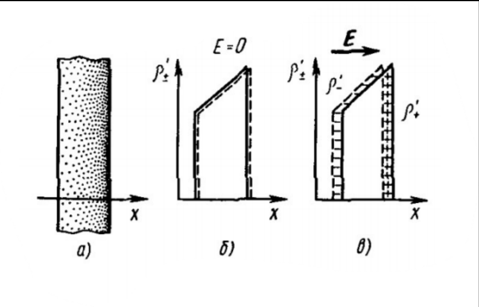
Три панели, читать слева направо.

- **а)** Пластина диэлектрика, показана точками, поперёк неё проведена ось $x$. Присмотрись: точки слева реже, справа гуще. Это не небрежность художника, а главное условие всего рисунка — **диэлектрик неоднородный**. Без этого панель в) выглядела бы иначе.
- **б)** Подпись $E = 0$. По вертикали отложена $\rho'_{\pm}$ — плотности положительного и отрицательного связанного заряда (обе по модулю). Сплошная линия — плюсы, пунктир — минусы. Обе кривые нарисованы **одна на другой**: в каждой точке плюсов ровно столько же, сколько минусов. Наклонный верх — как раз та самая неоднородность: правее вещества больше. Итог: нескомпенсированного заряда нет нигде.
- **в)** Сверху стрелка $\vec E$ вправо — поле включили. Кривые разъехались: сплошная $\rho'_+$ уползла вправо (плюсы сместились по полю), пунктирная $\rho'_-$ — влево. И вылезли два эффекта сразу:
  - у **левого** края торчит полоска, где есть только минусы (заштрихована горизонтальными чёрточками) — это $\sigma' < 0$; у **правого** края полоска с одними плюсами (штриховка с крестиками) — это $\sigma' > 0$;
  - **между** ними кривые тоже не совпадают: верх-то наклонный, и сдвиг по горизонтали превращается в разницу по вертикали. Эта разница и есть объёмный связанный заряд $\rho'$.

Вот ради второго пункта картинка и нарисована. Если бы верх был горизонтальным (однородный диэлектрик), сдвиг двух одинаковых прямоугольников дал бы разницу только на краях, и $\rho'$ внутри не возникло бы. Проверь это мысленно — это лучший способ понять билет.

**Чего на рисунке не хватает:**

- Не показано поле $\vec E'$, которое создают появившиеся заряды. А ведь ради него всё и затевалось: оно направлено против $\vec E$ и ослабляет поле внутри.
- Смещение нарисовано огромным — полоски по краям сравнимы с толщиной пластины. В действительности сдвиг составляет доли размера молекулы, и полоски были бы тоньше волоса. Рисунок качественный, масштаб на нём выдуман.
- Знаки нигде не подписаны буквами: где $\sigma' > 0$, а где $\sigma' < 0$, приходится вычислять по типу штриховки. Легко перепутать.
- $\rho'_{\pm}$ отложена как модуль, обе кривые вверх. Если забыть об этом и прочитать пунктир как «отрицательная плотность», картинка развалится.
- Нет самого $\vec P$ — вектора, ради которого билет и написан. Полезно дорисовать: он смотрел бы вправо, вдоль $\vec E$, от минусовой грани к плюсовой.

### Что дальше

Билет 21 дал слова и определение, но не дал ни одной формулы, связывающей $\vec P$ со связанными зарядами. Обещания розданы дважды: «$\sigma'$ как-то связана с $P$» и «$\rho'$ появляется при неоднородности».

Билет 22 их выполняет. Там доказывается теорема Гаусса для $\vec P$

$$\oint_S \vec P\ d\vec S = -q'_{\text{внутр}}$$

и из неё вытекают обе связи: $\sigma' = P_n$ на поверхности и $\rho' = -\mathrm{div}\ \vec P$ в объёме.

---

## Разбор 22. Теорема Гаусса для P, связь P со связанными зарядами

### Где мы находимся

Билет 21 дважды выдал обещания и оба раза не выполнил: «$\sigma'$ как-то связана с $P$» и «$\rho'$ появляется там, где поляризация неоднородна». Билет 22 обе связи доказывает. Инструмент один — теорема Гаусса для $\vec P$, из неё выводится и то и другое.

Структура билета такая:

```
теорема Гаусса для P  →  дифференциальная форма  →  ρ' = −div P
                      →  таблетка на границе     →  σ' = P_n
```

### Главная идея доказательства: поток P — это «сколько вытекло»

Прежде чем лезть в косые цилиндры, пойми главную мысль. Она в одной фразе:

> **Поток $\vec P$ через замкнутую поверхность — это количество связанного заряда, которое при поляризации вытекло наружу через эту поверхность.**

Дальше всё просто. Если из мешка что-то вытекло, значит, внутри этого стало меньше. Отсюда и минус в теореме. Ничего сложнее в билете нет — остальное техника подсчёта «сколько именно вытекло».

Сравни с теоремой для $\vec E$ (билет 4): там поток считал заряд, **сидящий** внутри. Здесь поток считает заряд, **пересёкший** границу. Это разные вещи, и путать их нельзя.

### Косой цилиндр: откуда он берётся

Возьмём кусочек поверхности $dS$ и разберёмся, какие плюсы через него выйдут.

**Шаг 1. Кто вообще может выйти.** Поляризация сдвигает каждый плюс на расстояние $l_+$ — и всё, больше он никуда не денется. Значит, наружу выйдут только те плюсы, которые изначально сидели к площадке ближе, чем $l_+$. Те, что дальше, не дотянутся.

**Шаг 2. Как выглядит область этих «счастливчиков».** Возьми площадку $dS$ и отложи от каждой её точки вектор сдвига назад. Получится тело: основание $dS$, а рёбра — отрезки длины $l_+$, наклонённые под углом $\alpha$ к нормали. Это и есть **косой цилиндр**. Не прямой, потому что заряды смещаются вдоль поля, а поле не обязано быть перпендикулярным нашей площадке.

**Шаг 3. Его объём.** Тут главная ловушка билета. Объём цилиндра — это основание на **высоту**, а не на ребро:

$$dV_+ = dS\cdot h_+ = dS\ l_+\cos\alpha$$

Высота — это проекция ребра на нормаль, отсюда $\cos\alpha$. Наклони цилиндр сильнее — ребро прежнее, а высота (и объём) меньше. В пределе $\alpha = 90°$ заряды скользят вдоль площадки и не пересекают её вовсе: $\cos 90° = 0$, объём ноль. Проверка сходится.

Именно этот $\cos\alpha$ в конце превратит произведение в скалярное $\vec P\ d\vec S$. Так что косинус тут не украшение — он и есть источник «векторности» теоремы.

**Шаг 4. Заряд в этом объёме.** Плотность на объём:

$$dq'_+ = \rho'_+\ dV_+ = \rho'_+ l_+ dS\cos\alpha$$

### Уловка со знаками: почему минусы складываются с плюсами, а не вычитаются

Это место в билете обычно и вызывает вопрос. Плюсы уехали по полю и вышли наружу. Минусы уехали против поля — и, наоборот, **вошли** внутрь снаружи.

Казалось бы, эффекты противоположные и должны вычитаться. Но посмотри на баланс заряда **внутри** поверхности:

| | что произошло | заряд внутри |
|---|---|---|
| плюс вышел наружу | внутри стало на $+e$ меньше | уменьшился |
| минус вошёл внутрь | внутри добавился $-e$ | уменьшился |

Оба события одинаково **уменьшают** заряд внутри. Поэтому вклады складываются:

$$dq' = (\rho'_+ l_+ + \rho'_- l_-)\ dS\cos\alpha$$

Житейская аналогия: касса пустеет и когда из неё вынули сто рублей, и когда в неё положили долговую расписку на сто рублей. Разные действия — одинаковый результат для баланса.

### Сборка: как из $ne\ l$ получается $P$

Дальше чистая алгебра, но её полезно проговорить, потому что в ней вся физика билета.

1. Плотность связанных зарядов через молекулы: в единице объёма $n$ молекул, в каждой заряд $e$ каждого знака. Значит $\rho'_+ = ne$ и $\rho'_- = ne$ (по модулю).
2. Подставляем в скобку: $ne\ l_+ + ne\ l_- = ne(l_+ + l_-) = ne\ l$. Здесь $l$ — **полное** расхождение плюса и минуса внутри молекулы: плюс уехал вперёд на $l_+$, минус назад на $l_-$, разъехались они на сумму.
3. Но заряд на расстояние — это дипольный момент молекулы: $e\ l = p$.
4. А момент одной молекулы на их концентрацию — это момент единицы объёма, то есть поляризованность: $n\ p = P$ (билет 21).

Итог:

$$dq' = P\ dS\cos\alpha = \vec P\ d\vec S$$

Обрати внимание, что случилось: слева стояли микроскопические величины, которых никто не знает ($n$, $e$, $l_\pm$), а справа осталась одна макроскопическая $\vec P$, которую можно измерить. Ради этого билет и написан.

### Откуда берётся минус

Проинтегрировали по всей поверхности — получили весь вышедший наружу заряд $q'_{\text{выш}} = \oint \vec P\ d\vec S$.

Дальше закон сохранения заряда: заряд не исчез, он просто переехал через границу. Сколько вышло — на столько же уменьшилось то, что осталось:

$$q'_{\text{внутр}} = -q'_{\text{выш}} \quad\Longrightarrow\quad \oint_S \vec P\ d\vec S = -q'_{\text{внутр}}$$

Проверь знак на понятном примере: диэлектрик поляризован вправо, $\vec P$ смотрит вправо. Окружим мысленно левую грань пластины. Поток $\vec P$ через эту поверхность положителен (внутри $P \neq 0$, снаружи ноль, вектор выходит вправо). Значит, заряд внутри отрицательный. И правда: на левой грани скапливаются минусы. Сходится.

### Дифференциальная форма и что такое div на пальцах

Переход стандартный, мы его уже делали в билете 4 для $\vec E$:

1. Поток превращаем в объёмный интеграл: $\oint_S \vec P\ d\vec S = \int_V \mathrm{div}\ \vec P\ dV$ (математическая теорема Остроградского-Гаусса).
2. Заряд тоже пишем интегралом: $q'_{\text{внутр}} = \int_V \rho'\ dV$.
3. Получаем $\int_V (\mathrm{div}\ \vec P + \rho')\ dV = 0$ для **любого** объёма. Значит подынтегральное выражение равно нулю везде.

$$\mathrm{div}\ \vec P = -\rho'$$

**Что это значит по-человечески.** Дивергенция — это «насколько поле расходится из точки». Если $\vec P$ всюду одинакова, ничего ниоткуда не расходится, дивергенция ноль, и связанного заряда в объёме нет — всё скомпенсировано, как в цепочке диполей из билета 21.

А вот если $\vec P$ меняется от точки к точке — например, справа поляризация сильнее, чем слева, — то справа из кубика «выносит» больше заряда, чем слева «вносит». Кубик обедняется, и в нём остаётся нескомпенсированный заряд. Это и есть $\rho'$.

Так что формула $\mathrm{div}\ \vec P = -\rho'$ — это ровно та фраза из билета 21 («$\rho'$ появляется там, где поляризация меняется от точки к точке»), записанная значком.

### Таблетка на границе: почему именно такая форма

Нужно поймать поверхностный заряд. Приём стандартный (так же ловили $E_n = \sigma/\varepsilon_0$ в билете 12): берём замкнутую поверхность, которая **обнимает кусок границы** и почти не имеет ничего лишнего.

Таблетка (плоский цилиндр) идеальна: два торца $\Delta S$ параллельно границе, высота стремится к нулю.

- **Боковая поверхность.** Её площадь — это периметр на высоту. Высоту устремляем к нулю, значит и поток через бок к нулю. Одним слагаемым меньше.
- **Торцы.** Верхний сидит в среде 2, его внешняя нормаль совпадает с $\vec n$, вклад $P_{2n}\Delta S$. Нижний сидит в среде 1, его внешняя нормаль смотрит **вниз**, то есть противоположна $\vec n$, поэтому вклад $-P_{1n}\Delta S$. Складываем: $(P_{2n} - P_{1n})\Delta S$.
- **Заряд внутри.** Внутрь таблетки попал только кусок границы с зарядом $\sigma'\Delta S$.

Подставляем в теорему $(P_{2n} - P_{1n})\Delta S = -\sigma'\Delta S$, сокращаем $\Delta S$:

$$P_{2n} - P_{1n} = -\sigma'$$

**Частный случай — диэлектрик и вакуум.** В вакууме поляризовать нечего, $P_2 = 0$. Остаётся $-P_{1n} = -\sigma'$, то есть

$$\sigma' = P_n$$

где $\vec n$ — внешняя нормаль к поверхности диэлектрика.

**Проверка на бруске.** В билете 21 мы уже получали этот результат грубым способом: у поляризованного бруска $P = q'/S = \sigma'$. Теперь видно, что то была частная версия общей формулы для случая, когда $\vec P$ перпендикулярна грани. Для косой грани появляется проекция: часть поляризации «скользит» вдоль поверхности и заряда на ней не создаёт.

Знак теперь тоже читается сам: на грани, куда уехали плюсы, $\vec P$ направлена наружу, $P_n > 0$, и $\sigma' > 0$. На противоположной грани $\vec P$ смотрит внутрь, проекция отрицательна, $\sigma' < 0$. Ровно то, что видно глазами.

### Формула $\rho' = -\dfrac{\varkappa}{1+\varkappa}\rho$ и что из неё следует

Вывод в билете — четыре подстановки подряд, ничего хитрого. Важен результат, а точнее два его предельных случая.

**Случай $\rho = 0$** (внутри диэлектрика нет сторонних зарядов). Тогда $\rho' = 0$. Это главный практический вывод всего билета: **в однородном изотропном диэлектрике объёмных связанных зарядов не бывает**, если мы сами не запихнули туда посторонний заряд. Вся поляризация вылезает наружу, на поверхность.

Поэтому в задачах про конденсатор с диэлектриком никогда не считают $\rho'$ — его там просто нет.

**Случай очень большой $\varkappa$.** Дробь $\varkappa/(1+\varkappa)$ стремится к единице, и $\rho' \to -\rho$. Связанный заряд почти полностью гасит сторонний. Это предел «диэлектрик работает как проводник»: у проводника поле внутри обнуляется полностью, потому что заряды свободны. Хорошая проверка на здравый смысл: чем легче вещество поляризуется, тем ближе оно к проводнику.

**Случай $\varkappa \to 0$** (вещество почти не поляризуется, как вакуум): $\rho' \to 0$, связанных зарядов нет вовсе. Тоже сходится.

Заодно из формулы видно: $\rho'$ и $\rho$ всегда противоположных знаков. Связанные заряды всегда **ослабляют** то, что создали сторонние, а не усиливают.

### Три теоремы Гаусса рядом

К этому моменту у тебя их две, а в следующем билете будет третья. Держи их в одной таблице, на экзамене это спасает.

| | поток чего | равен чему | какие заряды учитывает |
|---|---|---|---|
| билет 4 | $\vec E$ | $q_{\text{внутр}}/\varepsilon_0$ | **все**: и сторонние, и связанные |
| билет 22 | $\vec P$ | $-q'_{\text{внутр}}$ | только связанные |
| билет 23 | $\vec D$ | $q_{\text{внутр}}$ | только сторонние |

Логика видна сразу: $\vec E$ знает про всё, но мы не знаем связанных зарядов; $\vec P$ знает ровно про них. Значит, если правильно сложить эти две теоремы, связанные заряды сократятся и останется только то, что мы задаём сами. Такая комбинация и есть $\vec D = \varepsilon_0\vec E + \vec P$ — это билет 23.

### Про рисунки

**`22-skew-cylinder.png`.** Две панели.

- **а)** Замкнутая поверхность $S$ нарисована как овал (это «мешок», который мы мысленно провели внутри диэлектрика). Сквозь неё проходит заштрихованное тело, а полая стрелка справа показывает направление, куда поляризация вытаскивает заряды. Смысл панели: часть связанного заряда пересекает границу мешка и оказывается снаружи.
- **б)** Крупный план того самого косого цилиндра. Основание подписано $dS$, вдоль наклонной оси $s$ отложены отрезки $l_+$ и $l_-$ — сдвиги плюсов и минусов. Стрелка $\vec n$ — нормаль к площадке, стрелка $\vec p$ — направление смещения зарядов (вдоль поля), между ними угол $\alpha$. Пунктиром показаны невидимые рёбра. Именно проекция $l$ на $\vec n$ и даёт высоту $l\cos\alpha$.

**Чего не хватает на этом рисунке:**

- Не показано само поле $\vec E$, хотя направление сдвига задаёт именно оно. Приходится догадываться, что стрелка $\vec p$ смотрит вдоль поля.
- Не отмечено, где «внутри», а где «снаружи» мешка на панели б) — а от этого зависит знак.
- Не нарисованы сами заряды: было бы нагляднее увидеть плюсы, заполняющие косой цилиндр, и минусы, входящие навстречу.
- Панели а) и б) никак не связаны: не показано, что $dS$ на панели б) — это кусочек поверхности $S$ с панели а).

**`22-boundary.png`.** Волнистая линия — граница двух диэлектриков; снизу подписана среда **1**, сверху среда **2**. На границе сидит плоский цилиндр-таблетка, площадь торца подписана $\Delta S$.

- Сплошная стрелка $\vec n$ вверх — общая нормаль, направленная из среды 1 в среду 2. Такая же стрелка $\vec n$ нарисована левее, отдельно от таблетки, — это та же нормаль к границе, просто вынесенная, чтобы не загромождать.
- Пунктирная стрелка $\vec n'$ вниз — внешняя нормаль нижнего торца. Она противоположна $\vec n$, и ровно отсюда берётся минус в выражении $(P_{2n} - P_{1n})\Delta S$.

**Чего не хватает:**

- Высота таблетки нарисована вполне заметной, хотя весь фокус доказательства в том, что она стремится к нулю. По картинке кажется, что боковой поверхностью пренебрегли произвольно.
- Не показаны сами векторы $\vec P_1$ и $\vec P_2$ в двух средах — а считаем мы именно их проекции.
- Не нарисован связанный заряд $\sigma'$ на границе, ради которого всё и делается.

### Что дальше

Билет 22 закрыл тему связанных зарядов: теперь мы умеем находить и $\sigma'$, и $\rho'$, если знаем $\vec P$.

Но остался порочный круг, о котором говорилось в билете 21: чтобы найти $\vec P$, нужно знать поле $\vec E$ внутри, а поле внутри зависит от связанных зарядов, то есть от $\vec P$. Билет 23 разрывает этот круг, вводя вектор $\vec D$, поток которого зависит только от сторонних зарядов — тех, что мы знаем всегда.

---

## Разбор 23. Вектор D и теорема Гаусса для него

### Где мы находимся

В конце билета 22 была таблица трёх теорем Гаусса и обещание: если сложить теоремы для $\vec E$ и $\vec P$, связанные заряды сократятся. Билет 23 это обещание выполняет. Всё содержание билета — одно сложение двух строчек.

### Проблема, ради которой всё затевалось

Сформулируем честно, в чём беда с теоремой для $\vec E$:

$$\oint_S \vec E\ d\vec S = \frac{q + q'}{\varepsilon_0}$$

Слева величина, которую мы хотим найти. Справа два заряда. Первый, $q$, мы знаем — это мы сами зарядили обкладки. А второй?

Чтобы найти $q'$, нужно знать $\vec P$ (билет 22: $\sigma' = P_n$). Чтобы найти $\vec P$, нужно знать $\vec E$ (билет 21: $\vec P = \varkappa\varepsilon_0\vec E$). А чтобы найти $\vec E$ — нужно знать $q'$. Круг замкнулся:

```
E  →  P  →  q'  →  E  →  ...
```

Это не техническая сложность, а принципиальная: связанные заряды не задаются извне, они **отклик** среды на то самое поле, которое мы ищем. Поэтому уравнение с двумя неизвестными и не решается напрямую.

### Идея: сложить так, чтобы неизвестное сократилось

Приём чисто бухгалтерский. У нас есть два уравнения, и в обоих сидит один и тот же неприятный $q'$ — но с **разными знаками**:

| теорема | что справа | как входит $q'$ |
|---|---|---|
| для $\vec E$ (умножили на $\varepsilon_0$) | $q + q'$ | со знаком **плюс** |
| для $\vec P$ (билет 22) | $-q'$ | со знаком **минус** |

Складываем — и $q'$ исчезает:

$$\oint_S \left(\varepsilon_0\vec E + \vec P\right) d\vec S = q$$

Комбинация в скобках оказалась настолько удачной, что ей дали имя и букву:

$$\vec D = \varepsilon_0\vec E + \vec P$$

Заметь порядок действий. Сначала выяснилось, какая комбинация полезна, и только потом её назвали вектором смещения. Не наоборот. Это типичная история в физике: величину вводят не потому, что она «существует», а потому, что с ней уравнение становится решаемым.

**Почему знак минус в теореме для $\vec P$ оказался таким удачным.** Он не случаен: поток $\vec P$ считает заряд, **вышедший** наружу, а внутри его на столько же стало меньше (билет 22). Именно эта «зеркальность» и позволяет сократить $q'$.

### Главное предупреждение: $\vec D$ — не поле

Тут легко запутаться, поэтому проговорим прямо.

- $\vec E$ — **настоящее** поле. Именно оно действует на заряд силой $\vec F = q\vec E$. Именно его чувствует пробный заряд.
- $\vec D$ — **вспомогательная величина**. Сила $q\vec D$ не имеет физического смысла. Это удобная комбинация «поле плюс отклик среды», придуманная ради одной цели: чтобы связанные заряды выпали из уравнения.

Хорошая проверка на понимание: в формуле $\vec D = \varepsilon_0\vec E + \vec P$ складываются величины **разной природы** — характеристика поля и характеристика вещества. Настоящая физическая величина так обычно не устроена.

Название «смещение» — исторический пережиток времён теории эфира, когда $\vec D$ понимали как смещение зарядов в среде. Смысла в названии искать не надо.

### Откуда берётся $\varepsilon = 1 + \varkappa$

Подставляем $\vec P = \varkappa\varepsilon_0\vec E$ в определение и выносим за скобку:

$$\vec D = \varepsilon_0\vec E + \varkappa\varepsilon_0\vec E = \varepsilon_0(1 + \varkappa)\vec E$$

Единица в скобке — это вклад **вакуума** (слагаемое $\varepsilon_0\vec E$ есть всегда, даже если вещества нет), а $\varkappa$ — добавка от **вещества** (слагаемое $\vec P$). Отсюда сразу два вывода:

- для вакуума $\varkappa = 0$, значит $\varepsilon = 1$;
- для любого вещества $\varkappa > 0$, значит $\varepsilon > 1$ — среда всегда ослабляет поле, никогда не усиливает.

Теперь понятно, зачем в билете 21 в формулу $\vec P = \varkappa\varepsilon_0\vec E$ был воткнут $\varepsilon_0$: без него сложение $\varepsilon_0\vec E + \vec P$ не свернулось бы так красиво в $\varepsilon_0(1+\varkappa)\vec E$.

**Смысл $\varepsilon$ на пальцах.** Внесли диэлектрик, сторонние заряды не трогали. Тогда $\vec D$ не изменился (он от среды не зависит — его поток задан сторонними зарядами), а $E = D/\varepsilon_0\varepsilon$ уменьшился в $\varepsilon$ раз. Отсюда $E = E_0/\varepsilon$ — та самая формула, которая в билете 20 была получена на словах («поле ослабляется»), а теперь стала числом.

### Как этим пользоваться: рецепт

Практическая ценность билета — вот эта последовательность:

1. Находим $\vec D$ по теореме Гаусса, используя **только** сторонние заряды и симметрию задачи. Про диэлектрик на этом шаге можно вообще не думать.
2. Переходим к полю: $E = D/\varepsilon_0\varepsilon$.
3. Если нужно, находим связанные заряды: $\sigma' = P_n$, где $\vec P = \vec D - \varepsilon_0\vec E$.

**Пример — плоский конденсатор с диэлектриком.** Цилиндр Гаусса с торцом $\Delta S$, охватывающий обкладку с плотностью $\sigma$:

$$D\Delta S = \sigma\Delta S \quad\Longrightarrow\quad D = \sigma$$

Красиво: **численно $D$ равен поверхностной плотности сторонних зарядов на обкладке** — и никакой диэлектрик на это не влияет. А поле уже зависит от среды:

$$E = \frac{\sigma}{\varepsilon_0\varepsilon}$$

Вот откуда в билете 17 в формулах ёмкости появляется $\varepsilon$: напряжение $U = Eh$ падает в $\varepsilon$ раз, а значит $C = q/U$ во столько же раз растёт.

### Одно замечание о доказательстве из PDF

В PDF теорема для $\vec D$ доказывается иначе: берётся теорема Гаусса для $\vec E$ **сразу в виде** $\oint E_n dS = \sum q_i/\varepsilon_0\varepsilon$ и обе части умножаются на $\varepsilon_0\varepsilon$.

Ответ получается правильный, но рассуждение слабое: формула $\oint E_n dS = \sum q_i/\varepsilon_0\varepsilon$ — это уже следствие теоремы для $\vec D$, её обычно из неё и получают. Выходит доказательство по кругу, и работает оно только для однородного диэлектрика.

Поэтому в билете написан вывод через сложение двух теорем: он честный, ничего заранее не предполагает и годится для любого случая. Если преподаватель захочет ровно PDF-версию — она получается из нашей в одну строку подстановкой $D = \varepsilon_0\varepsilon E$, так что ты ничего не теряешь.

### Три вектора рядом

Таблица, которую стоит держать в голове до конца раздела.

| | $\vec E$ | $\vec P$ | $\vec D$ |
|---|---|---|---|
| что это | настоящее поле | поляризация среды | вспомогательная комбинация |
| единица | В/м | Кл/м² | Кл/м² |
| поток равен | $(q + q')/\varepsilon_0$ | $-q'$ | $q$ |
| какие заряды видит | все | только связанные | только сторонние |
| действует ли на заряд | да, $\vec F = q\vec E$ | нет | нет |
| зависит от среды | да | да | нет (при заданных сторонних зарядах) |

### Про рисунок

**`23-flux-D.png`.** Картинка иллюстрирует само понятие потока, а не теорему.

- **Зелёный замкнутый контур** подписан $S$ — это замкнутая поверхность, изображённая условно (мы смотрим на неё сбоку, поэтому она выглядит как петля).
- **Голубые стрелки** — линии вектора $\vec D$, они пронизывают поверхность насквозь. Пунктирные участки — те куски линий, что проходят с невидимой стороны.
- **Красная стрелка** $\vec n$ — внешняя нормаль к поверхности.
- **Угол $\alpha$** между $\vec D$ и $\vec n$ — тот самый угол, который даёт $D_n = D\cos\alpha$ в подынтегральном выражении.

**Чего на рисунке не хватает:**

- **Не нарисованы заряды.** Для картинки к теореме Гаусса это главный пропуск: вся теорема про то, чему равен поток, а справа стоит заряд внутри. По рисунку кажется, что все линии входят с одной стороны и выходят с другой, то есть суммарный поток нулевой — а это случай, когда сторонних зарядов внутри **нет**. Стоит дорисовать заряд внутри контура и увидеть, что тогда линии начинаются на нём.
- Не показан диэлектрик. Весь смысл $\vec D$ в том, что картинка не меняется при внесении вещества, — но самого вещества на рисунке нет, и сравнить не с чем.
- Нет площадки $dS$, к которой относится угол $\alpha$: нормаль нарисована как бы к поверхности вообще, хотя у каждой точки она своя.

### Что дальше

Мы научились считать поле в **однородном** диэлектрике. Но как только сред становится две, возникает вопрос: что происходит с $\vec E$ и $\vec D$ на границе между ними?

Ответ — билет 24: тангенциальная составляющая $\vec E$ не меняется, нормальная составляющая $\vec D$ не меняется (если на границе нет сторонних зарядов), а две другие составляющие терпят скачок в $\varepsilon$ раз. Инструменты для доказательства у тебя уже есть: теорема о циркуляции $\vec E$ и теорема Гаусса для $\vec D$ из этого билета.

---

## Разбор 24. Граница двух диэлектриков

### Где мы находимся

Билет 23 научил считать поле **внутри одной** однородной среды: нашли $\vec D$ по сторонним зарядам, поделили на $\varepsilon_0\varepsilon$. Но реальная задача почти всегда про **две** среды: стекло в воздухе, масло в конденсаторе, вода и лёд. Значит нужно знать, что происходит с полем в момент перехода через границу.

Ответ короткий и его стоит выучить как считалочку: **у $\vec E$ непрерывна касательная часть, у $\vec D$ — нормальная.** Остальное — вывод этих двух фактов и одно следствие из них.

### Почему нужны отдельные «граничные условия»

Внутри однородной среды поле меняется плавно. На границе оно меняется **скачком**: слева одно вещество, справа другое, и толщины перехода фактически нет. Никакая формула для объёма про такой скачок ничего не скажет — нужно отдельное правило, связывающее значения слева и справа. Это и называется граничным условием.

Инструментов у нас ровно два, и каждый даёт свою половину ответа:

| инструмент | что «щупает» | что даёт |
|---|---|---|
| теорема о циркуляции $\oint \vec E\ d\vec l = 0$ | обход **вдоль** границы | условие на **касательную** составляющую |
| теорема Гаусса $\oint \vec D\ d\vec S = q$ | поток **сквозь** границу | условие на **нормальную** составляющую |

Отсюда и вся структура билета: два доказательства, построенные по одному шаблону.

### Общий шаблон обоих доказательств

Он одинаков, и если понять его один раз, оба вывода пишутся автоматически.

1. **Ставим на границу маленькую фигурку** — прямоугольную рамку или плоскую таблетку.
2. **Сплющиваем её**, устремляя высоту к нулю. Боковые куски исчезают, остаются только две «рабочие» стороны — одна в среде 1, другая в среде 2.
3. **Замечаем, что они ориентированы противоположно**: у рамки обход идёт в разные стороны, у таблетки внешние нормали смотрят в разные стороны. Отсюда минус между двумя слагаемыми.
4. **Приравниваем нулю** (циркуляция нуль всегда; поток нуль, если внутри нет сторонних зарядов) и сокращаем на $l$ или на $\Delta S$.

**Тонкость про сплющивание.** Когда высота стремится к нулю, объём таблетки тоже стремится к нулю — поэтому **объёмный** заряд внутри исчезает, и его в условие не пишут. А вот **поверхностный** заряд не исчезает: площадь оснований $\Delta S$ остаётся конечной, и заряд $\sigma\Delta S$ остаётся. Именно поэтому в общем условии справа стоит $\sigma$, а не $\rho$.

### Почему условия физичны, а не формальны

**Почему $E_\tau$ не может прыгнуть.** Представь, что прыгнула. Тогда обход по нашей рамке (туда по среде 2, обратно по среде 1) дал бы ненулевую работу — заряд возвращался бы в исходную точку с прибавкой энергии. Это вечный двигатель. Электростатическое поле потенциально, значит такого не бывает.

**Почему $D_n$ не может прыгнуть.** Линии $\vec D$ рождаются и умирают **только** на сторонних зарядах (это и есть теорема из билета 23). На границе двух диэлектриков сторонних зарядов нет — линиям там просто негде начаться или закончиться. Сколько линий подошло, столько и прошло дальше.

**Почему $E_n$ прыгает.** А вот связанные заряды на границе есть — при поляризации на стыке двух сред выступает поверхностный связанный заряд (билет 22). Он и создаёт скачок настоящего поля. Это ровно то, ради чего вводился $\vec D$: он этих зарядов «не видит», поэтому и остаётся гладким.

### Итоговая таблица

| величина | на границе | во сколько раз меняется |
|---|---|---|
| $E_\tau$ | непрерывна | — |
| $D_n$ | непрерывна (если $\sigma = 0$) | — |
| $D_\tau$ | скачок | $D_{2\tau}/D_{1\tau} = \varepsilon_2/\varepsilon_1$ |
| $E_n$ | скачок | $E_{2n}/E_{1n} = \varepsilon_1/\varepsilon_2$ |

Мнемоника: **«тангенс — у E, нормаль — у D»**. Две другие строчки таблицы отдельно учить не надо: они получаются из первых двух домножением на $\varepsilon_0\varepsilon$.

### Закон преломления: что тут на самом деле происходит

Вектор в среде 2 получается из вектора в среде 1 так: **касательную часть оставили как была, а нормальную укоротили в $\varepsilon_2/\varepsilon_1$ раз** (при $\varepsilon_2 > \varepsilon_1$). Одну сторону прямоугольника не тронули, вторую сжали — понятно, что диагональ завалилась набок, ближе к границе. Формула $\tan\alpha_2/\tan\alpha_1 = \varepsilon_2/\varepsilon_1$ просто записывает это числом.

**Пример.** Воздух ($\varepsilon_1 = 1$) и стекло ($\varepsilon_2 \approx 7$), линия падает под $30^\circ$ к нормали. Тогда $\tan\alpha_2 = 7\tan 30^\circ \approx 4{,}04$, то есть $\alpha_2 \approx 76^\circ$. Линия в стекле идёт почти вдоль границы.

**Осторожно: это не закон Снеллиуса.** В оптике преломление света описывается отношением **синусов**, и синус большего угла в среде с меньшим показателем. Здесь — отношение **тангенсов**, и угол растёт в среде с большей $\varepsilon$. Слово «преломление» одно, законы разные; путать их на экзамене — классическая ошибка.

### Предельный случай: проводник

Проводник можно считать средой с $\varepsilon \to \infty$. Пусть среда 2 — проводник, среда 1 — диэлектрик. Внутри проводника поля нет вообще (билет 12), значит $E_{2\tau} = 0$. Но касательная составляющая непрерывна, поэтому и $E_{1\tau} = 0$: **поле в диэлектрике у самой поверхности проводника перпендикулярно ей**.

Это тот самый факт из билета 12, который там был получен отдельным рассуждением, — теперь он выпадает из общего граничного условия одной строкой. А вторая половина этого предельного случая (что происходит с $D_n$ у поверхности проводника) — это уже билет 25.

### Про рисунки

**`24-tangential.png`.** Волнистая жирная линия — граница раздела, цифры **2** сверху и **1** снизу нумеруют среды. На границе лежит вытянутый прямоугольник — тот самый контур; его высота нарисована маленькой, чтобы напомнить про $h \to 0$. Сверху размерная стрелка с буквой $l$ — длина контура. Внутри прямоугольника две стрелочки: верхняя $\tau$ смотрит вправо, нижняя $\tau'$ — влево. Это и есть направление обхода: по верхней стороне идём вперёд, по нижней возвращаемся. Стрелка $\tau$ справа, вне прямоугольника, — единичный касательный вектор границы.

*Чего не хватает:* **самого поля**. На картинке нет ни одного вектора $\vec E$ — а доказательство именно про его проекции $E_{1\tau}$ и $E_{2\tau}$. Не подписаны $\varepsilon_1$ и $\varepsilon_2$, не обозначена высота $h$ (её стоило подписать, раз мы её устремляем к нулю), и не показаны боковые стороны как отдельные отрезки — а ведь вся третья строчка доказательства про то, что их вклад исчезает.

**`24-normal.png`.** Та же волнистая граница со средами 1 и 2. На ней стоит плоский цилиндр — «таблетка». Верхнее основание подписано $\Delta S$. Две стрелки $n$: одна слева, у самой границы (нормаль к границе, направлена из среды 1 в среду 2), вторая — из центра верхнего основания (внешняя нормаль верхнего основания, совпадает с первой). Пунктирная стрелка $n'$ вниз — внешняя нормаль **нижнего** основания, направлена противоположно. Пунктир нижнего эллипса означает, что это невидимая сторона.

*Что тут главное:* две стрелки $n$ и $n'$ смотрят в разные стороны — вот откуда минус в $D_{2n}\Delta S - D_{1n}\Delta S$. Рисунок сделан ровно ради этого.

*Чего не хватает:* опять нет ни одного вектора $\vec D$; нет подписей $\varepsilon_1$, $\varepsilon_2$; не отмечено, что высота таблетки стремится к нулю; и не показано, что на границе может сидеть заряд $\sigma$ — а именно от него зависит, будет справа ноль или $\sigma\Delta S$.

**`24-refraction.png`.** Единственная цветная картинка билета, и самая содержательная. Граница здесь **вертикальная** (двойная линия посередине), слева среда $\varepsilon_1$, справа $\varepsilon_2$. В каждой среде вектор $\vec E$ (зелёная стрелка) достроен до прямоугольника: вертикальная сторона — касательная составляющая $\vec E_{1\tau}$, $\vec E_{2\tau}$, горизонтальная — нормальная $\vec E_{1n}$, $\vec E_{2n}$. Углы $\alpha_1$ и $\alpha_2$ отсчитываются от горизонтали, то есть **от нормали** — как и в формулах.

Самое ценное: **вертикальные стороны обоих прямоугольников одинаковой высоты, а горизонтальная справа заметно короче.** Это и есть оба граничных условия, нарисованные глазами: касательная часть сохранилась, нормальная сжалась. Отсюда сразу видно, что $\alpha_2 > \alpha_1$, значит на рисунке $\varepsilon_2 > \varepsilon_1$.

Плюсы и минусы вдоль границы — поверхностные связанные заряды, выступившие на стыке сред.

*Чего не хватает и что мешает:* граница нарисована двойной линией, и заряды показаны по обе стороны от неё — как два отдельных слоя, по одному от каждой среды. Суммарный заряд стыка — это их сумма, и её знак на картинке не виден. Отдельная стрелка $\vec E_0$ внизу вообще ничем не объяснена: в тексте билета никакого внешнего поля $\vec E_0$ нет, и что она там делает — непонятно. Ещё нет линий поля как таковых — нарисованы два отдельных вектора в разных местах, а не одна ломающаяся на границе линия, хотя закон называется законом преломления **линий**.

### Что дальше

Билет 25 — частный случай сегодняшнего: одна из сред становится проводником. Половину результата мы уже получили выше ($\vec E$ перпендикулярно поверхности), останется разобраться с $\vec D$ и найти связанный заряд, выступающий на диэлектрике у поверхности проводника.

---

## Разбор 25. Граница проводник-диэлектрик

### Где мы находимся

Билет 24 дал общие граничные условия для двух любых диэлектриков. Билет 25 — их частный случай: одну из сред заменяем проводником. Никакой новой теории здесь нет, весь билет — две подстановки в уже готовые формулы. Это самый лёгкий билет раздела, и заканчивает он всю тему диэлектриков.

### Первая часть: проводник обнуляет сразу всё

Ключевой шаг записывается одной строчкой, но в нём три звена, и каждое стоит на своём основании:

$$\vec E_1 = 0 \quad\Longrightarrow\quad \vec P_1 = 0 \quad\Longrightarrow\quad \vec D_1 = 0$$

- $\vec E_1 = 0$ — это **билет 12**: в равновесии поле внутри проводника отсутствует, иначе свободные электроны продолжали бы двигаться и равновесия бы не было.
- $\vec P_1 = 0$ — это **билет 21**: поляризованность пропорциональна полю, $\vec P = \varkappa\varepsilon_0\vec E$. Нет поля — нечему поворачивать и смещать молекулы.
- $\vec D_1 = 0$ — это **билет 23**, само определение $\vec D = \varepsilon_0\vec E + \vec P$: оба слагаемых нули, значит и сумма ноль.

Соблазн сказать «в проводнике всё ноль, что тут выводить» — но на экзамене как раз спросят, **почему** $\vec D = 0$, и ответ «потому что $\vec E = 0$» неполон: $\vec D$ не пропорционален $\vec E$ по определению, он равен $\varepsilon_0\vec E + \vec P$. Нужны оба слагаемых.

Дальше подстановка в условие $D_{2n} - D_{1n} = \sigma$ из билета 24 убирает второе слагаемое, и остаётся $D_n = \sigma$.

**Что это значит наглядно.** Все линии $\vec D$, выходящие из проводника, «пересчитаны» его собственным зарядом. Диэлектрик на это не влияет вообще: сколько заряда посадили на проводник, такова и $D$ у поверхности. Мы это уже видели в билете 23 на примере плоского конденсатора, где получилось ровно $D = \sigma$ — теперь понятно, что это не свойство конденсатора, а общее свойство любой поверхности проводника.

**А поле?** Вот оно от диэлектрика зависит: $E = D/\varepsilon_0\varepsilon = \sigma/\varepsilon_0\varepsilon$. При $\varepsilon = 1$ получается $\sigma/\varepsilon_0$ — та самая формула из билета 12. Хорошая проверка: новая формула обязана переходить в старую, когда диэлектрика нет.

### Вторая часть: главный приём вывода σ′

Тут стоит остановиться, потому что приём красивый и его любят спрашивать.

Мы берём **одну и ту же величину** — нормальную составляющую поля $E_n$ у поверхности — и считаем её **двумя разными способами**:

| способ | какая теорема | какие заряды видит | результат |
|---|---|---|---|
| первый | Гаусса для $\vec E$ | **все**: и $\sigma$, и $\sigma'$ | $E_n = \dfrac{\sigma + \sigma'}{\varepsilon_0}$ |
| второй | Гаусса для $\vec D$ | только сторонние $\sigma$ | $E_n = \dfrac{\sigma}{\varepsilon_0\varepsilon}$ |

Поле-то одно. Значит выражения равны — и из этого равенства выпадает $\sigma'$, единственная неизвестная.

Обрати внимание, как это соотносится с билетом 23. Там мы две теоремы **складывали**, чтобы связанный заряд сократился и исчез. Здесь мы их **приравниваем**, чтобы связанный заряд, наоборот, выразить. Один и тот же набор инструментов работает в обе стороны: сначала мы прятали $\sigma'$, теперь достаём обратно.

**Откуда берётся первая формула.** Это билет 12, только аккуратнее. Ставим на поверхность проводника таблетку Гаусса: нижнее основание в металле, верхнее в диэлектрике. Внутри металла $E = 0$, поток через нижнее основание нулевой; через боковую поверхность — тоже (высота мала). Остаётся $E_n\Delta S$. А внутри таблетки сидят оба заряда: сторонний $\sigma\Delta S$ на металле и связанный $\sigma'\Delta S$ на прилегающем слое диэлектрика. Отсюда $E_n = (\sigma + \sigma')/\varepsilon_0$.

### Разбор ответа

$$\sigma' = -\frac{\varepsilon - 1}{\varepsilon}\sigma$$

**Знак минус.** Он не формальность, а физика. Пусть проводник заряжен положительно. Его поле тянет отрицательные части молекул диэлектрика к себе, а положительные отталкивает вглубь. В результате к металлу прижимается слой отрицательного связанного заряда. Плюс притягивает минус — ровно то, чего и ждёшь.

**Почему компенсация неполная.** Если бы вместо диэлектрика был второй проводник, заряды в нём были бы свободны и сбежались бы к границе до полной компенсации — поле внутри стало бы нулевым. В диэлектрике заряды **связаны**: они смещаются, но лишь чуть-чуть, пока внутримолекулярные силы не уравновесят внешнее поле. Поэтому и $|\sigma'| < \sigma$ всегда.

**Два предельных случая — проверка формулы.**

- $\varepsilon = 1$ (вакуум, диэлектрика нет): $\sigma' = 0$. Компенсировать нечем — правильно.
- $\varepsilon \to \infty$: $\sigma' \to -\sigma$, компенсация полная, поле в среде исчезает. А среда с бесконечной проницаемостью — это и есть проводник. Формула сама, без подсказок, переходит в поведение металла.

**Числа для интуиции.** Парафин, $\varepsilon = 2$: $\sigma' = -0{,}5\sigma$, компенсируется ровно половина. Вода, $\varepsilon = 81$: $\sigma' = -0{,}988\sigma$, компенсируется почти всё — вода по электрическим свойствам недалеко ушла от проводника.

### Зачем это всё нужно: замыкание темы

Сложим сторонний и связанный заряды границы:

$$\sigma + \sigma' = \sigma - \frac{\varepsilon - 1}{\varepsilon}\sigma = \frac{\sigma}{\varepsilon}$$

Вот он, ответ на вопрос, с которого начался весь раздел (билет 20): **почему диэлектрик ослабляет поле ровно в $\varepsilon$ раз?** Потому что связанные заряды съедают часть стороннего, и работающим остаётся $\sigma/\varepsilon$ вместо $\sigma$.

Дальше цепочка идёт сама: поле упало в $\varepsilon$ раз → напряжение $U = Eh$ упало в $\varepsilon$ раз → ёмкость $C = q/U$ выросла в $\varepsilon$ раз. Это билет 17, где $\varepsilon$ просто появлялась в формулах как данность. Теперь у неё есть механизм.

### Про рисунки

**Иллюстраций к 25-му билету в PDF нет** — как и к билетам 15 и 16. Но своя картинка тут почти не нужна: подойдёт `24-normal.png` из прошлого билета, если мысленно её достроить.

Как её читать применительно к этому билету: нижняя среда 1 — теперь металл, верхняя среда 2 — диэлектрик. Всё, что нарисовано ниже границы, «выключается»: там нет ни поля, ни $\vec D$. Остаётся только верхнее основание таблетки — единственное, через которое идёт поток. Дорисовать в уме стоило бы две вещи: слой плюсов на самой поверхности металла (сторонний заряд $\sigma$) и сразу над ним слой минусов на диэлектрике (связанный заряд $\sigma'$), причём минусов должно быть **меньше**, чем плюсов, — это и есть неполная компенсация.

### Что дальше

Тема диэлектриков закрыта, и стоит увидеть её целиком: билет 20 — что происходит в веществе качественно; 21 — мера этого, вектор $\vec P$; 22 — теорема Гаусса для $\vec P$ и связанные заряды; 23 — вектор $\vec D$, снимающий проблему неизвестных связанных зарядов; 24 — граница двух диэлектриков; 25 — граница с проводником и величина связанного заряда.

Билет 26 стоит особняком: он не про поля, а про вещества — электреты, пьезоэлектрики, пироэлектрики и сегнетоэлектрики. Формул там почти нет, зато много определений и свойств.

---

## Разбор 26. Виды диэлектриков. Сегнетоэлектрики

### Где мы находимся

Билеты 20–25 были про **поле**: как диэлектрик его меняет, какие векторы для этого придуманы, что происходит на границах. Билет 26 — про **вещества**. Формул тут почти нет, зато есть четыре названия, которые легко перепутать, и одна картинка (петля гистерезиса), которую надо уметь прочитать вслух. Это билет на понимание и аккуратную зубрёжку, а не на вывод.

### Четыре класса и почему они вложены

Начнём с главного вопроса: почему на картинке овалы вложены друг в друга, а не лежат рядом?

**Пьезоэлектрик** — кристалл, который поляризуется при деформации. Чтобы такое было возможно, кристалл должен быть **несимметричным**: если сжать симметричный кристалл, плюсы и минусы сместятся симметрично и в сумме ничего не изменится. Только у кристалла без центра симметрии сжатие разводит центры тяжести зарядов и рождает дипольный момент.

**Пироэлектрик** — кристалл, у которого дипольный момент есть **сам по себе**, без всякого внешнего воздействия (спонтанная поляризация), и меняется при нагреве. Но если у кристалла есть собственное выделенное направление поляризации, он тем самым уже несимметричен. Значит **любой пироэлектрик автоматически пьезоэлектрик** — стоит его сжать, поляризация изменится. Обратное неверно: кварц деформацию чувствует, а сам по себе не поляризован.

**Сегнетоэлектрик** — пироэлектрик, у которого спонтанную поляризацию можно **развернуть** внешним полем. Тоже частный случай: спонтанная поляризация есть у всех пироэлектриков, а переключается она не у всех.

Отсюда и матрёшка: сегнетоэлектрики $\subset$ пироэлектрики $\subset$ пьезоэлектрики.

**Электреты** в эту матрёшку не входят — это отдельная история. Электрет не обязан быть кристаллом: чаще это полимер (например, плёнка), который **нагрели, поместили в сильное поле и охладили прямо в поле**. Молекулы успели повернуться по полю, а застывшее вещество не даёт им повернуться обратно — ориентация «заморожена». Поле убрали, а поляризация осталась. Отсюда и сравнение с постоянным магнитом.

Где это встречается в жизни:

- пьезоэффект прямой — зажигалка и газовая плита с пьезоподжигом (щёлкнули по кристаллу, получили искру), датчики давления, микрофоны;
- пьезоэффект обратный — кварцевый резонатор в часах, излучатели ультразвука в УЗИ;
- электреты — электретные микрофоны (почти во всех наушниках и телефонах);
- сегнетоэлектрики — компактные конденсаторы большой ёмкости, элементы памяти.

### Домены: почему кристалл поляризован, а тела не чувствуют

Тут легко запутаться. Сегнетоэлектрик поляризован спонтанно — но кусок сегнетоэлектрика на столе не притягивает бумажки. Почему?

Потому что кристалл разбит на **домены** — крошечные области, внутри каждой из которых поляризация одинакова и доведена до предела («до насыщения»). Но соседние домены поляризованы в **разные** стороны, и если сложить их моменты, получится ноль. Ровно та же ситуация, что с полярными молекулами в билете 20: каждая молекула — диполь, а вещество в целом не поляризовано, потому что диполи смотрят вразнобой.

Разница в масштабе и в том, что мешает порядку:

| | билет 20, полярные молекулы | билет 26, домены |
|---|---|---|
| что смотрит вразнобой | отдельные молекулы | целые области кристалла |
| размер | молекула | микроскопическая, но огромная по сравнению с молекулой область |
| что сбивает порядок | тепловое движение | энергетическая выгода: разнонаправленные домены дают меньше энергии поля снаружи |
| что даёт порядок | внешнее поле, слабо и частично | внешнее поле, легко и почти полностью |

Последняя строка и есть ключ ко всем свойствам сегнетоэлектриков. Внешнему полю не нужно бороться с каждой молекулой по отдельности: достаточно чуть подтолкнуть **границу** между доменами, и «выгодный» домен подрастёт за счёт соседа, а целая область развернётся разом. Отклик получается коллективным — отсюда и гигантская $\varepsilon$.

### Почему ε такая огромная

Сравни механизмы.

- Обычный неполярный диэлектрик: поле растягивает электронное облако внутри молекулы на ничтожную долю её размера. Отклик мизерный, $\varepsilon$ порядка 2.
- Обычный полярный: поле разворачивает молекулы, но тепловое движение тут же сбивает их обратно. Отклик побольше, у воды $\varepsilon = 81$.
- Сегнетоэлектрик: поле сдвигает границы доменов, и уже поляризованные до насыщения области просто меняют «команду». Ничего не надо создавать — только переориентировать готовое. Отклик в тысячи раз больше, $\varepsilon$ доходит до $10^3 \ldots 10^4$.

Практический смысл: ёмкость конденсатора пропорциональна $\varepsilon$ (билет 17), и сегнетоэлектрик между обкладками увеличивает её в тысячи раз. Именно так получают крошечные конденсаторы приличной ёмкости.

### Как читать петлю гистерезиса

Это единственная картинка билета, которую спросят наверняка. По осям: горизонтально — внешнее поле $E_0$, вертикально — поляризованность $P$.

Пройдём по петле по шагам.
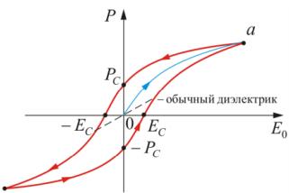

**1)** Стартуем из нуля: образец не поляризован, домены вразнобой. Включаем поле и увеличиваем — $P$ растёт по начальной кривой (на рисунке она внутри петли, к точке $a$).

**2)** Точка $a$ — **насыщение**. Все домены выстроены по полю. Дальше увеличивать поле бессмысленно: поляризованности расти неоткуда.

**3)** Теперь уменьшаем поле обратно к нулю. И вот главное: $P$ идёт **не по той же линии**, а выше. Домены «залипли» в новом положении, разворачиваться обратно им незачем.

**4)** Поле выключено, $E_0 = 0$, а поляризованность не ноль: осталась $P_C$ — **остаточная поляризованность**. Это и есть механизм электрета: поляризация без поля.

**5)** Чтобы её убрать, приходится включать поле **в обратную сторону**. Величина обратного поля, при которой $P$ обращается в ноль, называется **коэрцитивной силой** $E_C$ («коэрцитивный» — принуждающий).

**6)** Гоним поле дальше в минус — приходим в насыщение с другим знаком, потом возвращаемся, и картинка повторяется зеркально. Цикл замыкается в петлю.

Пунктирная прямая на рисунке — обычный диэлектрик: у него $P$ пропорциональна $E_0$, ход туда и обратно по одной и той же линии, никакой петли.

**Что означает сама форма графика.** Раз одному значению $E_0$ отвечают **два** значения $P$ (смотря с какой стороны мы пришли), значит $P$ не является функцией одного лишь поля — она зависит от предыстории. Это и называется гистерезисом. Заодно понятно, почему у сегнетоэлектрика нет одного числа $\varepsilon$: коэффициент между $P$ и $E$ разный в каждой точке петли.

Полезная деталь: площадь петли — это энергия, теряемая за один цикл (уходит в нагрев на перестройку доменов). Поэтому сегнетоэлектрики плохо работают на высоких частотах.

### Точка Кюри

Доменная структура держится на взаимодействии между частицами. Нагрев усиливает тепловое движение, и в какой-то момент оно это взаимодействие пересиливает — домены рассыпаются, спонтанная поляризация исчезает, огромная $\varepsilon$ пропадает. Вещество становится обычным полярным диэлектриком.

Происходит это не постепенно, а **скачком**, при вполне определённой температуре — это и есть точка Кюри, фазовый переход 2-го рода. У титаната бария она около $120\ ^\circ$C, у сегнетовой соли — около комнатной температуры, поэтому её свойства так капризны.

Полная аналогия есть в магнетизме: железо выше $770\ ^\circ$C перестаёт быть ферромагнетиком. Там тоже домены, тоже петля гистерезиса, тоже точка Кюри — сегнетоэлектрик устроен как «электрический магнит», и слово «сегнето» в физике магнетизма отвечает слову «ферро».

### Про рисунки

**Вложенность классов** (`26-classes.png`). Три овала один в другом: внешний — пьезоэлектрики, внутри — пироэлектрики, в самом центре — сегнетоэлектрики. Читается как «каждый следующий класс — часть предыдущего». Всё, что нужно из этой картинки, — направление вложения; нарисовать её на доске легко.

**Домены** (`26-domains.png`). Слева (а) — кристалл без поля: четыре домена, стрелки смотрят в четыре разные стороны, подпись $P = 0$. Справа (б) — тот же кристалл между обкладками: стрелки упорядочились, у всех появилась общая горизонтальная составляющая, подпись $P \sim E$.

Оговорка по этому рисунку: в PDF знаки на пластинах, похоже, переставлены. Поле между обкладками направлено от плюса к минусу, поляризованность — по полю, значит стрелки должны смотреть **в сторону отрицательной** пластины, а нарисованы в сторону положительной. Для смысла картинки это неважно (было вразнобой — стало упорядоченно), но если рисуешь сама, ставь стрелки остриём к минусу.

**Петля гистерезиса** (`26-hysteresis.png`). Разобрана по шагам выше. Обязательно подпиши на рисунке четыре вещи: оси $P$ и $E_0$, точку насыщения $a$, отрезок $P_C$ на вертикальной оси и отрезок $E_C$ на горизонтальной.

### Что дальше

Раздел электростатики закончен полностью: поле в вакууме (билеты 1–11), проводники (12–19), диэлектрики (20–26). Билет 27 открывает новую тему — **электрический ток**: заряды перестают стоять на месте, появляются сила тока, плотность тока и уравнение непрерывности. Многое из электростатики там продолжит работать, но условие «в равновесии внутри проводника поля нет» (билет 12) больше действовать не будет: именно поле внутри проводника и гонит ток.

---

## Разбор 27. Электрический ток. Уравнение непрерывности

### Где мы находимся

Начался новый раздел. Все двадцать шесть предыдущих билетов описывали **электростатику** — заряды стоят на месте, поля не меняются со временем. Теперь заряды поехали.

Сразу важное: билет 12 утверждал, что внутри проводника поля нет. Это не отменяется, но и не переносится сюда: там речь шла о **равновесии**. Ток — это как раз состояние, в котором равновесия нет, поле внутри проводника есть, и именно оно гонит заряды. Иначе двигаться было бы нечему.

Сам билет 27 — вводный и очень «бухгалтерский»: в нём вводятся две величины ($I$ и $\vec j$) и один закон, который на самом деле не новый закон, а старый — сохранение заряда, переписанный аккуратнее.

### Сила тока и плотность тока: зачем две величины

**Сила тока $I$** — это «сколько кулонов в секунду проходит через сечение провода». Величина простая, скалярная, и её измеряет амперметр. Но у неё есть недостаток: она относится к **сечению целиком**. Если провод толстый и ток по нему идёт неравномерно (например, у краёв гуще, чем в центре), $I$ об этом ничего не скажет.

Отсюда потребность в локальной величине — **плотности тока $\vec j$**. Она отвечает на вопрос «а что происходит вот в этой конкретной точке»: куда и насколько густо там течёт заряд.

Это ровно та же логика, что уже была дважды:

| «оптовая» величина | «розничная» величина | билет |
|---|---|---|
| заряд $q$ | плотность заряда $\rho$ | 3 |
| поток $\Phi$ через поверхность | напряжённость $\vec E$ в точке | 4 |
| сила тока $I$ через сечение | плотность тока $\vec j$ в точке | 27 |

И связь между ними каждый раз одна и та же: «оптовая» величина есть **интеграл** от «розничной». Для тока это $I = \int_S \vec j\ d\vec S$ — сила тока есть поток вектора $\vec j$. Слово «поток» тут не метафора, а тот же самый интеграл, что в билете 4, только вместо $\vec E$ стоит $\vec j$.

**Откуда берётся формула $\vec j = \rho\vec u$.** Проще всего проверить размерностью и здравым смыслом. Пусть в единице объёма сидит $n$ носителей с зарядом $q$, и все они дрейфуют со скоростью $u$. За время $dt$ через площадку $S$ пролетят все носители из столбика длиной $u\ dt$, то есть из объёма $Su\ dt$. Их заряд равен $nq \cdot Su\ dt$. Делим на $dt$ и на $S$ — получаем заряд через единицу площади за единицу времени, то есть $j = nqu = \rho u$.

**Почему в общей формуле два слагаемых.** В электролитах и газах ток несут одновременно и положительные ионы, и отрицательные. Положительные едут по полю, отрицательные — против, но переносят они заряд разного знака, поэтому вклады в ток **складываются**, а не вычитаются. В металлах носители одного сорта, и остаётся одно слагаемое $\vec j = \rho_-\vec u_-$; минус на минус даёт вектор, направленный против движения электронов, — то есть по направлению тока, как и договаривались.

**Забавный факт для интуиции.** Дрейфовая скорость электронов в бытовом проводе — доли миллиметра в секунду, медленнее улитки. Лампочка тем не менее загорается мгновенно, потому что в движение приходят не «те же самые» электроны от выключателя до лампы, а все электроны провода сразу: поле вдоль провода устанавливается со скоростью, близкой к скорости света.

### Уравнение непрерывности: это просто бухгалтерия

Вся его суть — в одной фразе: **заряд не берётся ниоткуда и не исчезает никуда, поэтому если внутри объёма заряда стало меньше, ровно столько же через границу вытекло.**

Разберём формулу по частям:

$$\oint_S \vec j\ d\vec S = -\frac{dq}{dt}$$

- Слева — поток $\vec j$ через **замкнутую** поверхность. Это «сколько заряда в секунду пересекает границу наружу».
- Справа — скорость изменения заряда внутри, со знаком минус.

**Про минус.** Он не хитрость, а бухгалтерия знаков. Нормаль к замкнутой поверхности всегда берётся внешней (билет 4). Значит поток положителен, когда заряд **уходит**. А если заряд уходит, то $q$ внутри **уменьшается**, и $dq/dt$ отрицательна. Слева плюс, справа минус на минус — обе части сходятся. Если бы минуса не было, уравнение утверждало бы, что чем больше вытекает, тем больше становится внутри.

Хорошая проверка на здравый смысл: у водопроводчиков ровно то же уравнение. Сколько литров в секунду вытекло из бака через все трубы — на столько литров в секунду бак и опустел. Никакой физики, чистый учёт.

**Случай постоянного тока.** Если ток стационарный, картина зарядов в пространстве застыла: в каждой точке всё время сидит один и тот же заряд, хотя носители через неё пролетают. Тогда $dq/dt = 0$ и поток через **любую** замкнутую поверхность равен нулю.

Отсюда следует важное: сколько тока втекает в любой объём, столько и вытекает. Линии вектора $\vec j$ не могут где-то начаться или оборваться — им некуда деться, кроме как замкнуться. Провод, идущий «в никуда», тока не проведёт: цепь обязана быть замкнутой. Это утверждение прямо готовит билет 28.

Заодно сравни с электростатикой: там линии $\vec E$ как раз начинались и заканчивались — на зарядах (билет 4). У постоянного тока источников нет вообще, поэтому линии $\vec j$ ведут себя иначе, чем линии $\vec E$.

### Переход к дифференциальной форме

Приём в точности тот же, что в билете 4 (и в билете 22 для $\vec P$), поэтому его стоит выучить один раз как шаблон:

**1) Обе части превратить в интегралы по одному и тому же объёму.**
Слева поток превращается в объёмный интеграл математической теоремой Остроградского-Гаусса: $\oint_S \vec j\ d\vec S = \int_V \mathrm{div}\ \vec j\ dV$. Справа заряд переписывается через плотность: $q = \int_V \rho\ dV$.

**2) Свести в одну скобку под одним интегралом.**
Получается $\int_V \left(\mathrm{div}\ \vec j + \dfrac{\partial\rho}{\partial t}\right) dV = 0$.

**3) Сослаться на произвольность объёма.**
Объём мы выбирали как угодно, а интеграл всё равно ноль. Если бы скобка была где-то положительна, можно было бы взять маленький объём вокруг этой точки — и интеграл получился бы не нулевым. Значит скобка равна нулю в каждой точке.

$$\mathrm{div}\ \vec j = -\frac{\partial\rho}{\partial t}$$

**Почему производная частная.** $\rho$ — функция четырёх переменных: трёх координат и времени. Значок $\partial/\partial t$ означает «меняем только время, точку держим неподвижно». Обычная $d/dt$ означала бы, что мы вдобавок ещё и едем куда-то вместе с зарядом. Нам нужно первое: мы стоим в точке и смотрим, как в ней меняется плотность.

**Как это читать вслух.** Дивергенция — «расходимость», мера того, насколько в точке есть источник (билет 4). Уравнение говорит: если из точки заряд разбегается ($\mathrm{div}\ \vec j > 0$), то плотность заряда в ней падает. Родник может бить только за счёт запаса под ним.

И тогда $\mathrm{div}\ \vec j = 0$ для постоянного тока читается так: родников и стоков нет нигде, заряд нигде не копится, всё, что втекает, — вытекает.

### Опечатки в PDF

- Формула (5.1) набрана как $\vec j = \rho_+\vec u + + \rho - \vec u -$: индексы сбились и разъехались по строке. Правильно $\vec j = \rho_+\vec u_+ + \rho_-\vec u_-$.
- В шаге 1 доказательства записано $q = \int_V \rho, dV$ — запятая вместо тонкого пробела перед $dV$; это опечатка набора, а не множитель.

### Про рисунки

**Иллюстраций к 27-му билету в PDF нет** (как к билетам 15, 16 и 25). Рисунок на странице 43 с бегающими по кольцу плюсами относится уже к билету 28.

Если захочется опоры для глаз, нарисуй сама простую вещь: кусок провода, внутри него замкнутую поверхность в виде «бочонка», и стрелки $\vec j$, входящие в одно основание и выходящие из другого. Подпись: сколько вошло, столько и вышло, потому что $\oint \vec j\ d\vec S = 0$. Этого достаточно, чтобы объяснить оба вывода билета.

### Что дальше

Билет 27 сказал, что для постоянного тока линии $\vec j$ обязаны быть замкнутыми. Но замкнутый круговорот зарядов невозможен, если работают одни только электростатические силы: их работа по замкнутому контуру равна нулю (билет 6), а на сопротивление энергия всё время тратится. Значит в цепи должно быть что-то ещё — **сторонние силы**. Это и есть билет 28, где появятся ЭДС и поле сторонних сил.

---

## Разбор 28. Сторонние силы. ЭДС

### Где мы находимся

Билет 27 закончился выводом: у постоянного тока линии $\vec j$ замкнуты, значит и цепь обязана быть замкнутой. Билет 28 отвечает на вопрос, который из этого немедленно вырастает: **что гонит заряды по кругу?**

Ответ «электрическое поле» не проходит, и это стоит понять твёрдо, потому что с этого начинается ответ на экзамене.

### Почему электростатики не хватает

Два независимых аргумента, и оба надо уметь сказать.

**Аргумент «потенциалы выровняются».** Электростатическая сила толкает положительный заряд туда, где потенциал меньше. Заряды растекаются, разность потенциалов уменьшается — и как только она исчезла, ток прекратился. Это ровно то, что происходит в билете 12 внутри проводника: равновесие устанавливается за доли микросекунды. Электростатика умеет только **прийти в равновесие**, а ток — это состояние, где равновесия нет.

**Аргумент «работа по кругу».** Более формальный и более сильный. По теореме о циркуляции (билет 6) $\oint \vec E\ d\vec l = 0$: сколько энергии поле отдало заряду на одной половине пути, столько же отберёт на другой. А ток по цепи всё время греет провода, то есть энергия расходуется безвозвратно. Взяться ей от потенциального поля неоткуда.

**Аналогия с водой.** Вода сама течёт вниз, и в этом смысле сила тяжести — точный аналог электростатической силы (тоже потенциальная, тоже нулевая работа по замкнутому пути). Фонтан работает не потому, что вода умеет течь вверх, а потому что внизу стоит **насос**. Сторонние силы — это и есть насос цепи. Батарейка поднимает заряды «в гору», по проводу они скатываются обратно.

Слово «сторонние» означает не «посторонние, лишние», а «любые, кроме электростатических». В батарейке это химия, в генераторе — магнитные силы, в термопаре — диффузия из-за разности температур, в солнечной панели — свет.

### Разбор рисунка

Рисунок в PDF (стр. 43) — та самая картина круговорота.

- Прямоугольник — участок цепи, у его концов подписаны потенциалы $\varphi_1$ (слева) и $\varphi_2$ (справа). Плюсы внутри едут **вправо**, значит $\varphi_1 > \varphi_2$: здесь заряды скатываются по электростатическому полю, как вода вниз.
- Пунктирная петля снаружи — остальная часть цепи, то есть источник. Плюсы на ней едут **обратно**, справа налево, то есть от меньшего потенциала к большему. Электростатическая сила здесь мешает, а не помогает; тащит заряды сторонняя сила.
- Круг замкнулся: заряды не накапливаются нигде, ток идёт непрерывно. Это и есть картинка к $\mathrm{div}\ \vec j = 0$ из билета 27.

### ЭДС: главная ловушка билета

**Электродвижущая сила — не сила.** В ньютонах она не измеряется, в законе Ньютона не участвует. Это работа сторонних сил на единицу заряда, и измеряется она **в вольтах**. Название историческое и неудачное; на экзамене про это спрашивают охотно.

$$\mathcal{E} = \frac{A_{st}}{q}$$

Почему делим на заряд: чтобы получить характеристику **источника**, а не конкретного заряда. Работа $A_{st}$ зависит от того, какой заряд мы прогнали; отношение $A_{st}/q$ — уже нет. Точно так же в билете 7 получался потенциал: работа делится на пробный заряд, и остаётся характеристика поля.

### Поле сторонних сил и вывод через циркуляцию

Приём здесь чисто технический, но красивый: раз сторонняя сила пропорциональна заряду, её можно записать в том же виде, что и электрическую,

$$\vec f_{st} = q\vec E^*$$

и назвать $\vec E^*$ напряжённостью поля сторонних сил. Звёздочка нужна, чтобы не путать с настоящим электростатическим $\vec E$. Никакой новой физики: это просто «сила, поделённая на заряд».

Зачем так делают — становится видно сразу, как только считаем работу по цепи:

$$A_{st} = \oint \vec f_{st}\ d\vec l = q\oint \vec E^*\ d\vec l \quad\Longrightarrow\quad \mathcal{E} = \oint \vec E^*\ d\vec l$$

Заряд $q$ выносится за интеграл (он один и тот же на всём пути) и тут же сокращается при делении. Остаётся чистая характеристика цепи.

**Вот теперь главное сравнение билета:**

| | электростатическое поле | поле сторонних сил |
|---|---|---|
| циркуляция по замкнутому контуру | $\oint \vec E\ d\vec l = 0$ | $\oint \vec E^*\ d\vec l = \mathcal{E} \neq 0$ |
| потенциально? | да | нет |
| можно ли ввести потенциал | да, $\varphi$ | нет |
| может ли поддерживать ток | нет | да |

Верхняя строка — это ответ на вопрос «чем принципиально отличаются два поля». Ненулевая циркуляция и есть математическая запись того, что поле умеет гонять заряды по кругу.

### Напряжение: третья величина, которую путают с двумя первыми

К концу билета их три, и на экзамене легко смешать. Все три — работа на единицу заряда, различаются тем, **чья** это работа:

| величина | чья работа | формула |
|---|---|---|
| разность потенциалов $\varphi_1 - \varphi_2$ | электростатических сил | билет 7 |
| ЭДС $\mathcal{E}_{12}$ | сторонних сил | $\int_1^2 \vec E^*\ d\vec l$ |
| напряжение $U_{12}$ | обеих вместе | $\varphi_1 - \varphi_2 + \mathcal{E}_{12}$ |

Вывод формулы напряжения после этого — одна строчка алгебры: работа суммарной силы есть сумма двух работ, потому что интеграл от суммы равен сумме интегралов. Первое слагаемое мы только что назвали ЭДС, второе — известная из билета 7 работа электростатического поля $q(\varphi_1 - \varphi_2)$. Делим всё на $q$ — получаем

$$U_{12} = \varphi_1 - \varphi_2 + \mathcal{E}_{12}$$

**Частный случай, ради которого всё и затевалось.** Если на участке нет источника, то $\mathcal{E}_{12} = 0$ и $U_{12} = \varphi_1 - \varphi_2$. Именно поэтому в школе «напряжение» и «разность потенциалов» звучали как синонимы: там просто не рассматривали участки с источником внутри. Общее определение — то, что выше.

### Опечатки в PDF

- Обозначение сторонней силы набрано слитно, $\vec fst$ вместо $\vec f_{st}$ — индекс потерялся.
- В пункте «Поле сторонних сил» поле обозначено просто $\vec E$, хотя во всех формулах ниже стоит $\vec E^*$. Мы всюду пишем со звёздочкой: без неё поле сторонних сил не отличить от электростатического, а это разные вещи.

### Что дальше

Билет 29 — **закон Ома для однородного участка цепи**. «Однородный» означает как раз участок без сторонних сил, где $U = \varphi_1 - \varphi_2$; там появятся сопротивление и дифференциальная форма $\vec j = \sigma\vec E$. А неоднородный участок (со сторонними силами) и полная цепь пойдут следом — там пригодится напряжение в общем виде, выведенное здесь.

---

## Разбор 29. Закон Ома для однородного участка

### Где мы находимся

Билет 28 дал общую формулу напряжения $U_{12} = \varphi_1 - \varphi_2 + \mathcal{E}_{12}$. Билет 29 берёт её простейший случай — участок **без источника**, где $\mathcal{E}_{12} = 0$ и напряжение просто равно разности потенциалов. Это и называется однородным участком. Билет 30 вернёт источник обратно и обобщит закон Ома; так что 29-й — тренировка на лёгком варианте.

Слово «однородный» здесь означает **не** «из одного материала» и не «одинаковой толщины», а именно «без сторонних сил». Это частая путаница.

### Что такое сопротивление на самом деле

Формулу $I = U/R$ ты знаешь со школы, но полезно понимать, откуда берётся само сопротивление.

Поле внутри проводника разгоняет свободные электроны. Если бы им ничто не мешало, они разгонялись бы бесконечно и ток рос бы без предела. Но электроны всё время сталкиваются с ионами кристаллической решётки и отдают им набранную энергию — решётка от этого колеблется сильнее, то есть проводник нагревается. В итоге устанавливается **средняя** скорость дрейфа, пропорциональная полю. Сопротивление — количественная мера этой помехи.

Отсюда сразу видно, почему закон Ома — **не теорема, а эксперимент**. Ниоткуда не следует, что помеха обязана быть пропорциональна скорости; в металлах при обычных температурах это так, а в полупроводниковом диоде, в лампе накаливания при разогреве или в газовом разряде — уже нет.

**Формула $R = \rho l/S$** запоминается через воду в трубе: чем длиннее труба, тем труднее проталкивать (сопротивление $\propto l$); чем шире труба, тем легче ($\propto 1/S$). Множитель $\rho$ — свойство самого вещества: у меди $\rho$ мала, поэтому из неё делают провода; у нихрома в десятки раз больше, поэтому из него делают спирали нагревателей.

### Ловушка обозначений

В этом билете буквы $\rho$ и $\sigma$ означают **совсем не то**, что в первой половине курса:

| буква | было (билеты 3–27) | стало (билет 29) |
|---|---|---|
| $\rho$ | объёмная плотность заряда, Кл/м³ | удельное сопротивление, Ом $\cdot$ м |
| $\sigma$ | поверхностная плотность заряда, Кл/м² | удельная проводимость, См/м |

Ничего общего между ними нет, это историческое совпадение. Понимать, какая именно величина имеется в виду, приходится по контексту: если рядом стоит $\vec j$ или $R$ — речь про ток, если $\vec E$, $\vec D$, заряды — про электростатику. На экзамене лучше проговорить это вслух, тогда видно, что ты не путаешься.

### Разбор вывода дифференциальной формы

Идея вывода простая: **взять закон Ома для целого проводника и применить его к кусочку размером почти в точку.** Кусочек выбираем цилиндриком вдоль тока — тогда все три величины пишутся элементарно.

Подставляемые кусочки:

| величина | для цилиндрика | откуда |
|---|---|---|
| ток $I$ | $j\ dS$ | билет 27, $I$ есть поток $\vec j$ |
| напряжение $U$ | $E\ dl$ | билет 8, $U = E\ell$ для однородного поля |
| сопротивление $R$ | $\rho\ dl/dS$ | формула $R = \rho l/S$ |

Дальше чистая алгебра. Подставили в $I = U/R$:

$$j\ dS = \frac{E\ dl}{\rho\ dl/dS}$$

Деление на дробь — умножение на перевёрнутую, поэтому справа получается $\dfrac{E\ dl\ dS}{\rho\ dl}$. Теперь $dl$ сокращается сверху и снизу справа, а $dS$ — слева и справа. Остаётся $j = E/\rho$.

**Почему это важно, что всё сократилось.** Ни $dl$, ни $dS$ в ответ не вошли — значит результат не зависит от того, какой именно кусочек мы вырезали. А раз так, формула верна в каждой точке любого проводника, независимо от его формы. Ровно тот же приём и тот же смысл, что при переходе к дифференциальной форме в билетах 4, 22 и 27.

**Последний шаг — про векторы.** Формула $j = \sigma E$ пока связывает только длины. Но направление тока в каждой точке задаётся полем: положительные носители едут вдоль $\vec E$. Значит векторы сонаправлены, и можно писать $\vec j = \sigma\vec E$ — это и есть окончательная запись.

**Как читать результат.** Плотность тока в точке пропорциональна напряжённости в этой же точке, а коэффициент — свойство вещества. Никаких размеров, никакой геометрии. Это «закон Ома для точки»: интегральная форма из него получается обратно, если проинтегрировать вдоль проводника.

### Про рисунок

Рисунок в PDF (стр. 45) — тот самый элементарный цилиндрик внутри проводника:

- $dS$ — площадь основания (подписана слева, с выноской на переднее основание);
- $dl$ — длина цилиндра (размерная стрелка сверху);
- стрелки $\vec j$ и $\vec E$ идут вдоль оси, вправо, — они сонаправлены, и это как раз то, что доказывается в последнем шаге.

Главное в картинке — что цилиндр вырезан **вдоль** тока, а не поперёк. Если бы образующие не были параллельны $\vec j$, ток тёк бы через боковую поверхность и формула $I = j\ dS$ уже не годилась бы.

### Что дальше

Билет 30 — **закон Ома для неоднородного участка**, то есть с источником внутри. Там вернётся ЭДС из билета 28, и вместо $IR = \varphi_1 - \varphi_2$ получится $IR = \varphi_1 - \varphi_2 + \mathcal{E}_{12}$; выводиться это будет уже не из эксперимента, а из закона сохранения энергии через джоулево тепло.

---

## Разбор 30. Закон Ома для неоднородного участка

### Где мы находимся

Билет 29 разобрал участок без источника. Билет 30 возвращает источник на место — и получается самый общий вид закона Ома, из которого оба предыдущих случая выпадают как частные. Это последний билет вводной части про ток; дальше (билет 31) начнутся уже расчёты разветвлённых цепей.

Смысл слова «неоднородный» тот же, что и «однородный» в билете 29, только наоборот: **на участке есть сторонние силы**. К материалу и толщине провода это отношения не имеет.

### Почему вывод идёт через энергию, а не «по Ому»

Заметь разницу с прошлым билетом. Там $I = U/R$ был **экспериментальным фактом**: Ом измерял и обнаружил пропорциональность. Здесь так поступить нельзя — участок с источником экспериментально устроен сложнее. Зато можно опереться на закон сохранения энергии, и это делает вывод честнее.

Логика в одну фразу: **вся работа, совершённая над зарядами, целиком превращается в тепло — значит работа равна теплу, и из этого равенства выпадает всё, что нужно.**

Оговорка в шаге 2 («проводники неподвижны и химические реакции не происходят») — не формальность. Она перечисляет, куда энергия могла бы уйти, кроме нагрева: на механическую работу, если бы провод двигался, или на химию, если бы шёл электролиз. Раз этих каналов нет, остаётся только нагрев, и знак равенства законен.

### Три формулы, которые подставляются

Вывод короткий, но каждая строчка взята из своего билета — на экзамене хорошо это назвать:

| формула | что это | откуда |
|---|---|---|
| $dA = \mathcal{E}_{12}dq + (\varphi_1 - \varphi_2)dq$ | работа сторонних плюс работа электростатических сил | билет 28 |
| $dQ = I^2R\ dt$ | джоулево тепло | закон Джоуля-Ленца, билет 32 |
| $dq = I\ dt$ | определение силы тока | билет 27 |

Приём в шаге 3 стоит отметить отдельно: тепло изначально записано **через время**, а работа — **через заряд**. Складывать их нельзя, пока они в разных «валютах». Подстановка $dq = I\ dt$ переводит тепло на язык заряда:

$$dQ = I^2R\ dt = IR \cdot (I\ dt) = IR\ dq$$

Теперь обе части содержат множитель $dq$, и он сокращается — потому что равенство должно выполняться при любом перенесённом заряде, каким бы малым он ни был.

### Правило знаков — где обычно теряют баллы

Формула $IR = (\varphi_1 - \varphi_2) + \mathcal{E}_{12}$ выглядит безобидно, но у неё три величины со знаками, и все три зависят от того, как ты выбрала направление обхода.

Порядок действий такой:

1. Выбираешь направление обхода участка — например, от точки 1 к точке 2. Это выбор произвольный, но дальше его надо держать.
2. Ток $I > 0$, если он течёт **по** обходу, и $I < 0$, если против.
3. ЭДС берётся с «$+$», если сторонние силы внутри источника гонят положительные заряды **по** обходу (то есть от 1 к 2), и с «$-$», если навстречу.
4. Разность потенциалов пишется именно как $\varphi_1 - \varphi_2$: сначала точка, из которой выходим.

Если в итоге ток получился отрицательным — ничего страшного, это значит, что он течёт в другую сторону, а по модулю всё верно. Такая ситуация нормальна, когда в цепи два источника и один «пересиливает» другой.

### Замкнутая цепь и внутреннее сопротивление

Красивый предельный переход: замкнём участок, соединив точку 2 с точкой 1. Тогда это одна и та же точка, $\varphi_1 = \varphi_2$, разность потенциалов исчезает, и остаётся

$$I = \frac{\mathcal{E}}{R}$$

Обрати внимание, что произошло: разность потенциалов **не нужна** для поддержания тока в замкнутой цепи, весь ток держится на ЭДС. Это ровно то, о чём говорил билет 28: электростатика по кругу работы не совершает.

Одна тонкость, которой в PDF нет. Ток течёт не только по внешней цепи, но и **внутри самого источника**, а у того тоже есть сопротивление $r$. Поэтому в знаменателе стоит полное сопротивление:

$$I = \frac{\mathcal{E}}{R + r}$$

Отсюда, кстати, видно, почему напряжение на клеммах батарейки падает под нагрузкой: $U = \mathcal{E} - Ir$, и чем больше ток, тем сильнее просадка. При коротком замыкании ($R \to 0$) ток ограничен только внутренним сопротивлением.

### Дифференциальная форма: ничего нового

Здесь вообще нет вывода, и это правильно. Рассуждение в одну строку: в билете 29 плотность тока была пропорциональна силе, действующей на носители, а сила задавалась полем $\vec E$. Теперь на носители действует ещё и сторонняя сила с полем $\vec E^*$. Полная сила пропорциональна $\vec E + \vec E^*$ — значит и плотность тока тоже:

$$\vec j = \sigma(\vec E + \vec E^*)$$

### Общая картина: четыре формулы одного закона

| | однородный участок ($\mathcal{E} = 0$) | неоднородный участок |
|---|---|---|
| интегральная форма | $I = \dfrac{\varphi_1 - \varphi_2}{R}$ | $I = \dfrac{\varphi_1 - \varphi_2 + \mathcal{E}_{12}}{R}$ |
| дифференциальная форма | $\vec j = \sigma\vec E$ | $\vec j = \sigma(\vec E + \vec E^*)$ |

Правый столбец — общий случай, левый получается из него занулением сторонних сил. Если на экзамене помнить только правый столбец, левый восстанавливается за секунду.

### Про рисунок

Рисунок в PDF (стр. 46) предельно скупой: отрезок цепи, слева подписан потенциал $\varphi_1$, справа $\varphi_2$, сверху стрелка с пометкой $(I > 0)$. Всё, что он сообщает, — соглашение о знаке: ток положителен, когда течёт слева направо, от точки 1 к точке 2.

Если рисуешь сама, дорисуй в разрыв участка кружок источника с чёрточками разной длины (длинная — плюс) и стрелку сторонней силы внутри него. Тогда картинка начнёт объяснять и правило знаков для ЭДС, а не только для тока.

### Что дальше

Билет 31 — **правила Кирхгофа**. Оба вырастают прямо из уже пройденного: первое (для узлов) — из закона сохранения заряда и условия $\mathrm{div}\ \vec j = 0$ билета 27, второе (для контуров) — из закона Ома этого билета, применённого по очереди ко всем участкам замкнутого контура. Так что 30-й билет — рабочий инструмент для следующего.

И для ориентира: в PDF за 30-м билетом идут ещё 26. После цепей (31–34) начинается магнетизм — с 35-го и до уравнений Максвелла в 56-м.

---

## Разбор 31. Правила Кирхгофа

### Где мы находимся

До сих пор ты имела дело с **одним** током. В билете 29 был кусок провода, в билете 30 — кусок провода с источником. Даже последовательное и параллельное соединение (билет 18, там были конденсаторы, но идея та же) сводилось к тому, чтобы схлопнуть схему в одно эквивалентное сопротивление и написать один закон Ома.

Теперь схема стала такой, что схлопнуть её нельзя: в разных ветвях **разные** источники, и они спорят друг с другом. Ток в каждой ветви свой, и заранее не известно даже, в какую сторону он течёт. Правила Кирхгофа — это рецепт, как в такой ситуации получить ровно столько уравнений, сколько неизвестных.

Важно понимать: **никакой новой физики в этом билете нет**. Первое правило — это закон сохранения заряда. Второе — это закон Ома из билета 30, применённый по очереди ко всем участкам и сложенный. Всё, что нужно, ты уже проходила.

### Первое правило: сохранение заряда, переодетое в ток

Бытовая картинка: развилка водопроводных труб. Сколько воды в секунду втекает в развилку, столько же и вытекает — иначе вода в развилке копилась бы, а труба не резиновая.

С зарядом то же самое, но с одной оговоркой, и она важная. Заряд в узле **может** накапливаться — узел это кусочек металла, он способен зарядиться. Поэтому честная формулировка идёт через уравнение непрерывности:

$$\oint_S \vec j\ d\vec S = -\frac{dq}{dt}$$

и только потом добавляется условие **постоянного тока**: раз ток постоянный, картина не меняется во времени, значит и заряд узла не меняется, $dq/dt = 0$.

Вот почему в билете стоит слово «стационарный». Если ток переменный (билеты 33–34, зарядка конденсатора), заряд на обкладках как раз накапливается, и первое правило в лоб уже не работает — работает только в квазистационарном приближении.

Обратный ход рассуждения (он в PDF идёт как основной) тоже полезно уметь произнести: **если бы** сумма токов в узле была не нулём, заряд узла рос бы, вместе с ним рос бы его потенциал, а значит менялись бы и токи — но мы условились, что ток постоянный. Противоречие.

### Почему поток превращается в сумму токов

Шаг 4 вывода стоит проговорить медленно, потому что на нём в голове обычно провал.

Мы окружили узел воображаемым мешком $S$. Мешок пересекает провода — скажем, три штуки. Поток $\oint \vec j\ d\vec S$ считается по **всей** поверхности мешка, но:

- по «пустым» участкам мешка (там, где воздух) вклад нулевой: тока в воздухе нет, $\vec j = 0$;
- остаются только три «дырки» — сечения проводов;
- поток через одно сечение $\int \vec j\ d\vec S$ и есть по определению сила тока в этом проводе (билет 27).

Знак получается сам: нормаль у замкнутой поверхности внешняя, поэтому ток, **вытекающий** наружу, даёт положительный вклад, а **втекающий** — отрицательный. Итог: сумма вытекающих токов равна нулю. Привычная запись $\sum I_k = 0$ с правилом «к узлу — плюс» отличается от неё только общим знаком, а уравнение от умножения на $-1$ не меняется.

### Второе правило: закон Ома, пущенный по кругу

Здесь весь фокус в **телескопической сумме**. Смотри, что происходит с потенциалами:

| участок | уравнение | какие потенциалы |
|---|---|---|
| 1 → 2 | $I_1R_1 = \varphi_1 - \varphi_2 + \mathcal{E}_1$ | $+\varphi_1$, $-\varphi_2$ |
| 2 → 3 | $I_2R_2 = \varphi_2 - \varphi_3 + \mathcal{E}_2$ | $+\varphi_2$, $-\varphi_3$ |
| 3 → 4 | $I_3R_3 = \varphi_3 - \varphi_4 + \mathcal{E}_3$ | $+\varphi_3$, $-\varphi_4$ |
| 4 → 1 | $I_4R_4 = \varphi_4 - \varphi_1 + \mathcal{E}_4$ | $+\varphi_4$, $-\varphi_1$ |

Каждый потенциал встречается **ровно дважды**: один раз с плюсом (когда мы из точки выходим) и один раз с минусом (когда в неё приходим). При сложении они убиваются попарно.

И вот главное: это происходит **только потому, что контур замкнут**. Если бы мы прошли не по кругу, а от 1 до 3 и остановились, то $\varphi_1$ и $\varphi_3$ остались бы несокращёнными, и мы получили бы обычный закон Ома для составного участка, а не правило Кирхгофа. Замкнутость — не деталь оформления, а суть.

Ещё один взгляд на то же самое. Убери из контура все источники ($\mathcal{E}_k = 0$), и второе правило превращается в $\sum I_kR_k = 0$. А это ровно теорема о циркуляции из билета 6: работа электростатического поля по замкнутому контуру равна нулю. Правило контуров — её обобщение на случай, когда в цепи есть ещё и сторонние силы; тогда циркуляция равна не нулю, а сумме ЭДС.

### Три знака, в которых легко запутаться

Это единственное место в билете, где реально теряют баллы. Разложим по полочкам — знаков ровно три вида, и они независимы друг от друга.

| что | когда «+» | когда «−» |
|---|---|---|
| ток $I_k$ в **узловом** уравнении | течёт к узлу | течёт от узла |
| падение $I_kR_k$ в **контурном** уравнении | ток идёт по направлению обхода | ток идёт против обхода |
| ЭДС $\mathcal{E}_k$ | обход идёт внутри источника от «−» к «+» | обход идёт от «+» к «−» |

Два практических замечания.

**Стрелки токов ты рисуешь сама, наугад.** Это не гадание и не ошибка: если угадала неверно, ответ выйдет отрицательным, что и означает «течёт в другую сторону». Пересчитывать ничего не надо. Важно только одно — нарисовав стрелку, держаться её во **всех** уравнениях.

**Направление обхода тоже произвольно.** Можно все контуры обходить по часовой, можно по-разному. Если поменять обход контура на противоположный, все знаки в его уравнении сменятся разом, то есть уравнение умножится на $-1$ — это то же самое уравнение.

### Разбор примера по шагам
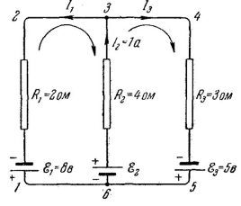

Схема: три вертикальные ветви, соединённые сверху и снизу. Узлов ровно два — точки 3 (сверху) и 6 (снизу); точки 1, 2, 4, 5 — просто углы, там ничего не разветвляется.

Стрелки на рисунке заданы так: $I_1$ идёт вниз по левой ветви, $I_3$ вниз по правой, $I_2$ вверх по средней. (В тексте PDF сказано «зададим стрелками вниз» — это неточность: у среднего тока стрелка смотрит вверх, что видно на рисунке и что подтверждают знаки в дальнейших уравнениях.)

**Узел 3.** Наверх по средней ветви приходит $I_2$, а по верхнему проводу утекают влево $I_1$ и вправо $I_3$:

$$-I_1 + I_2 - I_3 = 0$$

**Левый контур 1-2-3-6-1, обход по часовой стрелке** (вверх по левой ветви, вправо по верхнему проводу, вниз по средней, влево по нижнему):

- левую ветвь проходим **снизу вверх**, а ток $I_1$ течёт вниз — против обхода, значит $-I_1R_1$;
- среднюю ветвь проходим **сверху вниз**, а ток $I_2$ течёт вверх — снова против, значит $-I_2R_2$;
- у источника $\mathcal{E}_1$ плюс внизу, минус вверху; идя снизу вверх, мы проходим его от «+» к «−» — значит $-\mathcal{E}_1$;
- у источника $\mathcal{E}_2$ плюс вверху, минус внизу; идя сверху вниз, мы снова проходим от «+» к «−» — значит $-\mathcal{E}_2$.

$$-I_1R_1 - I_2R_2 = -\mathcal{E}_1 - \mathcal{E}_2$$

Все четыре знака минус — это не подозрительно, это просто следствие того, что стрелки нарисованы наугад. Уравнение можно домножить на $-1$ и переписать как $I_1R_1 + I_2R_2 = \mathcal{E}_1 + \mathcal{E}_2$ — оно от этого не изменится.

**Правый контур 3-4-5-6-3, обход по часовой стрелке.** Здесь всё наоборот: правую ветвь проходим сверху вниз, и $I_3$ течёт вниз — по обходу, $+I_3R_3$; среднюю проходим снизу вверх, и $I_2$ течёт вверх — тоже по обходу, $+I_2R_2$. Оба источника проходятся от «−» к «+»:

$$I_3R_3 + I_2R_2 = \mathcal{E}_3 + \mathcal{E}_2$$

Три уравнения, три неизвестных — система замкнута.

### Сколько уравнений и как не написать лишних

Простой рецепт, по которому ты никогда не ошибёшься с количеством:

1. Посчитай **ветви** — столько будет неизвестных токов. В примере три.
2. Посчитай **узлы**. Узловых уравнений бери на одно меньше: $N - 1$. В примере узлов два, значит уравнение одно.
3. Остальные уравнения — контурные. В примере $3 - 1 = 2$ контура.

Почему последний узел лишний? Потому что его уравнение — это сумма всех остальных, взятая с обратным знаком. Физически: если во всех узлах, кроме последнего, заряд не копится, то и в последнем не копится автоматически — заряду просто некуда деться из цепи.

Как выбрать контуры, чтобы они были независимыми: бери их так, чтобы **каждый следующий содержал хотя бы одну ветвь, не входившую в предыдущие**. В примере левый контур забрал ветви 1 и 2, правый добавил ветвь 3 — годится. А вот внешний контур 1-2-3-4-5-6-1 брать третьим бессмысленно: он получается сложением двух уже написанных.

### Что дальше

Билет 32 — **закон Джоуля-Ленца**. Тепло $dQ = I^2R\ dt$ мы уже дважды брали в долг (в выводе закона Ома для неоднородного участка, билет 30, и косвенно здесь), и в 32-м билете этот долг наконец возвращается: формулу выведут честно, плюс появится её локальная форма — удельная тепловая мощность.

---

## Разбор 32. Мощность тока и закон Джоуля-Ленца

### Где мы находимся: возвращаем долг

Помнишь билет 30? Там в выводе закона Ома для неоднородного участка мы написали строчку «за время $dt$ выделяется джоулево тепло $dQ = I^2R\ dt$» и честно оговорились, что берём её как известную. Вот сейчас этот долг возвращается: в 32-м билете формула выводится с нуля.

И выясняется, что выводить-то почти нечего. Весь закон Джоуля-Ленца — это **работа тока плюс одна фраза о том, что этой работе больше некуда деться, кроме как в нагрев**. Никакого отдельного физического закона тут нет, есть закон сохранения энергии в частной ситуации.

### Три формулы мощности — на самом деле одна

$$P = UI \qquad P = I^2R \qquad P = \frac{U^2}{R}$$

Главная из них — **первая**, она следует прямо из определения работы. Две другие получаются подстановкой закона Ома: в $P = UI$ заменяем либо $U = IR$, либо $I = U/R$. Учить надо одну, остальные выводятся за секунду.

**Классическая ловушка, на которую ловят на экзамене.** Посмотри: в формуле $P = I^2R$ мощность **растёт** с сопротивлением, а в $P = U^2/R$ — **падает**. Это не противоречие. Просто в первой фиксированным считается ток, а во второй — напряжение, и это разные физические ситуации:

| что закреплено | какая формула удобна | что происходит при росте $R$ |
|---|---|---|
| ток $I$ (последовательное соединение) | $P = I^2R$ | греется сильнее |
| напряжение $U$ (параллельное соединение, розетка) | $P = U^2/R$ | греется слабее |

Отсюда житейское: в последовательной гирлянде сильнее греется самая «плохая» лампочка, а в розетке наоборот — чем меньше сопротивление прибора, тем больше он потребляет.

### Почему работа **целиком** уходит в тепло

Это единственное место в выводе, где вообще есть физика, и потому именно его стоит уметь произнести вслух.

Работа над зарядами совершена. Куда она в принципе могла бы уйти?

- в **механическую** энергию — если бы проводник двигался;
- в **химическую** — если бы шли химические превращения (электролиз, зарядка аккумулятора);
- в **тепло**.

Условие «неподвижный металлический проводник, химических превращений нет» закрывает первые два канала. Остаётся один — значит равенство $Q = A$ законно.

И обрати внимание на обратную сторону: **если условие нарушено, закон в таком виде неверен**. В электродвигателе провод движется, часть работы уходит в механику, и тепла выделяется меньше, чем $I^2Rt$. Именно поэтому в формулировке всегда стоит слово «неподвижный» — это не украшение.

### Что происходит внутри провода

Картинка, которую полезно держать в голове. Электрон под действием поля разгоняется, набирает энергию — и врезается в ион кристаллической решётки, отдавая ему всё набранное. Потом снова разгоняется, снова врезается. Ион от удара начинает сильнее колебаться, а колебания решётки — это и есть внутренняя энергия, то есть температура.

Отсюда видно, почему электрон не разгоняется бесконечно и почему ток постоянный, а не нарастающий: поле его всё время подталкивает, столкновения всё время тормозят, и устанавливается равновесная скорость дрейфа. **Сопротивление — это по сути трение**, а тепло — результат этого трения.

### Что нарисовано на картинке

Рисунок к этому билету обманчиво простой, поэтому разберём по элементам.

**Две длинные слегка изогнутые линии** — это стенки проводника. Обрати внимание, что они уходят
за края рисунка в обе стороны: перед нами не весь провод, а **вырезанный из него участок**.
Изогнут он не случайно — так художник намекает, что форма среды может быть любой, кривой и
неровной, на выводе это никак не скажется.

**Два коротких штриха поперёк проводника** (слева и справа, каждый с пунктирной половинкой) —
это **сечения**, которыми участок отрезан от остального провода. Пунктир означает, что штрих
не плоская чёрточка, а площадка, уходящая «вглубь» рисунка: сечение — это площадь, а не линия.
Слева оно подписано цифрой **1**, справа — **2**.

**$\varphi_1$ и $\varphi_2$ под сечениями** — потенциалы этих сечений. Их разность и есть
напряжение на участке, $U = \varphi_1 - \varphi_2$, то самое, что стоит в формуле $A = UIt$.

**Стрелка $I$ посередине** — направление тока, то есть куда движутся положительные носители.
Раз она смотрит от 1 к 2, значит $\varphi_1 > \varphi_2$: ток сам по себе течёт от большего
потенциала к меньшему, как вода стекает сверху вниз.

### Чего на рисунке не хватает

Список тут длиннее обычного, потому что рисунок иллюстрирует **интегральную** постановку,
а вывод в билете идёт по **локальной**. Дорисуй мысленно:

- **Элементарный цилиндрик.** Главного героя вывода на картинке нет вообще. Представь внутри
  участка маленький столбик длиной $dl$ вдоль тока и с площадью торца $dS$ — именно для него
  считается $\delta Q$. Ни $dl$, ни $dS$ на рисунке не обозначены.
- **Вектор $\vec j$.** Есть стрелка $I$ — величина «для всего сечения», а плотности тока,
  вдоль которой ориентируется цилиндрик, нет. Мысленно поставь $\vec j$ в ту же сторону,
  что и $I$.
- **Вектор $\vec E$.** Его нет совсем, хотя именно поле разгоняет носители и стоит в итоговой
  формуле $Q_{\text{уд}} = \vec j\cdot\vec E$. Направлен он туда же, куда $\vec j$
  (в изотропной среде они параллельны, это и есть закон Ома в дифференциальной форме).
- **Само тепло.** Нет никакого значка того, ради чего билет написан. Тепло выделяется
  **по всему объёму** участка, а не в сечениях и не на поверхности — можно дорисовать
  волнистые стрелки, торчащие из всего тела проводника наружу.
- **Что течёт на самом деле.** Стрелка $I$ показывает условное направление тока, а электроны
  ползут **навстречу** ей. На рисунке этого не видно, а на экзамене про это любят спросить.

### Дифференциальная форма: знакомый приём

Вывод $Q_{\text{уд}} = \rho j^2$ построен ровно по тому же шаблону, что и дифференциальная форма закона Ома в билете 29: **берём элементарный цилиндрик и переводим «крупные» величины в «точечные»**.

| крупная величина | точечная замена | почему |
|---|---|---|
| сопротивление $R$ | $\rho$ — удельное сопротивление | $R$ зависит от длины и толщины куска, $\rho$ — только от вещества |
| сила тока $I$ | $j$ — плотность тока | $I$ зависит от толщины провода, $j$ — нет |
| теплота $Q$ | $Q_{\text{уд}}$ — теплота на объём и на время | не «сколько всего», а «сколько здесь и сейчас» |

Шаг 5 стоит проговорить медленно, потому что там за одну строчку происходит три вещи:

$$\delta Q = RI^2dt = \left(\rho\frac{dl}{dS}\right)(j\ dS)^2dt$$

1. Подставили $R = \rho\ dl/dS$ и $I = j\ dS$.
2. Возвели во вторую степень: $(j\ dS)^2 = j^2(dS)^2$. Одно $dS$ сокращается со знаменателем, второе остаётся.
3. Осталось $\rho j^2\ dS\ dl\ dt$, а $dS\ dl$ — это в точности объём $dV$.

Получилось $\delta Q = \rho j^2\ dV\ dt$. Дальше делим на $dV$ и на $dt$ — и все следы геометрии цилиндра исчезают. Это и есть признак правильной локальной формулы: **в ней не осталось ничего от того, какой формы кусок мы взяли**.

### Три записи одного и того же

$$Q_{\text{уд}} = \rho j^2 = \sigma E^2 = \vec j\cdot\vec E$$

Все три эквивалентны, переход между ними — это просто $\vec j = \sigma\vec E$ и $\rho = 1/\sigma$. Какую брать, зависит от того, что тебе известно:

- знаешь **ток** в среде — бери $\rho j^2$;
- знаешь **поле** — бери $\sigma E^2$;
- нужна общая формулировка — бери $\vec j\cdot\vec E$, она самая «честная» и работает даже в анизотропной среде, где $\vec j$ и $\vec E$ не параллельны.

Единица $Q_{\text{уд}}$ — Вт/м³: мощность на объём.

Осторожно с буквами: здесь $\rho$ — **удельное сопротивление**, а $\sigma$ — **удельная проводимость**, как в билете 29. Это не плотность заряда из билетов 3 и 27 и не поверхностная плотность из билета 21. Таблица «было/стало» есть в разборе 29-го.

### Неоднородный участок: зачем умножать на $I$

Приём выглядит фокусом, но смысл у него простой — **перевод из «на заряд» в «в секунду»**.

Закон Ома для неоднородного участка

$$IR = (\varphi_1 - \varphi_2) + \mathcal{E}_{12}$$

записан в вольтах, то есть это энергия **на единицу заряда**. Умножение на $I$ (а $I$ — это заряд в секунду) превращает каждое слагаемое в мощность, то есть в энергию **в секунду**:

$$I^2R = I(\varphi_1 - \varphi_2) + I\mathcal{E}_{12}$$

Читается так: слева — мощность, уходящая в нагрев; справа — то, чем она оплачена: мощность электростатического поля плюс мощность сторонних сил. Энергетический баланс участка в одну строчку.

Знак второго слагаемого может быть и отрицательным — тогда источник не отдаёт энергию, а **принимает** её. Так выглядит зарядка аккумулятора: ток продавлен через него навстречу его сторонним силам.

### Что дальше

Билет 33 — **разрядка конденсатора**, начало переходных процессов. Там впервые ток будет **непостоянным**, и появится оговорка про квазистационарность: токи меняются достаточно медленно, чтобы в каждый момент времени к ним всё ещё можно было применять закон Ома и правила Кирхгофа из билета 31.

---

## Разбор 33. Разрядка конденсатора

### Где мы находимся

Это перелом. Все билеты с 27-го по 32-й были про **постоянный** ток: ничего не меняется во времени, поэтому можно писать $q = It$ и не думать. Здесь ток впервые **непостоянен** — он максимален в первое мгновение и дальше затухает. Сразу же появляются производные, дифференциальное уравнение и экспонента.

Отсюда и обязательная оговорка про квазистационарность в начале билета: без неё мы не имели бы права применять закон Ома.

### Зачем нужна оговорка про квазистационарность

Подвох такой. Закон Ома и правила Кирхгофа выведены **для постоянного тока**. А у нас ток меняется. Формально применять их нельзя.

Спасает медленность. Электрический сигнал бежит по цепи со скоростью, близкой к скорости света, то есть проскакивает всю схему за миллиардные доли секунды. Если за это время ток практически не успел измениться, то в каждый момент цепь выглядит так, **как будто** ток в ней постоянный — просто с тем значением, которое сейчас. Тогда законы постоянного тока применимы к каждому мгновению по отдельности.

Условие в двух словах: **процесс должен идти намного медленнее, чем сигнал пробегает цепь**. Для обычной цепи с $\tau = RC$ порядка миллисекунд это выполняется с гигантским запасом. Нарушается оно только на очень высоких частотах — там уже нужна теория Максвелла.

### Минус в $I = -dq/dt$ — где ошибаются чаще всего

Две величины, и обе про заряд, но ведут себя противоположно:

| величина | что делает при разрядке |
|---|---|
| заряд конденсатора $q$ | **убывает**, значит $dq/dt < 0$ |
| сила тока $I$ | по договорённости **положительна** |

Чтобы из отрицательной производной получить положительный ток, нужен минус. Вот и всё содержание этого знака.

Сравни с билетом 34 (зарядка): там заряд **растёт**, $dq/dt > 0$, и минус не нужен — ток пишется просто как $I = dq/dt$. Знак определяется не формулой, а тем, копится заряд или уходит.

### Как решается уравнение, если матан подзабылся

Уравнение

$$\frac{dq}{dt} + \frac{q}{RC} = 0$$

решается **разделением переменных** — приёмом, который выглядит как жульничество с дробями, но законен.

**Шаг 1.** Переносим второе слагаемое вправо: $\dfrac{dq}{dt} = -\dfrac{q}{RC}$.

**Шаг 2.** Собираем всё с $q$ слева, всё с $t$ справа. Делим на $q$, умножаем на $dt$:

$$\frac{dq}{q} = -\frac{dt}{RC}$$

**Шаг 3.** Ставим интегралы с пределами. Слева заряд идёт от начального $q_0$ до текущего $q$, справа время от $0$ до $t$ — **пределы должны соответствовать друг другу**: началу процесса начало, концу конец.

**Шаг 4.** Берём интегралы. Слева первообразная от $1/q$ — это $\ln q$, поэтому получаем $\ln q - \ln q_0$. Справа $RC$ — константа, её выносят, и остаётся $\int dt = t$.

**Шаг 5.** Разность логарифмов сворачивается в логарифм дроби: $\ln q - \ln q_0 = \ln(q/q_0)$.

**Шаг 6.** «Потенцировать» — значит взять экспоненту от обеих частей. Экспонента и логарифм уничтожают друг друга ($e^{\ln x} = x$), и слева остаётся просто $q/q_0$:

$$\frac{q}{q_0} = e^{-t/RC} \implies q = q_0e^{-t/RC}$$

### Почему получилась именно экспонента

Взгляни на уравнение по-человечески: $\dfrac{dq}{dt} = -\dfrac{q}{RC}$ читается как **«скорость убывания пропорциональна тому, что ещё осталось»**.

Чем больше заряда на обкладках, тем больше напряжение, тем больше ток, тем быстрее заряд уходит. Заряд утекает — ток падает — утекание замедляется. Процесс сам себя тормозит.

Любая величина, которая убывает по такому правилу, затухает по экспоненте. Ровно так же остывает чай (чем горячее, тем быстрее теряет тепло) и распадаются радиоактивные ядра. Так что экспонента здесь не случайность формул, а прямое следствие фразы «скорость пропорциональна остатку».

### $\tau = RC$: почему это время и что оно значит

**Проверка размерности** — полезно уметь показать на экзамене:

$$[R][C] = \frac{\text{В}}{\text{А}}\cdot\frac{\text{Кл}}{\text{В}} = \frac{\text{Кл}}{\text{А}} = \text{с}$$

Вольты сокращаются, а кулон, делённый на ампер, это секунда по определению силы тока. Действительно время.

**Что происходит за время $\tau$:** подставь $t = \tau$ в закон, экспонента даст $e^{-1}$, то есть от заряда останется примерно $37\ \%$. Дальше:

| прошло времени | осталось заряда |
|---|---|
| $\tau$ | $37\ \%$ |
| $2\tau$ | $14\ \%$ |
| $3\tau$ | $5\ \%$ |
| $5\tau$ | $0{,}7\ \%$ |

Поэтому на практике говорят, что через $(3-5)\tau$ конденсатор разряжен, хотя строго ноль не достигается никогда.

**Почему $\tau$ растёт с $R$ и с $C$:**

- больше $R$ — уже «горло», через которое утекает заряд, ток меньше, разрядка дольше;
- больше $C$ — больше запас заряда при том же напряжении, дольше выгружать.

### Что нарисовано на схеме

Прямоугольный контур из четырёх проводов:

- **слева конденсатор** $C$ — две параллельные чёрточки, между ними подписан заряд $q$ и знаки $\pm$: верхняя обкладка положительная, нижняя отрицательная;
- **справа резистор** $R$ — прямоугольник в разрыве провода;
- **сверху стрелка** $I$ смотрит вправо: ток выходит из «$+$» обкладки и идёт по внешней цепи к «$-$»;
- **снизу ключ** $K$ — две точки с зазором между ними.

Чего не хватает:

- **Ключ нарисован разомкнутым**, то есть это картинка «до момента $t = 0$». Того, что происходит после замыкания, на рисунке нет вообще — весь процесс надо воображать.
- **Нет намёка на то, что ток затухает.** Стрелка $I$ выглядит так же, как в задачах на постоянный ток, хотя здесь она должна была бы «худеть» со временем.
- **Не показано, что через сам конденсатор ток не течёт.** Между обкладками диэлектрик, заряды через него не переходят: ток идёт только по внешнему проводу, справа налево через $R$.
- **Нет $q_0$** — начального заряда, с которого всё начинается.
- Электроны, как всегда, движутся навстречу стрелке $I$.

### Что нарисовано на графике

Оси: вертикальная — заряд $q$, горизонтальная — время $t$, начало координат $O$. Кривая стартует из точки $q_0$ на вертикальной оси и монотонно спадает, всё сильнее прижимаясь к горизонтальной оси.

Чего не хватает:

- **Не отмечено $\tau$** — а это главная характеристика процесса. Дорисуй на оси $t$ точку $\tau$ и от неё пунктир вверх до кривой: он упрётся в уровень $q_0/e \approx 0{,}37q_0$.
- **Нет асимптоты.** Кривая справа выглядит так, будто легла на ось. На самом деле она к ней только стремится, никогда не касаясь — стоит провести пунктиром линию $q = 0$.
- **Нет графика тока $I(t)$.** Он выглядит точно так же, только по вертикали отложено $I$ и старт из $I_0$. Об этом сказано словами, но не показано.
- **Не подписано красивое свойство:** касательная к кривой в точке старта пересекает ось времени ровно при $t = \tau$. Это удобный способ снять $\tau$ с экспериментального графика.

### Что дальше

Билет 34 — **зарядка конденсатора**: та же цепь, но с источником ЭДС. Схема вывода повторяется почти дословно, отличия всего два: ток пишется без минуса ($I = dq/dt$, заряд растёт) и в закон Ома добавляется ЭДС. Ответ получается «перевёрнутый»: заряд не убывает от $q_0$ к нулю, а нарастает от нуля к предельному значению $q_{\max} = C\mathcal{E}$.

---

## Разбор 34. Зарядка конденсатора

### Где мы находимся

Это зеркало 33-го билета. Цепь почти та же, шаги вывода те же, приёмы те же. Отличий ровно три, и если ты их запомнишь, второй билет учить почти не придётся — он выведется сам.

### Таблица различий: разрядка и зарядка

Самое полезное, что есть в этом разборе. Выучи её — и оба билета лягут в голову как один.

| | разрядка (билет 33) | зарядка (билет 34) |
|---|---|---|
| источник в цепи | нет | есть, $\mathcal{E}$ |
| участок | однородный | неоднородный |
| закон Ома | $IR = q/C$ | $IR = \mathcal{E} - q/C$ |
| ток | $I = -dq/dt$ | $I = +dq/dt$ |
| начальное условие | $q = q_0$ при $t = 0$ | $q = 0$ при $t = 0$ |
| заряд | $q = q_0e^{-t/\tau}$ убывает | $q = q_m(1 - e^{-t/\tau})$ растёт |
| ток | $I = I_0e^{-t/\tau}$ | $I = I_0e^{-t/\tau}$ |
| начальный ток | $I_0 = q_0/RC$ | $I_0 = \mathcal{E}/R$ |
| время релаксации | $\tau = RC$ | $\tau = RC$ |

Обрати внимание на две последние строки: **ток в обоих случаях убывает по одинаковому закону**, и $\tau$ одно и то же. Различается только заряд — в одном случае он падает, в другом растёт. Это не совпадение: $\tau = RC$ определяется самой цепью, а не тем, что в ней происходит.

### Куда делся минус

В 33-м билете стояло $I = -dq/dt$, здесь $I = +dq/dt$. Причина простая: там заряд конденсатора **убывал** ($dq/dt < 0$), и минус был нужен, чтобы ток вышел положительным. Здесь заряд **растёт**, производная уже положительна, и поправлять нечего.

Правило в одну строку: **знак ставится так, чтобы ток получился положительным.**

### Откуда взялось $\mathcal{E} - q/C$

Это второе отличие и главное место, где путаются.

Порядок рассуждения важен, и в PDF он изложен задом наперёд. Идти надо так: ток приходит на обкладку **2**, значит на ней копится плюс и $\varphi_2 > \varphi_1$; напряжение на конденсаторе равно $q/C$ (билет 16), поэтому положительна именно разность $\varphi_2 - \varphi_1 = q/C$, а обратная равна $\varphi_1 - \varphi_2 = -q/C$. Подставляем её в закон Ома для неоднородного участка $IR = \varphi_1 - \varphi_2 + \mathcal{E}$ (билет 30):

$$IR = \mathcal{E} - \frac{q}{C}$$

И только теперь, глядя на минус в готовой формуле, можно сказать словами: **напряжение на конденсаторе направлено навстречу ЭДС.** Это вывод, а не посылка — из него ничего не выводят, он сам получается в конце.

Физический смысл при этом важнее алгебры. Источник гонит заряды на обкладки, а уже накопленный там заряд отталкивает следующие порции. Чем больше накачали, тем сильнее сопротивление.

Аналогия: надуваешь шарик. Сначала легко, потом всё труднее — внутри растёт давление, которое давит навстречу. Когда твоё давление сравнялось с давлением в шарике, воздух перестаёт идти. У конденсатора то же самое: когда $q/C$ дорастает до $\mathcal{E}$, скобка обращается в ноль и ток прекращается.

### Самый трудный шаг — интеграл в пункте 5

$$\int_{0}^{q}\frac{R\ dq}{\mathcal{E} - q/C}$$

Откуда взялся множитель $-RC$ перед логарифмом? Это не опечатка и не магия — вот подробно.

**Шаг 1.** Обозначим знаменатель за новую переменную: $u = \mathcal{E} - \dfrac{q}{C}$.

**Шаг 2.** Найдём $du$. Величина $\mathcal{E}$ постоянна, её производная ноль; у второго слагаемого производная по $q$ равна $-1/C$. Значит $du = -\dfrac{dq}{C}$, откуда $dq = -C\ du$.

**Шаг 3.** Подставляем в интеграл:

$$\int\frac{R\ dq}{u} = \int\frac{R(-C\ du)}{u} = -RC\int\frac{du}{u} = -RC\ln u$$

Вот и множитель. Он появился из того, что **переменная сидит в знаменателе со своим коэффициентом $-1/C$** — при замене этот коэффициент вылезает наружу перевёрнутым.

**Проверка** (полезно уметь на экзамене): продифференцируй $-RC\ln(\mathcal{E} - q/C)$ по $q$. Производная логарифма — единица на аргумент, умножить на производную аргумента:

$$-RC\cdot\frac{1}{\mathcal{E} - q/C}\cdot\left(-\frac{1}{C}\right) = \frac{R}{\mathcal{E} - q/C}$$

Получили подынтегральное выражение — значит первообразная найдена верно.

### Что происходит физически: два предельных момента

Их стоит уметь описать словами, без формул — это частый вопрос.

**Сразу после замыкания ключа** конденсатор пуст, напряжения на нём нет, мешать он не может. Цепь ведёт себя так, будто конденсатора нет вовсе — просто источник и резистор. Отсюда $I_0 = \mathcal{E}/R$, обычный закон Ома для замкнутой цепи.

**Через долгое время** заряд дорос до $q_m = C\mathcal{E}$, напряжение на конденсаторе сравнялось с ЭДС, они уравновесились, и ток прекратился. Теперь цепь ведёт себя так, будто в месте конденсатора **разрыв**.

Отсюда общее правило, которое сильно выручает в задачах:

> В первый момент **незаряженный конденсатор — это провод**, а через долгое время **заряженный конденсатор — это разрыв**.

### Куда девается энергия

Красивый факт, который любят спрашивать сверх билета. Источник за всё время зарядки отдаёт работу $A = q_m\mathcal{E} = C\mathcal{E}^2$. А в конденсаторе оседает только

$$W = \frac{q_m^2}{2C} = \frac{C\mathcal{E}^2}{2}$$

то есть **ровно половина**. Вторая половина ушла в тепло на сопротивлении. Самое удивительное — доля не зависит от $R$: возьми резистор хоть в тысячу раз больше, и всё равно половина энергии уйдёт в нагрев, просто медленнее.

### Что нарисовано на схеме

Прямоугольный контур:

- **слева источник** $\mathcal{E}$ — две чёрточки разной длины;
- **сверху стрелка** $I$ и следом **резистор** $R$ в разрыве провода;
- **справа конденсатор** $C$, его обкладки подписаны цифрами: **2** верхняя, **1** нижняя. Именно эти номера стоят в формуле $\varphi_2 - \varphi_1 = q/C$ первого шага;
- **снизу ключ** $K$ и стрелка, показывающая, что по нижнему проводу ток возвращается к источнику.

Чего не хватает:

- **Ключ нарисован разомкнутым** — как и в 33-м билете, это момент до $t = 0$.
- **Не показаны знаки на обкладках.** Верхняя (номер 2) заряжается положительно, потому что именно к ней ток приходит через $R$. Полезно дорисовать «$+$» и «$-$» самой.
- **Нет намёка на то, что ток затухает,** а он спадает от $\mathcal{E}/R$ до нуля.
- **Не отмечено, что через конденсатор ток не идёт** — заряды только накапливаются на обкладках.

### Что нарисовано на графике

Здесь, в отличие от 33-го билета, обе кривые на одних осях:

- по вертикали отложены сразу две величины, поэтому на оси две отметки: $q_m$ повыше и $I_0$ пониже;
- **пунктирная горизонталь на уровне $q_m$** — это асимптота, предел, к которому тянется заряд;
- **растущая кривая, подписанная $q$**, стартует из нуля и загибается к пунктиру, никогда его не достигая;
- **спадающая кривая, подписанная $I$**, стартует из $I_0$ и прижимается к оси времени;
- кривые пересекаются — но точка пересечения **не означает ничего**: по вертикали отложены разные величины с разными единицами, так что их равенство случайно и зависит от масштаба.

Чего не хватает:

- **Не отмечено $\tau$** на оси времени — а именно оно задаёт, насколько круто идут обе кривые. При $t = \tau$ заряд набирает $63\ \%$ от предельного, а ток падает до $37\ \%$ от начального.
- **Нет числовых уровней** $0{,}63q_m$ и $0{,}37I_0$.
- **Не подписано, что обе кривые зеркальны**: их сумма в подходящем масштабе всегда постоянна, ведь $q$ растёт ровно настолько, насколько $I$ убывает.

### Что дальше

Билет 35 — **природа магнетизма**, начало большого нового раздела. Электростатика и постоянный ток закончились; дальше и до самого конца списка (56-й билет, уравнения Максвелла) будет магнетизм.

---

## Разбор 35. Природа магнетизма

### Где мы находимся

Электростатика и постоянный ток закончились. С этого билета и до конца списка (56-й, уравнения Максвелла) идёт магнетизм — по объёму он больше всего пройденного.

Билет вводный и качественный: формул в нём всего одна с половиной. Его задача — объяснить, **откуда вообще взялась идея магнитного поля** и почему без неё нельзя было обойтись.

### Почему понадобилось новое поле

До 1820 года электричество и магнетизм считались разными науками. Заряды, конденсаторы, токи — одно; магниты, компас, залежи магнитного железняка — совсем другое. Ничто не намекало на связь.

А теперь главный довод, ради которого весь билет и написан. Возьми два провода с током. Они **электрически нейтральны**: внутри металла ровно столько же электронов, сколько положительных ионов, суммарный заряд каждого провода равен нулю. По закону Кулона они не должны чувствовать друг друга вообще.

Но они притягиваются. Значит существует взаимодействие, **не сводящееся к электростатическому**, и переносит его что-то новое. Это новое и назвали магнитным полем.

Если на экзамене спросят «зачем нужно магнитное поле, разве мало электрического» — отвечать надо именно так: провода нейтральны, а сила есть.

### Опыт Эрстеда: что в нём удивительного

Эрстед заметил на лекции, что компас рядом с проводом дёргается, когда включают ток. Само по себе «ток на что-то влияет» — уже открытие. Но по-настоящему странно другое: **стрелка встаёт поперёк провода, а не вдоль него.**

Сравни с электростатикой. Там сила всегда направлена **вдоль линии**, соединяющей два заряда: притянулись или оттолкнулись, но строго по прямой между ними. Такие силы называют центральными, и вся электростатика на них построена.

А здесь эффект **поперечный**. Это первый намёк на то, что в магнетизме появится векторное произведение — оно как раз даёт вектор, перпендикулярный двум исходным. В билете 36 ты его и увидишь: $\vec B \sim [\vec v \times \vec r]$.

Ещё одна деталь опыта: если поменять направление тока, стрелка развернётся на $180^\circ$. Значит магнитное действие зависит от **направления** движения зарядов, а не только от их количества.

### Опыты Ампера: почему это контринтуитивно

Тут есть ловушка, в которую попадают почти все.

| | одинаковые | противоположные |
|---|---|---|
| **заряды** | отталкиваются | притягиваются |
| **токи** | притягиваются | отталкиваются |

Всё **наоборот** по сравнению с зарядами. Одноимённые заряды разбегаются, а сонаправленные токи, наоборот, сходятся. Запомнить проще всего именно через это «наоборот».

Житейское следствие: если по двум жилам кабеля ток идёт туда и обратно (а так и есть в любом проводе питания), токи противоположны и жилы **расталкиваются**. При коротком замыкании, когда ток огромен, провода реально расшвыривает в стороны.

### Закон Ампера: откуда что взялось

$$f_1 = \frac{\mu_0}{4\pi}\frac{2i_1i_2}{b}$$

Три вещи, которые стоит понимать, а не заучивать.

**Почему сила на единицу длины, а не полная.** Проводники считаются бесконечными. Полная сила между двумя бесконечными проводами тоже бесконечна, говорить о ней бессмысленно. Поэтому берут силу, приходящуюся на метр длины — она конечна и от длины не зависит.

**Почему $1/b$, а не $1/b^2$.** В законе Кулона стоит квадрат, и хочется ждать его и здесь. Но квадрат бывает у **точечных** источников. У бесконечно длинного провода поле спадает медленнее — как $1/b$. Ты это уже видела в билете 3: поле заряженной нити тоже пропорционально $1/r$, а не $1/r^2$. Причина одна и та же — источник растянут вдоль бесконечной линии.

**Почему коэффициент записан как $\mu_0/4\pi$, а не одной буквой.** Из удобства: в формулах для полей от токов почти всегда всплывает $4\pi$, и в такой записи оно сокращается. Ровно так же в электростатике пишут $1/4\pi\varepsilon_0$ вместо одной константы.

### $\mu_0$ — величина, которую не измеряли

Самое любопытное в этом билете. Обычно константы измеряют, а эту **назначили**.

Логика такая: в старой системе СИ **ампер определялся через силу** — «такой ток, что два провода на расстоянии метра тянут друг друга с силой $2\cdot10^{-7}$ Н на метр». Число $2\cdot10^{-7}$ выбрали люди, чтобы новый ампер совпал со старым практическим. А раз и сила, и ток, и расстояние в определении заданы точно, то $\mu_0$ вычисляется из формулы **точно**, без погрешности. Отсюда и красивое $4\pi\cdot10^{-7}$ — такое число не бывает результатом измерения.

Честная оговорка, если спросят: с 2019 года СИ переопределили, ампер теперь задаётся через элементарный заряд, и $\mu_0$ стала измеряемой величиной. Но её значение отличается от $4\pi\cdot10^{-7}$ примерно в десятом знаке, так что для всех задач курса ничего не изменилось.

Размерность $\text{Гн/м}$ — генри на метр. Генри появится позже, в билете про индуктивность; пока просто прими как название.

**Оговорка по PDF:** в исходнике заголовок этого вывода стоит с шестью вопросительными знаками — автор сам сомневался, туда ли он его поместил. Сам вывод при этом правильный, воспроизводить его можно спокойно.

### $\vec B$ — аналог $\vec E$, но не полный

| | электрическое поле $\vec E$ | магнитное поле $\vec B$ |
|---|---|---|
| кто создаёт | любые заряды | только **движущиеся** заряды |
| на кого действует | на любые заряды | только на **движущиеся** |
| единица | В/м | тесла (Тл) |
| суперпозиция | работает | работает |

Два ограничения в правом столбце — это и есть вся разница на данном этапе. Неподвижный заряд магнитного поля не создаёт и его не чувствует.

**Про название.** Логично было бы назвать силовую характеристику «напряжённостью магнитного поля», по аналогии с $\vec E$. Но исторически буквой $\vec H$ и словом «напряжённость» назвали **другую** величину, а силовой характеристикой оказалась $\vec B$ — «индукция». Это неудачное наследство, из-за него путаются все. Пока запомни просто: **в магнетизме главная, силовая величина — это $\vec B$**, а $\vec H$ появится позже и будет играть роль, похожую на роль $\vec D$ в диэлектриках (билет 23).

### Что дальше

Билет 36 — **магнитное поле равномерно движущегося заряда**. Там появится первая настоящая формула магнетизма с векторным произведением, и станет понятно, откуда берётся та самая перпендикулярность, которую увидел Эрстед.

---
